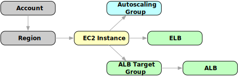

# Resoto Query Language 101

```mdx-code-block
import Image from '@theme/IdealImage';
```

Retrieving information about resources you have deployed in your [Amazon Web Services (AWS)](https://aws.amazon.com) infrastructure means tediously navigating the [AWS Management Console](https://aws.amazon.com/console) or using the [AWS Command Line Interface](https://aws.amazon.com/cli). This approach works well in a single account setup, but best practice is to set up a multi-account environment. And as the number of accounts grows, navigating your infrastructure and finding resources via the [Console](https://aws.amazon.com/console) or the [CLI](https://aws.amazon.com/cli/) becomes increasingly difficult.

Furthermore, the relationships between your resources are also relevant: an EBS volume is mounted to an EC2 instance running in a VPC and reachable via an ALB load balancer, for example. Developers create resources using tools such as [Terraform](https://terraform.io), [CDK](https://aws.amazon.com/cdk), or [CloudFormation](https://aws.amazon.com/cloudformation)… or sometimes even the console or CLI. How can you see everything that is running in your cloud?

<p><Image img={require('./img/banner.png')} alt="Left: Sheep Spinning Up Cloud Resources; Right: Confused Sheep with Abacus" /></p>

<!--truncate-->

We created Resoto to allow the user to effortlessly [query resources](/docs/reference/cli/query) and [automate workflows](/docs/concepts/automation/workflow). Resoto gathers data about your infrastructure and builds a directed acyclic [graph](/docs/concepts/graph), where resources are [vertices](/docs/concepts/graph/node) and their relationships/dependencies [edges](/docs/concepts/graph/edge). This graph is what makes Resoto so powerful, but we needed a way to allow users to query this data.

Graph data is not relational, so SQL was not a good fit. And existing graph query languages like [Cypher](https://neo4j.com/developer/cypher), [Gremlin](https://tinkerpop.apache.org/gremlin.html), or [GSQL](https://tigergraph.com/gsql) have steep learning curves and are unnecessarily complex for this use case.

And so, we developed our own query language tailored specifically to Resoto. The [Resoto Shell](/docs/concepts/components/shell) allows you to interact with your Resoto installation. In particular, it provides a [`query`](/docs/reference/cli/query) command.

Let's try searching for all available EC2 instances. `is()` will match a specific or abstract type in a polymorphic fashion, checking all types and subtypes of the provided type. The `instance_cores` filter will limit results to only those instances with more than two cores. The query will automagically search your entire infrastructure, regardless of account or region!

```bash
$> query is(aws_ec2_instance) and instance_cores > 2
// highlight-start
id=i-a..., name=crmsec, age=2y2M, account=dev, region=us-east-1
id=i-0..., name=airgap, age=2M, account=staging, region=eu-central-1
id=i-0..., name=flixer, age=1M3w, account=sales, region=us-west-2
// highlight-end
```

The query found three instances in three accounts and three regions. The default output is a condensed list view, but it is also possible to get all collected properties of any resource using the `dump` command:

```bash
$> query is(aws_ec2_instance) and instance_cores > 2 limit 1 | dump
// highlight-start
reported:
  kind: aws_ec2_instance
  id: i-a...
  tags:
    aws:cloudformation:stack-name: lk-build-server
    aws:cloudformation:stack-id: arn:aws:cloudformation:...
    owner: team-proto
  name: LKbuild
  instance_cores: 4
  instance_memory: 16
  instance_type: t3.xlarge
  instance_status: stopped
  age: 1y10M
// highlight-end
```

Let us see how many EC2 instances we have grouped by `instance_type` using the `count` command:

```bash
$> query is(aws_ec2_instance) and instance_cores > 2 | count instance_type
// highlight-start
t3.2xlarge: 1
m5.4xlarge: 15
total matched: 16
total unmatched: 0
// highlight-end
```

Sixteen EC2 instances were returned, including fifteen `m5` and one `t3` `xlarge`.

Now, let's say we want to find all ELB load balancers attached to the EC2 instances returned above. We must first understand Resoto's graph data structure to tackle this problem.

When Resoto collects data on your cloud infrastructure, it creates an edge between ELB and EC2 instances if the ELB balances the traffic of the related EC2 instance:



```bash
$> query is(aws_ec2_instance) and instance_cores > 2 --> is(aws_elb)
// highlight-start
name=a5..., age=1y1M, account=sales, region=eu-central-1
name=a3..., age=6M2w, account=staging, region=us-west-2
// highlight-end
```

The `-->` arrow will take all matching EC2 instances and walk the graph "outbound," moving precisely one step. The list of matching items is not limited only to ELB load balancers, so we need to filter this list again to return only ELB results.

It is also possible to reverse the last query to output all EC2 instances behind an ELB:

```bash
$> query is(aws_elb) <-- is(aws_ec2_instance) and instance_cores > 2
// highlight-start
id=i-0..., name=airgap, age=2M, account=staging, region=eu-central-1
id=i-0..., name=flixer, age=1M3w, account=sales, region=us-west-2
// highlight-end
```

The arrow is now mirrored and traverses the graph "inbound," walking edges in the opposite direction.

The above examples only begin to scratch the surface of Resoto's [query language](/docs/reference/cli/query). I hope you will check out our [documentation](/docs) and give Resoto a spin!

:::note

This blog post showcases examples of working with [AWS resources](/docs/reference/data-models/aws), but Resoto also supports other resource types (and additional integrations with other providers are planned!):

- [Google Cloud Platform (GCP)](/docs/reference/data-models/gcp)
- [vSphere](https://github.com/someengineering/resoto/tree/main/plugins/vsphere) (alpha)
- [Kubernetes (K8s)](https://github.com/someengineering/resoto/tree/main/plugins/k8s) (alpha)

:::
