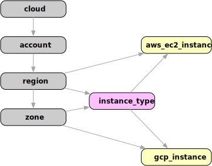

# Aggregating Search Data

:::note

This blog post is the second in a series about Resoto's powerful search functionality. The previous post, [Resoto Search 101](/blog/2022/02/04/resoto-search-101), provides an introduction to Resoto's search capabilities.

:::

Resoto's search allows for resources to be selected using [filters](/docs/concepts/search/filters), [combinators](/docs/concepts/search/filters#combining-selections), and [traversals](/docs/concepts/search/traversals). Search results can be combined, grouped, and [aggregated](/docs/concepts/search/aggregation).


<!--truncate-->

The simplest example of search aggregation in Resoto is the [`count` command](/docs/reference/cli/count), which enables you to count objects or the occurrences of a specific property. Let's say we are interested in the number of compute instances we maintain:

```bash
> search is(instance) | count
// highlight-start
total matched: 540
total unmatched: 0
// highlight-end
```

Compute instances are of [kind](/docs/concepts/graph/node#kind) `instance` regardless of cloud provider, so `is(instance)` selects both [`aws_ec2_instance`](/docs/reference/data-models/aws#aws_ec2_instance)s _and_ [`gcp_instance`](/docs/reference/data-models/gcp#gcp_instance)s. The [`count` command](/docs/reference/cli/count) then takes the results and returns the number of occurrences.

The `count` command also allows specifying a grouping value. The following search would return counts by `instance_status`:

```bash
> search is(instance) | count instance_status
// highlight-start
stopped: 48
terminated: 151
running: 341
total matched: 540
total unmatched: 0
// highlight-end
```

While [`count`](/docs/reference/cli/count) is often sufficient, the [`aggregate` command](/docs/reference/cli/aggregate) is required for more advanced use cases. For example, we could get CPU core and memory data using [`aggregate`](/docs/reference/cli/aggregate):

```bash
> search is(instance) | aggregate
  sum(instance_cores) as sum_of_cores,
  max(instance_cores) as max_cores,
  sum(instance_memory) as sum_of_memory,
  max(instance_memory) as max_mem
// highlight-start
sum_of_cores: 3441
max_cores: 16
sum_of_memory: 12802.25
max_mem: 64
// highlight-end
```

In this example, we have 3441 cores in total and each instance has a maximum of 16 cores. The same data is also available for provisioned memory: we have almost 13 TB of RAM with no instance having more than 64 GB.

We can further analyze this aggregated data using grouping variables, which we have already seen in an above example of the [`count` command](/docs/reference/cli/count). Let's try aggregating the available memory by instance status:

```bash
> search is(instance) | aggregate
   instance_status as status:
   sum(instance_memory) as memory
// highlight-start
group:
 status: running
memory: 8538
---
group:
 status: stopped
memory: 1345
---
group:
 status: terminated
memory: 2919.25
// highlight-end
```

This search returns multiple results, each of which has a `group` property. The grouping variable value for each result is a property of its `group` object. In this case, running compute instances have 8 TB of available memory altogether, while the remaining stopped or terminated instances have a total of 4 TB of allocated memory.

## Ancestors and Descendants

The aggregation capabilities we have seen so far include grouping and functions. Resoto captures the state of your infrastructure as nodes, and their relationships as edges.

Wouldn't it be great if we could aggregate over not only the data of a single node, but the data of ancestor or descendant nodes in the graph? Resoto's search engine can perform nested search statements for this exact purpose.



The above diagram illustrates the relationship between compute instances. AWS resources are attached to a region, while GCP resources are associated with a zone. Each instance also has a `instance_type` predecessor node. To access properties of ancestor nodes of a given kind, we can use the following notation:

```bash
> search is(instance) | aggregate
  sum(/ancestors.instance_type.reported.ondemand_cost) as cost
cost: 155.73
```

This search selects all instances, then aggregates the on-demand cost of each element by traversing up to the instance type and selecting the `reported.ondemand_cost` property.

The path `/ancestors.instance_type.reported.ondemand_cost` can be translated as a traversal over the node's ancestors until an ancestor of kind `instance_type` is found. The last part of this path is relative to the node that is found (`reported.ondemand_cost` in this example). The result is the on-demand cost of all instances.

It is possible to walk the graph inbound with `ancestors`, and outbound using `descendants`. You can apply this syntax anywhere a property path is defined in a search. Let's use this technique to find running instances aggregated by account and region:

```bash
> search is(instance) and instance_status==running | aggregate
  /ancestors.account.reported.name as account,
  /ancestors.region.reported.name as region:
  sum(instance_memory) as memory,
  sum(instance_cores) as cores,
  sum(/ancestors.instance_type.reported.ondemand_cost) as cost
// highlight-start
group:
 account: sales
 region: us-west-2
memory: 1936
cores: 484
cost: 23.232
---
group:
 account: sales
 region: us-west1
memory: 30
cores: 8
cost: 0.3799
---
group:
 account: dev
 region: us-east-1
memory: 576
cores: 144
cost: 7.2
.
.
// highlight-end
```

As you can see, Resoto's search enables you to gather data about your infrastructure that would otherwise be extremely challenging and tedious to tabulate. This search result is also refreshed whenever the graph is updated (every hour by default), which enables the collection of data that is not feasible to manage manually.

Now, imagine feeding results of an aggregation search into a [Prometheus](https://prometheus.io) time series database and being able to visualize the data in a [Grafana](https://grafana.com) dashboard. [Resoto Metrics](https://github.com/someengineering/resoto/tree/main/resotometrics) serves this exact purpose, feeding robust aggregation metrics into a time series database.

Please refer to our [documentation](/docs/concepts/search/aggregation) for more details about supported aggregation capabilities. I hope the examples presented here clearly illustrate the power of Resoto's search aggregation. If you're new to Resoto, we hope you will [try it out](/docs/getting-started)! ✨
