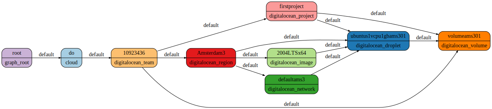

# Resoto on Digital Ocean.

I’m happy to announce that resoto now supports the DigitalOcean cloud.

Over the last few weeks, I worked on a plugin that allows collecting DigitalOcean resources. And now I’m proud to say that all DigitalOcean resources are supported in resoto from day one.

## Getting started

To get started, set up the DigitalOcean API tokens via the config. To do that, launch `resh` and edit the worker config file using the `config edit resoto.worker` command:

First, enable the DigitalOcean collector in the resotoworker session:

```
resotoworker:
  collector:
    - do
```

Second, in the digitalocean section, add the DigitalOcean API tokens and spaces access keys. Please note that the spaces access keys should correspond to the API tokens.

```
digitalocean:
  # DigitalOcean API tokens for the teams to be collected
  api_tokens:
    - ACCESS_KEY_1
    - ACCESS_KEY_2
  # DigitalOcean Spaces access keys for the teams to be collected, separated by colons
  spaces_access_keys:
    - SPACE_ACCESS_KEY_1:SPACE_ACCESS_SECRET_1
    - SPACE_ACCESS_KEY_2:SPACE_ACCESS_SECRET_2

```

DigitalOcean collector also supports multiple teams. To collect several teams, provide multiple keys separated by space.

The next step is to execute the collect command:

```
workflows run collect
```

After the collection is over, resoto is ready to use.

<!--truncate-->

## Searching the graph

All Digitalocean resources inherit from a `digitalocean_resource` class, and this means that you can find all resources using `is(digitalocean_resource)` syntax. For a more specific search, it is also possible to find the resource by its type, e.g. `search is(​​digitalocean_droplet)`.

Filtering is also possible. For example, to find all droplets under the project `foo`, you can use the following query:

```
search is(digitalocean_project) and name=="foo" --> is(digitalocean_droplet)
```

Here we first found all projects with name `foo`, and then we filtered the result to only contain droplets.

will mark all droplets to be cleaned up, and they will be removed the next time the cleanup workflow runs. You can also trigger the cleanup manually by calling `workflows run cleanup`.

### Visualizing the graph

It is possible to generate a dotfile with a result of your search. For example, to generate a dotfile for all available resources in your digitalocean cloud, you can use the following query:

```
search --with-edges is(digitalocean_team) <-[0:]-> | format --dot | write out.dot
```



The dotfile can later be viewed in any graphviz viewer. One that I personally like is a VSCode extenstion called _Graphviz Interactive Preview_.

For more, chech out the [resoto documentation on search](https://resoto.com/docs/concepts/search).

## Tagging

Additionally, you can tag the resource (for those resources where DigitalOcean supports tagging):

```
search is(digitalocean_droplet) | tag update foo bar
```

This command will attach tag `foo` with the value `bar` to all droplets. Please note that since DigitalOcean does not support tag values, values are emulated by resoto using `--` as a separator, so you will see the tag `foo--bar` in the DigitalOcean console.

It is also possible to not provide any value at all, e.g.

```
search is(digitalocean_droplet) | tag update foo
```

### Removing tags

To untag the resource, use the `tag delete` command:

```
search is(digitalocean_droplet) | tag delete foo
```

### Searching by tag

If you want to get all resources with a tag `foo` and value `bar`, you can use the following query:

```
search is(digitalocean_droplet) and tags.foo==bar
```

If you're interested in all resources tagged `foo` regardless of the value, you can use the following query:

```
search is(digitalocean_droplet) and has_key(tags, foo)
```

Since DigitalOcean does not support tag values, you need to either specify an empty string as a tag value or use the `has_key` function.

## Cleaning up

To delete a resource, pipe the search results to a cleanup command. For example,

```
search is(​​digitalocean_droplet) | cleanup
```

Doing manual searches and cleanups is cool, but what if you could set up a cron job that cleans up the resources after your experiments? Resoto can do that as well.

For example, we can add a job that will cleanup the droplets older than 1 day for a specific digital ocean team at 04:00:

```
> jobs add cleanup-after-experiments --schedule '0 4 * * *'  ‘search is(digitalocean_droplet) and /ancestors.account.reported.id=="1234567" and age > 1d | cleanup’
```

This way, you can experiment all day long and your droplets will be cleaned up by the next day.

For more, see the [jobs section in the docs](https://resoto.com/docs/concepts/automation/job).
