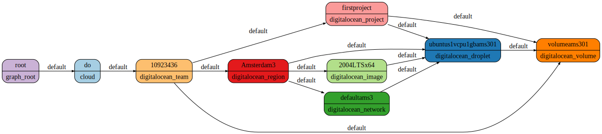

# DigitalOcean Support

Over the last few weeks, I worked on a plugin that allows collecting DigitalOcean resources. I'm happy to announce that Resoto now has DigitalOcean support!


<!--truncate-->

## Getting Started

To get started, add your DigitalOcean API tokens to [Resoto Worker](/docs/concepts/components/worker)via the [`config` command](/docs/reference/cli/configs) in [Resoto Shell](/docs/concepts/components/shell):

```bash
> config edit resoto.worker
```

In the text editor opened by [`config edit`](/docs/reference/cli/configs/edit), modify the configuration as follows:

```yml
resotoworker:
  collector:
    - do
    ...

digitalocean:
  # DigitalOcean API tokens for the teams to be collected
  api_tokens:
    - ACCESS_KEY_1
    - ACCESS_KEY_2
  # DigitalOcean Spaces access keys for the teams to be collected, separated by colons
  spaces_access_keys:
    - SPACE_ACCESS_KEY_1:SPACE_ACCESS_SECRET_1
    - SPACE_ACCESS_KEY_2:SPACE_ACCESS_SECRET_2
...
```

:::note

The spaces access keys should correspond to the API tokens.

:::

The DigitalOcean collector also supports multiple teams. To collect several teams, simply provide multiple keys separated by space.

Once the DigitalOcean plugin configuration has been updated, trigger a collect run:

```bash
> workflows run collect
```

<!--truncate-->

## Searching the Graph

All Digitalocean resources inherit from a `digitalocean_resource` class, and this means that you can find all resources using `is(digitalocean_resource)` syntax. For a more specific search, it is also possible to find the resource by its type, e.g. `search is(​​digitalocean_droplet)`.

Filtering is also possible. For example, to find all droplets under the project `foo`, you can use the following query:

```
search is(digitalocean_project) and name=="foo" --> is(digitalocean_droplet)
```

Here we first found all projects with name `foo`, and then we filtered the result to only contain droplets.

will mark all droplets to be cleaned up, and they will be removed the next time the cleanup workflow runs. You can also trigger the cleanup manually by calling `workflows run cleanup`.

### Visualizing the Graph

It is possible to generate a dotfile with a result of your search. For example, to generate a dotfile for all available resources in your digitalocean cloud, you can use the following query:

```bash
> search --with-edges is(digitalocean_team) <-[0:]-> | format --dot | write out.dot
```



The dotfile can be opened in any [Graphviz](https://graphviz.org) viewer. I personally like the [Graphviz Interactive Preview](https://marketplace.visualstudio.com/items?itemName=tintinweb.graphviz-interactive-preview) VSCode extenstion.

For more, please see the [search documentation](/docs/concepts/search).

## Tagging

Additionally, you can add tags for those resources where DigitalOcean supports tagging:

```bash
> search is(digitalocean_droplet) | tag update foo bar
```

This command will attach tag `foo` with the value `bar` to all droplets.

:::note

Since DigitalOcean does not support tag values, values are emulated by resoto using `--` as a separator. As a result, you will see the tag `foo--bar` in the DigitalOcean console.

:::

It is also possible to omit the value:

```bash
> search is(digitalocean_droplet) | tag update foo
```

### Removing Tags

To untag the resource, use the `tag delete` command:

```bash
> search is(digitalocean_droplet) | tag delete foo
```

### Searching by Tag

It is possible to find all resources with tag `foo` and value `bar`:

```bash
> search is(digitalocean_droplet) and tags.foo==bar
```

It is also possible to search for all resources tagged with `foo` (regardless of the tag value):

```bash
> search is(digitalocean_droplet) and has_key(tags, foo)
```

:::note

Since DigitalOcean does not support tag values, it is necessary to either specify an empty string as the tag value or use the `has_key` function.

:::

## Cleaning Up

To delete a resource, pipe the search results to a cleanup command. For example,

```bash
> search is(​​digitalocean_droplet) | cleanup
```

Doing manual searches and cleanups is cool, but what if you could set up a cron job that cleans up the resources after your experiments? Resoto can do that as well.

For example, we can add a job that will cleanup the droplets older than 1 day for a specific digital ocean team at 04:00:

```bash
> jobs add cleanup-after-experiments --schedule '0 4 * * *'  ‘search is(digitalocean_droplet) and /ancestors.account.reported.id=="1234567" and age > 1d | cleanup'
```

This way, you can experiment all day long and your droplets will be cleaned up by the next day.

For more, see the [jobs documentation](https://resoto.com/docs/concepts/automation/job).
