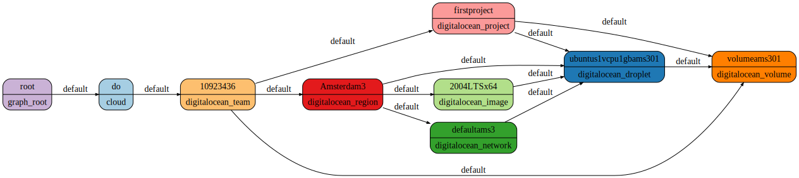

# DigitalOcean Support

I worked on a plugin that allows collecting DigitalOcean resources over the past few weeks, and I'm happy to announce that Resoto now has DigitalOcean support! 🌊


<!--truncate-->

## Getting Started

To get started, add your DigitalOcean API tokens to [Resoto Worker](/docs/concepts/components/worker)via the [`config` command](/docs/reference/cli/configs) in [Resoto Shell](/docs/concepts/components/shell):

```bash
> config edit resoto.worker
```

In the text editor opened by [`config edit`](/docs/reference/cli/configs/edit), modify the configuration as follows:

```yaml
resotoworker:
  collector:
    - digitalocean
    ...

digitalocean:
  # DigitalOcean API tokens for the teams to be collected
  api_tokens:
    - ACCESS_KEY_1
    - ACCESS_KEY_2
  # DigitalOcean Spaces access keys for the teams to be collected, separated by colons
  spaces_access_keys:
    - SPACE_ACCESS_KEY_1:SPACE_ACCESS_SECRET_1
    - SPACE_ACCESS_KEY_2:SPACE_ACCESS_SECRET_2
...
```

:::note

The spaces access keys should correspond to the API tokens.

:::

The DigitalOcean collector also supports multiple teams. To collect several teams, simply provide multiple keys separated by space.

Once the DigitalOcean plugin configuration has been updated, trigger a collect run:

```bash
> workflows run collect
```

<!--truncate-->

## Searching the Graph

All DigitalOcean resources inherit from the `digitalocean_resource` class, meaning that you can find resources using `search is(digitalocean_resource)`. It is also possible to search DigitalOcean resources by type with a query like `search is(​​digitalocean_droplet)`.

In addition, these search results can be filtered. For example, we can find all droplets under the project `foo`:

```bash
> search is(digitalocean_project) and name=="foo" --> is(digitalocean_droplet)
```

For more details, please see the [search documentation](/docs/concepts/search).

### Visualizing the Graph

It is possible to generate a dotfile with a result of your search:

```bash
> search --with-edges is(digitalocean_team) <-[0:]-> | format --dot | write out.dot
```



The generated dotfile can be opened in any [Graphviz](https://graphviz.org) viewer. I personally like the [Graphviz Interactive Preview](https://marketplace.visualstudio.com/items?itemName=tintinweb.graphviz-interactive-preview) VSCode extenstion.

## Tagging

Additionally, you can add tags to resources using the [`tag update` command](/docs/reference/cli/tag/update):

```bash
> search is(digitalocean_droplet) | tag update foo bar
```

This command will attach a tag `foo` with value `bar` to all droplets.

It is also possible to omit the tag value:

```bash
> search is(digitalocean_droplet) | tag update foo
```

:::note

Since DigitalOcean does not support tag values, values are emulated by resoto using `--` as a separator. As a result, you will see the tag `foo--bar` in the DigitalOcean console.

:::

### Removing Tags

To untag the resource, use the [`tag delete` command](/docs/reference/cli/tag/delete):

```bash
> search is(digitalocean_droplet) | tag delete foo
```

### Searching Tags

We can find all resources with tag `foo` and value `bar` like so:

```bash
> search is(digitalocean_droplet) and tags.foo==bar
```

It is also possible to search for all resources tagged with `foo` (regardless of the tag value):

```bash
> search is(digitalocean_droplet) and has_key(tags, foo)
```

:::note

Since DigitalOcean does not support tag values, it is necessary to either specify an empty string as the tag value or use the `has_key` function.

:::

## Cleaning Up

To delete resources, pipe search results to the `cleanup` command:

```bash
> search is(​​digitalocean_droplet) | cleanup
```

Doing manual searches and cleanups is cool, but what if you could set up a cron job that cleans up the resources after your experiments? Resoto makes it easy to accomplish this as well.

For example, we can add a job that will clean up droplets in a specific DigitalOcean team that are more than a day old at 4 AM each day:

```bash
> jobs add cleanup-after-experiments --schedule '0 4 * * *'  'search is(digitalocean_droplet) and /ancestors.account.reported.id=="1234567" and age > 1d | cleanup'
```

Now, you can spin up new resources for testing without needing to worry about cleaning them up! 🎉

Check out the [jobs documentation](https://resoto.com/docs/concepts/automation/job) for more information. I hope that this blog post was informative, and that you will try out the new DigitalOcean plugin!
