# Resotonotebook

Today I'm excited to talk about resotonotebook, a library for interacting with resoto using jupyter notebooks.

With it, you can enjoy the power of pandas, graphviz and other popular python data analysis libraries straight in your browser. Let's dive in!

## Installation

Before we get started, I assume that you have an access to a running resotocore. If you don't, please follow the [getting started instructions](https://resoto.com/docs/getting-started) first.

Once the resotocore is up and running, we can install the resotonotebook:

```bash
pip install notebook resotonotebook
```

Let's also install the jupyter notebook:

```bash
pip install notebook
```

And that's it!

## Usage

Now let's dive in and see what can be done using resoto notebook. For this we need an instance of the `ResotoNotebook` object. Let's create it first:

```python
from resotonotebook import ResotoNotebook
rnb = ResotoNotebook("https://localhost:8900", None)
```

### Full text search:

Search all resources for a property with value foobar:

```python
rnb.search('"foobar"')
```

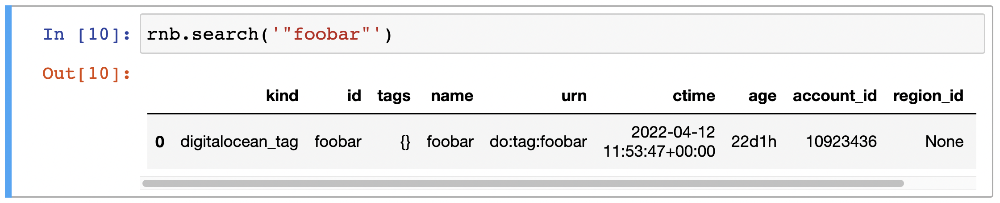

### Counting

Get number of all collected instances by kind

```python
rnb.search("is(instance)").groupby(["kind"])["kind"].count()
```

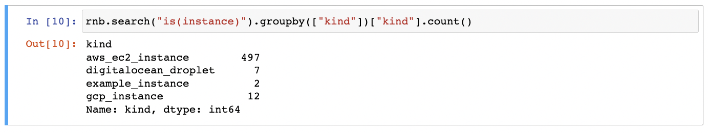

### Searching by kind

Get list of all the DigitalOcean droplets:

```python
rnb.search("is(digitalocean_droplet)")
```

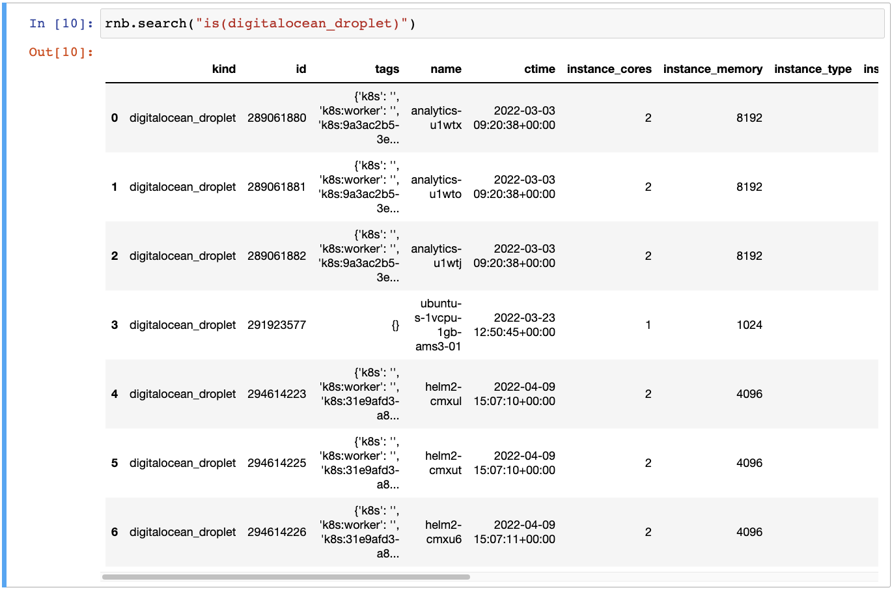

### Visualization

Render the acounts as an svg graph:

```python
from IPython.display import display_png as render_png, display_svg as render_svg
render_svg(rnb.graph("is(cloud)"))
```

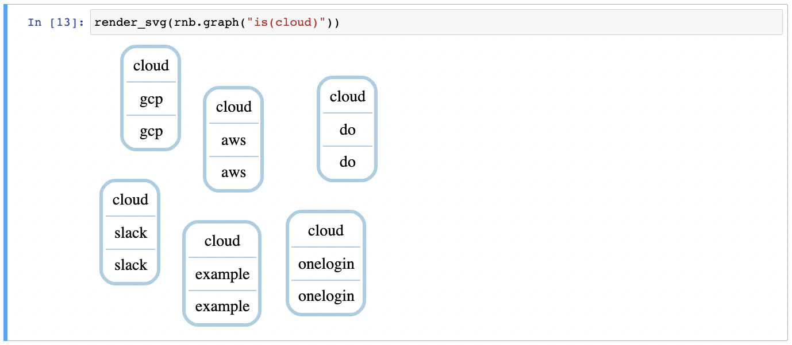

Make a graph of all clouds with name do and their successors one level deep and render it as a PNG image:

```python
render_png(rnb.graph("is(cloud) and name=do <-[0:2]->"))
```

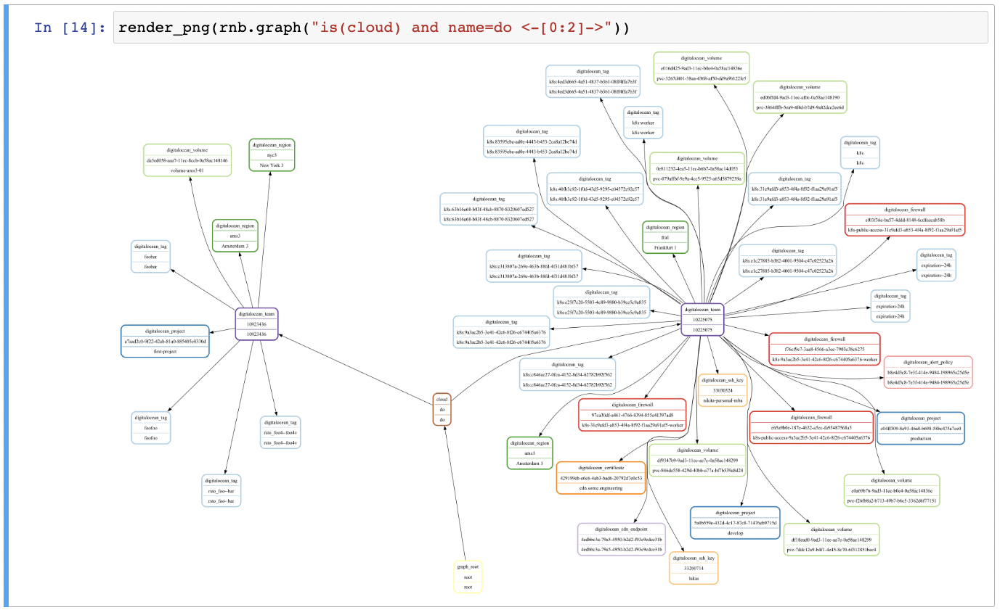

Show the instances/cores/account heatmap:

```python
import plotly.express as px
data = rnb.search("is(instance)")
px.density_heatmap(data, x="account_id", y="instance_cores")
```

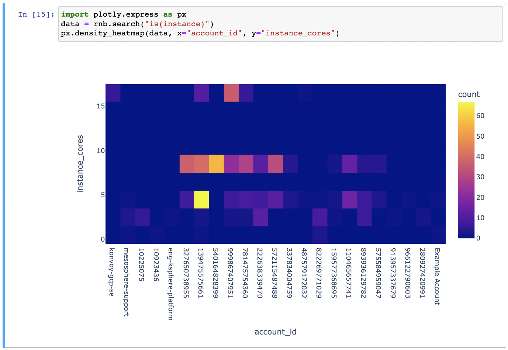

### Selecting properties

Get list of name, type, cores, and memory for each instance:

```python
rnb.search("is(instance)")[["region_id", "instance_type","instance_cores", "instance_memory"]]
```

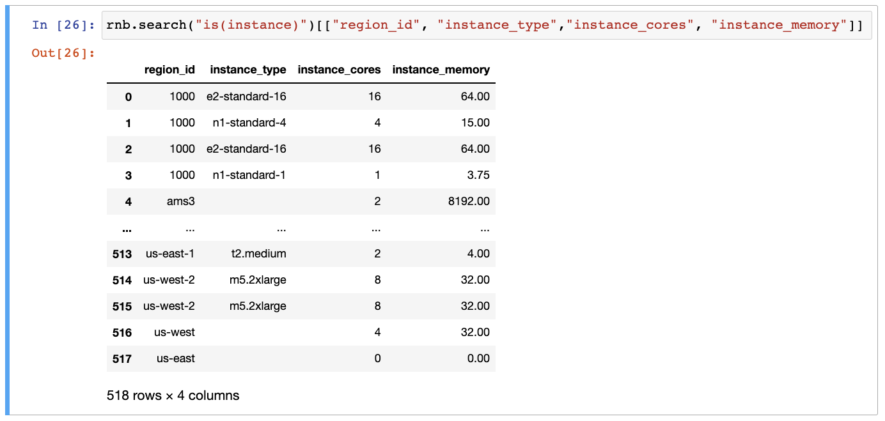

### Filtering

Get list of all compute instances with more than two CPU cores:

```python
rnb.search("is(instance) and instance_cores > 2")['id']
```

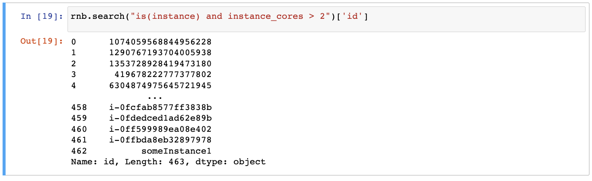

Get list volumes that are not in use, larger than 10GB, older than 30 days.

```python
rnb.search("is(volume) and volume_status != in-use and volume_size > 10 and age > 30d")['id']
```

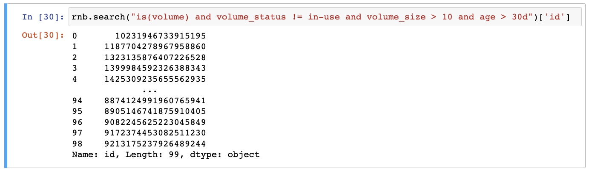

### Aggregation

Count the number of instances by account ID:

```python
rnb.search("is(instance)").groupby(["account_id"])["account_id"].count()
```

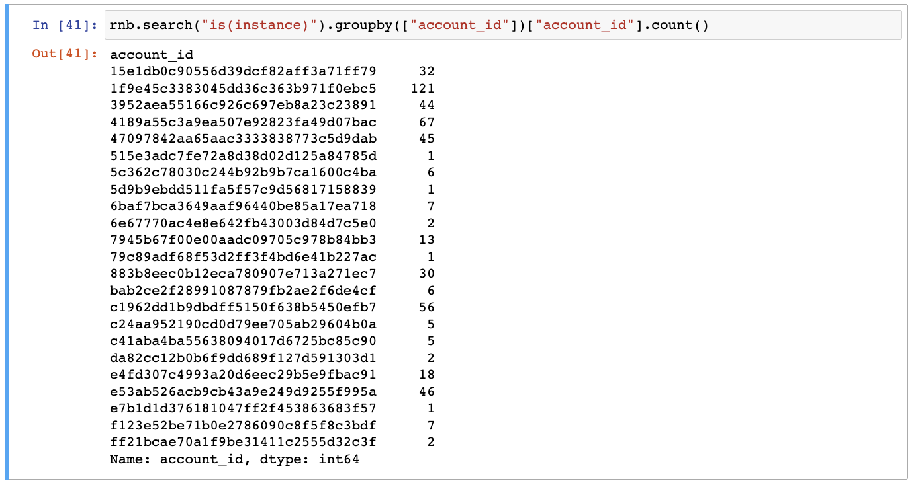

Aggregate RAM usage (bytes) data grouped by cloud, region, and instance type:

```python
rnb.search("is(instance) and instance_status == running") \
    .groupby(["cloud_id", "region_id", "instance_type"], as_index=False)[["instance_cores"]] \
    .sum()
```

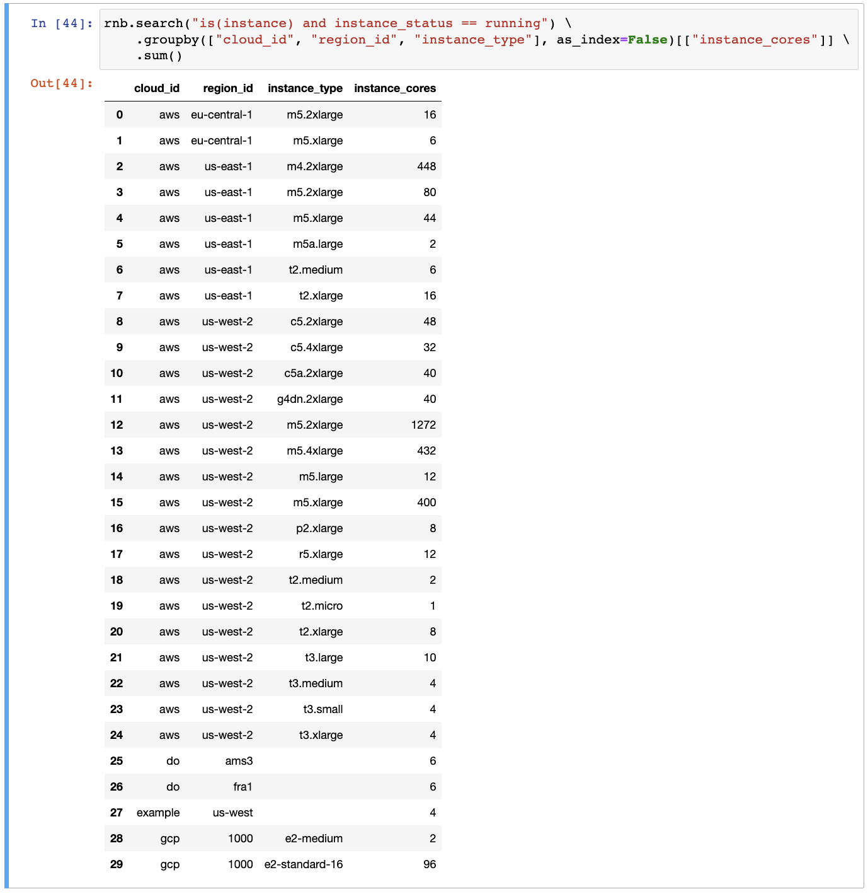

## Next steps

You can find the examples from this blog in the [resotonotebook repository](https://github.com/someengineering/resotonotebook/blob/main/examples/example.ipynb).

That's it for now. Happy exploring!
