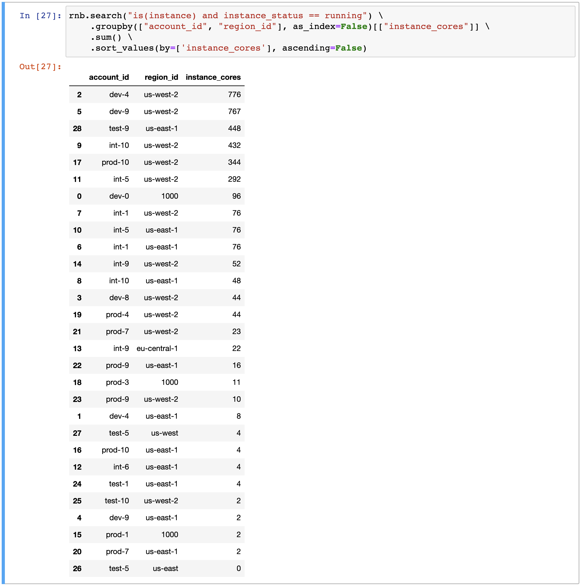

# Resotonotebook

Recenty we released resotonotebook, a library to visualize and and explore the Resoto graph interactively, designed to be used together with jupyter notebooks. It is similar to resotoshell in a sense that you can execute your queries one by one, but, unlike resotoshell, the results are returned as [pandas](https://pandas.pydata.org/docs/user_guide/10min.html) dataframes, and you can use python too! This gives you much more flexibility for further filtering, aggregation, visualization and much more.

Let me take you for a tour:

## A tour of resotonotebook

The examples below are taken from [example notebook](https://github.com/someengineering/resotonotebook/blob/main/examples/example.ipynb). I recommend to copy it and modify it for your own needs.

### Heatmaps

Resotonotebook comes with a library called [plotly](https://plotly.com/python/), which is capable of visualizing data in a variety of ways.

A useful example is a heatmap. It makes it easy to spot outliers, for example when someone played around with an expensive cluster and forgot to shut it down. Then you can easily clean it up using resoto.

Here we will use the [heatmap](https://plotly.com/python/2D-Histogram/) to visualize now the number instances per core count per accunt looke like.


### Graphs

Sometimes you're interested in the relationships between resources. Let's say you want to remove the database, but you're not sure which other resources this will impact. With resotonotebook, you can put the resource and its relations under the microscope and have a clear picture of what's going on.

Let's make a graph of a cloud called `do` (DigitalOcean) and all its successor resources 2 levels deep:


### Aggregations

With resotonotebook, you can rely on the power of Pandas, a popular python package for data analysis. Pandas allows you to use dataframe, a table-like object that allows you to easily query, filter and aggregate the data. To make an example, let's aggregate the number of cores of running instances per account per region:



With this information, we can quickly identify the most expensive accounts to take cost reduction measures.

I hope at this point resotonotebook has whetted your appetite. Let's install it and start playing with it!

## Installation

Installation is simple. We need to install the jupyter notebook and the resotonotebook packages. Just run the following command in your terminal:

```bash
pip install notebook resotonotebook
```

And you're good to go! Just one note: you need access to a running instance of resotocore. If you don't have it yet, see the [resoto documentation](https://resoto.com/docs/getting-started) for the installation instructions.

## Next steps

Now that you have resotonotebook installed, what's next? One option is to clone the [example](https://github.com/someengineering/resotonotebook/blob/main/examples/example.ipynb) notebook and modify it for your needs:

```bash
git checkout git@github.com:someengineering/resotonotebook.git
cd resotonotebook/examples
jupyter notebook
```

Happy exploring!
