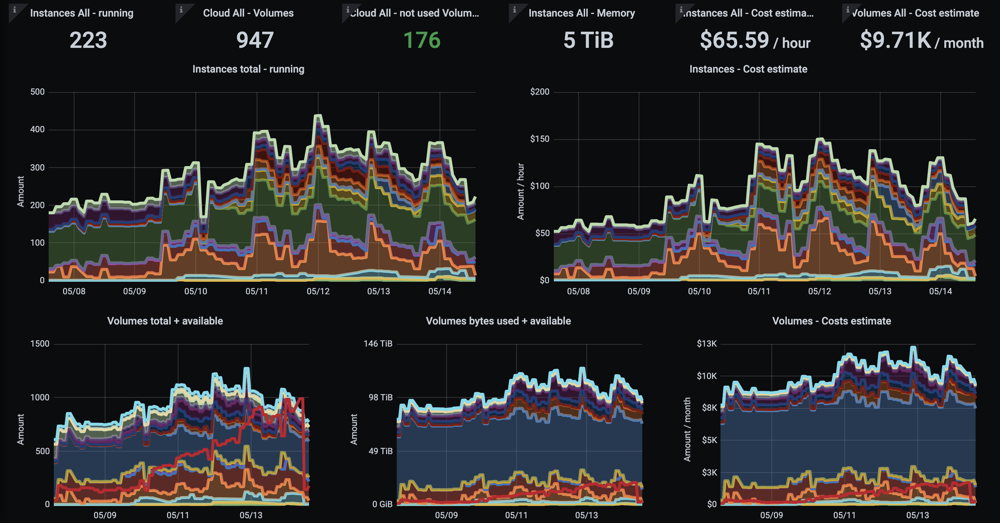

# 1. Collect , 2. Aggregate , 3. ......, 4. Profit!

## Metrics in Resoto

Let's begin with a question: Do you know how many compute instances are running in your infrastructure right now and what you are paying for them?

If the answer is "No, not exactly", then my next question would be: Why not? Compute and storage are typically the most expensive items on your cloud bill. Compute and storage are also the most critical pieces of infrastructure for most businesses. Critical for the business to function but also security and compliance critical in that you should want to know if you unknowingly stored your customer data on an unencrypted storage volume or if there were credentials that allowed access to said data and haven't been rotated in a couple of months or even years.

With Resoto you get a picture of the current state of your infrastructure, can search it and also automatically react to changes in your infrastructure. Resoto also lets you aggregate this data as my Co-Founder Matthias has explained in [his March Blog post](https://resoto.com/blog/2022/03/03/aggregating-search-data). Building on that knowledge, if we take the aggregated data and ingest it into a timeseries database like Prometheus, we can then use this data to build a diagram that shows the evolution of compute instances in your infrastructure over time.

<!--truncate-->

## Getting Started
