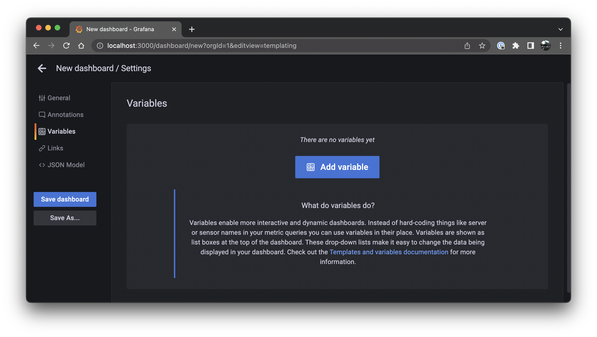

# 1. Collect , 2. Aggregate , 3. ..., 4. Profit!

## Cloud Infrastructure Metrics

Let's begin with a question: At this very moment, do you know how many compute instances are running in your infrastructure and what you are paying for them?

If the answer is "No, not exactly", then my next question would be: Why not? Compute and storage are typically the most expensive items on your cloud bill. Compute and storage are also the most critical pieces of infrastructure for most businesses.

With Resoto we give you a picture of the current state of your cloud infrastructure. You can search that state and have Resoto automatically react to state changes. Resoto also lets you [aggregate this data](https://resoto.com/blog/2022/03/03/aggregating-search-data) as my Co-Founder Matthias explained in [his March Blog post](https://resoto.com/blog/2022/03/03/aggregating-search-data).

Building on that knowledge, we can take the aggregated data and ingest it into a time series database like Prometheus. We can then use this information to build diagrams to for example show the evolution of cloud resources like compute instances and storage over time. We can also [alert on trends](https://prometheus.io/docs/alerting/latest/alertmanager/), like if we are going to run out of quota or about to hit a spend limit.


Resoto comes with a handy dandy metrics component called [Resoto Metrics](https://resoto.com/docs/concepts/components/metrics). It takes aggregation results and exports them to [Prometheus](https://prometheus.io/). In this post we will show you how to use Resoto's metrics component to build a simple metrics dashboard using Resoto Metrics, Prometheus and Grafana.

<!--truncate-->

## Prefix

If you already know what graph databases, time series databases, Prometheus and Grafana are you can [skip ahead to the next chapter](#getting-started). For anyone not deep into the cloud native ecosystem let's get some concepts and terminology out of the way.

Resoto creates an inventory of your cloud infrastructure by taking all the meta data of your cloud resources and storing them inside of a graph database. This is what we call the `collect` [step](https://resoto.com/docs/concepts/automation/workflow). Every resource (like a compute instance, storage volume, etc.) is represented by a node in the graph. Nodes are connected to each other by edges. Edges represent the relationship between two nodes.


In Resoto a node is essentially an indexed JSON document that contains all the meta data of a resource. The `aws_ec2_instance` from the graph picture above would look something like this:

```json
{
  "reported": {
    "kind": "aws_ec2_instance",
    "id": "i-07c9d738469b966d0",
    "tags": {
      "owner": "lukas"
    },
    "name": "wes-scaletesting-bootstrap",
    "ctime": "2020-06-16T15:08:45Z",
    "instance_cores": 4,
    "instance_memory": 16,
    "instance_type": "t2.xlarge",
    "instance_status": "running"
    ...
  }
  ...
}
```

Resoto then allows you to [search that meta data](http://localhost:3000/blog/2022/02/04/resoto-search-101). An example search could be

```
> search is(aws_ec2_instance) and instance_cores > 4
​
​kind=aws_ec2_instance, id=i-065af67d77cd5a272, name=16ca1.prod1, instance_cores=16, age=3yr2mo, cloud=aws, account=eng-production, region=us-west-2
​kind=aws_ec2_instance, id=i-019f3f3a2a8d1990e, name=16ca2.prod1, instance_cores=16, age=3yr2mo, cloud=aws, account=eng-production, region=us-west-2
​kind=aws_ec2_instance, id=i-0667dc8de49a4319e, name=16ca3.prod1, instance_cores=16, age=3yr2mo, cloud=aws, account=eng-production, region=us-west-2
​kind=aws_ec2_instance, id=i-076b9763c755a9b51, name=16ca4.prod1, instance_cores=16, age=3yr2mo, cloud=aws, account=eng-production, region=us-west-2
​kind=aws_ec2_instance, id=i-074fcfe526f95c9fd, name=16ca5.prod1, instance_cores=16, age=3yr2mo, cloud=aws, account=eng-production, region=us-west-2
​kind=aws_ec2_instance, id=i-04e09d3c714048c4d, name=16ca6.prod1, instance_cores=16, age=3yr2mo, cloud=aws, account=eng-production, region=us-west-2
​kind=aws_ec2_instance, id=i-0d2dfda13e02b2b20, name=16ca7.prod1, instance_cores=16, age=2yr9mo, cloud=aws, account=eng-production, region=us-west-2
​...
```

This would return a list of all the EC2 instances with more than 4 cores. That's neat if I want to do something with each individual instance, but sometimes I'm not interested in the details of individual resources. Sometimes I just want to know the sum of how many resources are running in my infrastructure. Or, how many resources with a certain criteria are running. Like the distribution of compute instances by instance type (e.g. how many m5.large, m5.2xlarge, etc.) or the current cost of compute plus storage grouped by team. This is where the before mentioned [aggregation](https://resoto.com/blog/2022/03/03/aggregating-search-data) comes into play. It does just that. [Aggregating resources and grouping the result](https://resoto.com/blog/2022/03/03/aggregating-search-data) by a criteria.

```
> search aggregate(/ancestors.account.reported.name as account: sum(1) as instances_total): is(aws_ec2_instance)

​group:
​  account: eng-production
​instances_total: 21
​
​---
​group:
​  account: eng-scaletesting
​instances_total: 56
​...
```

Now this is also useful but what would be even neater was if I could compare the current value to the one from an hour ago, a day ago, a month ago, a year ago, etc. This is where time series come into play. A time series database like [Prometheus](https://prometheus.io/) does not store the details of an individual resource but instead stores the aggregated data over time. It then allows us to query that data and create charts to visualize the result. Prometheus has some very basic graphing capabilities but if we want to build a dashboard we want to use a more advanced tool like [Grafana](https://grafana.com/). It can visualize data from a variety of different sources and it can also be used to create dashboards.


So here's the plan. First we are going to [configure Prometheus to fetch data from Resoto Metrics](#getting-started). Then we will learn how to [query that data inside Prometheus](#querying-a-metric). Then we learn [where Resoto has those metrics configured](#how-metrics-are-made) and how to define our own custom metrics. Finally we will use Grafana to [create a simple dashboard and visualize the data](#i-was-promised-a-metrics-dashboard).

## Getting Started

If you are new to Resoto, [start the Resoto stack](https://resoto.com/docs/getting-started/installing-with-docker) and [configure it to collect some of your cloud accounts](https://resoto.com/docs/getting-started/configuring-resoto#configuring-cloud-providers).

To checkout the data Resoto Metrics generates open [`https://localhost:9955/metrics`](https://localhost:9955/metrics) in your browser (replacing `localhost` with the IP address or hostname of the machine where `resotometrics` is running). This should show an output similar to this:


That is the raw metrics data Prometheus will ingest. If you are using our Docker stack you do not have to do anything, Prometheus is already pre-configured. If you are using your own Prometheus installation, configure it to scrape this metrics endpoint. The config will look something like this:

```yml title="prometheus.yml"
scrape_configs:
  - job_name: "resotometrics"
    scheme: https
    tls_config:
      insecure_skip_verify: true
    static_configs:
      - targets: ["localhost:9955"]
```

Instead of skipping verification of the TLS certificate, you can also [download the Resoto CA certificate](https://resoto.com/docs/concepts/security#retrieving-and-validating-the-ca-certificate) and [configure Prometheus to use it](https://prometheus.io/docs/prometheus/latest/configuration/configuration/#tls_config).

## Querying a Metric

Open up your Prometheus installation (in our Docker stack it is running at [`http://localhost:9090`](http://localhost:9090)) and you should see the following:


Let's start with a very simple expression:

```
resoto_instances_total
```

That's it, that's the query. If you have any instances collected in Resoto the output will look something like this:


Here is one of those metrics from the list:

```
resoto_instances_total{cloud="aws", account="eng-production", region="us-west-2", status="running", type="m5.xlarge", instance="localhost:9955", job="resotometrics"} 17
```

The key=value pairs inside those curly brackets are called labels. We can filter by label. Update the query to:

```
resoto_instances_total{status="running"}
```

Now we are only seeing compute instances that we are actually paying for at the moment.This information is a bit more interesting, but we could get the same from within the Resoto Shell. What would be really interesting, is how the number of compute instances has changed over the last week or two.

Click on the `Graph` tab, choose a `2w` period and click the `Show stacked graph` button. We are getting closer to what we'd like to see. But what are these speckles? Why aren't we seeing solid lines?


By default Resoto collects data once per hour. Let's tell Prometheus to create an average over time over one hour by changing the query to:

```
avg_over_time(resoto_instances_total{status="running"}[1h])
```


Good, the data points are connected and averaged over time. However the amount of labels is a bit overwhelming. Right now we are seeing one stacked chart per unique label combination. Let's try to reduce the amount of labels by summing them all up.

```

sum(avg_over_time(resoto_instances_total{status="running"}[1h]))

```


Nice, now we see how the total number of compute instances has changed over time. However we lost absolutely all labels. No more accounts, region and instance type information. To get some information back, let's group the summed up averages by account.

```

sum(avg_over_time(resoto_instances_total{status="running"}[1h])) by (account)

```


Neat, we see how the number of compute instances has changed over time for each account.

Want to see how storage has changed over time? Just change `resoto_instances_total` to `resoto_volume_bytes`. Want to see $$$ spent per hour? `resoto_instances_hourly_cost_estimate` is the metric you are looking for.

## How Metrics are made

Now Prometheus' Web UI will provide syntax help and auto-complete for the available metric names. However you might be wondering, how are you supposed to know which metrics exist? How do you know what other metrics there are and where something like `resoto_instances_total` is coming from? Glad you asked. All Metrics are defined in the `resoto.metrics` [config](https://resoto.com/docs/getting-started/configuring-resoto). Within [Resoto Shell (`resh`)](https://resoto.com/docs/concepts/components/shell) run:

```

> config edit resoto.metrics

```

```yaml
resotometrics:
  metrics:
    instances_total:
      # Metric help text
      help: 'Number of Instances'
      # Aggregation search to run
      search: 'aggregate(/ancestors.cloud.reported.name as cloud, /ancestors.account.reported.name as account, /ancestors.region.reported.name as region, instance_type as type, instance_status as status: sum(1) as instances_total): is(instance)'
      # Type of metric (gauge or counter)
      type: 'gauge'
...
```

Here you can add your own metrics. The `aggregate` expression in the `search` field is what creates the metric.

Try copying the above `search` into the `resh` shell and run it. You should see something like this:

```
> search aggregate(/ancestors.cloud.reported.name as cloud, /ancestors.account.reported.name as account, /ancestors.region.reported.name as region, instance_type as type, instance_status as status: sum(1) as instances_total): is(instance)
​
​group:
​  cloud: aws
​  account: eng-production
​  region: us-west-2
​  type: m5.xlarge
​  status: running
​instances_total: 13
​
​---
​group:
​  cloud: aws
​  account: eng-production
​  region: us-west-2
​  type: m5.4xlarge
​  status: stopped
​instances_total: 7
...
```

This config can be updated at runtime. Next time the `metrics` [workflow](https://resoto.com/docs/concepts/automation/workflow) is run Resoto Metrics will generate the new metric and from then on provide it to Prometheus.

```
> workflow run metrics
```

## I was promised a Metrics Dashboard!

So now we have learned how to get metrics from Resoto into Prometheus, how to query them and how to create new ones. But what about the dashboard?

Right, fasten your seatbelt. This will go fast.

1. Run the Grafana Docker container

```
$ docker run -d -p 3000:3000 -v grafana-data:/var/lib/grafana -v grafana-etc:/etc/grafana grafana/grafana-oss
```

2. Open up the Grafana UI (e.g. [http://localhost:3000](http://localhost:3000))

3. Login as `admin` with password `admin` and set a new password.

4. Go to Settings > Data Sources > Add Data Source > Prometheus

5. In the URL field, enter the Prometheus URL e.g. `http://tsdb.docker.internal:9090`


6. Scroll down and click `Save & test`. Make sure it replies with "Data source is working".


7. On the left click on the `+` button and select `Create Dashboard`.

8. On the top click on `Settings` > `Variables` and `Add variable`.



9. As Name choose `Cloud`, as Query enter `label_values(cloud)` and select `Multi-value`. Make sure that the `Preview of values` shows the available clouds and click `Update`.


10. Repeat Step 9 for "Account/account" and "Region/region".

11. Hit `ESC` and on the top of the page click on `Add a new panel`.


12. On the right in `Panel Options` enter Title `Instances Total`.

13.

```
sum(avg_over_time(resoto_instances_total{cloud=~"$cloud", region=~"$region", account=~"$account", status="running"}[$__interval]))
```
