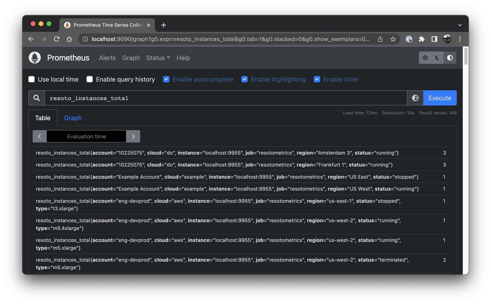
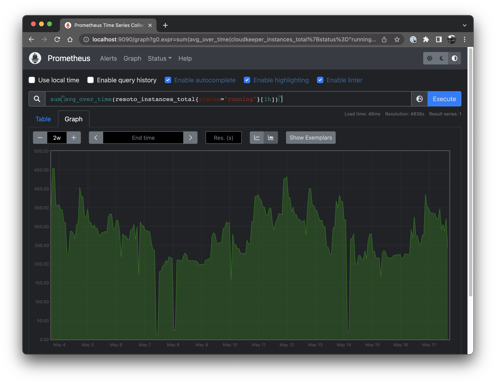
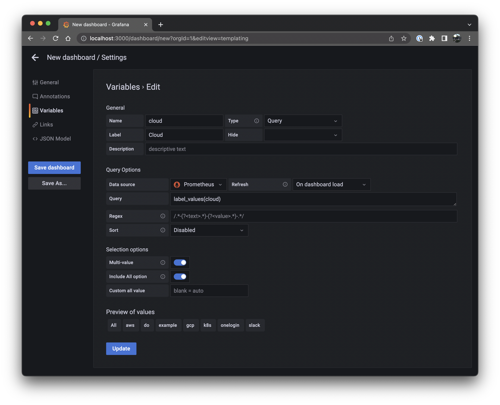
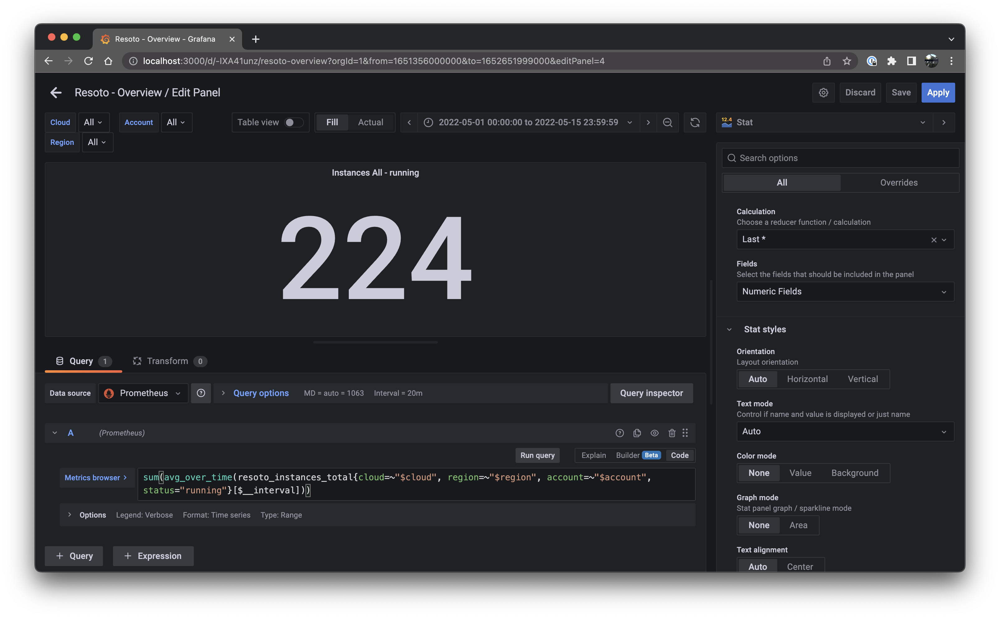

# 1. Collect , 2. Aggregate , 3. ..., 4. Profit!

## Cloud Infrastructure Metrics

At this very moment, do you know how many compute instances are running in your infrastructure and what you are paying for them?

If the answer is, "No, not exactly," then my next question for you is, "Why not?"

Compute and storage are typically the most expensive items on your cloud bill. They are also the most critical pieces of infrastructure for most businesses.

With Resoto we give you a picture of the current state of your cloud infrastructure. You can search that state and have Resoto automatically react to state changes. Resoto also lets you [aggregate this data](/blog/2022/03/03/aggregating-search-data) as my Co-Founder Matthias explained in [his March blog post](/blog/2022/03/03/aggregating-search-data).

We can ingest this aggregated data and into a time series database, such as Prometheus. This information can then be used to build diagrams of cloud resources (e.g., compute instances and storage) over time.


This then allows you to [alert on trends](https://prometheus.io/docs/alerting/latest/alertmanager/), like if we are going to run out of quota or about to hit a spend limit. Another use case is to quickly [identify anomalies](https://prometheus.io/docs/prometheus/latest/querying/functions/#aggregation_over_time) using [the 3σ rule](https://en.wikipedia.org/wiki/68%E2%80%9395%E2%80%9399.7_rule). If somebody in the organization leaked their cloud API credentials or an automated system is going haywire, you will immediately see a spike and not only know about it when your next cloud bill arrives. Best of all it works across multiple clouds and accounts.

Resoto comes with a handy dandy metrics component called [Resoto Metrics](/docs/concepts/components/metrics). It takes aggregation results and exports them to [Prometheus](https://prometheus.io/). In this post we will show you how to build a simple metrics dashboard using [Resoto Metrics](/docs/concepts/components/metrics), [Prometheus](https://prometheus.io/) and [Grafana](https://grafana.com/).

<!--truncate-->

## Prefix

If you already know what graph and time series databases, metrics, samples, labels, Prometheus and Grafana are you can [skip ahead to the next chapter](#getting-started). For anyone not deep into the cloud native metrics ecosystem let's get some concepts and terminology out of the way.

#### Collecting

Resoto creates an inventory of your cloud infrastructure by taking all the meta data of your cloud resources and storing them inside of a graph. This is what we call the `collect` [step](/docs/concepts/automation/workflow). Every resource (like a compute instance, storage volume, etc.) is represented by a node in the graph. Nodes are connected to each other by edges. Edges represent the relationship between two nodes as illustrated in this graph excerpt (please excuse my MS Paint skills):


In Resoto a node is essentially an indexed JSON document that contains all the meta data of a resource. The `aws_ec2_instance` from the graph picture above would look something like this:

```json
{
  "reported": {
    "kind": "aws_ec2_instance",
    "id": "i-07c9d738469b966d0",
    "tags": {
      "owner": "lukas"
    },
    "name": "wes-scaletesting-bootstrap",
    "ctime": "2020-06-16T15:08:45Z",
    "instance_cores": 4,
    "instance_memory": 16,
    "instance_type": "t2.xlarge",
    "instance_status": "running"
    ...
  }
  ...
}
```

#### Searching

Among other things Resoto then allows you to [search that meta data](/blog/2022/02/04/resoto-search-101). An example search could be

```
> search is(aws_ec2_instance) and instance_cores > 4
​
​kind=aws_ec2_instance, id=i-065af67d77cd5a272, name=16ca1.prod1, instance_cores=16, age=3yr2mo, cloud=aws, account=eng-production, region=us-west-2
​kind=aws_ec2_instance, id=i-019f3f3a2a8d1990e, name=16ca2.prod1, instance_cores=16, age=3yr2mo, cloud=aws, account=eng-production, region=us-west-2
​kind=aws_ec2_instance, id=i-0667dc8de49a4319e, name=16ca3.prod1, instance_cores=16, age=3yr2mo, cloud=aws, account=eng-production, region=us-west-2
​kind=aws_ec2_instance, id=i-076b9763c755a9b51, name=16ca4.prod1, instance_cores=16, age=3yr2mo, cloud=aws, account=eng-production, region=us-west-2
​kind=aws_ec2_instance, id=i-074fcfe526f95c9fd, name=16ca5.prod1, instance_cores=16, age=3yr2mo, cloud=aws, account=eng-production, region=us-west-2
​kind=aws_ec2_instance, id=i-04e09d3c714048c4d, name=16ca6.prod1, instance_cores=16, age=3yr2mo, cloud=aws, account=eng-production, region=us-west-2
​kind=aws_ec2_instance, id=i-0d2dfda13e02b2b20, name=16ca7.prod1, instance_cores=16, age=2yr9mo, cloud=aws, account=eng-production, region=us-west-2
​...
```

This would return a list of all the EC2 instances with more than 4 cores. That's useful if I want to do something with each individual instance, but sometimes I'm not interested in the details of individual resources. Sometimes I just want to know the sum of how many resources there are. Or, how many resources of a certain kind are running. Like the distribution of compute instances by instance type (e.g. how many m5.large, m5.2xlarge, etc.) or the current cost of compute plus storage grouped by team.

#### Aggregating

This is where the before mentioned [aggregation](/blog/2022/03/03/aggregating-search-data) comes into play. It does just that; [aggregating and grouping the results of a search](/blog/2022/03/03/aggregating-search-data). This is what creates the samples of a metric.

```
> search aggregate(/ancestors.cloud.reported.name as cloud, /ancestors.account.reported.name as account, /ancestors.region.reported.name as region, instance_type as type, instance_status as status: sum(1) as instances_total): is(instance)
​
​group:
​  cloud: aws
​  account: eng-production
​  region: us-west-2
​  type: m5.xlarge
​  status: running
​instances_total: 13
​
​---
​group:
​  cloud: aws
​  account: eng-production
​  region: us-west-2
​  type: m5.4xlarge
​  status: stopped
​instances_total: 7
​...
```

Now this is useful but what would be even more useful was if I could compare the current values to the ones from an hour ago, a day ago, a month ago, a year ago, etc. This is where time series come into play.

#### Time series

A time series database like [Prometheus](https://prometheus.io/) does not store the details of an individual resource but instead stores the aggregated data over time. It then allows us to query that data and create charts to visualize the result. In the aggregated search above each of the results is what Prometheus calls a sample. A sample is a single value at a point in time in a time series. In our previous example the `cloud`, `account`, `region`, `type` and `status` in each group is what's called a [label](https://prometheus.io/docs/concepts/data_model/#metric-names-and-labels) in Prometheus. Labels are `key: value` pairs that allow us to group samples.

Prometheus has some basic graphing capabilities but to build a dashboard we want to use a better suited tool like [Grafana](https://grafana.com/). It can visualize data from different sources in a variety of chart styles, like this stacked line chart.


So here's the plan. First we will learn how to [configure Prometheus to fetch data from Resoto Metrics](#getting-started). Then how to [query that data inside Prometheus](#querying-a-metric). After that we explore from where Resoto retrieves its metrics configuration and how to [define our own metrics](#how-metrics-are-made). Finally we will use Grafana to [create a simple dashboard and visualize the data](#i-was-promised-a-metrics-dashboard).

## Getting Started

If you are new to Resoto, [start the Resoto stack](/docs/getting-started/installation) and [configure it to collect some of your cloud accounts](/docs/getting-started/configuring-resoto#configuring-cloud-providers).

To check out the data Resoto Metrics generates open [`https://localhost:9955/metrics`](https://localhost:9955/metrics) in your browser (replacing `localhost` with the IP address or hostname of the machine where `resotometrics` is running). This data is updated [whenever Resoto runs the collection workflow](/docs/getting-started/configuration/core#workflow-schedules). You should see an output similar to this:


That is the raw metrics data Prometheus will ingest. If you are using our Docker stack you do not have to do anything, Prometheus is already pre-configured. If you are using your own Prometheus installation, [configure it to scrape](https://prometheus.io/docs/prometheus/latest/configuration/configuration/#scrape_config) this metrics endpoint. The config will look something like this:

```yml title="prometheus.yml"
scrape_configs:
  - job_name: "resotometrics"
    scheme: https
    tls_config:
      insecure_skip_verify: true
    static_configs:
      - targets: ["localhost:9955"]
```

Instead of skipping verification of the TLS certificate, you can also [download the Resoto CA certificate](/docs/concepts/security#retrieving-and-validating-the-ca-certificate) and [configure Prometheus to use it](https://prometheus.io/docs/prometheus/latest/configuration/configuration/#tls_config).

## Querying a Metric

Open up your Prometheus installation (in our Docker stack it is running at [`http://localhost:9090`](http://localhost:9090)) and you should see the following:


Let's start with a very simple expression:

```
resoto_instances_total
```

That's it, that's the query. If you have any instances collected in Resoto the output will look something like this:



Here is one of those metrics from the list:

```
resoto_instances_total{cloud="aws", account="eng-production", region="us-west-2", status="running", type="m5.xlarge", instance="localhost:9955", job="resotometrics"} 17
```

The `key="value"` pairs inside those curly brackets are those [previously mentioned](#time-series) [labels](https://prometheus.io/docs/concepts/data_model/#metric-names-and-labels). To filter by label let us update the query to:

```
resoto_instances_total{status="running"}
```

Now we are only seeing compute instances that we are actually paying for at the moment.This information is a bit more interesting, but we could get the same from within the Resoto Shell. What would be really interesting, is how the number of compute instances has changed over the last week or two.

Click on the `Graph` tab, choose a `2w` period and click the `Show stacked graph` button.


We are getting closer to what we'd like to see. But what are these speckles? Why aren't we seeing solid lines?

By default Resoto collects data once per hour. Let's tell Prometheus to create an average over time over one hour by changing the query to:

```
avg_over_time(resoto_instances_total{status="running"}[1h])
```


Good, the data points are connected and averaged over time. However the amount of labels is a bit overwhelming. Right now we are seeing one stacked chart per unique label combination. Let's try to reduce the amount of labels by summing them all up.

```

sum(avg_over_time(resoto_instances_total{status="running"}[1h]))

```



Nice, now we see how the total number of compute instances has changed over the last two weeks. However we lost absolutely all labels. No more accounts, region and instance type information. To get some information back, let's group the summed up averages by account.

```

sum(avg_over_time(resoto_instances_total{status="running"}[1h])) by (account)

```


Neat, we see how the number of compute instances has changed over time for each account.

Want to see how storage has changed over time? Just change `resoto_instances_total` to `resoto_volume_bytes`. Want to see $$$ spent per hour? `resoto_instances_hourly_cost_estimate` is the metric you are looking for.

## How Metrics are made

Now Prometheus' Web UI will provide syntax help and auto-complete for available metric names. However you might be wondering, how are you supposed to know which metrics exist? How do you know what other metrics there are and where something like `resoto_instances_total` is defined? Glad you asked. All Metrics are configured in the `resoto.metrics` [config](/docs/getting-started/configuring-resoto). Within [Resoto Shell (`resh`)](/docs/concepts/components/shell) execute:

```

> config edit resoto.metrics

```

```yaml
resotometrics:
  metrics:
    instances_total:
      # Metric help text
      help: 'Number of Instances'
      # Aggregation search to run
      search: 'aggregate(/ancestors.cloud.reported.name as cloud, /ancestors.account.reported.name as account, /ancestors.region.reported.name as region, instance_type as type, instance_status as status: sum(1) as instances_total): is(instance)'
      # Type of metric (gauge or counter)
      type: 'gauge'
...
```

Here you can add your own metrics. As [previously explained](#aggregating), the `aggregate` expression in the `search` field is what creates the samples of a metric.

This config can be updated at runtime. Next time the `metrics` [workflow](/docs/concepts/automation/workflow) is run Resoto Metrics will generate the new metric and from then on provide it to Prometheus.

```
> workflow run metrics
```

## Creating the Metrics Dashboard

So now we have learned how to get metrics from Resoto into Prometheus, how to query them and how to create new ones. But what about the dashboard?

Right, fasten your seatbelt. This will go fast.

1. Run the Grafana Docker container

```
$ docker run -d -p 3000:3000 -v grafana-data:/var/lib/grafana -v grafana-etc:/etc/grafana grafana/grafana-oss
```

2. Open up the Grafana UI (e.g. [http://localhost:3000](http://localhost:3000))

3. Login as `admin` with password `admin` and set a new password.

4. On the left go to Settings > Data Sources > Add Data Source > Prometheus

5. In the URL field, enter the Prometheus URL e.g. `http://tsdb.docker.internal:9090`


6. Scroll down and click `Save & test`. Make sure it replies with "Data source is working".


7. On the left click on the `+` button and select `Create Dashboard`, then click the `Save` button in the top menu bar.


8. On the top click on `Dashboard settings` > `Variables` and `Add variable`.


9. As Name choose `cloud`, as Label `Cloud`, as Query enter `label_values(cloud)` and select `Multi-value` and `Include All option`. Make sure that the `Preview of values` shows the available clouds and click `Update`.



10. Repeat Step 9 for

- Name `account`, Label `Account`, Query `label_values(account)` and
- Name `region`, Label `Region`, Query `label_values(region)` with `Multi-value` and `Include All option` turned on for all variables.


11. Hit `ESC` on your keyboard to go back and on the top of the page click on `Add new panel`.


12. Apply the following Settings then click `Save` in the top right.

- In the query field next to "Metrics browser" enter

```
sum(avg_over_time(resoto_instances_total{cloud=~"$cloud", account=~"$account", region=~"$region", status="running"}[$__interval])) by (cloud, account)
```

- On the right in `Panel Options` enter Title `Instances Total - running`.
- Legend > Legend mode: Hidden
- Graph styles > Line width: 4
- Graph styles > Fill opacity: 40
- Graph styles > Connect null values: Always
- Graph styles > Stack series: Normal


- Click `Apply` in the top left.

13. Congratulations this is the start of your Resoto dashboard!


Do not forget to press the `Save` button whenever you make changes to the dashboard!

14. Next let's add a second panel with the following settings.

- In the query field next to "Metrics browser" enter

```
sum(avg_over_time(resoto_instances_total{cloud=~"$cloud", region=~"$region", account=~"$account", status="running"}[$__interval]))
```

- In the top right of the panel page instead of `Time series` choose `Stats` from the dropdown menu.
- Panel options > Title: `Instances $cloud - running`
- Value Options > Calulation: Last\*
- Stat styles > Color mode: None
- Stat styles > Graph mode: None



15. On the dashboard page reduce the size of the new panel a bit. Congratulations, the dashboard now shows two panels. One with the number of currently running instances, the other shows the history of the number of instances.


## The final product

If we repeat the above steps for [all the metrics we saw before](#how-metrics-are-made), we will get a dashboard that looks like this:


This is the actual production dashboard from a current Resoto user. It shows them the amount of compute and storage they are currently using, as well as the associated cost. It also graphs volumes that are not in use and will soon be cleaned up by Resoto. They also have dashboards for quota limits and network related stats. Individual teams use these dashboards to monitor their cloud usage by exposing custom tags as Prometheus labels and filtering by team or project.

They were nice enough to contribute [the Grafana dashboard templates](https://github.com/someengineering/resoto/tree/main/contrib/grafana-dashboards) so you don't have to create them yourself. But if you want to customize them, now you know how!

[Install Resoto](/docs/getting-started/installation) and build your own dashboard today!
