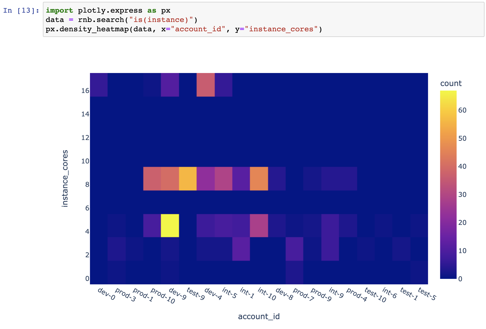
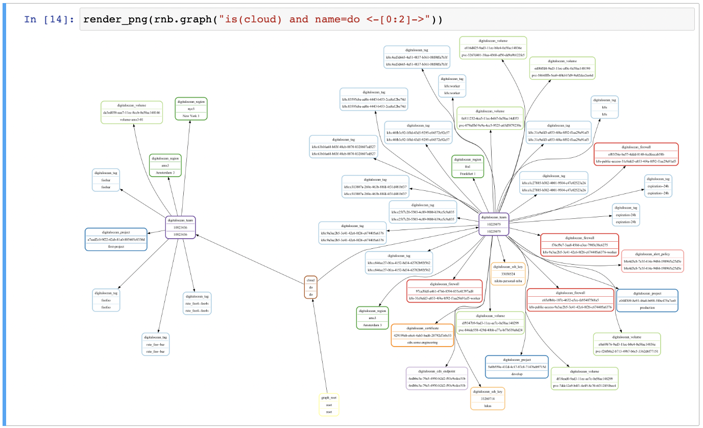
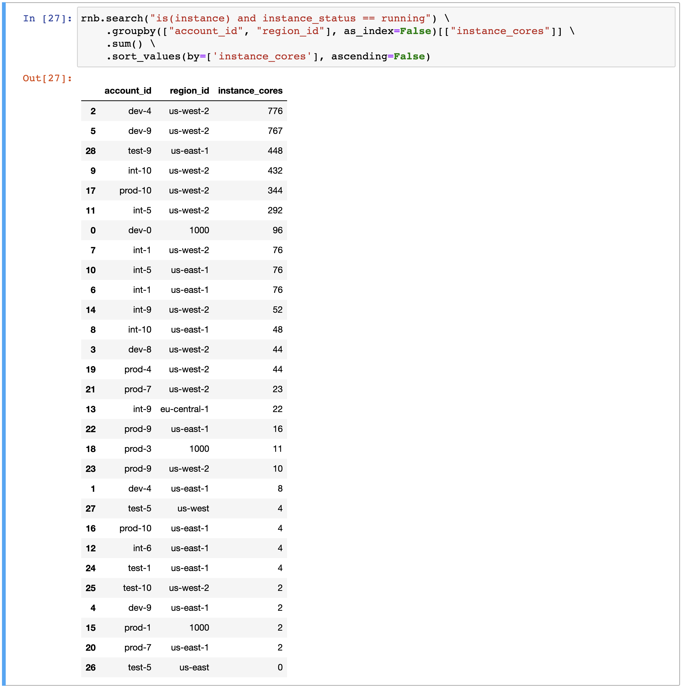

# Resoto Meets Jupyter Notebook

We recently released [Resoto Notebook](/docs/reference/notebook), a library that allows for the visualization and exploration of the Resoto graph interactively using [Jupyter](https://jupyter.org) Notebook.

[Resoto Notebook](/docs/reference/notebook) is similar to [Resoto Shell](/docs/concepts/components/shell) in the sense that you execute queries, but the results are returned in a [pandas](https://pandas.pydata.org) [`DataFrame` structure](https://pandas.pydata.org/pandas-docs/stable/reference/api/pandas.DataFrame.html). This gives you more flexibility in filtering, aggregation, visualization, etc.

<!--truncate-->

:::info

Please see [Resoto Notebook](/docs/reference/notebook) for [installation instructions](/docs/reference/notebook#installation) and [usage details](/docs/reference/notebook#usage).

An example notebook is [available on GitHub](https://github.com/someengineering/resotonotebook/blob/main/examples/example.ipynb). We encourage you to copy and modify it to suit your needs.

:::

## Heatmaps

[Resoto Notebook](/docs/reference/notebook) includes the [Plotly Python library](https://plotly.com/python), which is capable of visualizing data in a variety of ways.

[Heatmaps](https://plotly.com/python/2D-Histogram) are one of the supported visualization methods. [Heatmaps](https://plotly.com/python/2D-Histogram) make it easy to spot outliers—imagine, for example, someone was experimenting with an expensive cluster and forgot to shut it down.

Here is an example of a heatmap depicting the number of instances per core, per account:

The y-axis represents the number of cores per instance, while account IDs are listed along x-axis. The color of the heatmap cell indicates the number of instances with the given number of cores; the brighter the color, the greater the number.

## Graphs

There are instances where you may be interested in the relationships between resources. Let's say you want to remove a database, but you are not sure of the impact of the removal on other resources. With [Resoto Notebook](/docs/reference/notebook), you can inspect a resource and its relations to see what's going on.

Let's graph a cloud `do` (DigitalOcean) and two levels of successor resources:

## Aggregation

As mentioned previously, [Resoto Notebook](/docs/reference/notebook) allows you to harness the power of [pandas](https://pandas.pydata.org), a popular [Python](https://python.org) package for data analysis. The [pandas](https://pandas.pydata.org) [`DataFrame` structure](https://pandas.pydata.org/pandas-docs/stable/reference/api/pandas.DataFrame.html) is a table-like object that allows for easy querying, filtering, and aggregation of data.

Let's try aggregating the number of cores in running instances per account, per region:

With this result, we can quickly identify expensive accounts and act accordingly (e.g., taking cost reduction measures).

## Next Steps

I hope this blog post has piqued your interest, and that you will try [installing Resoto Notebook](/docs/reference/notebook#installation). Happy exploring!
