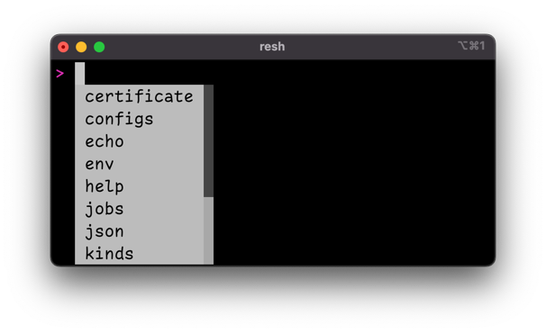
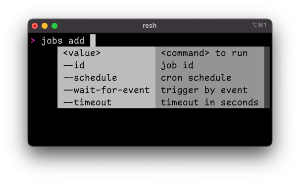

# Resotoshell TAB completion

Resoto comes with a command-line interface that is accessed via Resotoshell. The command lines that the user defines are not executed locally but get interpreted server-side. Nothing but Resotoshell is required on the client-side.

Many of the commands that Resoto offers are old friends to shell users like `echo`, `tail` and `jq`, but there are more. While there is a good [command line reference](/docs/reference/cli), it is always easier to get the help exactly where the question arises, which is the prompt of the CLI.

The latest version of Resotoshell comes with a tab-completion feature, that the user supports in almost all situations. When Resotoshell is started, you can list available commands by pressing the TAB key.

Once you have selected a command, you can press the TAB key again to list all available options. In fact, you do not even need to press the TAB key at all, since all suggestions are shown automatically.

## Support for search syntax

Resoto comes with a powerful [search syntax](/docs/concepts/search) that allows for many use cases. Everybody wants to use a powerful search capability - nobody wants to learn a new search syntax. Our approach to bridge this gap is also to provide typing support for the search syntax.

This guidance helps you with the general search syntax. Resources can be filtered by a specific kind via `is(<kind>)`. The list of possible kinds is available. The completion uses fuzzy search, so you can start in the middle of a word or just type the first letters. Example: `v_t<TAB>` will be completed to `volume_type`.

Filter expressions use the syntax `<field> <operator> <value>`. The list of all possible fields is available as well as all available operators. Ideally the completer would only show properties, that are relevant for the selected kind. It is currently not smart enough and shows always all possible properties - something we want to improve in the future.

A sort criteria also uses a property to sort - so the completer shows all available properties, as well as the possible sort order `asc` or `desc`.

## Support for aggregations

Not only search but also [aggregate](/docs/reference/cli/aggregate) uses special syntax to define aggregation expressions. An aggregation is always computed on the result of a search and defines a list of grouping variables, as well as a list of aggregation functions.

The completer helps in defining the grouping variables, by providing the list of all possible properties. Please also note the special support to define [`/ancestors`](/docs/concepts/search/merging-nodes#ancestors-and-descendants) grouping variables, which requires to define the kind of the ancestor as well as the property to group by.

It also knows about the possible aggregation functions and provides it as a list. Since every grouping variable and every aggregation function can be renamed, an optional `as` clause is suggested.

With the support of this feature, it is hopefully much simpler to use the CLI. Please find our [Getting Started Guide](/docs/getting-started) and give Resoto a spin!
