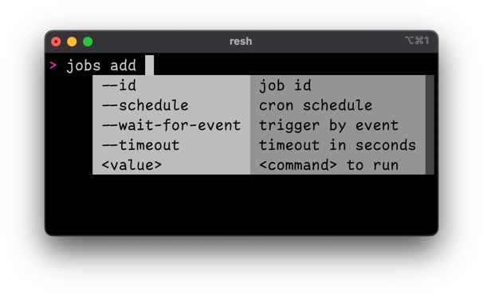

# Resoto Shell Tab Completion

Resoto has a [command-line interface](/docs/reference/cli) which is accessible via [Resoto Shell](/docs/concepts/components/shell). Commands are not executed locally, but interpreted on the server. As such, only [Resoto Shell](/docs/concepts/components/shell) is required client-side.

Resoto offers commands like [`echo`](/docs/reference/cli/echo), [`tail`](/docs/reference/cli/tail), and [`jq`](/docs/reference/cli/jq)—old friends to veteran shell users—but these commands only account for a small fraction of the possibilities in Resoto's [command-line interface](/docs/reference/cli).

Version 2.X of [Resoto Shell](/docs/concepts/components/shell) introduces tab completion, making the [command-line interface](/docs/reference/cli) easier to use than ever before! Press the tab key, and [Resoto Shell](/docs/concepts/components/shell) will present you with a list of available commands:

The tab completion feature is context-aware and will even help you configure the options for a command:

## Search Syntax

Previous blog posts have touched upon the power and extensibility of Resoto's [search syntax](/docs/concepts/search), but learning the ins and outs of Resoto's [search syntax](/docs/concepts/search) has a rather steep learning curve. Never fear—the new tab completion feature also provides autocomplete for the [`search` command](/docs/reference/cli/search) to make Resoto's [search functionality](/docs/concepts/search) more accessible:

This guidance helps you with the general search syntax. Resources can be filtered by a specific kind via `is(<kind>)`. The list of possible kinds is available. The completion uses fuzzy search, so you can start in the middle of a word or just type the first letters. Example: `v_t<TAB>` will be completed to `volume_type`.

Filter expressions use the syntax `<field> <operator> <value>`. The list of all possible fields is available as well as all available operators. Ideally the completer would only show properties, that are relevant for the selected kind. It is currently not smart enough and shows always all possible properties - something we want to improve in the future.

A sort criteria also uses a property to sort - so the completer shows all available properties, as well as the possible sort order `asc` or `desc`.

## Aggregation

The [`aggregate` command](/docs/reference/cli/aggregate) also uses special syntax to define aggregation expressions, and tab completion again can help:

As you can see, the autocomplete feature lists possible properties. There is also support for defining [`/ancestors` grouping variables](/docs/concepts/search/merging-nodes#ancestors-and-descendants).

As mentioned previously, [Resoto Shell](/docs/concepts/components/shell) is context-aware and will supply a list of possible aggregation functions. And since every grouping variable and every aggregation function can be renamed, the optional `as` clause is suggested as well.

We hope that the new tab completion feature makes Resoto's [command-line interface](/docs/reference/cli) easier to use!
