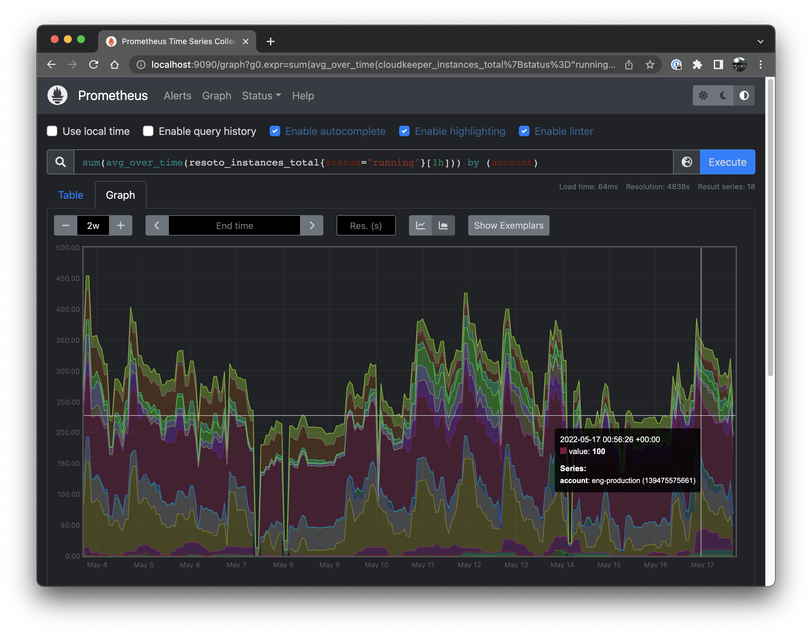
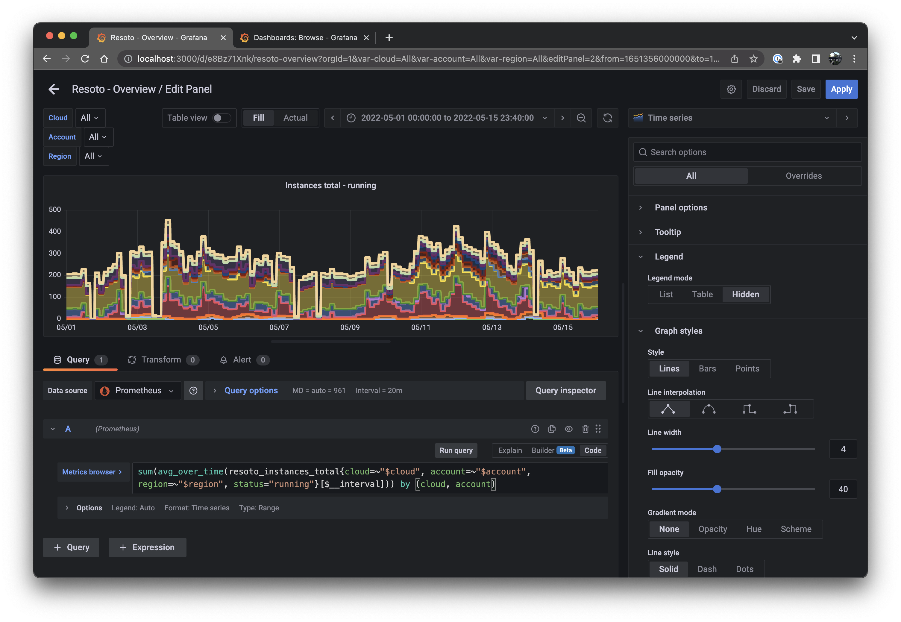
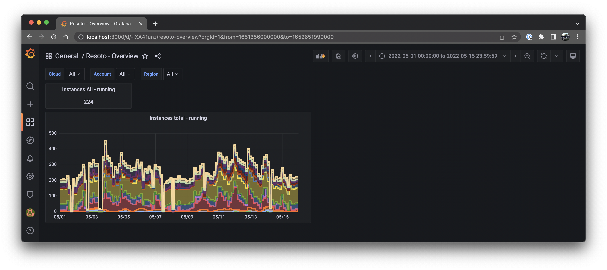

# Cloud Infrastructure Metrics

**At this very moment, do you know how many compute instances are running in your infrastructure and how much you are paying for them?**

If the answer is, "No, not exactly," then my next question for you is, "Why not?"

Compute and storage are typically the most expensive items on your cloud bill. They are also the most critical pieces of infrastructure for most businesses.

Resoto gives a snapshot of the current state of your cloud infrastructure. You can [search](/docs/concepts/search) that snapshot and have Resoto [automatically react to state changes](/docs/concepts/automation).

Resoto also lets you [aggregate](/docs/concepts/search/aggregation) and [visualize](/docs/reference/notebook) this data, as my colleagues [Matthias](https://github.com/aquamatthias) and [Nikita](https://github.com/meln1k) described in previous [blog](/blog/2022/03/03/aggregating-search-data) [posts](/blog/2022/05/31/resoto-meets-jupyter-notebook).

Here is an example of a heatmap that allows you to immediately see outliers (like when an account suddenly starts using a large number of expensive, high-core-count instances):


We can ingest this aggregated data into a time series database, such as [Prometheus](https://prometheus.io). This information can then be used to build diagrams illustrating cloud resources (e.g., compute instances and storage) over time.


This allows you to [alert on trends](https://prometheus.io/docs/alerting/latest/alertmanager)—for example, if you are projected to exceed a quota or spend limit.

Another use case is to quickly [identify anomalies](https://prometheus.io/docs/prometheus/latest/querying/functions/#aggregation_over_time) using [the 3σ rule](https://en.wikipedia.org/wiki/68%E2%80%9395%E2%80%9399.7_rule). If cloud API credentials are leaked or an automated system goes haywire, you would immediately see the spike instead of receiving an unpleasant surprise on your next cloud bill. Best of all, it works across multiple clouds and accounts!

Resoto comes with a handy metrics component, [Resoto Metrics](/docs/concepts/components/metrics), which takes aggregation results and exports them to [Prometheus](https://prometheus.io). This blog post describes how to build a simple metrics dashboard using [Resoto Metrics](/docs/concepts/components/metrics), [Prometheus](https://prometheus.io), and [Grafana](https://grafana.com).

<!--truncate-->

## Concepts and Terminology

If you are already familiar with graph and time series databases, metrics, samples, labels, Prometheus, and Grafana, please feel free to [skip ahead](#getting-started). For those new to the cloud-native metrics ecosystem, let's get some concepts and terminology out of the way!

### Collect

Resoto creates an inventory of your cloud infrastructure by storing the metadata of your cloud resources inside of a [graph](/docs/concepts/graph). This is what we call the `collect` [step](/docs/concepts/automation/workflow). Each resource (e.g., compute instance, storage volume, etc.) is represented by a graph [node](/docs/concepts/graph/node). [Nodes](/docs/concepts/graph/node) are connected via [edges](/docs/concepts/graph/edge). [Edges](/docs/concepts/graph/edge) represent the relationship between two [nodes](/docs/concepts/graph/node), like so (please excuse my MS Paint skills):


A [node](/docs/concepts/graph/node) is essentially an indexed JSON document containing the metadata of a resource. The `aws_ec2_instance` from the graph picture above would look something like this:

```json
{
  "reported": {
    "kind": "aws_ec2_instance",
    "id": "i-07c9d738469b966d0",
    "tags": {
      "owner": "lukas"
    },
    "name": "wes-scaletesting-bootstrap",
    "ctime": "2020-06-16T15:08:45Z",
    "instance_cores": 4,
    "instance_memory": 16,
    "instance_type": "t2.xlarge",
    "instance_status": "running"
    ...
  }
  ...
}
```

### Search

Among other things, Resoto allows you to [search this metadata](/blog/2022/02/04/resoto-search-101). Here's an example:

```bash
> search is(aws_ec2_instance) and instance_cores > 4
​# highlight-start
​kind=aws_ec2_instance, id=i-065af67d77cd5a272, name=16ca1.prod1, instance_cores=16, age=3yr2mo, cloud=aws, account=eng-production, region=us-west-2
​kind=aws_ec2_instance, id=i-019f3f3a2a8d1990e, name=16ca2.prod1, instance_cores=16, age=3yr2mo, cloud=aws, account=eng-production, region=us-west-2
​kind=aws_ec2_instance, id=i-0667dc8de49a4319e, name=16ca3.prod1, instance_cores=16, age=3yr2mo, cloud=aws, account=eng-production, region=us-west-2
​kind=aws_ec2_instance, id=i-076b9763c755a9b51, name=16ca4.prod1, instance_cores=16, age=3yr2mo, cloud=aws, account=eng-production, region=us-west-2
​kind=aws_ec2_instance, id=i-074fcfe526f95c9fd, name=16ca5.prod1, instance_cores=16, age=3yr2mo, cloud=aws, account=eng-production, region=us-west-2
​kind=aws_ec2_instance, id=i-04e09d3c714048c4d, name=16ca6.prod1, instance_cores=16, age=3yr2mo, cloud=aws, account=eng-production, region=us-west-2
​kind=aws_ec2_instance, id=i-0d2dfda13e02b2b20, name=16ca7.prod1, instance_cores=16, age=2yr9mo, cloud=aws, account=eng-production, region=us-west-2
​...
# highlight-end
```

The search returned a list of all EC2 instances with more than 4 cores. There are times when you may not be interested in the details of individual resources, but simply want to do something with each individual instance. You may want to know the total number of resources, or the number of running resources of a particular kind. You may be interested in the distribution of compute instances by instance type (e.g., `m5.large`, `m5.2xlarge`, etc.), or the current cost of compute and storage grouped by team.

### Aggregation

[Aggregating and grouping the results of a search](/blog/2022/03/03/aggregating-search-data) creates the samples of a metric.

```bash
> search aggregate(/ancestors.cloud.reported.name as cloud, /ancestors.account.reported.name as account, /ancestors.region.reported.name as region, instance_type as type, instance_status as status: sum(1) as instances_total): is(instance)
​# highlight-start
​group:
​  cloud: aws
​  account: eng-production
​  region: us-west-2
​  type: m5.xlarge
​  status: running
​instances_total: 13
​---
​group:
​  cloud: aws
​  account: eng-production
​  region: us-west-2
​  type: m5.4xlarge
​  status: stopped
​instances_total: 7
​...
# highlight-end
```

This is useful, but the ability to compare current values to those from an hour, day, month, year, etc. ago would be even more useful. This brings us to the next concept, time series.

### Time Series

Time series databases such as [Prometheus](https://prometheus.io) do not store details of individual resources, but aggregated data over time—allowing us to query aggregate data and create charts to visualize the results.

In the aggregated search above, each result is what [Prometheus](https://prometheus.io) calls a [sample](https://prometheus.io/docs/concepts/data_model#samples). A [sample](https://prometheus.io/docs/concepts/data_model#samples) is a single value at a specific point in time.

Looking again at the same example, `cloud`, `account`, `region`, `type`, and `status` in each group are [labels](https://prometheus.io/docs/concepts/data_model#metric-names-and-labels). [Labels](https://prometheus.io/docs/concepts/data_model#metric-names-and-labels) are `key: value` pairs that allow us to group [samples](https://prometheus.io/docs/concepts/data_model#samples).

Prometheus has basic graphing capabilities, but [Grafana](https://grafana.com) allows you to build a dashboard visualizing data from different sources in a variety of chart styles, like this stacked line chart:


So here's the plan. First we will learn how to [configure Prometheus to fetch data from Resoto Metrics](#getting-started). Then how to [query that data inside Prometheus](#querying-a-metric). After that we explore from where Resoto retrieves its metrics configuration and how to [define our own metrics](#how-metrics-are-made). Finally we will use Grafana to [create a simple dashboard and visualize the data](#i-was-promised-a-metrics-dashboard).

## Getting Started

If you are new to Resoto, [start the Resoto stack](/docs/getting-started/installation) and [configure it to collect your cloud accounts](/docs/getting-started/configuration/worker#cloud-providers).

To check out the data Resoto Metrics generates open [`https://localhost:9955/metrics`](https://localhost:9955/metrics) in your browser (replacing `localhost` with the IP address or hostname of the machine where `resotometrics` is running). This data is updated [whenever Resoto runs the collection workflow](/docs/getting-started/configuration/core#workflow-schedules). You should see an output similar to this:


That is the raw metrics data Prometheus will ingest. If you are using our Docker stack you do not have to do anything, Prometheus is already pre-configured. If you are using your own Prometheus installation, [configure it to scrape](https://prometheus.io/docs/prometheus/latest/configuration/configuration/#scrape_config) this metrics endpoint. The config will look something like this:

```yml title="prometheus.yml"
scrape_configs:
  - job_name: "resotometrics"
    scheme: https
    tls_config:
      insecure_skip_verify: true
    static_configs:
      - targets: ["localhost:9955"]
```

Instead of skipping verification of the TLS certificate, you can also [download the Resoto CA certificate](/docs/concepts/security#retrieving-and-validating-the-ca-certificate) and [configure Prometheus to use it](https://prometheus.io/docs/prometheus/latest/configuration/configuration/#tls_config).

## Querying a Metric

Open up your Prometheus installation (in our Docker stack it is running at [`http://localhost:9090`](http://localhost:9090)) and you should see the following:


Let's start with a very simple expression:

```
resoto_instances_total
```

That's it, that's the query. If you have any instances collected in Resoto the output will look something like this:


Here is one of those metrics from the list:

```
resoto_instances_total{cloud="aws", account="eng-production", region="us-west-2", status="running", type="m5.xlarge", instance="localhost:9955", job="resotometrics"} 17
```

The `key="value"` pairs inside those curly brackets are those [previously mentioned](#time-series) [labels](https://prometheus.io/docs/concepts/data_model/#metric-names-and-labels). To filter by label let us update the query to:

```
resoto_instances_total{status="running"}
```

Now we are only seeing compute instances that we are actually paying for at the moment.This information is a bit more interesting, but we could get the same from within the Resoto Shell. What would be really interesting, is how the number of compute instances has changed over the last week or two.

Click on the `Graph` tab, choose a `2w` period and click the `Show stacked graph` button.


We are getting closer to what we'd like to see. But what are these speckles? Why aren't we seeing solid lines?

By default Resoto collects data once per hour. Let's tell Prometheus to create an average over time over one hour by changing the query to:

```
avg_over_time(resoto_instances_total{status="running"}[1h])
```


Good, the data points are connected and averaged over time. However the amount of labels is a bit overwhelming. Right now we are seeing one stacked chart per unique label combination. Let's try to reduce the amount of labels by summing them all up.

```
sum(avg_over_time(resoto_instances_total{status="running"}[1h]))
```


Nice, now we see how the total number of compute instances has changed over the last two weeks. However we lost absolutely all labels. No more accounts, region and instance type information. To get some information back, let's group the summed up averages by account.

```
sum(avg_over_time(resoto_instances_total{status="running"}[1h])) by (account)
```



Neat, we see how the number of compute instances has changed over time for each account.

Want to see how storage has changed over time? Just change `resoto_instances_total` to `resoto_volume_bytes`. Want to see $$$ spent per hour? `resoto_instances_hourly_cost_estimate` is the metric you are looking for.

## How Metrics Are Made

The [Prometheus](https://prometheus.io) web UI provides syntax help and autocomplete for available metric names. However, you may be wondering—how are you supposed to know which metrics exist? How do you find what other metrics exist and where a value (for example, `resoto_instances_total`) is defined?

Metrics are defined in the `resoto.metrics` [configuration](/docs/getting-started/configuration). To edit metrics definitions, execute the following command in [Resoto Shell](/docs/concepts/components/shell):

```bash
> config edit resoto.metrics
```

```yaml
resotometrics:
  metrics:
    instances_total:
      # Metric help text
      help: 'Number of Instances'
      # Aggregation search to run
      search: 'aggregate(/ancestors.cloud.reported.name as cloud, /ancestors.account.reported.name as account, /ancestors.region.reported.name as region, instance_type as type, instance_status as status: sum(1) as instances_total): is(instance)'
      # Type of metric (gauge or counter)
      type: 'gauge'
    [...]
  [...]
```

As [described above](#aggregating), the `aggregate` expression in the `search` field is what creates the samples of a metric.

Metrics configuration can be updated at runtime. When the `metrics` [workflow](/docs/concepts/automation/workflow) is run, [Resoto Metrics](/docs/concepts/components/metrics) will generate the new metric for [Prometheus](https://prometheus.io) to consume.

```bash
> workflow run metrics
```

## Creating a Metrics Dashboard

Now that we've learned how to get metrics from Resoto into [Prometheus](https://prometheus.io), query metrics, and define new metrics, we can create the dashboard.

Alright, fasten your seatbelts! This will go fast. 🏎️💨

1. Start the [Grafana Docker container](https://hub.docker.com/r/grafana/grafana-oss):

   ```bash
   $ docker run -d -p 3000:3000 -v grafana-data:/var/lib/grafana -v grafana-etc:/etc/grafana grafana/grafana-oss
   ```

2. Open the Grafana web UI (e.g., [http://localhost:3000](http://localhost:3000)).

3. Login as `admin` with password `admin` and set a new password.

4. On the left, open **Settings > Data Sources > Add Data Source > Prometheus**.

5. In the URL field, enter the Prometheus URL e.g. `http://tsdb.docker.internal:9090`

   

6. Scroll down and click the **Save & test** button. Make sure that the result is "Data source is working":

   

7. Click the **+** button on the left, select **Create Dashboard**, and then click the **Save** button in the top menu bar.

   

8. Select **Dashboard settings > Variables** and click the **Add variable** button:

   

9. Enter `cloud` for **Name**, `Cloud` for **Label**, and `label_values(cloud)` for **Query**. Toggle **Multi-value** and **Include All option** to enable both selection options. Ensure that the **Preview of values** at the bottom displays the available clouds, then click the **Update** button.

   

10. Repeat steps 8 and 9, but with the following values:

    | Name      | Label     | Query                   | Multi-value | Include All option |
    | --------- | --------- | ----------------------- | ----------- | ------------------ |
    | `account` | `Account` | `label_values(account)` | ✔️          | ✔️                 |
    | `region`  | `Region`  | `label_values(region)`  | ✔️          | ✔️                 |

    

11. Hit `Esc` on your keyboard to go back, then click **Add new panel**.

    

12. Copy the following into the text box to the right of **Metrics browser >** in the **Query** tab:

    ```bash
    sum(avg_over_time(resoto_instances_total{cloud=~"$cloud", account=~"$account", region=~"$region", status="running"}[$__interval])) by (cloud, account)
    ```

    "Time Series" should be selected in the dropdown at the top right. Configure the settings underneath as follows:

    | Setting                                | Value                       |
    | -------------------------------------- | --------------------------- |
    | **Panel options > Title**              | `Instances Total - running` |
    | **Legend > Legend mode**               | Hidden                      |
    | **Graph styles > Line width**          | 4                           |
    | **Graph styles > Fill opacity**        | 40                          |
    | **Graph styles > Connect null values** | Always                      |
    | **Graph styles > Stack series**        | Normal                      |

    Click the **Save** button, then the **Apply** button.

    

    You now have a functional dashboard!

    

    :::info

    Don't forget to click the `Save` button any time you make changes to the dashboard!

    :::

13. Now, we'll add a second panel. Again, click **Add new panel**.

    Copy the following into the text box to the right of **Metrics browser >** in the **Query** tab:

    ```bash
    sum(avg_over_time(resoto_instances_total{cloud=~"$cloud", region=~"$region", account=~"$account", status="running"}[$__interval]))
    ```

    Select "Stats" in the dropdown at the top right. Then, configure the settings underneath as follows:

    | Setting                      | Value                        |
    | ---------------------------- | ---------------------------- |
    | **Panel options > Title**    | `Instances $cloud - running` |
    | **Value options > Title**    | Calulation: Last \*          |
    | **Stat styles > Color mode** | None                         |
    | **Stat styles > Graph mode** | None                         |

    Click the **Save** button, then the **Apply** button.

    

14. The dashboard now shows two panels; one showing the number of currently running instances, and another depicting the history of the number of instances:

    

## The Final Product

If we repeat the above steps for [all of the metrics present in the configuration](#how-metrics-are-made), the result is a dashboard that looks like this:


This is the actual production dashboard from a real Resoto user. 😉

The dashboard shows the amount of compute and storage currently in use, as well as the associated cost. It also graphs volumes that are _not_ in use and pending cleanup by Resoto. They also have dashboards for quota limits and network-related stats, which individual teams use to monitor their cloud usage by exposing custom tags as [Prometheus](https://prometheus.io) labels and filtering by team or project.

This user even [contributed their Grafana dashboard templates to our GitHub repository](https://github.com/someengineering/resoto/tree/main/contrib/grafana-dashboards), so you don't have to create them yourself. But if you want to customize it, you now know how!

[Install Resoto](/docs/getting-started/installation) and build your own dashboard today! ✨
