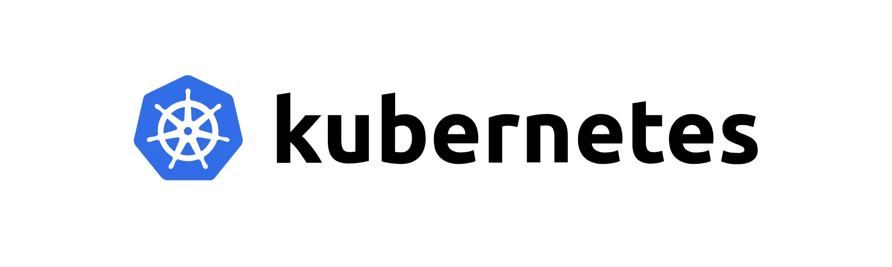
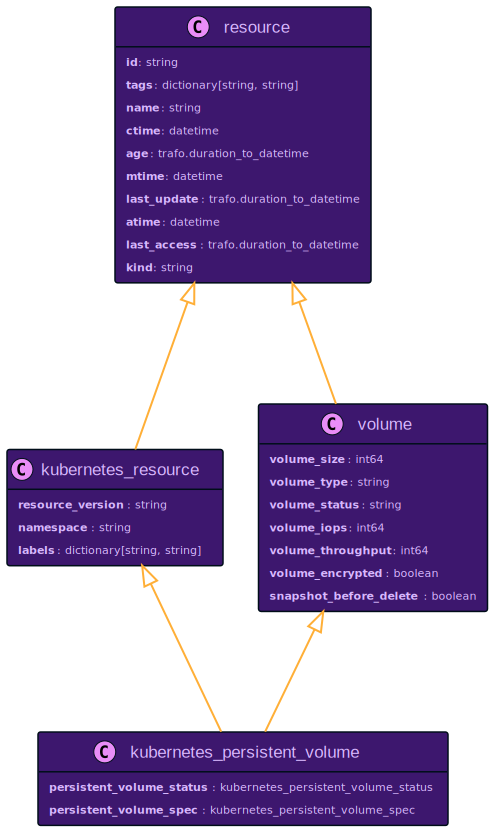
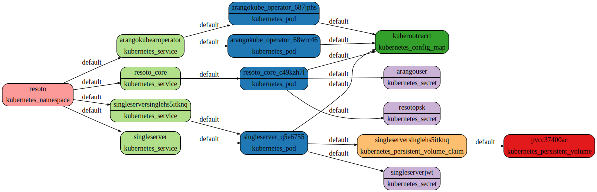

# Kubernetes Support

[Kubernetes](https://kubernetes.io) is the de-facto standard for orchestrating containerized applications. It is the go-to solution no matter where your infrastructure is running. Resoto can already collect resources in [Amazon Web Services](/docs/getting-started/configure-cloud-provider-access/aws), [Google Cloud Platform](/docs/getting-started/configure-cloud-provider-access/gcp), and [DigitalOcean](/docs/getting-started/configure-cloud-provider-access/digitalocean), all of which support [Kubernetes](https://kubernetes.io).

**I'm happy to announce that Resoto now has support for collecting [Kubernetes](/docs/reference/data-models/kubernetes) resources!**



<!--truncate-->

## Getting Started

To get started, configure Resoto to use your [kubeconfig file](https://kubernetes.io/docs/concepts/configuration/organize-cluster-access-kubeconfig) or copy the relevant sections as described in [Configure Kubernetes Access](/docs/getting-started/configure-cloud-provider-access/kubernetes).

```bash
> config edit resoto.worker
```

In the text editor opened by [`config edit`](/docs/reference/cli/setup-commands/configs/edit), modify the configuration and define the location of your kubeconfig file. By default, Resoto will collect all contexts that are found in the kubeconfig file. It is possible to restrict the contexts to be used by setting the `contexts` property and turning `all_contexts` off.

```yaml
resotoworker:
  collector:
# highlight-next-line
    - k8s
    ...
...
# highlight-start
k8s:
  config_files:
    - path: "/home/resoto/.kube/config"
# highlight-end
```

Alternatively, you can also copy & paste the relevant fields directly to the configuration in case the ResotoWorker is running on a machine that does not have access to the file. An example configuration might look like this:

```yaml
resotoworker:
  collector:
# highlight-next-line
    - k8s
    ...
...
# highlight-start
k8s:
  configs:
      - # The name of the kubernetes cluster.
      name: 'dev'
      # The url of the server to connect to.
      server: 'https://kubernetes.dev.example.com'
      # The user access token to use to access this cluster.
      token: '7632083ca514e919601bb1797caca80XXXXXXXXXXXXXXXXXXXXXXXXXXXXXXXXX'
      # The optional CA certificate string.
      certificate_authority_data: 'LS0tLS1CRUd...'
# highlight-end
```

The Kubernetes collector can collect multiple Kubernetes clusters by defining multiple entries in the `configs` or `config_files` section.

Once this is done, Resoto will start collecting data from all configured clusters on the schedule configured in ResotoCore `resotocore.workflows.collect_and_cleanup.schedule`, which defaults to every hour. You can trigger a collection run manually by entering:

```bash
> workflows run collect_and_cleanup
```

## Kubernetes Resource Data Model

Every resource found in Kubernetes is represented by a node in the graph. Available resource properties are captured and available to filter and automate.



Resoto has a common data model for resources that abstracts from the underlying provider. Every resource inherits the properties from the base `resource`, which defines properties like `id`, `name`, `age`, `last_update`, `tags` etc.

Every resource in Kubernetes is also of type `kubernetes_resource`, which brings in additional properties like a `resource_version`, `labels`, and an optional `namespace` property, which is defined for all namespaced resources. Annotations of a Kubernetes resource are available as `tags` and can be modified via the [`tag`](/docs/reference/cli/action-commands/tag) command.

Common abstractions apply as well. A [PersistentVolume](/docs/reference/data-models/kubernetes#kubernetes_persistent_volume) is of base type `volume`. So it shares the same kind and properties with other volumes of other cloud providers, e.g. an [`EBSVolume`](/docs/reference/data-models/aws#aws_ec2_volume) in <abbr title="Amazon Web Services">AWS</abbr> or a [`Disk`](/docs/reference/data-models/gcp#gcp_disk) in <abbr title="Google Cloud Platform">GCP</abbr>. The same idea applies to a Kubernetes [node](/docs/reference/data-models/kubernetes#kubernetes_node) which is of base type `instance` etc.

Kubernetes has its own way of describing a resource, which is available in Resoto as well. The three main sections `metadata`, `spec`, and `status` can be found in almost any resource. The data in the `metadata` section is basically covered by the base `resource` properties (`id`, `name`, `tags`, etc.). The `spec` section usually holds the desired state, while the `status` section holds the current state.

Both sections are unique to the resource type. Since Resoto allows searching on any resource property, we made the `spec` and `status` section unique to the resource type. So a `Pod` in Resoto has a `pod_spec` and `pod_status` section, while a `Deployment` has a `deployment_spec` and `deployment_status` section. The relevant spec and status sections have the same specific data model as the Kubernetes resource.

You can find a complete reference at [Kubernetes Resources](/docs/reference/data-models/kubernetes).

## Searching the Graph

Since all Kubernetes resources share the same base kind `kubernetes_resource`, we can filter the graph by this resource type. We will count the number of Kubernetes resources by its kind. This will print the kind of the resource and the number of occurrences in ascending order. This is the output for the 2 clusters we have configured:

```bash
> search is(kubernetes_resource) | count kind
# highlight-start
kubernetes_job: 1
kubernetes_ingress: 1
kubernetes_ingress_class: 1
kubernetes_cluster: 2
kubernetes_csi_driver: 2
kubernetes_storage_class: 2
kubernetes_mutating_webhook_configuration: 3
kubernetes_validating_webhook_configuration: 4
kubernetes_priority_class: 4
kubernetes_pod_disruption_budget: 5
kubernetes_volume_attachment: 6
kubernetes_node: 6
kubernetes_csi_node: 6
kubernetes_persistent_volume_claim: 7
kubernetes_persistent_volume: 7
kubernetes_stateful_set: 7
kubernetes_daemon_set: 11
kubernetes_priority_level_configuration: 14
kubernetes_namespace: 14
kubernetes_flow_schema: 22
kubernetes_deployment: 25
kubernetes_role: 31
kubernetes_role_binding: 32
kubernetes_controller_revision: 37
kubernetes_endpoint_slice: 45
kubernetes_service: 45
kubernetes_endpoint: 47
kubernetes_replica_set: 63
kubernetes_pod: 70
kubernetes_config_map: 73
kubernetes_service_account: 122
kubernetes_secret: 160
kubernetes_cluster_role_binding: 166
kubernetes_cluster_role: 193
total matched: 1234
total unmatched: 0
# highlight-end
```

Can we reveal general information about the Kubernetes clusters? This query shows all available clusters including version and server URL:

```bash
> search is(kubernetes_cluster) | list cluster_info
# highlight-start
major=1, minor=21, platform=linux/amd64, server_url=https://31e9afd3-xxxxx.k8s.ondigitalocean.com
major=1, minor=21, platform=linux/amd64, server_url=https://9a3ac2b5-xxxxx.k8s.ondigitalocean.com
# highlight-end
```

Now we can start asking questions about the state of our Kubernetes infrastructure. For example, how many pods are running on each node in the cluster?

```bash
> search is(kubernetes_pod) | count /ancestors.kubernetes_node.reported.name
# highlight-start
helm2-cjhg9: 7
analytics-u1wtx: 11
helm2-cjhgz: 11
analytics-u1wtj: 11
analytics-u1wto: 15
helm2-cjhg1: 15
total matched: 70
total unmatched: 0
# highlight-end
```

You want to see details? Let's retrieve the information that has been collected about a Kubernetes service with name `resotocore`:

```bash
> search is(kubernetes_service) and name~resotocore | dump
# highlight-start
id: AS-E-YjvAftQUcuUmNC52g
reported:
  ctime: '2022-04-20T14:52:58Z'
  id: df8f6c37-5542-4e17-b2f4-bb6caaa2ba17
  labels:
    app.kubernetes.io/instance: resoto
    app.kubernetes.io/managed-by: Helm
    app.kubernetes.io/name: resoto
    app.kubernetes.io/version: 2.2.0
    helm.sh/chart: resoto-0.2.0
    resoto: core
  name: resoto-resotocore
  namespace: resoto
  resource_version: '51578078'
  service_spec:
    cluster_ip: 10.245.133.206
    cluster_ips:
    - 10.245.133.206
    external_ips: []
    external_traffic_policy: Cluster
    ip_families:
    - IPv4
    ip_family_policy: SingleStack
    load_balancer_source_ranges: []
    ports:
    - name: http
      node_port: 32648
      port: 8900
      protocol: TCP
      target_port: api
    session_affinity: None
    type: LoadBalancer
  service_status:
    conditions: []
    load_balancer:
      ingress:
      - ip: 132.159.204.142
        ports: []
  tags:
    kubernetes.digitalocean.com/load-balancer-id: 03d5ed66-fefe-41fb-a3f6-9a0e43560adb
    meta.helm.sh/release-name: resoto
    meta.helm.sh/release-namespace: resoto
  kind: kubernetes_service
  age: 1mo29d
# highlight-end
```

Resoto ships with the ability to search for a value everywhere, no matter where this value is defined. We call this feature full-text search - you can read about all the details here [full-text search](/docs/concepts/search/full-text) Let us use this feature, to search an IP address that we found in the resoto core service. We expect it will find exactly the same ResotoCore service:

```bash
> search "10.245.133.206"
# highlight-start
kind=kubernetes_service, id=df8f6c37-5542-4e17-b2f4-bb6caaa2ba17, name=resoto-resotocore, age=2mo1d, cloud=k8s, account=dev, region=resoto
# highlight-end
```

Let us find all secrets inside Kubernetes, that are shared between more than one pod. Such queries might be useful to find resources, that have a defined relationship in the graph:

```bash
> search is(kubernetes_secret) and namespace=resoto with(count>1, <-- is(kubernetes_pod))
# highlight-start
kind=kubernetes_secret, id=af1495e4, name=resoto-psk, namespace=resoto, age=2mo1d, cloud=k8s, account=dev, region=resoto
# highlight-end
```

There is more than one secret in this namespace, but only one is shared: the resoto-psk secret holds the private shared key. If we want to see the attached pods, we can use the same query again and list the resources. We will see that ResotoCore, ResotoWorker and ResotoMetrics use the secret resoto-psk. Please note: the secrets that are collected do not sensitive data fields.

```bash
> search is(kubernetes_secret) and namespace=resoto with(count>1, <-- is(kubernetes_pod)) <-- is(kubernetes_pod) | list name
# highlight-start
name=resoto-resotocore-67858dbc49-x5vgq
name=resoto-resotometrics-6c557bd666-n2t22
name=resoto-resotoworker-dc6bd998f-xpnb7
# highlight-end
```

Render a graph of all services that are deployed in the `resoto` namespace on the `dev` cluster. Please note: we are looking at a cluster where we have deployed `resoto` as a Helm chart as described in [getting started](/docs/getting-started/install-resoto/kubernetes).

```bash
search --with-edges is(kubernetes_service) and namespace=resoto <-[0:]-> | format --dot | write service.dot
```

This will output a Graphviz file that can be rendered with the `dot` command:



You can see the list of services as successors of the namespace node. Each service has one or more pods attached to it, where the pods reference configmaps and secrets. The data in Resoto is persistent, so you can also find a persistent volume claim that is attached to the database pod. The claim then references the actual persistent volume.

## Tagging

All annotations in Kubernetes are available as tags. Resoto allows to update tags via ResotoShell, as well as delete tags.

Let's tag all pods with the name `resoto` in it with the tag `owner`. Please note: this tag will be temporary and goes away once the pod is deleted since a pod is only a template instance in Kubernetes. If we wanted a more permanent tag, we would need to adjust the related pod template - the deployment in this case.

```bash
> search is(kubernetes_pod) and name~resoto | tag update owner matthias | list name, tags
# highlight-start
name=resoto-resotocore-67858dbc49-kzh7l, owner=matthias
name=resoto-resotoworker-dc6bd998f-tvhkw, owner=matthias
name=resoto-resotometrics-6c557bd666-m9qzm, owner=matthias
# highlight-end
```

To make sure the existing resources in the cluster have changed:

```bash
$ kubectl get pods resoto-resotocore-67858dbc49-kzh7l -o json | jq .metadata.annotations
# highlight-start
{
  "owner": "matthias"
}
# highlight-end
```

Tags can be updated and deleted again:

```bash
> search is(kubernetes_pod) and name~resoto | tag delete owner | list name, tags
# highlight-start
name=resoto-resotometrics-6c557bd666-m9qzm,
name=resoto-resotocore-67858dbc49-kzh7l,
name=resoto-resotoworker-dc6bd998f-tvhkw,
# highlight-end
```

## Cleaning Up

To delete resources, pipe search results to the [`clean`](/docs/reference/cli/action-commands/clean) command. Let us find volume claims that are not bound to any kubernetes pod and clean them up:

```bash
> search is(kubernetes_persistent_volume_claim) with(empty, <-- is(kubernetes_pod)) -[0:1]-> | clean
# highlight-start
kind=kubernetes_persistent_volume_claim, id=079affbf, name=single-tvhrrqmm, age=6mo23d, cloud=k8s, account=dev, region=test
kind=kubernetes_persistent_volume, id=c299101c, name=pvc-079affbf, age=6mo23d, cloud=k8s, account=dev, region=test
# highlight-end
```

This query selects all volume claims that have no pod attached and then also select the related volume. The clean command marks the resources for cleanup. The resources will be deleted once the `collect_and_cleanup` workflow runs (default: every hour).

## Future Work

We are currently working on the way to connect resources found in Kubernetes to resources found in the underlying cloud provider. Let's assume you have a Kubernetes cluster running on [Amazon Web Services](https://aws.amazon.com), [Google Cloud Platform](https://cloud.google.com), or [DigitalOcean](https://digitalocean.com) and we want to show the underlying persistent volume provided by the related cloud provider. This would show which compute instance a pod runs on or which underlying volume is provided.

## Further Reading

- [Install Resoto with Kubernetes](/docs/getting-started/install-resoto/kubernetes)
- [Configure Kubernetes Access](/docs/getting-started/configure-cloud-provider-access/kubernetes)
- [Kubernetes Resources](/docs/reference/data-models/kubernetes)
