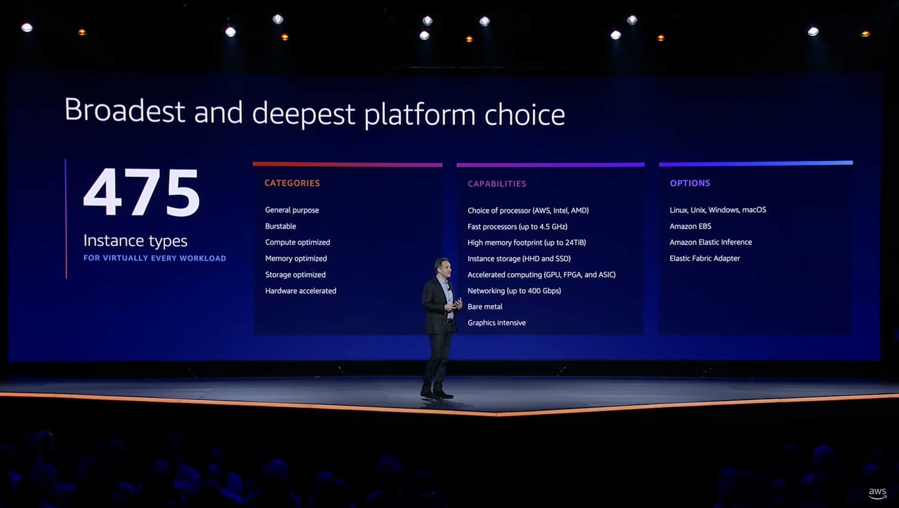

# What Is Cloud Asset Inventory?

On March 14, 2006, [Amazon Web Services (AWS)](https://aws.amazon.com) launched [<abbr title="Simple Storage Service">S3</abbr>](https://aws.amazon.com/s3), the first public cloud service. Since then, cloud consumption has increased each year. [Gartner estimates that worldwide spend on public cloud services will reach $600 billion in 2023](https://www.gartner.com/en/newsroom/press-releases/2022-04-19-gartner-forecasts-worldwide-public-cloud-end-user-spending-to-reach-nearly-500-billion-in-2022), up from $410 billion in 2021. At annual growth rates of over 20%, the trillion-dollar market size is only a few years away.

<!--truncate-->

## The Evolution of Cloud Offerings

Cloud providers foster that growth by continuously launching new products. Market leader <abbr title="Amazon Web Services">AWS</abbr> now offers a portfolio of over two hundred fully-featured services.

Two hundred may not seem significant until you start looking at the <abbr title="stock-keeping units">SKU</abbr>s for each service. Consider [<abbr title="Elastic Compute Cloud">EC2</abbr>](https://aws.amazon.com/ec2), <abbr title="Amazon Web Services">AWS</abbr>' computing flagship service which comes in over 475 instance types with various combinations of CPU, memory, storage, and networking capacity. "And we're not even close to being done," said <abbr title="Amazon Web Services">AWS</abbr> CEO Adam Selipsky during the 2021 [<abbr title="Amazon Web Services">AWS</abbr> re:Invent keynote](https://www.youtube.com/watch?v=WGA2P_oH5Xc).

[AWS re:Invent 2021 - Keynote with Adam Selipsky](https://www.youtube.com/watch?v=WGA2P_oH5Xc)

With the emergence of containers and serverless functions, services have only become even more abstract, and the size of the individual deliverables smaller. And since cloud providers often match each other's portfolios, these trends apply to [Azure](https://azure.microsoft.com), [Google Cloud Platform (GCP)](https://cloud.google.com), [DigitalOcean](https://digitalocean.com), and others as well.

### A New Type of Technical Debt

On the enterprise side, adoption of new cloud services is driving forward innovation.

The flip side of that innovation is that companies now have an inventory problem. It's a new type of technical debt, where you lose track of the assets running in your infrastructure and how they relate to your business.

The following graph render depicts how vast the problem can be. It shows the <abbr title="Amazon Web Services">AWS</abbr> infrastructure snapshot of a 200-employee startup with over 400,000 cloud resources:

### What Is an Asset?

An asset can be a resource such as a virtual machine, database, or storage bucket. An asset can also be a VPC, subnet, policy, security key, or IP address. Assets also include third-party cloud services, like an identity platform or even channels on [Slack](https://slack.com) or [Discord](https://discord.com). Cloud inventory consists of the many discrete assets that form your stack.

IT used to control asset procurement. Now, developers have liberal permissions to spin up new cloud resources. Re-introducing the old, rigid process of submitting IT support tickets would kill productivity.

If anything, companies have adopted new processes to iterate more quickly. Continuous integration (CI) and infrastructure-as-code (IaC) have enabled development teams to deploy more, faster. A startup with a hundred employees can easily have hundreds of thousands of resources, and larger enterprises millions.

## New Operational Challenges

Platform teams responsible for infrastructure today deal with three new challenges:

1. **It's hard to get a complete picture of all assets in a cloud.**

   Resources tend to be distributed across multiple regions and accounts, for reasons like architecture, high availability, geography, compliance, and separation of workloads. There is no single view of all resources in a cloud and you have to peel through many layers of hierarchy to get answers to questions like, "How many instances are running?" or "Which resources sit behind this IP address?"

2. **Frequent deployments lead to changes in the stack and its resources.**

   When pipelines fail, they often leave behind orphaned assets. Developers also make changes and spin up resources through cloud consoles, unbeknownst to the platform team. These changes result in infrastructure drift, which in turn causes uncertainty, security issues, and toil.

3. **Platform teams need resource context to prioritize their work and take action.**

   Creating metrics like resource adoption, utilization, pricing, or tag coverage is impossible without complete inventory knowledge. Platform teams also need a simple way to search inventory for specific resources and accounts.

### Inventory Debt Slows Down Development

If inventory debt is left unmanaged, it slows down development. Sooner or later, resources hit quota limits and result in the failure of new deployments. Misconfigured resources expose critical data. Cloud bills pile up and consume budget that would otherwise be spent on fueling more development.

These problems can be mitigated by introducing new policies and restricting developer access rights. But those mitigations result in less flexibility for developers and more burden on the platform team for infrastructure updates.

In our experience, platform teams want both. They want to give developers liberal permissions and encourage experimentation, but they also want to stay in control, have visibility, and take action when things move in the wrong direction.

## Building a Cloud Asset Inventory

The first step to gaining visibility is to build a cloud asset inventory.

Building and periodically updating that inventory is really a data problem. A cloud asset inventory should include two types of data:

1. **Resource data**, including but not limited to:
   - General resource information (e.g., name, ID, timestamp, tags),
   - Hierarchy information (e.g., region, account), and
   - Resource-specific information (e.g., CPU, memory, price, utilization, policy).
2. **Dependency data** that represents the relationship between different resources.

With this data, platform teams can start tracking and reporting asset changes, and answer questions about their infrastructure.

Inventory data is already available through cloud provider <abbr title="application programming interface">API</abbr>s, but not in a single consistent format. That means you have to consolidate and transform extracted data into a format more suitable for analysis to get a complete view of your infrastructure.

A cloud asset inventory should be a full representation of your infrastructure at a specific point in time.

### How Resoto Builds Your Inventory

Cloud providers already have native inventory tools, but they usually have a list-based approach and only support their own resources.

Resoto adds four capabilities that make it an ideal solution for platform teams that work with cloud-native infrastructure:

1. **Resoto maps out resources and their dependencies in a [graph of all clouds, accounts and regions](/blog/2022/05/17/a-walk-in-the-graph).**

   Cloud-native infrastructure is already a graph, with implicit relationships between resources. Why lose that context by flattening data into a table or list? Graph nodes represent resources, while edges represent relationships and dependencies. Resoto's graph enables intelligent resource search across any relation.

2. **Resoto's foundation is a unified [data model](/docs/reference/data-models) that brings together inventory data from different sources in one consistent format.**

   Platform teams can search any cloud or <abbr title="software as a service">SaaS</abbr> tool via the Resoto [<abbr title="application programming interface">API</abbr>](/docs/reference/api) (or [Resoto Shell](/docs/concepts/components/shell)). Internal tools can use the <abbr title="application programming interface">API</abbr> to expose asset search and metrics to other users.

3. **Resoto generates [custom metrics](/blog/2022/06/09/building-actionable-cloud-infrastructure-metrics).**

   Resoto stores collected metadata as resource properties in its data model. This metadata includes resource pricing, age, tags, or CPU core count. Resoto's [search syntax](/docs/concepts/search) can perform operations on data like [`count`](/docs/reference/cli/count) and [`aggregate`](/docs/reference/cli/aggregate). Calculating metrics in place is a more efficient way to generate insights about your infrastructure than exporting data to an external processing layer.

4. **Resoto's [jobs](/docs/concepts/automation/job) automate tedious work.**

   Existing inventory tools focus on reporting, and the burden of resolving issues falls upon the platform team. Resoto not only monitors your infrastructure but automatically takes action based on your defined criteria. Enforcing tagging and compliance rules or cleaning up unused resources is no longer a chore.

While each of these four capabilities offers differentiated benefits, it's combining them that transforms infrastructure work for platform teams.

## Start Now

With its graph and unified data model, Resoto can gather metrics about your infrastructure that would otherwise be challenging to tabulate. Resoto enables platform teams to create measurable <abbr title="key performance indicator">KPI</abbr>s they can track over time, build fleet-wide monitoring, and automate tedious infrastructure work.

Resoto is [open source](https://github.com/someengineering/resoto/blob/main/LICENSE) and free to use. Start now, and [install Resoto](/docs/getting-started/install-resoto) today!
