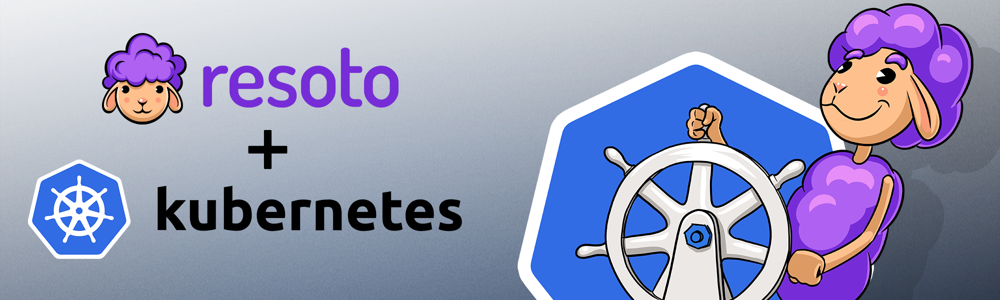
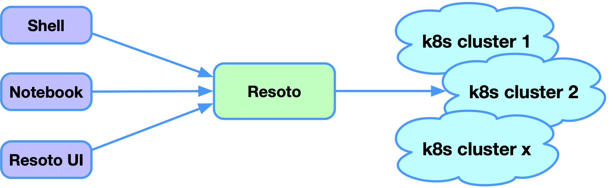
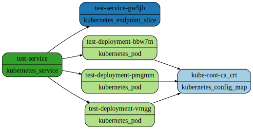
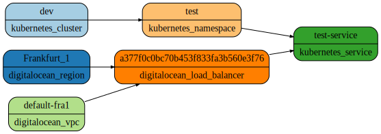
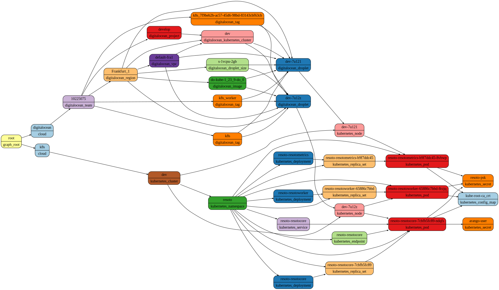
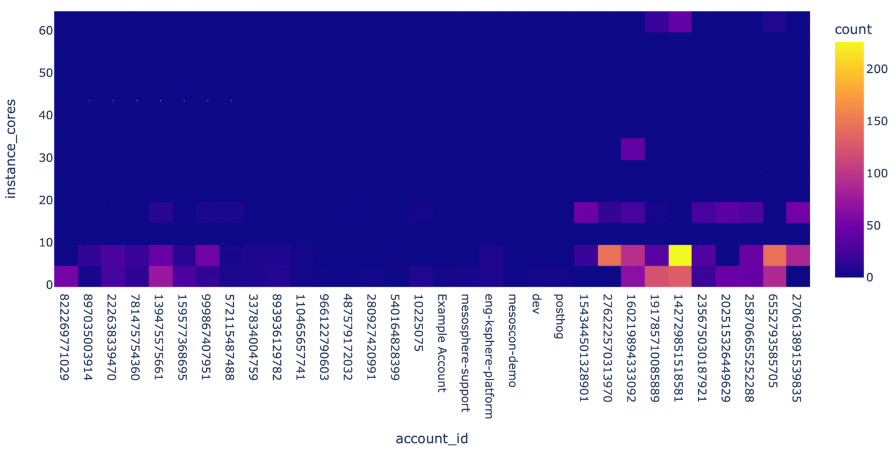
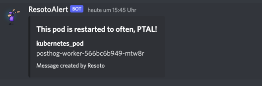

# Discover Kubernetes Resources

Kubernetes has dramatically improved the way we manage our workloads. It has become the de facto standard for deploying and managing containers, which is available in all major cloud providers.

A typical setup uses different Kubernetes clusters for different application stages (dev, test, prod) or one cluster per tenant. A Kubernetes cluster shared between different users and teams usually uses namespaces and roles to control access. Deploying a single application to a Kubernetes cluster usually consists of 10s to 100s of resources to deploy (deployments, services, configmaps, secrets, ingresses, etc.).

What starts simple in the beginning becomes tedious quite fast since the number of resources is vast and the view of a single user is limited to certain clusters in certain namespaces. A human can lose track easily in such a setup.  



<!--truncate-->

## Resoto Overview

Kubernetes provides an API to gather information about resources deployed in the cluster.
Resoto can provide a consistent view of all resources in all Kubernetes clusters in all namespaces of all configured clusters.
It is doing this continuously on a configurable interval which is set to one hour by default.
The collected information can be accessed using [ResotoShell](/docs/concepts/components/shell), [ResotoNotebook](https://resoto.com/docs/reference/notebook) or ResotoUI.



:::note 

The examples that I will present in this blog post are also available as a separate notebook [here](https://github.com/someengineering/resotonotebook/blob/main/examples/resoto_kubernetes.ipynb), so you can play with your Kubernetes cluster once you have installed Resoto. 

:::

## Full-text search

A simple and powerful way of finding resources in your cluster is by using the full-text search index that Resoto maintains. It indexes all properties of every service in every namespace in every cluster. Everything we need to do is enter the search term enclosed in double quotes.

```shell
> search "10.245.11.204"
kind=kubernetes_service, id=377f0, name=test-service, age=6d23h, cloud=k8s, account=dev, region=test
```

This search for an IPv4 address returned one resource of kind `kubernetes_service`. To see all properties of this service, we need to pipe the search into the [`dump`](/docs/reference/cli/dump) command. Here we can see the IPv4 address as the cluster IP we searched.

```shell
> search "10.245.11.204" | dump
reported:
  id: 377f0c0b
  tags:
    kubernetes.digitalocean.com/load-balancer-id: bdf3a6cf-fa5a-4241-b344-91b93506ee02
  name: test-service
  ctime: '2022-08-22T09:06:04Z'
  resource_version: '3024417'
  namespace: test
  service_status:
    load_balancer:
      ingress:
      - ip: 164.90.240.138
  service_spec:
    allocate_load_balancer_node_ports: true
    cluster_ip: 10.245.11.204
    cluster_ips:
    - 10.245.11.204
    external_traffic_policy: Cluster
    internal_traffic_policy: Cluster
    ip_families:
    - IPv4
    ip_family_policy: SingleStack
    ports:
    - node_port: 30304
      port: 80
      protocol: TCP
      target_port: '80'
    type: LoadBalancer
  kind: kubernetes_service
  age: 6d23h
```

## Filter resources

While using the full-text search index is a convenient way to find resources, you often want to filter the list of resources by specific criteria. This can be done by using a combination of `is(kind)` where we can filter the list of resources for a specific kind and predicates for specific properties. Since Resoto itself is installed as Kubernetes [helm chart](https://github.com/someengineering/helm-charts), we could search for pods that have the name `resoto` as part of their name:

```shell
> search is(kubernetes_pod) and name=~resoto
kind=kubernetes_pod, id=7d2e76ef, name=resotocore-ndqfs, age=11d19h, cloud=k8s, account=dev, region=resoto
kind=kubernetes_pod, id=7c7c6cfa, name=resotometrics-8vbwp, age=11d19h, cloud=k8s, account=dev, region=resoto
kind=kubernetes_pod, id=6297b9e1, name=resotoworker-8rzjq, age=11d19h, cloud=k8s, account=dev, region=resoto
```

The result that we see here are three pods that have been installed on the `dev` cluster in the the `resoto` namespace. Please note that we are able to filter the resources for any predicate that is combined with `and` or `or` using brackets to define the precedence. We could also show all properties of all matching resources using the `dump` command.

```shell
> search is(kubernetes_pod) and name=~resoto | dump
# result is stripped for brevity
```

## Get the service of a specific pod

Kubernetes uses labels and selectors to define the relationship between a service and a pod. It is valid to expose the same pod via different services. To reveal which service exposes a pod, we need to understand the selector syntax and check all pods for matching labels. Thankfully, Resoto analyzes the relationships between resources, providing this information as edges between nodes and revealing a directed acyclic graph.

To understand the concept of a graph a bit better, let me show you two examples that we enter into our Jupyter notebook:

```
search is(kubernetes_service) and name=test-service -[0:2]->
```



We are searching for a specific Kubernetes service with the name `test-service` and asking to traverse all outgoing dependencies from the service to a maximum depth of two. The result is a graph that shows the service and three pods behind this service, that all reference the same configmap.

```
search is(kubernetes_service) and name=test-service <-[0:2]-
```



We can do the same query, but this time reverse the direction of the arrow, showing us all incoming dependencies up to two levels. This time we see all resources that have a dependency on this service. Please also note that Resoto understands the underlying provider of this Kubernetes cluster, in this case, DigitalOcean. This service type is `LoadBalancer`, so a publicly available load balancer needs to be provided. A DigitalOcean load balancer is used here, backing the Kubernetes service. You can also see that the DigitalOcean load balancer is provided in the Frankfurt region in the default VPC. All of this knowledge is gathered automatically by Resoto without any additional action.

With this knowledge at hand, it is easy to get the services that expose a specific pod: we filter for the pod in question, walk the dependencies inbound by one step and then filter the resulting list of incoming dependencies for services.

```shell
> is(kubernetes_pod) and name=~bbw7m <-- is(kubernetes_service)
kind=kubernetes_service, id=377f0c0b, name=test-service, age=7d, cloud=k8s, account=dev, region=test
```

We can list the pods that are exposed by a specific service the same way: we filter for the service, walk the graph one step outbound and filter the result list of resources to return only pods:

```shell
> search is(kubernetes_service) and name=~test --> is(kubernetes_pod)
kind=kubernetes_pod, id=7bb6478e, name=test-deployment-bbw7m, age=7d, cloud=k8s, account=dev, region=test
kind=kubernetes_pod, id=84ab880b, name=test-deployment-pmgmm, age=7d, cloud=k8s, account=dev, region=test
kind=kubernetes_pod, id=a3207ba4, name=test-deployment-vrngg, age=6d19h, cloud=k8s, account=dev, region=test
```

Getting the list of pods behind a service is also possible when we start from a specific pod. We need to combine two walks: find the pod and walk inbound to the service, then walk outbound from the service to all pods of this service. As you can see, traversals in the graph can be chained together. You can chain as many traversals as you want.

```shell
> search is(kubernetes_pod) and name=~bbw7m <-- is(kubernetes_service) --> is(kubernetes_pod)
kind=kubernetes_pod, id=7bb6478e, name=test-deployment-bbw7m, age=7d, cloud=k8s, account=dev, region=test
kind=kubernetes_pod, id=84ab880b, name=test-deployment-pmgmm, age=7d, cloud=k8s, account=dev, region=test
kind=kubernetes_pod, id=a3207ba4, name=test-deployment-vrngg, age=6d19h, cloud=k8s, account=dev, region=test
```

The result of this search is the same as the previous one since we were starting from the same pod.

## Use the ~~Force~~ Graph, Luke!

The ability to walk the relationships of a resource graph is a powerful feature and can reveal a lot of exciting information. I have written a separate blog post about this topic [A walk in the graph](/blog/2022/05/17/a-walk-in-the-graph), which I recommend to read. Let me show you a couple of more examples.

We have a specific pod and want to know the memory and CPU cores that are available on the node running this pod:

```shell
> search is(kubernetes_pod) and name~resotocore <-- is(instance) | list instance_memory, instance_cores
instance_memory=2, instance_cores=1
```

As you can see, this pod runs on a rather weak node, which has only 2 GB of memory and one core.

Do we have a Kubernetes secret that is not read from any Kubernetes resource? Such a secret might hold sensitive information and no longer seem to be required. This time we want to filter nodes of a specific kind that do not have a relation. Since secrets are a namespaced resource, they relate to the owning namespace we want to ignore for our search.

```shell
> search is(kubernetes_secret) with(empty, <-- not is(kubernetes_namespace) )
kind=kubernetes_secret, id=cb3fdf32, name=nginx-letsencrypt-test, age=5mo24d, cloud=k8s, account=dev, region=test
```

The [`with clause`](/docs/concepts/search/with-clause) allows filtering resources with specific relationships to other resources. In this case, we want to filter secrets that have no incoming relationship to other resources except the owning namespace.

As the third example, I would like to present filtering for pods with the name `resoto` and show all incoming and outgoing dependencies of the matching resources. As we have seen earlier, there are three pods with the name `resoto` in the cluster. We can get all transitive dependencies of any resource using the `<-[0:]->` traversal, which says:

- show incoming (`<--`) and outgoing (`-->`) dependencies of the resource
- walk from the resource until you reach either a leaf or the graph root (depending on the direction)

```shell
is(kubernetes_pod) and name~resoto <-[0:]->
```



The three pods are visible as red nodes in the lower right corner. All other nodes have relationships to the three nodes. Without knowing anything about a Resoto installation, we can get quite a lot of information from this graph:

- the three pods belong to three different deployments and replica sets.
- the ResotoCore has a service attached
- the three pods are running on two nodes
- DigitalOcean droplets back the nodes from a DigitalOcean Kubernetes cluster with version 1.23.9
- the Kubernetes cluster is running in region Frankfurt on the default VPC

## Counting Resources

Resoto can count using the `count` command. A search is piped into count, which can either count occurrences of resources or count a specific property of every resource.

```shell
> search is(kubernetes_pod) | count
total matched: 67
total unmatched: 0
```

This command line counts the number of pods in all clusters in all namespaces.

Every pod has the property namespace. We can also count the number of pods for all namespaces by counting this property of every pod:

```shell
> search is(kubernetes_pod) | count namespace
test: 3
resoto: 6
posthog: 16
kube-system: 42
total matched: 67
total unmatched: 0
```

You can see there are four namespaces where most pods are running in the `kube-system` namespace.

Let's try to count the number of pods running on every node. This part is a bit more complicated since this information is not a property of the pod. We can get the node by extracting the data from the graph. Resoto provides a special syntax to reach [ancestors and descendants](/docs/concepts/search/merging-nodes#ancestors-and-descendants) of a resource.

```shell
> search is(kubernetes_pod) | count /ancestors.kubernetes_node.reported.name
dev-7u121: 9
dev-7u129: 10
dev-7u12z: 11
analytics-7u14b: 12
analytics-7u14r: 12
analytics-7u14w: 13
```

We see two clusters with three nodes each, together with the number of pods running on each node.

The same approach can be used for counting the number of pods in any deployment:

```shell
> search is(kubernetes_pod) | count /ancestors.kubernetes_deployment.reported.name
# result is stripped for brevity
```

## Aggregation

`count` is a particular case of a more general purpose command: `aggregate`. Aggregate can apply functions like `min`, `max`, `avg` and `sum` values of a resource's property or static values.

In this example, we want to combine some searches we did with different `count` commands earlier: we want to count the pods per node, together with the respective node memory and CPU cores available on that node.

```shell
search is(kubernetes_pod) | aggregate
  /ancestors.instance.reported.name as node_name:
  sum(1) as pod_count,
  min(/ancestors.instance.reported.instance_memory) as memory,
  min(/ancestors.instnace.reported.instance_cores) as cores
```

| node_name       | pod_count | memory | cores |
| --------------- | --------- | ------ | ----- |
| analytics-7u14w | 13        | 8      | 2     |
| analytics-7u14r | 12        | 8      | 2     |
| analytics-7u14b | 12        | 8      | 2     |
| dev-7u12z       | 11        | 2      | 1     |
| dev-7u129       | 10        | 2      | 1     |
| dev-7u121       | 9         | 2      | 1     |

The above table shows the result of the aggregation, where each line represents information about one node.

## Heatmaps

Jupyter Notebooks make it very easy to visualize data. One of the options that are available out of the box is heatmaps. Let's assume you have not only two but many clusters and want to see where most compute instances are running. You can use the heatmap visualization to get precisely this information.

```python
import plotly.express as px
data = rnb.search("is(instance)")
px.density_heatmap(data, x="account_id", y="instance_cores")
```



This heatmap will show all accounts (and every Kubernetes cluster is represented as one account here) on the x-axis and the number of cores on the y-axis, representing a specific machine type. Every point in this coordinate system is color coded and shows the count of nodes of that type in this account. You can see with one view that the cluster with id=142729851518581 uses the most compute instances.

## Interface with other systems

Resoto makes it very easy to interface with other systems. It ships with a custom command to talk to [discord](/docs/how-to-guides/alerting/send-discord-notifications) while there is also a howto that describes how to interface with other systems using the example of [`alertmanager`](/docs/how-to-guides/alerting/send-prometheus-alertmanager-alerts).

Let's assume we want to get a notification in case a pod is restarting too often.

First, let's create a search that matches our rule of a pod that has is restarting too often:

```shell
> search is(kubernetes_pod) and pod_status.container_statuses[*].restart_count>42
kind=kubernetes_pod, id=3f16abea, name=posthog-worker-mtw8r, restart_count=[1], age=14d2h, cloud=k8s, account=posthog, region=posthog
```

The property `restart_count` is part of the container status. A pod can have several containers. Since we do not care which container in the pod has been restarted very often, we use the wildcard `*` to match all container statuses. As we can see, one pod has been restarted too often.

We use the discord command shipped with Resoto to send a notification. Since the `webhook` parameter has been defined in the configuration, we only need to pipe the search into the `discord` command and specify the message's title.

```shell
> search is(kubernetes_pod) and pod_status.container_statuses[*].restart_count>42 | discord title="This pod is restarted to often, PTAL!"
1 requests with status 204 sent.
```

This command line will result in a notification in Discord: 

The whole idea of the notification makes sense if Resoto knows about my rule and sends me the notification when it happens, not when I search for it. To achieve this, we need to create a job that executes this command line whenever the latest data is available from all Kubernetes clusters. We can achieve this with the [`job`](/docs/reference/cli/jobs) command:

```shell
> jobs add --id pod_restarted_too_often --wait-for-event post_collect
  'search is(kubernetes_pod) and pod_status.container_statuses[*].restart_count>0 |
  discord title="This pod is restarted too often, PTAL!"'
Job pod_restarted_too_often added.
```

Since we register this job with the `post_collect` event, it will be executed automatically by Resoto whenever new data has been collected. If there is a pod that restarts very often in the future, we will get a notification on Discord.

## Kubernetes and more

Resoto is not only able to collect resource metadata from Kubernetes but also other cloud providers like AWS, GCP, and DigitalOcean. Resoto is [open source](https://github.com/someengineering/resoto/blob/main/LICENSE) and free to use. [Install Resoto](/docs/getting-started/install-resoto) today!
