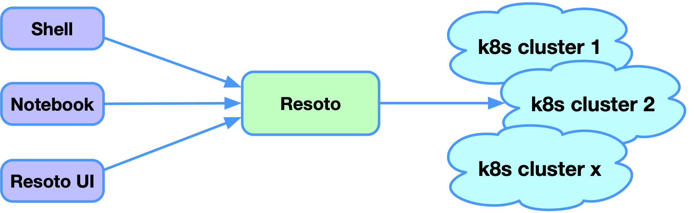
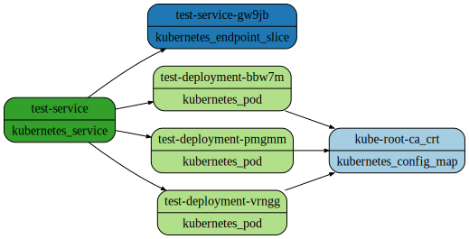
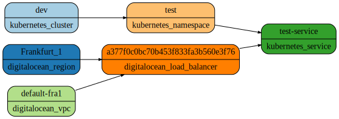
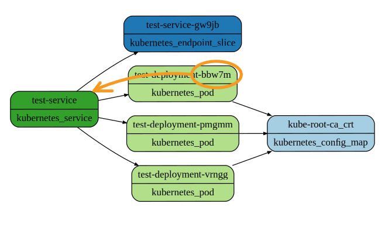
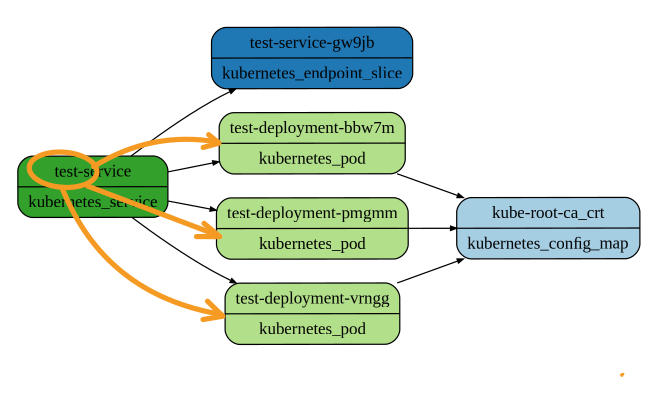
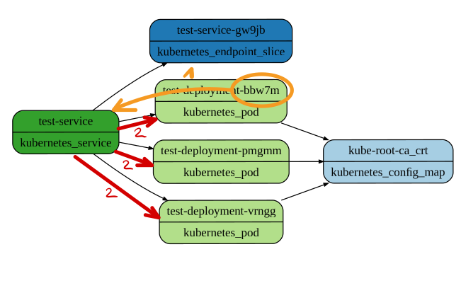
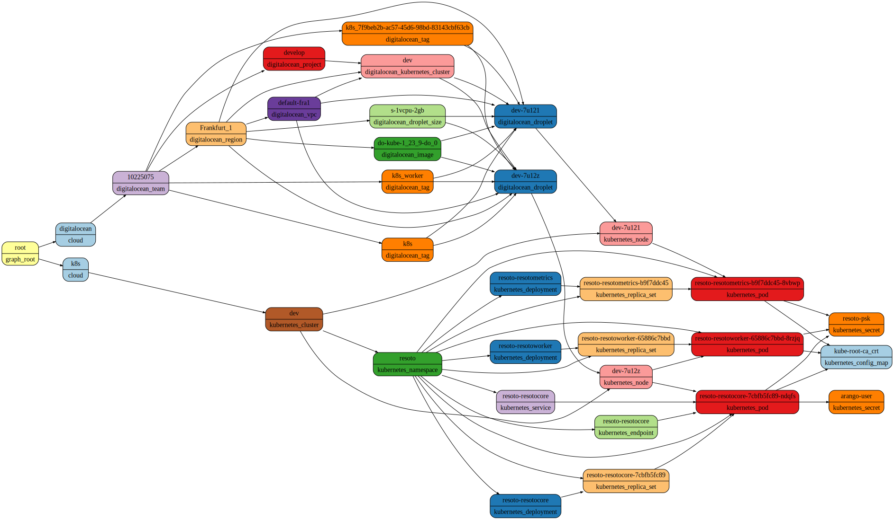
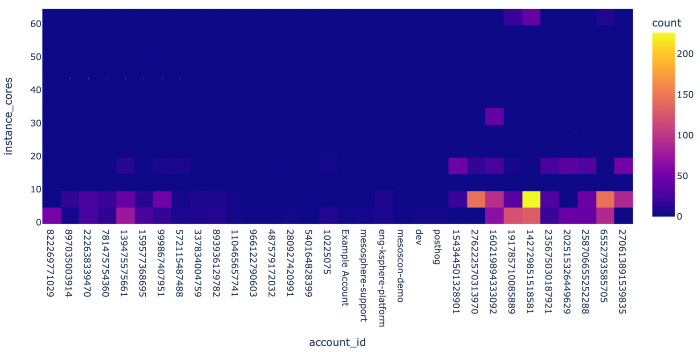
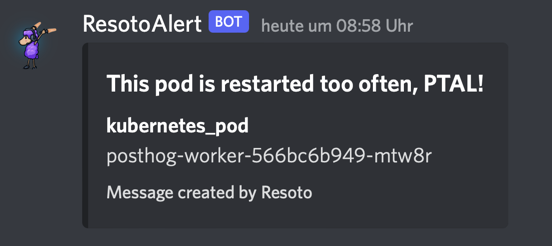

# Discover Kubernetes Resources

[Kubernetes](https://kubernetes.io) has dramatically improved the way we manage our workloads. It has become the de-facto standard for deploying and managing containerized applications, and is available in all major cloud providers.

A typical setup consists of distinct Kubernetes clusters for each application stage (e.g., dev, test, prod) or a cluster per tenant, and Kubernetes clusters shared between different users and teams often utilize namespaces and roles to control access. Deploying a single application to a Kubernetes cluster usually consists of tens to hundreds of resources (e.g., deployments, services, ConfigMaps, secrets, ingresses, etc.).

Even a relatively simple setup quickly becomes tedious to manage as the resource count grows. It is difficult for a human to keep track of resources, especially with user access limited to certain clusters in select namespaces.


<!--truncate-->

## Kubernetes Support in Resoto

Kubernetes provides an API that returns information about a cluster's deployed resources. Resoto uses this API to build an index of resources in all of your Kubernetes clusters. Resoto continuously updates this index and the collected data is accessible via [Resoto Shell](/docs/concepts/components/shell), [Resoto Notebook](/docs/reference/notebook), or Resoto UI.



:::info

The examples presented in this blog post are available in the [`someengineering/resotonotebook` GitHub repository](https://github.com/someengineering/resotonotebook/blob/main/examples/resoto_kubernetes.ipynb). Try them out on your own Kubernetes cluster after [installing Resoto](/docs/getting-started/install-resoto)!

:::

## Full-Text Search

One of the simplest ways to find resources in your cluster is using Resoto's full-text search. Resoto indexes the properties of all services in every namespace in each cluster. To perform a full-text search, simply provide your search term to the [`search` command](/docs/reference/cli/search) enclosed in double quotes:

```bash
> search "10.245.11.204"
# highlight-next-line
​kind=kubernetes_service, id=377f0, name=test-service, age=6d23h, cloud=k8s, account=dev, region=test
```

The searches for IPv4 address `10.245.11.204` returned a single resource of kind `kubernetes_service`. To see _all_ properties of this service, pipe the result of the search to the [`dump` command](/docs/reference/cli/dump):

```bash
> search "10.245.11.204" | dump
# highlight-start
​reported:
​  id: 377f0c0b
​  tags:
​    kubernetes.digitalocean.com/load-balancer-id: bdf3a6cf-fa5a-4241-b344-91b93506ee02
​  name: test-service
​  ctime: '2022-08-22T09:06:04Z'
​  resource_version: '3024417'
​  namespace: test
​  service_status:
​    load_balancer:
​      ingress:
​      - ip: 164.90.240.138
​  service_spec:
​    allocate_load_balancer_node_ports: true
​    cluster_ip: 10.245.11.204
​    cluster_ips:
​    - 10.245.11.204
​    external_traffic_policy: Cluster
​    internal_traffic_policy: Cluster
​    ip_families:
​    - IPv4
​    ip_family_policy: SingleStack
​    ports:
​    - node_port: 30304
​      port: 80
​      protocol: TCP
​      target_port: '80'
​    type: LoadBalancer
​  kind: kubernetes_service
​  age: 6d23h
# highlight-end
```

## Filtering Resources

While Resoto's full-text search is a convenient way to find resources, you often want to specify additional criteria to filter the results. For example, we may want the results to [only include resources of a specific kind](/docs/concepts/search/filters#selecting-nodes-by-kind) or [filter for nodes with specific attributes](/docs/concepts/search/filters#selecting-nodes-by-predicate).

Since Resoto itself can be installed on a Kubernets cluster using the [Helm chart](https://github.com/someengineering/helm-charts/tree/main/charts/resoto), we can search for pods with names containing "resoto":

```bash
> search is(kubernetes_pod) and name=~resoto
# highlight-start
​kind=kubernetes_pod, id=7d2e76ef, name=resotocore-ndqfs, age=11d19h, cloud=k8s, account=dev, region=resoto
​kind=kubernetes_pod, id=7c7c6cfa, name=resotometrics-8vbwp, age=11d19h, cloud=k8s, account=dev, region=resoto
​kind=kubernetes_pod, id=6297b9e1, name=resotoworker-8rzjq, age=11d19h, cloud=k8s, account=dev, region=resoto
# highlight-end
```

## Finding Services of Pods

Kubernetes uses labels and selectors to define the relationship between a service and a pod. It is valid to expose the same pod via different services. To reveal which service exposes a pod, we need to understand the selector syntax and check all pods for matching labels. Thankfully, Resoto analyzes the relationships between resources, providing this information as edges between nodes and revealing a directed acyclic graph.

To understand the concept of a graph a bit better, let me show you two examples that we present in our Jupyter notebook via `display_svg(rnb.graph(...))`:

```python
is(kubernetes_service) and name=test-service -[0:2]->
```



We are searching for a specific Kubernetes service with the name `test-service` and asking to traverse all outgoing dependencies from the service to a maximum depth of two. The result is a graph that shows the service and three pods behind this service, that all reference the same configmap.

```python
is(kubernetes_service) and name=test-service <-[0:2]-
```



We can do the same query, but this time reverse the direction of the arrow, showing us all incoming dependencies up to two levels. This time we see all resources that have a dependency on this service. Please also note that Resoto understands the underlying provider of this Kubernetes cluster, in this case, DigitalOcean. This service type is `LoadBalancer`, so a publicly available load balancer needs to be provided. A DigitalOcean load balancer is used here, backing the Kubernetes service. You can also see that the DigitalOcean load balancer is provided in the Frankfurt region in the default VPC. All of this knowledge is gathered automatically by Resoto without any additional action.

With this knowledge at hand, it is easy to get the services that expose a specific pod: we filter for the pod in question, walk the dependencies inbound by one step and then filter the resulting list of incoming dependencies for services.



```bash
> is(kubernetes_pod) and name=~bbw7m <-- is(kubernetes_service)
# highlight-next-line
​kind=kubernetes_service, id=377f0c0b, name=test-service, age=7d, cloud=k8s, account=dev, region=test
```

We can list the pods that are exposed by a specific service the same way: we filter for the service, walk the graph one step outbound and filter the result list of resources to return only pods:



```bash
> search is(kubernetes_service) and name=~test --> is(kubernetes_pod)
# highlight-start
​kind=kubernetes_pod, id=7bb6478e, name=test-deployment-bbw7m, age=7d, cloud=k8s, account=dev, region=test
​kind=kubernetes_pod, id=84ab880b, name=test-deployment-pmgmm, age=7d, cloud=k8s, account=dev, region=test
​kind=kubernetes_pod, id=a3207ba4, name=test-deployment-vrngg, age=6d19h, cloud=k8s, account=dev, region=test
# highlight-end
```

Getting the list of pods behind a service is also possible when we start from a specific pod. We need to combine two walks: find the pod and walk inbound to the service, then walk outbound from the service to all pods of this service. As you can see, traversals in the graph can be chained together. You can chain as many traversals as you want.



```bash
> search is(kubernetes_pod) and name=~bbw7m <-- is(kubernetes_service) --> is(kubernetes_pod)
# highlight-start
​kind=kubernetes_pod, id=7bb6478e, name=test-deployment-bbw7m, age=7d, cloud=k8s, account=dev, region=test
​kind=kubernetes_pod, id=84ab880b, name=test-deployment-pmgmm, age=7d, cloud=k8s, account=dev, region=test
​kind=kubernetes_pod, id=a3207ba4, name=test-deployment-vrngg, age=6d19h, cloud=k8s, account=dev, region=test
# highlight-end
```

The result of this search is the same as the previous one since we were starting from the same pod.

## Use the ~~Force~~ Graph, Luke!

[Walking the relationships of a resource graph](/blog/2022/05/17/a-walk-in-the-graph) can reveal a lot of useful information.

For example, let's say we want to know the amount of memory and the number of CPU cores available on the node running a specific pod:

```bash
> search is(kubernetes_pod) and name~resotocore <-- is(instance) | list instance_memory, instance_cores
# highlight-next-line
​instance_memory=2, instance_cores=1
```

The above search reveals that the pod runs on a rather weak node with only 2 GB of memory and a single CPU core.

Next, consider a scenario where we may have secrets no longer read by any Kubernetes resource. It is best practice to remove unused secrets, to reduce the risk of unauthorized access to your resources. To accomplish this task, we will filter the search for nodes of a kind `kubernetes_secret` that do not have a relation:

```bash
> search is(kubernetes_secret) with(empty, <-- not is(kubernetes_namespace))
# highlight-next-line
​kind=kubernetes_secret, id=cb3fdf32, name=nginx-letsencrypt-test, age=5mo24d, cloud=k8s, account=dev, region=test
```

The [`with` clause](/docs/concepts/search/with-clause) allows us to find resources with specific relationships to other resources. Here, we searched for secrets without incoming relationships to resources aside from the owning namespace.

Finally, we'll find all incoming and outgoing dependencies of pods with name containing "resoto." As seen earlier, there are three such pods in the cluster. We can find the transitive dependencies of these resources using the `<-[0:]->` traversal, which follows both incoming (`<--`) and outgoing (`-->`) dependencies until it reaches either a leaf or the graph root:

```bash
> search is(kubernetes_pod) and name~resoto <-[0:]->
```



The red nodes in the lower right corner of the above graph represent the three pods, and the other nodes depict their transitive dependencies. We can intuit quite a bit of information from this graph:

1. The three pods belong to three different deployments and replica sets.
2. Resoto Core has an attached service.
3. The three pods are running on two nodes.
4. DigitalOcean droplets back the nodes from a DigitalOcean Kubernetes cluster with version 1.23.9.
5. The Kubernetes cluster is running in Frankfurt on the default VPC.

## Counting Resources

Resoto can count resources or properties with the [`count` command](/docs/reference/cli/count).

The following counts the number of pods in all clusters:

```bash
> search is(kubernetes_pod) | count
# highlight-start
​total matched: 67
​total unmatched: 0
# highlight-end
```

`namespace` is a property of each pod, and we can also count the pods for each namespace:

```bash
> search is(kubernetes_pod) | count namespace
# highlight-start
​test: 3
​resoto: 6
​posthog: 16
​kube-system: 42
​total matched: 67
​total unmatched: 0
# highlight-end
```

The results reveal that there are four namespaces: `test`, `resoto`, `posthog` and `kube-system`. Most of the pods are running in the `kube-system` namespace.

Now, let's try to count the number of pods running on every node. Doing so is a bit more complicated since this information is not a property of the pod. However, we can get the node data by extracting the data from the graph. Resoto provides a special syntax to access the [ancestors and descendants](/docs/concepts/search/merging-nodes#ancestors-and-descendants) of a resource:

```bash
> search is(kubernetes_pod) | count /ancestors.kubernetes_node.reported.name
# highlight-start
​dev-7u121: 9
​dev-7u129: 10
​dev-7u12z: 11
​analytics-7u14b: 12
​analytics-7u14r: 12
​analytics-7u14w: 13
# highlight-end
```

The above search result shows that there are two clusters, each with three nodes. The result also includes the number of pods running on each of these nodes.

The same approach can be used for counting the number of pods in each deployment:

```bash
> search is(kubernetes_pod) | count /ancestors.kubernetes_deployment.reported.name
```

## Aggregation

[`count`](/docs/reference/cli/count) is actually an [aggregation](/docs/concepts/search/aggregation). Aggregations apply functions like `min`, `max`, `avg`, and `sum` on the a resource's property values.

Here, we combine some of the above searches to count the number of pods in each node, in addition to getting the amount of memory and CPU cores available on each node:

```bash
> search is(kubernetes_pod) | aggregate /ancestors.instance.reported.name as node_name: sum(1) as pod_count, min(/ancestors.instance.reported.instance_memory) as memory, min(/ancestors.instnace.reported.instance_cores) as cores
```

The following table shows the results of the aggregation:

| `node_name`       | `pod_count` | `memory` | `cores` |
| ----------------- | ----------- | -------- | ------- |
| `analytics-7u14w` | 13          | 8        | 2       |
| `analytics-7u14r` | 12          | 8        | 2       |
| `analytics-7u14b` | 12          | 8        | 2       |
| `dev-7u12z`       | 11          | 2        | 1       |
| `dev-7u129`       | 10          | 2        | 1       |
| `dev-7u121`       | 9           | 2        | 1       |

While aggregation can be helpful for adhoc queries, we can also turn this data into a time series and watch the values over time. Please find the blog post about [Actionable Cloud Infrastructure Metrics](/blog/2022/06/09/building-actionable-cloud-infrastructure-metrics) for more details.

## Heatmaps

Jupyter Notebooks make it very easy to visualize data. One of the options that are available out of the box is heatmaps. Let's assume you have not only two but many clusters and want to see where most compute instances are running. You can use the heatmap visualization to get precisely this information.

```python
import plotly.express as px
data = rnb.search("is(instance)")
px.density_heatmap(data, x="account_id", y="instance_cores")
```



This heatmap will show all accounts (and every Kubernetes cluster is represented as one account here) on the x-axis and the number of cores on the y-axis, representing a specific machine type. Every point in this coordinate system is color coded and shows the count of nodes of that type in this account. You can see with one view that the cluster with id=142729851518581 uses the most compute instances.

## Interface with Other Systems

Resoto makes it very easy to interface with other systems. It ships with a custom command to talk to [discord](/docs/how-to-guides/alerting/send-discord-notifications) while there is also a howto that describes how to interface with other systems using the example of [`alertmanager`](/docs/how-to-guides/alerting/send-prometheus-alertmanager-alerts).

Let's assume we want to get a notification in case a pod is restarting too often.

First, let's create a search that matches our rule of a pod that has is restarting too often:

```bash
> search is(kubernetes_pod) and pod_status.container_statuses[*].restart_count>42
# highlight-next-line
​kind=kubernetes_pod, id=3f16abea, name=posthog-worker-mtw8r, restart_count=[1], age=14d2h, cloud=k8s, account=posthog, region=posthog
```

The property `restart_count` is part of the container status. A pod can have several containers. Since we do not care which container in the pod has been restarted very often, we use the wildcard `*` to match all container statuses. As we can see, one pod has been restarted too often.

We use the discord command shipped with Resoto to send a notification. Since the `webhook` parameter has been defined in the configuration, we only need to pipe the search into the `discord` command and specify the message's title.

```bash
> search is(kubernetes_pod) and pod_status.container_statuses[*].restart_count>42 | discord title="This pod is restarted to often, PTAL!"
# highlight-next-line
​1 requests with status 204 sent.
```

This command line will result in a notification in Discord:



The whole idea of the notification makes sense if Resoto knows about my rule and sends me the notification when it happens, not when I search for it. To achieve this, we need to create a job that executes this command line whenever the latest data is available from all Kubernetes clusters. We can achieve this with the [`job`](/docs/reference/cli/jobs) command:

```bash
> jobs add --id pod_restarted_too_often --wait-for-event post_collect 'search is(kubernetes_pod) and pod_status.container_statuses[*].restart_count>0 | discord title="This pod is restarted too often, PTAL!"'
# highlight-next-line
​Job pod_restarted_too_often added.
```

Since we register this job with the `post_collect` event, it will be executed automatically by Resoto whenever new data has been collected. If there is a pod that restarts very often in the future, we will get a notification on Discord.

## Kubernetes and More

Resoto is not only able to collect resource metadata from Kubernetes but also other cloud providers like AWS, GCP, and DigitalOcean. Resoto is [open source](https://github.com/someengineering/resoto/blob/main/LICENSE) and free to use. [Install Resoto](/docs/getting-started/install-resoto) today!
