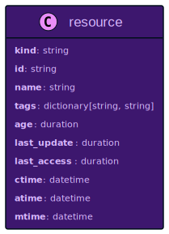

# Unified Data Model

Todays world of cloud computing is complex. There are many different cloud providers, each with their own set of services.
If we take the most popular cloud providers, we can see this picture according to [Map the Cloud](https://mapthe.cloud)
- AWS: 324 services
- Azure: 222 services
- GCP: 52 services

Any application that is build on top of such a cloud infrastructure usually uses a lot of the provided services like compute, storage, databases, networking, etc.
Every service offered by any cloud provider is unique and so it is not a surprise, that also the data model that each service offers is different.

## Unification Step 1: Everything is a Resource

Let us assume we have an application deployed on AWS and we want to get the EC2 instances, SQS queues of my application ordered by time of creation.
We can use the AWS CLI to query the data, using the [describe-instances](https://docs.aws.amazon.com/cli/latest/reference/ec2/describe-instances.html) and a combination of [list-queues](https://docs.aws.amazon.com/cli/latest/reference/sqs/list-queues) and [get-queue-attributes](https://docs.aws.amazon.com/cli/latest/reference/sqs/get-queue-attributes) for every queue that is returned by the list call.
The output of each command returns a list of resources with a specific data model, which is also described in the documentation of the AWS CLI commands.

In order to sort the list of resources by time of creation, we need to know which property each resource provides that contains the time of creation.
There are services that do not provide this information. EC2 is providing this data somehow - after looking for something similar, we will find out, that the best property for this purpose is called `LaunchTime`. The value is provided as ISO 8601 time string.
The SQS queue provides a property called `CreatedTimestamp` which is the number of seconds since the epoch. In order to compare creation time of EC2 instances and SQS queues we need to use the same time format. 
I will leave out the listing and sorting part, since it is not straight forward.

The example I presented might be a bit artificial, but it shows the problem that you face, when you want to get data out of your cloud infrastructure:
you need to have a deep understanding of the data model of each service and how to get to the data. In order to select or combine data from different services, you need to make sure to use the same abstraction level and the same units of measurement.

Resoto collects data from different services and different cloud providers. We could have made our life easy and just collected the data as it is provided by the cloud provider - but we decided against it.
While Resoto makes all the data available that is provided by the cloud provider for every service, it also abstracts and unifies it at the same time. The first basic building block I want to present is the `Resource` abstraction:



Every resource that Resoto collects adheres to this model.
Every resource has a specific `kind`, like `aws_ec2_instance` or `aws_sqs_queue` which is accessible as property of the resource.
The `id` is a synthetic property created by Resoto as global unique identifier. Resoto tries its best to retrieve the `name` from the underlying resource. In case the resource does not provide a name, Resoto will look for a tag with the name `Name` and use the value if defined. 
Most cloud providers allow to attach arbitrary information to resources in the form of key-value pairs. This information is also provided for every resource and is called `tags`.

There are three attributes, that you can define for every resource: when has it been created (`ctime`), when has it been modified (`mtime`) and when has it been accessed the last time (`atime`).
Resoto makes sure to transform available properties to one unit, which is the ISO 8601 time string in the UTC timezone.
Ofcourse this information is not always available for every resource. Either Resoto can map a meaningful value to the attribute or it tries to get the information from other systems.
One example to get meaningful access and modification time in AWS, is querying CloudWatch metrics for RDS databases or EBS volumes.
This is fully transparent to the user, since it happens during collection time.

While `ctime`, `mtime` and `atime` are timestamps, you often want to display and query by duration.
This is where `age`, `last_update` and `last_access` come into play. Those properties are calculated from the timestamp attributes and are displayed as human-readable durations.
The same is true for searching those properties, which is possible in the same human-readable format, like: `14d`, `1h30m`, `23s`.

So to complete the example I started in the beginning: this is the search that would do the job in Resoto:

```bash
> search is(aws_ec2_instance, aws_sqs_queue) sort age | list --markdown kind, name, age
​|kind            |name      |age   |
​|----------------|----------|------|
​|aws_ec2_instance|ganymed   |3mo5d |
​|aws_sqs_queue   |styx      |1mo5d |
​|aws_ec2_instance|bardolin-1|1mo14d|
​|aws_ec2_instance|bardolon-2|17d   |
​|aws_sqs_queue   |jordan    |5d3h  |
```

We select the resources by kind and sort them by age. The output is a table with the kind, name and age of the resources.
This kind of query can be done with any resource from any service and any cloud provider, since we rely only on properties of the `resource` abstraction. 

With this knowledge at hand, we can also search for resources with a specific name or with specific tags.
If this information is available in the list of supported cloud providers and services, you can find the resource using Resoto.


## Unification Step 2: Define Common Abstractions

TBD.

