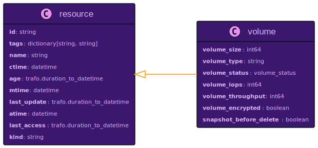
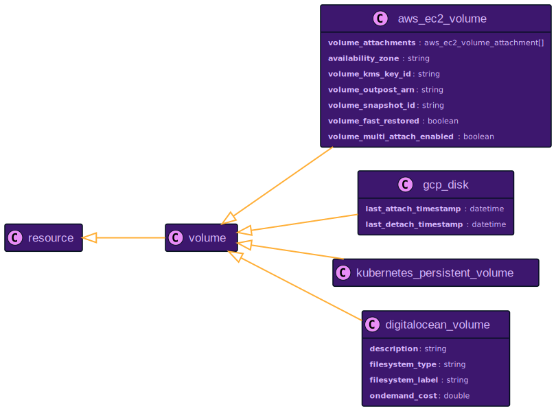
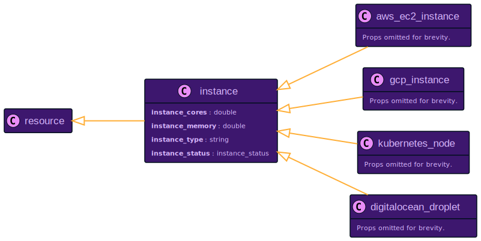
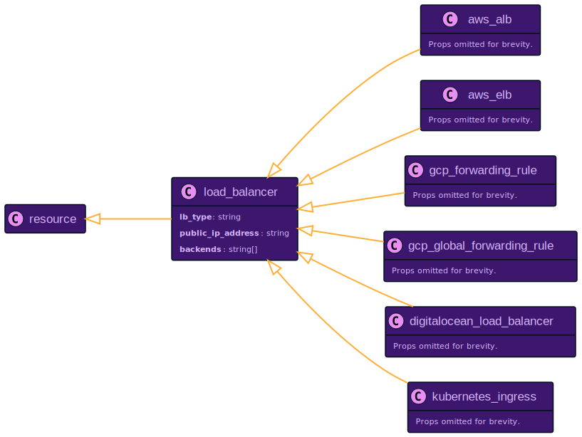

# Unified Data Model

Today's world of cloud computing is complex. There are many different cloud providers, each with its own set of services. If we take the most popular cloud providers, we can see this picture according to [Map the Cloud](https://mapthe.cloud)

- AWS: 324 services
- Azure: 222 services
- GCP: 52 services

Any application built on such a cloud infrastructure usually uses many provided services like computing, storage, databases, networking, etc. Every service offered by any cloud provider is unique, so it is not surprising that each service's data model is different.

## Unification Step 1: Everything is a Resource

Let us assume we have an application deployed on AWS, and we want to get my application's EC2 instances and SQS queues ordered by the time of creation. We can use the AWS CLI to query the data using the [describe-instances](https://docs.aws.amazon.com/cli/latest/reference/ec2/describe-instances.html) and a combination of [list-queues](https://docs.aws.amazon.com/cli/latest/reference/sqs/list-queues) and [get-queue-attributes](https://docs.aws.amazon.com/cli/latest/reference/sqs/get-queue-attributes) for every queue that is returned by the list call. The output of each command returns a list of resources with a specific data model, which is also described in the documentation of the AWS CLI commands.

To sort the list of resources by the time of creation, we need to know which property each resource provides that contains the time of creation. Not all services provide this information, but EC2 does, somehow. After looking for something similar, we will find out that the best property for this purpose is `LaunchTime`. The value is provided as ISO 8601 time string. The SQS queue provides a property called `CreatedTimestamp`, which is the number of seconds since the epoch. We need to use the same time format to compare the creation time of EC2 instances and SQS queues. I will leave out the listing and sorting part since it is not straightforward using just the AWS CLI (it is impossible with the console).

The example I presented might be a bit artificial, but it shows the problem that you face when you want to get data out of your cloud infrastructure: You need to deeply understand each service's data model and how to get to the data. To select or combine data from different services, you need to use the same abstraction level and the same units of measurement.

Resoto collects data from different services and different cloud providers. We could have made our life easy and just collected the data as the cloud provider provides - but we decided against it to make your life easier. While Resoto makes all the data available that the cloud provider provides for every service, it also abstracts and unifies it simultaneously. The first basic building block I want to present is the `Resource` abstraction:


Every resource that Resoto collects provides this set of properties. A resource is of a specific `kind` and provides this information as property. A resource `kind` could be something like `aws_ec2_instance` or `aws_sqs_queue`. The `id` is a synthetic property created by Resoto as a globally unique identifier across providers. Resoto tries its best to retrieve the `name` from the underlying resource. If the resource does not provide a name, Resoto will look for a tag named `Name` and use the value if defined. Most cloud providers allow attaching arbitrary information to resources as key-value pairs. This information is also provided for every resource called `tags`.

There are three attributes that you can define for every resource: when has it been created (`ctime`), when has it been modified (`mtime`), and when has it been accessed the last time (`atime`). Resoto makes sure to transform available properties to one base unit, the ISO 8601 time string in the UTC timezone. Of course, this information is not always available for every resource. Either Resoto can map a meaningful value to the attribute, or it tries to get the data from other systems. For the time of creation, the default is mapping an existing property, as we have seen for the EC2 instances and SQS queues. If this information is unavailable, Resoto will remember the time it has seen the resource for the first time and uses it as `ctime`. By default, Resoto scrapes your infrastructure every hour, so this might be a sane fallback value. If there is no meaningful access or modification time, it might be possible to retrieve this information elsewhere. AWS, for example, provides time series data via the CloudWatch service. Resoto can use this data to provide meaningful values for the `atime` and `mtime` attributes for specific resources. Let's take AWS RDS databases or EC2 volumes as an example, where we can retrieve meaningful values for the `atime` and `mtime` attributes. The process of retrieving and merging the data is fully transparent to the user since it happens during collection time. You can access, filter, and sort the data as you like.

While `ctime`, `mtime` and `atime` are timestamps, you often want to display and query by duration. This is where `age`, `last_update` and `last_access` come into play. Those properties are calculated from the timestamp attributes and are displayed as human-readable durations. The same is true for searching those properties, which is possible in the same human-readable format, like: `14d`, `1h30m`, `23s`.

So to complete the example I started in the beginning: this is the Resoto search that would find all EC2 instances and SQS queues and sort them by age. As a bonus, we render the resulting list as a markdown table:

```bash
> search is(aws_ec2_instance, aws_sqs_queue) sort age | list --markdown kind, name, age
```

| kind             | name       | age    |
| ---------------- | ---------- | ------ |
| aws_ec2_instance | ganymed    | 3mo5d  |
| aws_sqs_queue    | styx       | 1mo5d  |
| aws_ec2_instance | bardolin-1 | 1mo14d |
| aws_ec2_instance | bardolin-2 | 17d    |
| aws_sqs_queue    | jordan     | 5d3h   |

We select the resources by kind and sort them by age. The output is a table with the resources' kind, name, and age. This kind of query can be done with any resource from any service and any cloud provider since we rely only on properties of the `resource` abstraction. Please note what you don't see: you don't need to collect data from different accounts or regions, know anything about the specific resource, don't need to know the unit of measurement or the property name. Instead, you can select and sort by any base property.

With this knowledge at hand, we can also do other interesting searches. Let's select all resources that have been created in the last 4 hours and do not have an owner tag defined:

```bash
> search age<4h and tags.owner==null
```

Summarize the number of resources per kind that have been created in the last two days:

```bash
> search age<2d | count kind
```

Show resources that are older than one year and have not been accessed in the last two months:

```bash
> search age>1y and last_access>2mo
```

**Take away from this section:** every resource in Resoto provides the same head data based on the same base units. This allows you to select, sort and aggregate without knowing anything about the underlying resource.

## Unification Step 2: Define Common Abstractions

:::info Resoto has support for the following cloud providers:

- AWS
- GCP
- Kubernetes
- DigitalOcean

This section is most relevant for Resoto users with more than one resource provider. You should definitely read on if you can tick more than one of the boxes above. :::

The unification of the base properties is only the first step. There are other entities for every cloud provider that can be abstracted and unified. For example, let's take the representation of a volume in Resoto:



This image shows a [UML](https://en.wikipedia.org/wiki/Unified_Modeling_Language) class diagram of the `volume` abstraction in Resoto. The arrow to the resource says that a volume is a resource and has all the properties every resource has. It brings additional properties like volume size, throughput, etc. This abstract idea of a volume holds whether it is a persistent volume in Kubernetes, a block device in AWS, or a disk in GCP. Since the specific resource in a particular cloud provider has its own set of unique properties, we can not simply use the volume definition directly but use it again as one level of abstraction. The following image shows the `resource` and `volume` abstraction, as well as all the possible concrete definitions:



An AWS EC2 volume is a specific resource available in AWS. It brings its own set of properties that are unique to AWS EC2 volumes. At the same time, it also provides properties it shares with other volumes from different providers.

This abstraction level allows one to search, sort, and aggregate on the volume level using properties available for all volumes. Resoto again will ensure that the property has the same name, the same unit of measurement, and the same base unit for every volume collected. To give you an idea of what that means: the size of a volume can be defined in MB, GB, MiB, GiB, etc. as a string or integer, or float unit. Resoto will always give you the size as `integer` using `GB` as the unit of measurement.

As an example, we will search all volumes and aggregate data by volume type, counting all available volumes and the size in GB. The result contains volumes from AWS (`gp3`), GCP (`pd-ssd`), and DigitalOcean (`do-block-storage`).

```bash
$ search is(volume) |
  aggregate volume_type: sum(volume_size) as total_size, sum(1) as count
```

| volume_type      | count | volume_size |
| ---------------- | ----- | ----------- |
| gp3              | 5405  | 1448160     |
| pd-ssd           | 937   | 20944       |
| do-block-storage | 3     | 108         |

The general idea of a volume is available in all cloud providers, but the specific implementation is different. Resoto provides a set of properties with the same name and meaning, no matter which cloud provider you use.

More abstractions like this are available in Resoto. The following list shows the most prominent examples that are available in Resoto: Compute Instances (`instance`) like EC2, GCE, DO Droplets, and Kubernetes Pods share common properties. Please note that the number of cores, the amount of memory, and the state of an instance use the same unit of measurement. 

The same logic is applied to Load balancers (`load_balancer`). Please note there are even different options using the same cloud provider here. 

And many more, like `network_interface`, `ip_address`, `dns_record`, `database` etc.

We have a [data model reference](/docs/reference/data-models) for all resources of all cloud providers that Resoto supports. You will find the complete list of properties as well as the hierarchy of the abstractions:

- [AWS Reference](/docs/reference/data-models/aws)
- [GCP Reference](/docs/reference/data-models/gcp)
- [Kubernetes Reference](/docs/reference/data-models/kubernetes)
- [DigitalOcean Reference](/docs/reference/data-models/digitalocean)
