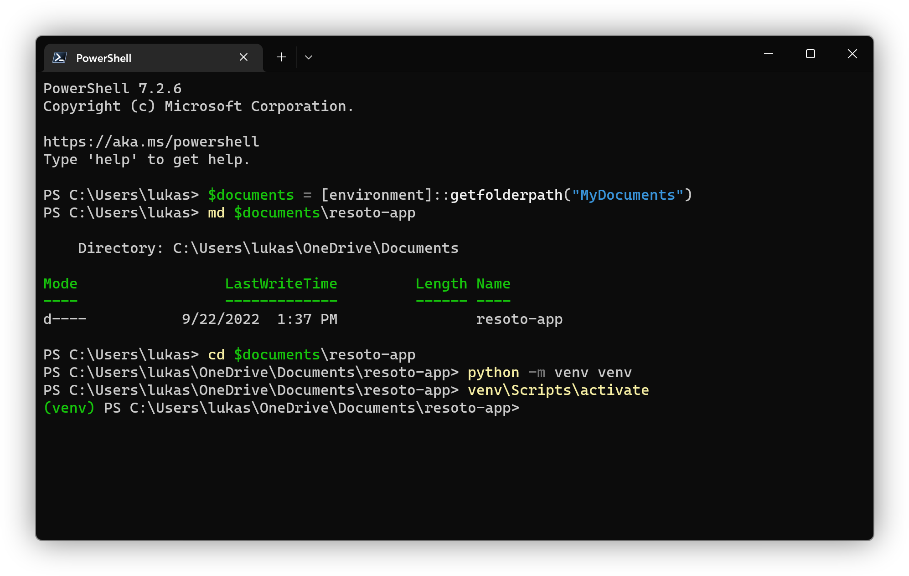
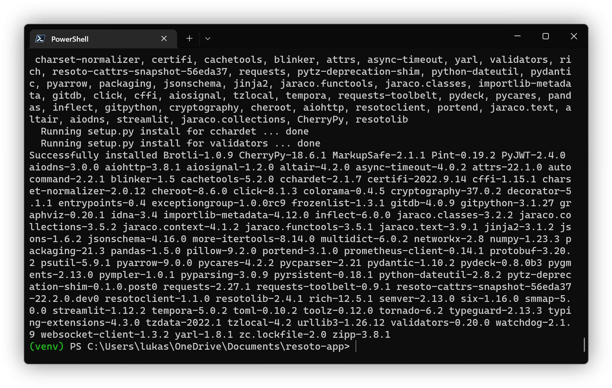
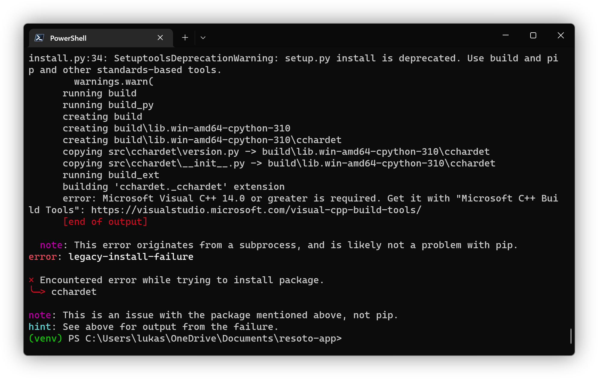
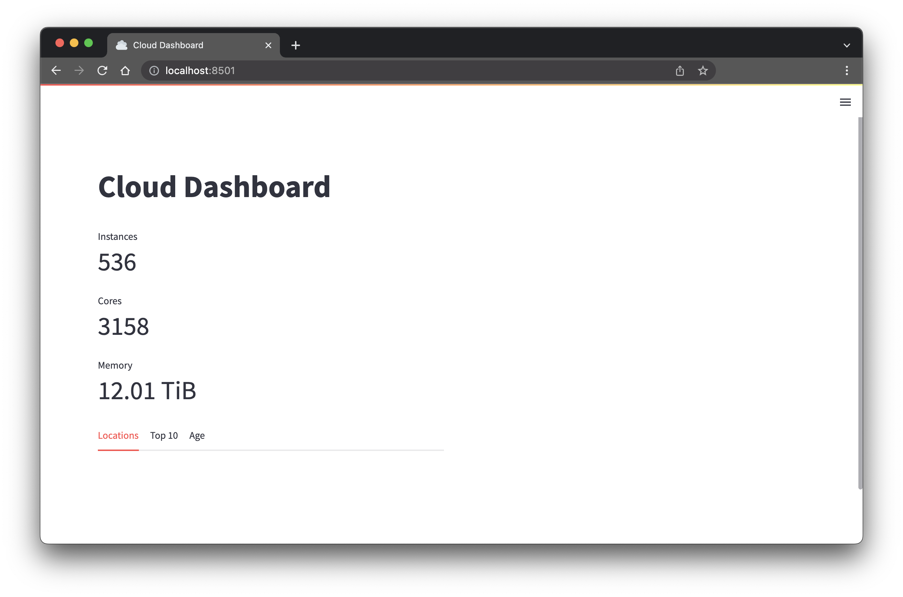

# Building Infrastructure Apps with Resoto and Streamlit

```mdx-code-block
import TabItem from '@theme/TabItem';
import Tabs from '@theme/Tabs';
```

Last time we talked about [building actionable cloud infrastructure metrics](../06-09-building-actionable-cloud-infrastructure-metrics/index.md) and learned how to create metrics, export them into a time series database, and visualize them with Grafana. This time we'll take a look at how to take the next step. We'll write some Python code to build our own infrastructure app using [Streamlit](https://streamlit.io/), a framework to turn data into web apps.


If you are not familiar with Python, don't worry. We'll keep it simple and under 100 lines of code. In the [prerequisites](#prerequisites) we'll show you how to install Python and give a brief overview of the few coding techniques that we are going to apply. Looking at the code ahead, the only thing we're going to do is some variable assignment and function calls. If you have ever written even a simple shell or batch script or done some slightly complex Excel calculations, you will be able to follow along.

<!--truncate-->

If you are familiar with Python and just want the finished product, install the packages from [requirements.txt](#creating-a-requirementstxt-file), jump straight to [the completed app](#the-complete-app) and [run it](#running-the-app).

## Prerequisites

The only things we need are [Python 3.8+](https://www.python.org/), [`pip` the Python package installer](https://pip.pypa.io/), and of course [Resoto](https://www.resoto.com/), as well as a text editor of choice. Personally I use [Visual Studio Code](https://code.visualstudio.com/). If you already have Python and pip installed and you know your way around Python jump straight to [Getting Started](#getting-started).

### Installing Python 3.8+ and Pip

The only things we need to get started are Python and Pip, the Python package installer. The Python version must be 3.8 or higher.

<Tabs>
<TabItem value="windows" label="Windows">

<Tabs>
<TabItem value="windows-download" label="Download">

You can download the latest version from [python.org](https://www.python.org/downloads/).


TODO: insert information about path length and PATH

</TabItem>
<TabItem value="windows-chocolatey" label="Chocolatey">

If you have [Chocolatey](https://chocolatey.org/) installed you can install Python with the following command:

```powershell
choco install python
```

</TabItem>

</Tabs>

</TabItem>
<TabItem value="macos" label="macOS">

<Tabs>
<TabItem value="macos-homebrew" label="Homebrew">

If you have [Homebrew](https://brew.sh/) installed you can install Python with the following command:

```sh
$ brew install python
```

Enter this command in the `Terminal` app, which can be found in the `Utilities` folder of the `Applications` folder.


</TabItem>
<TabItem value="macos-download" label="Download">

You can download the latest version from [python.org](https://www.python.org/downloads/).


</TabItem>
</Tabs>

</TabItem>
<TabItem value="linux" label="Linux">

On Linux there is a good chance your distribution already comes with a version of Python 3.x installed. If you are not sure, you can check with the following command:

```bash
$ python3 --version
# highlight-start
​Python 3.10.4
# highlight-end
```

If instead of the version the command returns an error, you can install Python and pip (the Python package installer) using your distribution's package manager.

<Tabs>
<TabItem value="linux-fedora" label="Fedora/CentOS">

```bash
$ sudo dnf install python3 python3-pip
```

</TabItem>
<TabItem value="linux-debian" label="Debian/Ubuntu">

```bash
$ sudo apt update
$ sudo apt install python3 python3-pip
```

</TabItem>
</Tabs>

</TabItem>
</Tabs>

### Python Crash Course

In the next couple of minutes we'll give you a quick overview of the Python programming language. If you are already familiar with Python, you can [skip this section](#getting-started).

:::info

The `$`, `>>>` or `...` in front of the line must not be entered into the terminal. It just indicates that the following command is to be entered into the terminal. When using the code boxes' copy button ⧉, the code will be copied without those characters, ready to be pasted into the terminal.

:::

#### Starting the REPL

Start Python by running the following command:

```bash
$ python3
​Python 3.10.4 (v3.10.4:9d38120e33, Mar 23 2022, 17:29:05) [Clang 13.0.0 (clang-1300.0.29.30)] on darwin
​Type "help", "copyright", "credits" or "license" for more information.
​>>>
```

This is the REPL, the Python Read-Eval-Print-Loop. It is a great way to quickly test out some code. You can type in a command and press enter to execute it. The result will be printed to the screen. If you want to exit the REPL, type `exit()` and press enter.

#### Variables and Functions

_Variables_ are used to store values. They are created by assigning a value to a name. The name can be any combination of letters, numbers, and underscores, but it must start with a letter or underscore.

_Functions_ are used to group code into a single unit. Functions can be called by using the function name followed by a list of arguments in parentheses. For this app we won't write any functions ourselves but we will call existing functions.

In the following code we assign the value `Monday` to a variable named `today` and then use the `print()` function to print the value of the variable to the screen.

```python
>>> today = "Monday"
>>> print(today)
​Monday
```

##### Types of Variables

There are different types of variables. The most common are _strings_, _integers_, and _floats_. Strings are used to store text. Integers are used to store whole numbers. Floats are used to store decimal numbers. There are also _booleans_, which can be either `True` or `False`, and _lists_ and _dictionaries_ which are used to store multiple values. To access a value in a list we use an index, which is a number that starts at 0, 0 being the first element of a list. Dictionaries are similar to lists, but instead of using a number to access a value, you can use a string. Lists are created by using square brackets `[]` and dictionaries are created by using curly brackets `{}`.

Let's quickly go through some examples of each type of variable.

```python
>>> greeting = "Hello there! 👋"
>>> number_of_colleagues = 7
>>> current_temperature = 74.6
>>> window_closed = True
>>> pancake_ingredients = ["flour", "eggs", "milk", "salt", "baking powder"]
>>> capital_cities = {
...   "England": "London",
...   "Germany": "Berlin",
...   "USA": "Washington DC",
...   "Lebanon": "Beirut",
...   "Nepal": "Kathmandu",
...   "Spain": "Madrid"
... }
>>> type(greeting)
​<class 'str'>
>>> type(number_of_colleagues)
​<class 'int'>
>>> type(current_temperature)
​<class 'float'>
>>> type(window_closed)
​<class 'bool'>
>>> type(pancake_ingredients)
​<class 'list'>
>>> type(capital_cities)
​<class 'dict'>
```

##### Ways to access and print variables

Let us look at ways to access and print the values of variables.

```python
>>> print(current_temperature)
​74.6
>>> print(f"The current temperature is {current_temperature}F")
​The current temperature is 74.6F
>>> pancake_ingredients[0]
​'flour'
>>> pancake_ingredients[3]
​'salt'
>>> {capital_cities['USA']}
​{'Washington DC'}
>>> print(f"The capital city of England is {capital_cities['England']}")
​The capital city of England is London
>>> capital_cities.get("USA")
​'Washington DC'
>>> capital_cities.get("USA", "Unknown")
​'Washington DC'
>>> capital_cities.get("USAwoiuebcroiuw", "Unknown")
​'Unknown'
```

##### Changing the value of a variable

Variables can be changed by assigning a new value to them.

```python
>>> current_temperature = 75.2
>>> print(f"The current temperature is {current_temperature}F")
​The current temperature is 75.2F
>>> current_temperature = current_temperature + 5
>>> print(f"The current temperature is {current_temperature}F")
​The current temperature is 80.2F
>>> current_temperature += 10
>>> print(f"The current temperature is {current_temperature}F")
​The current temperature is 90.2F
```

##### Assigning multiple variables at once

Multiple variables can be assigned at once by separating the variable names and values with commas.

```python
>>> name, age, city = "John", 36, "New York"
>>> print(f"My name is {name}, I am {age} years old, and I live in {city}.")
​My name is John, I am 36 years old, and I live in New York.
```

Some functions also return multiple values. In that case, the values can be assigned to multiple variables at once.

##### Decision Making

Sometimes we want to take different actions depending on the value of a variable. We can do this with an `if` statement. The following code will print a different message depending on the value of the `window_closed` variable.

```python
>>> if window_closed:
...   print("The window is closed.")
... else:
...   print("The window is open.")
​The window is closed.
```

It is also possible to chain multiple `if` statements together using `elif` (short for else if). The following code will print a different message depending on the value of the `current_temperature` variable.

```python
>>> if current_temperature < 50:
...   print("It's cold outside.")
... elif current_temperature < 70:
...   print("It's warm outside.")
... else:
...   print("It's hot outside.")
​It's hot outside.
```

Multiple conditions can be checked using the `and` and `or` operators.

```python
>>> if current_temperature < 50 and window_closed:
...   print("It's cold and the window is closed.")
... elif current_temperature < 50 or window_closed:
...   print("It's cold or the window is closed.")
... else:
...   print("It's warm and the window is open.")
​It's warm and the window is open.
```

### Resoto

If you are new to Resoto, [start the Resoto stack](/docs/getting-started/install-resoto) and [configure it to collect your cloud accounts](/docs/getting-started/configure-cloud-provider-access).

## Getting Started

### Creating a new Python environment

First we will create a new project directory where we store our source code as well as the Python virtual environment (venv). We'll use a Python virtual environment to keep our project isolated from the rest of our system. This is not strictly necessary, but it is a good practice to keep your system clean and avoid conflicts with other projects.

<Tabs>
<TabItem value="venv-macoslinux" label="macOS/Linux">

In your Terminal create a new directory for your project, create a new virtual environment and activate it by running the following commands:

```bash title="Enter this into your Terminal"
$ mkdir ~/resoto-app        # create a new directory named resoto-app inside the home directory
$ cd ~/resoto-app           # change into the new directory
$ python3 -m venv venv      # create a new virtual environment named venv
$ source venv/bin/activate  # activate the virtual environment
```

:::note

The `$` in front of the line must not be entered into the terminal. It just indicates that the following command is to be entered on a user shell without elevated permissions. You can use the code boxes copy button ⧉, to copy the commands to your clipboard.

:::


:::info

When you close your Terminal and come back to it later, you will need to activate the virtual environment again. You can do this by switching to the `resoto-app` folder using the `cd` command followed by the `source` command. You do not have to enter the `mkdir` and `python3` commands again.

:::

</TabItem>
<TabItem value="venv-windows" label="Windows">

In your PowerShell create a new directory for your project, create a new virtual environment and activate it by running the following commands:

```powershell title="Enter this into PowerShell"
$documents = [Environment]::GetFolderPath("MyDocuments")
md $documents\resoto-app
cd $documents\resoto-app
python -m venv venv
venv\Scripts\activate
```



:::info

When you close your Terminal and come back to it later, you will need to activate the virtual environment again. You can do this by switching to the `resoto-app` folder using the `cd` command followed by the `venv\Scripts\activate` command. You do not have to enter the `md` and `python` commands again.

:::

</TabItem>
</Tabs>

### Creating a requirements.txt file

We use the `pip` package manager to install all dependencies for our project. We'll create a `requirements.txt` file to keep track of the list of packages we need.

In your text editor create a new file called `requirements.txt` inside the `resoto-app` directory and add the following lines:

```txt
resotoclient[extras]
resotodata
resotolib
streamlit
pydeck
numpy
```

:::note

In a production project you would want to pin the versions of the packages you are using, by adding the version number behind the package name (e.g. `resotolib==2.4.1`). For this tutorial we'll just use the latest versions.

:::

Here is a quick overview of the packages we are using:

- [`streamlit`](https://streamlit.io/) is the app framework we're using to create our web app.
- [`resotoclient`](https://github.com/someengineering/resotoclient-python) is the Resoto Python client library. It is used to connect to the Resoto API to retrieve infrastructure data as [Pandas dataframes](https://pandas.pydata.org/) and [JSON](https://www.json.org/).
- [`resotodata`](https://github.com/someengineering/resotodata) contains static data like the locations of cloud data centers on a world map.
- [`resotolib`](https://github.com/someengineering/resoto) is a collection of helper functions for Resoto. The one we're interested in converts bytes into human readable units like GiB, TiB, etc.
- [`pydeck`](https://deckgl.readthedocs.io/) a library for making spatial visualizations. We'll use it to display the locations of our cloud resources on a map.
- [`numpy`](https://numpy.org/) is a math library for working with the data Resoto returns.

### Installing the dependencies

Now we can install the dependencies with the following command:

<Tabs>
<TabItem value="venv-macoslinux" label="macOS/Linux">

```bash
$ pip install -r requirements.txt
```


</TabItem>
<TabItem value="venv-windows" label="Windows">

```powershell
pip install -r requirements.txt
```



:::note

If you are getting the following error message:



Follow [the link from the error message](https://visualstudio.microsoft.com/visual-cpp-build-tools/) to download Visual Studio Build Tools and install them. Then try installing the dependencies again using the `pip install -r requirements.txt` command.

Make sure to select the following option during installation:


:::

</TabItem>
</Tabs>

## Creating the app

So what should the app look like? I am mostly interested in compute and storage as they are the most expensive resources on my bill. If you are interested in different resources, you can easily adapt the code to your needs.

At the top of the app I'd like to see a summary of the current number of compute instances, CPU cores and memory across all my cloud accounts in AWS and GCP. Next to that we will display similar statistics for storage volumes.

Then I would like a world map showing where in the world those instances are running. That way if anyone starts compute instances in a region we don't typically use, I can easily spot it.

For compute it could also be useful to see which account is currently spending the most money as well as the age distribution per account. What I mean by that is the average age of the compute instances per account. If a development account has a lot of old instances, it might be a good idea to look into that as they are typically short lived.

For storage it would be great to have a sunburst chart showing the distribution of storage volumes by cloud and account. Just to see at a glance if a account suddenly has a lot more storage than usual.

Finally I'd like to see a heatmap of instance type distribution by account. This allows us to easily spot outliers. For example if an account suddenly has a lot of instances of a high-core count type.

### First steps

Now that we've set up our project environment and thought about what we would like to build, we can start creating our infrastructure app.

Let's start with a very short 7 lines demo app, just to test that our environment is set up correctly. When we've got that working, we'll add the code for our infrastructure app.

In your text editor create a new file called `app.py` inside the `resoto-app` directory and add the following lines:

```python
import streamlit as st
from resotoclient import ResotoClient

resoto = ResotoClient(url="https://localhost:8900", psk="changeme")

st.set_page_config(page_title="Cloud Dashboard", page_icon=":cloud:", layout="wide")
st.title("Cloud Dashboard")

df = resoto.dataframe("is(instance)")
st.dataframe(df)
```

Adjust the `url` and `psk` values to match your local Resoto Core URL and pre-shared-key. The settings above are the default values for a Docker compose setup.

Save the file and switch back to the Terminal.

### Running the app

In the Terminal run Streamlit with the following command:

<Tabs>
<TabItem value="venv-macoslinux" label="macOS/Linux">

```bash
$ streamlit run app.py
```


</TabItem>
<TabItem value="venv-windows" label="Windows">

```powershell
streamlit run app.py
```


:::note

The first time you run Streamlit on Windows you might get the following firewall notice:


Click on `Allow access` so your browser can access the Streamlit web server.

:::

</TabItem>
</Tabs>

Your browser should open [http://localhost:8501](http://localhost:8501) and show something like the following page:


Congratulations, you've just created your first infrastructure app!

From now on whenever we change code all we need to do is reload the browser page to see the changes.

#### Line by line details

Let's take a look at what is going on here and what the meaning of each line of code that we just wrote is.

```python
import streamlit as st
from resotoclient import ResotoClient
```

This is the import section of our app. In it we import libraries that other people have written and made available to us. Imports typically happen at the beginning of a file. These two lines import the `streamlit` and `resotoclient` libraries into our project. In our first import we use the `as` keyword to give Streamlit a shorter name. This way we can use `st` instead of `streamlit`. In the second line instead of importing all of `resotoclient` we tell Python to only import the `ResotoClient` class.

```python
resoto = ResotoClient(url="https://localhost:8900", psk="changeme")
```

Here we initialize a new instance of the Resoto Client and assign it to the [variable](#v) `resoto`. We pass the URL of our Resoto Core and the pre-shared-key (PSK) as arguments. The PSK is used to authenticate the client against the Resoto Core.

```python
st.set_page_config(page_title="Cloud Dashboard", page_icon=":cloud:", layout="wide")
st.title("Cloud Dashboard")
```

These two lines tell Streamlit to set the page title and icon. The `page_icon` argument is an emoji that will be displayed in the browser tab. The `layout` argument tells Streamlit to use the full width of the browser window. With `st.title`

```python
df = resoto.dataframe("is(instance)")
st.dataframe(df)
```

For right now these two lines are only here for demo purposes. Here we ask Resoto to search for everything that is a compute instance and return it as a [Pandas dataframe](https://pandas.pydata.org/docs/reference/api/pandas.DataFrame.html). We then pass the dataframe to Streamlit's `st.dataframe` function to display it as a table in our app. Think of dataframes as an Excel spreadsheet. They are a great way to work with tabular data and popular in the data science and ML community. Resoto stores all of its data in a large [graph](https://en.wikipedia.org/wiki/Directed_acyclic_graph). `resoto.dataframe()` allows us to search the graph and flatten the result into a dataframe that can be directly consumed by Streamlit.

### Creating the app layout

Now that we have a basic app up and running, let's **remove those last two lines of demo code** and create the layout we actually want to see.

Switch back to your text editor, delete the last two lines of code from `app.py` (the ones starting with `df =` and `st.dataframe`).

Then add the following code:

```python
col_instance_metrics, col_volume_metrics = st.columns(2)
col_instance_details, col_storage = st.columns(2)
map_tab, top10_tab, age_tab = col_instance_details.tabs(["Locations", "Top 10", "Age"])
```

This gives us seven new variables. The first two (`col_instance_metrics` and `col_volume_metrics`) are columns. Columns are a way to split the screen horizontally. The `st.columns()` function takes a number as an argument and returns that many columns. In our case we want two columns so we pass the number `2` as an argument. These two columns is where we will add our instance an volume metrics later.

The next two variables (`col_instance_details` and `col_storage`) are also columns. The former is where we will add our instance details, like the world map, the top 10 and the instance age distribution and the latter is where we will add our sunburst chart that shows how storage is distributed among clouds and accounts.

The last three variables (`map_tab`, `top10_tab` and `age_tab`) are tabs. Tabs are a way to switch between different views. The `st.tabs()` function takes a list of tab names as an argument and returns that many tabs.

When we reload the browser it should now look like this:


### Adding instance metrics

Let's start by adding the instance metrics.

Add the following code to the import section:

```python
from resotolib.utils import iec_size_format
```

This line imports a function `iec_size_format()` that we will use to format the instance metrics. It turns bytes into human readable GiB, TiB, etc.

Then add the following code at the end of the file:

```python
# Instance metrics
resoto_search = "aggregate(sum(1) as instances_total, sum(instance_cores) as cores_total, sum(instance_memory*1024*1024*1024) as memory_total): is(instance)"
instances_info = list(resoto.search_aggregate(resoto_search))[0]
col_instance_metrics.metric("Instances", instances_info["instances_total"])
col_instance_metrics.metric("Cores", instances_info["cores_total"])
col_instance_metrics.metric("Memory", iec_size_format(instances_info["memory_total"]))
```

When we reload the browser we should now see the instance metrics on the left side of our layout:



Let's go through the code again.

In the first line we define a variable `resoto_search` which contains [a Resoto aggregate search](../docs/concepts/search/aggregation). You can copy and paste the search into the Resoto Shell to see what it does. In short it searches for all instances (`is(instance)`) and returns the total number of instances (`sum(1) as instances_total`), the total number of CPU cores (`sum(instance_cores) as cores_total`) and the total amount of memory (`sum(instance_memory*1024*1024*1024) as memory_total`). Instance memory is stored in GB in Resoto but we need it in bytes so we multiply it by 1024\*1024\*1024 to get the number of bytes.

In the second line we execute the search and store the result in the variable `instances_info`. The `list()` function is used to convert the result into a list. The result is a generator and we need to convert it into a list so we can access it by index. We know that our aggregate search only returns a single result so we can access it by index `0`.

The resulting content of `instances_info` looks something like this:

```json
{
  "cores_total": 3158,
  "instances_total": 536,
  "memory_total": 13202410860544
}
```

When we use the `iec_size_format()` function on the `memory_total` value we get a human readable string:

```python
>>> iec_size_format(instances_info["memory_total"])
​'12.01 TiB'
```

The last three lines of code use the `st.metric()` function to display the instance metrics. The `st.metric()` function takes three arguments: a label, a value and an optional delta. The delta is the difference between the current value and the previous value. We don't have a previous value so we don't use it.

Because we don't want the metrics to be appended at the end of the page we apply the `metric()` function on the `col_instance_metrics` variable we created earlier. This tells Streamlit to display the metrics in the appropriate column.

### Adding volume metrics

This is going to be quick. Add the following code at the end of the file:

```python
resoto_search = "aggregate(sum(1) as volumes_total, sum(volume_size*1024*1024*1024) as volumes_size): is(volume)"
volumes_info = list(resoto.search_aggregate(resoto_search))[0]
col_volume_metrics.metric("Volumes", volumes_info["volumes_total"])
col_volume_metrics.metric("Size", iec_size_format(volumes_info["volumes_size"]))
```

Reload the browser and you should now see the volume metrics on the right side of our layout:


The code is the same as for the instance metrics except that we search for volumes instead of instances.

### Adding the world map

Next we are going to add one of the most complex elements of our app: the world map.

In the import section add the following line:

```python
import pydeck as pdk
import numpy as np
from resotodata.cloud import regions as cloud_regions
```

Add the following code at the end of the file:

```python
resoto_search = "aggregate(/ancestors.cloud.reported.name as cloud, /ancestors.region.reported.name as region: sum(1) as instances_total): is(aws_ec2_instance) or is(gcp_instance)"
df = resoto.dataframe(resoto_search)
df["latitude"], df["longitude"] = 0, 0
for x, y in df.iterrows():
    location = cloud_regions.get(y["cloud"], {}).get(y["region"], {})
    df.at[x, "latitude"] = location.get("latitude", 0)
    df.at[x, "longitude"] = location.get("longitude", 0)
midpoint = (np.average(df["latitude"]), np.average(df["longitude"]))
map_tab.pydeck_chart(
    pdk.Deck(
        map_style=None,
        initial_view_state=pdk.ViewState(
            latitude=midpoint[0], longitude=midpoint[1], zoom=2, pitch=50
        ),
        tooltip={
            "html": "<b>{instances_total}</b> instances running in {region} ({cloud})",
            "style": {
                "background": "grey",
                "color": "white",
                "font-family": '"Helvetica Neue", Arial',
                "z-index": "10000",
            },
        },
        layers=[
            pdk.Layer(
                "ColumnLayer",
                data=df,
                get_position=["longitude", "latitude"],
                get_elevation="instances_total",
                get_fill_color="cloud == 'aws' ? [217, 184, 255, 150] : [255, 231, 151, 150]",
                elevation_scale=10000,
                radius=100000,
                pickable=True,
                auto_highlight=True,
            )
        ],
    )
)
```

When we reload the browser we should now see the world map, displaying where our instances are running:


Let's go through the code again. First the three imports. The `pydeck` library is used to create the world map. The `numpy` library is used to calculate the midpoint of the map. The `resotodata.cloud` library is used to get the latitude and longitude of the cloud provider regions.

We then do an aggregate search to get the number of instances per region. The search is similar to the one we used for the instance metrics. The only difference is that we also return the cloud provider and region name. We store the result in the variable `df` which is a [Pandas DataFrame](https://pandas.pydata.org/pandas-docs/stable/reference/api/pandas.DataFrame.html). The `resoto.dataframe()` function is used to convert the result into a DataFrame.

The contents of the DataFrame look something like this:

```python
>>> df
   instances_total cloud        region
0                7   aws  eu-central-1
1               55   aws     us-east-1
2                2   aws     us-east-2
3              405   aws     us-west-2
4               12   gcp   us-central1
```

We then add two new columns to the DataFrame: `latitude` and `longitude`. We use the `resotodata` library to get the latitude and longitude of the cloud provider regions. We store the result in the `latitude` and `longitude` columns.

When we look at the structure of the `cloud_regions` variable we see that it is a dictionary with the cloud provider name as key and a dictionary with the region name as key. The value of the region dictionary is another dictionary with the latitude and longitude as keys. We use this structure to get the latitude and longitude of the region.

```python
>>> pprint(cloud_regions)
​{'aws': {'af-south-1': {'latitude': -33.928992,
​                        'long_name': 'Africa (Cape Town)',
​                        'longitude': 18.417396,
​                        'short_name': 'af-south-1'},
​         'ap-east-1': {'latitude': 22.2793278,
​                       'long_name': 'Asia Pacific (Hong Kong)',
​                       'longitude': 114.1628131,
​                       'short_name': 'ap-east-1'},
​...
```

The `midpoint` variable is used to center the map. We use the `numpy` library to calculate the average latitude and longitude of the DataFrame. We then use the `pydeck` library to create the map. The `pydeck` library is used to create interactive maps in Python. The `pydeck` library is built on top of the [Deck.gl](https://deck.gl/) library which is used to create interactive maps in JavaScript.

We are using the ColumnLayer to create the map. The ColumnLayer is used to create 3D columns. We use the latitude and longitude columns to position the columns. We use the `instances_total` dataframe column to set the height of the columns. We use the cloud column to set the color of the columns. This is done in the line:

```python
get_fill_color="cloud == 'aws' ? [217, 184, 255, 150] : [255, 231, 151, 150]",
```

The code can be read as:

```python
if cloud == 'aws':
    get_fill_color = [217, 184, 255, 150]
else:
    get_fill_color = [255, 231, 151, 150]
```

The elements of the `get_fill_color` list are the red, green, blue and alpha values of the column color. The alpha value is used to set the transparency of the color.

See the [pydeck documentation](https://deckgl.readthedocs.io/en/latest/gallery/column_layer.html) for more information about the ColumnLayer.

### Adding Top 10 accounts and regions by ondemand cost

This is going to be an easy one. It's almost like our demo app just that instead of just displaying the dataframe unchanged we are going to use some of Panda's built-in functions to display the top 10 accounts and regions by ondemand cost.

Add the following code at the end of the file:

```python
top10_tab.header("Top 10 accounts and regions")
resoto_search = "aggregate(/ancestors.cloud.reported.name as cloud, /ancestors.account.reported.name as account, /ancestors.region.reported.id as region: sum(/ancestors.instance_type.reported.ondemand_cost) as ondemand_cost): is(instance)"
df = (
    resoto.dataframe(resoto_search)
    .nlargest(n=10, columns=["ondemand_cost"])
    .sort_values(by=["ondemand_cost"], ascending=False)
    .reset_index(drop=True)
)
top10_tab.table(df.style.format({"ondemand_cost": "${:.2f}/h"}))
```

Reload the browser, select the "Top 10" tab and you should see the following:


The dataframe looks like this:

```python
>>> resoto.dataframe(resoto_search)
​    ondemand_cost         cloud                                            account                                region
​0        0.166400           aws                                        eng-devprod                             us-east-1
​1        0.768000           aws                                        eng-devprod                             us-west-2
​2        7.104000           aws                                eng-sphere-insights                             us-west-2
​3        0.192000           aws                                eng-sphere-platform                             us-east-1
​4       26.304000           aws                                eng-sphere-platform                             us-west-2
​5        3.648000           aws                                   eng-ksphere-soak                             us-east-1
​6        6.460800           aws                                   eng-ksphere-soak                             us-west-2
​7        0.166400           aws                                  eng-qualification                             us-east-1
​...
```

We then ask Pandas to sort the DataFrame by the `ondemand_cost` column and to only show the top 10 rows. We then use the `top10_tab.table()` function to display the DataFrame as a table.

We use the `style.format()` function to format the `ondemand_cost` column. Using the [Python string format function](https://docs.python.org/3/library/string.html#format-string-syntax) to format the column. The `:.2f` means that we want to format the column as a floating point number with two decimals.

### Adding Sunburst chart of storage distribution

Add the following code to the import section:

```python
import plotly.express as px
```

We use the `plotly.express` library to create the sunburst chart. The `plotly.express` library is a wrapper around the `plotly` library. The `plotly` library is used to create interactive charts in Python. The `plotly` library in turn is built on top of the [Plotly.js](https://plotly.com/javascript/) library which is used to create interactive charts in JavaScript.

Add the following code at the end of the file:

```python
resoto_search = "aggregate(/ancestors.cloud.reported.name as cloud, /ancestors.account.reported.name as account: sum(volume_size*1024*1024*1024) as volume_size): is(volume)"
df = resoto.dataframe(resoto_search)
df["volume_size_human"] = df["volume_size"].apply(iec_size_format)
fig = px.sunburst(
    df,
    path=["cloud", "account"],
    values="volume_size",
    hover_data=["cloud", "account", "volume_size_human"],
)
fig.update_traces(hoverinfo="label+percent entry", textinfo="label+percent entry")
col_storage.plotly_chart(fig)
```

Reload the browser and you should see something like this:


This aggregate search returns a dataframe that looks like this:

```python
>>> resoto.dataframe(resoto_search)
​       volume_size         cloud                                        account
​0     223338299392           aws                                    eng-devprod
​1    2940978855936           aws                            eng-sphere-insights
​2       2147483648           aws                                eng-sphere-kudo
​3   11857330962432           aws                            eng-sphere-platform
​4    5625333415936           aws                                eng-sphere-soak
​5    4778151116800           aws                                         eng-ds
​...
```

The line `df["volume_size_human"] = df["volume_size"].apply(iec_size_format)` adds a new column to the dataframe. The new column is called `volume_size_human` and it contains the volume size in human readable format by asking Pandas to apply the `iec_size_format` function to the `volume_size` column.

`px.sunburst()` creates a sunburst chart from the dataframe. The `path` argument tells the function which columns to use for the different levels of the sunburst chart. The `values` argument tells the function which column to use for the size of the slices. The `hover_data` argument tells the function which columns to show when hovering over a slice.

`fig.update_traces()` updates the properties of the slices. The `hoverinfo` argument tells the function which information to show when hovering over a slice. The `textinfo` argument tells the function which information to show in the center of the sunburst chart.

### Adding heatmap of instance types

This will be similar to the sunburst chart. We will use the `plotly.express` library to create a heatmap of the instance types. This heatmap is pretty useful to quickly detect outliers.

Add the following code at the end of the file:

```python
st.header("Instance Types")
resoto_search = "aggregate(/ancestors.cloud.reported.name as cloud, /ancestors.account.reported.name as account_name, instance_type as instance_type, instance_cores as instance_cores: sum(1) as instances): is(instance)"
df = resoto.dataframe(resoto_search).sort_values(by=["instance_cores"])
fig = px.density_heatmap(
    df,
    x="instance_type",
    y="account_name",
    z="instances",
    color_continuous_scale="purples",
)
st.plotly_chart(fig, use_container_width=True)
```

Reload the browser and you should see something like this:


I feel like by now you should be able to understand what is going on.

### Adding instance age distribution

Lastly we will add a histogram of the instance age distribution. This is again useful to quickly detect outliers. For instance, if in a development you see a lot of instances that are older than 1 year, you might want to investigate why.

We add this last because it takes a while to load.

Add the following code to the import section:

```python
import pandas as pd
```

Add the following code at the end of the file:

```python
resoto_search = "is(instance)"
df = resoto.dataframe(resoto_search)
df["age_days"] = (pd.Timestamp.utcnow() - df["ctime"]).dt.days
fig = px.histogram(
    df,
    x="age_days",
    nbins=50,
    title="Instance Age Distribution",
    labels={"age_days": "age in days"},
    color="account_name",
)
age_tab.plotly_chart(fig, use_container_width=True)
```

Reload the browser and you should see something like this:


The different colors in the histogram represent the different accounts. We are creating a new `age_days` column which is calculated by subtracting the `ctime` column from the current time and then use that `age_days` column as the basis for the x-axis of the histogram. `ctime` is the time when an instance was created. `nbins` is the number of bins to use for the histogram. All instances within a certain age range are grouped together in a bin.

## The complete app

```python
import streamlit as st
import pydeck as pdk
import numpy as np
import pandas as pd
import plotly.express as px
from resotoclient import ResotoClient
from resotolib.utils import iec_size_format
from resotodata.cloud import regions as cloud_regions


resoto = ResotoClient(url="https://localhost:8900", psk="changeme")

# Page config
st.set_page_config(page_title="Cloud Dashboard", page_icon=":cloud:", layout="wide")
st.title("Cloud Dashboard")

# Page layout
col_instance_metrics, col_volume_metrics = st.columns(2)
col_instance_details, col_storage = st.columns(2)
map_tab, top10_tab, age_tab = col_instance_details.tabs(["Locations", "Top 10", "Age"])

# Instance metrics
resoto_search = "aggregate(sum(1) as instances_total, sum(instance_cores) as cores_total, sum(instance_memory*1024*1024*1024) as memory_total): is(instance)"
instances_info = list(resoto.search_aggregate(resoto_search))[0]
col_instance_metrics.metric("Instances", instances_info["instances_total"])
col_instance_metrics.metric("Cores", instances_info["cores_total"])
col_instance_metrics.metric("Memory", iec_size_format(instances_info["memory_total"]))

# Volume metrics
resoto_search = "aggregate(sum(1) as volumes_total, sum(volume_size*1024*1024*1024) as volumes_size): is(volume)"
volumes_info = list(resoto.search_aggregate(resoto_search))[0]
col_volume_metrics.metric("Volumes", volumes_info["volumes_total"])
col_volume_metrics.metric("Size", iec_size_format(volumes_info["volumes_size"]))

# World map of instance locations
resoto_search = "aggregate(/ancestors.cloud.reported.name as cloud, /ancestors.region.reported.name as region: sum(1) as instances_total): is(aws_ec2_instance) or is(gcp_instance)"
df = resoto.dataframe(resoto_search)
df["latitude"], df["longitude"] = 0, 0
for x, y in df.iterrows():
    location = cloud_regions.get(y["cloud"], {}).get(y["region"], {})
    df.at[x, "latitude"] = location.get("latitude", 0)
    df.at[x, "longitude"] = location.get("longitude", 0)
midpoint = (np.average(df["latitude"]), np.average(df["longitude"]))
map_tab.pydeck_chart(
    pdk.Deck(
        map_style=None,
        initial_view_state=pdk.ViewState(
            latitude=midpoint[0], longitude=midpoint[1], zoom=2, pitch=50
        ),
        tooltip={
            "html": "<b>{instances_total}</b> instances running in {region} ({cloud})",
            "style": {
                "background": "grey",
                "color": "white",
                "font-family": '"Helvetica Neue", Arial',
                "z-index": "10000",
            },
        },
        layers=[
            pdk.Layer(
                "ColumnLayer",
                data=df,
                get_position=["longitude", "latitude"],
                get_elevation="instances_total",
                get_fill_color="cloud == 'aws' ? [217, 184, 255, 150] : [255, 231, 151, 150]",
                elevation_scale=10000,
                radius=100000,
                pickable=True,
                auto_highlight=True,
            )
        ],
    )
)

# Top 10 accounts and regions by ondemand cost
top10_tab.header("Top 10 accounts and regions")
resoto_search = "aggregate(/ancestors.cloud.reported.name as cloud, /ancestors.account.reported.name as account, /ancestors.region.reported.id as region: sum(/ancestors.instance_type.reported.ondemand_cost) as ondemand_cost): is(instance)"
df = (
    resoto.dataframe(resoto_search)
    .nlargest(n=10, columns=["ondemand_cost"])
    .sort_values(by=["ondemand_cost"], ascending=False)
    .reset_index(drop=True)
)
top10_tab.table(df.style.format({"ondemand_cost": "${:.2f}/h"}))

# Sunburst of storage distribution
resoto_search = "aggregate(/ancestors.cloud.reported.name as cloud, /ancestors.account.reported.name as account: sum(volume_size*1024*1024*1024) as volume_size): is(volume)"
df = resoto.dataframe(resoto_search)
df["volume_size_human"] = df["volume_size"].apply(iec_size_format)
fig = px.sunburst(
    df,
    path=["cloud", "account"],
    values="volume_size",
    hover_data=["cloud", "account", "volume_size_human"],
)
fig.update_traces(hoverinfo="label+percent entry", textinfo="label+percent entry")
col_storage.plotly_chart(fig)

# Heatmap of instance types
st.header("Instance Types")
resoto_search = "aggregate(/ancestors.cloud.reported.name as cloud, /ancestors.account.reported.name as account_name, instance_type as instance_type, instance_cores as instance_cores: sum(1) as instances): is(instance)"
df = resoto.dataframe(resoto_search).sort_values(by=["instance_cores"])
fig = px.density_heatmap(
    df,
    x="instance_type",
    y="account_name",
    z="instances",
    color_continuous_scale="purples",
)
st.plotly_chart(fig, use_container_width=True)

# Age distribution of instances
resoto_search = "is(instance)"
df = resoto.dataframe(resoto_search)
df["age_days"] = (pd.Timestamp.utcnow() - df["ctime"]).dt.days
fig = px.histogram(
    df,
    x="age_days",
    nbins=50,
    title="Instance Age Distribution",
    labels={"age_days": "age in days"},
    color="account_name",
)
age_tab.plotly_chart(fig, use_container_width=True)
```
