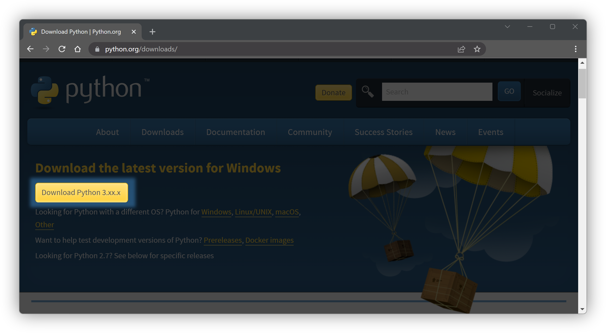

# Building Infrastructure Apps with Resoto

```mdx-code-block
import TabItem from '@theme/TabItem';
import Tabs from '@theme/Tabs';
```

Last time we talked about [building actionable cloud infrastructure metrics](../06-09-building-actionable-cloud-infrastructure-metrics/index.md) and learned how to create metrics, export them into a time series database, and visualize them with Grafana. This time we'll take a look at how to take the next step. Instead of just clicking together a dashboard, limited by the components Grafana provides, we'll write some Python code to build our own infrastructure app.


If you are not familiar with Python, don't worry. We'll keep it simple and under 100 lines of code. In the Prerequisites we'll show you how to install Python and give a brief overview of the few coding techniques that we are going to apply. Looking at the code ahead, the only thing we're going to do is some variable assignment and function calls. If you have ever written even a simple shell or batch script, you will be able to follow along.

<!--truncate-->

If you are familiar with Python and just want the finished product, install the packages from [requirements.txt](#creating-a-requirementstxt-file), jump straight to [the completed app](#the-complete-app) and [run it](#running-the-app).

## Prerequisites

The only things we need are [Python 3.8+](https://www.python.org/), [`pip` the Python package installer](https://pip.pypa.io/), and of course [Resoto](https://www.resoto.com/), as well as a text editor of choice. Personally I use [Visual Studio Code](https://code.visualstudio.com/).

### Installing Python 3.8+ and Pip

The only things we need to get started are Python and Pip, the Python package installer. The Python version must be 3.8 or higher.

<Tabs>
<TabItem value="windows" label="Windows">

<Tabs>
<TabItem value="windows-download" label="Download">

You can download the latest version from [python.org](https://www.python.org/downloads/).



TODO: insert information about path length and PATH

</TabItem>
<TabItem value="windows-chocolatey" label="Chocolatey">

If you have [Chocolatey](https://chocolatey.org/) installed you can install Python with the following command:

```powershell
choco install python
```

</TabItem>

</Tabs>

</TabItem>
<TabItem value="macos" label="macOS">

<Tabs>
<TabItem value="macos-homebrew" label="Homebrew">

If you have [Homebrew](https://brew.sh/) installed you can install Python with the following command:

```sh
$ brew install python
```

Enter this command in the `Terminal` app, which can be found in the `Utilities` folder of the `Applications` folder.


</TabItem>
<TabItem value="macos-download" label="Download">

You can download the latest version from [python.org](https://www.python.org/downloads/).


</TabItem>
</Tabs>

</TabItem>
<TabItem value="linux" label="Linux">

On Linux there is a good chance your distribution already comes with a version of Python 3.x installed. If you are not sure, you can check with the following command:

```bash
$ python3 --version
# highlight-start
​Python 3.10.4
# highlight-end
```

If instead of the version the command returns an error, you can install Python and pip (the Python package installer) using your distribution's package manager.

<Tabs>
<TabItem value="linux-fedora" label="Fedora/CentOS">

```bash
$ sudo dnf install python3 python3-pip
```

</TabItem>
<TabItem value="linux-debian" label="Debian/Ubuntu">

```bash
$ sudo apt update
$ sudo apt install python3 python3-pip
```

</TabItem>
</Tabs>

</TabItem>
</Tabs>

### 4 Minute Python Crash Course

In the next four minutes we'll give you a quick overview of the Python language. If you are already familiar with Python, you can skip this section. Use the code boxes copy button ⧉, to copy the commands to your clipboard.

#### Starting the REPL

Start Python by running the following command:

```bash
$ python3
​Python 3.10.4 (v3.10.4:9d38120e33, Mar 23 2022, 17:29:05) [Clang 13.0.0 (clang-1300.0.29.30)] on darwin
​Type "help", "copyright", "credits" or "license" for more information.
​>>>
```

This is the REPL, the Python Read-Eval-Print-Loop. It is a great way to quickly test out some code. You can type in a command and press enter to execute it. The result will be printed to the screen. If you want to exit the REPL, type `exit()` and press enter.

#### Variables and Functions

_Variables_ are used to store values. They are created by assigning a value to a name. The name can be any combination of letters, numbers, and underscores, but it must start with a letter or underscore.

_Functions_ are used to group code into a single unit. Functions can be called by using the function name followed by a list of arguments in parentheses. In the following code we will assign the value `Monday` to a variable named `today` and then use the `print()` function to print the value of the variable to the screen.

```python
>>> today = "Monday"
>>> print(today)
​Monday
```

##### Types of Variables

There are different types of variables. The most common are _strings_, _integers_, and _floats_. Strings are used to store text. Integers are used to store whole numbers. Floats are used to store decimal numbers. There are also _booleans_, which can be either `True` or `False`, and _lists_ and _dictionaries_ which are used to store multiple values. Dictionaries are similar to lists, but instead of using a number to access a value, you can use a string. Lists are created by using square brackets `[]` and dictionaries are created by using curly brackets `{}`.

Let's quickly go through some examples of each type of variable.

```python
>>> greeting = "Hello there! 👋"
>>> number_of_colleagues = 7
>>> current_temperature = 74.6
>>> window_closed = True
>>> pancake_ingredients = ["flour", "eggs", "milk", "salt", "baking powder"]
>>> capital_cities = {
...   "England": "London",
...   "Germany": "Berlin",
...   "USA": "Washington DC",
...   "Lebanon": "Beirut",
...   "Nepal": "Kathmandu",
...   "Spain": "Madrid"
... }
>>> type(greeting)
<class 'str'>
>>> type(number_of_colleagues)
<class 'int'>
>>> type(current_temperature)
<class 'float'>
>>> type(window_closed)
<class 'bool'>
>>> type(pancake_ingredients)
<class 'list'>
>>> type(capital_cities)
<class 'dict'>
```

##### if Statements

Sometimes we want to take different actions depending on the value of a variable. We can do this with an `if` statement. The following code will print a different message depending on the value of the `window_closed` variable.

```python
>>> if window_closed:
...   print("The window is closed.")
... else:
...   print("The window is open.")
​The window is closed.
```

##### Ways to access and print variables

Lets look at how to access and print the values of variables.

```python
>>> print(current_temperature)
74.6
>>> print(f"The current temperature is {current_temperature}F")
The current temperature is 74.6F
>>> pancake_ingredients[0]
'flour'
>>> pancake_ingredients[3]
'salt'
>>> print(f"The capital city of England is {capital_cities['England']}")
The capital city of England is London
```

### Resoto

If you are new to Resoto, [start the Resoto stack](/docs/getting-started/install-resoto) and [configure it to collect your cloud accounts](/docs/getting-started/configure-cloud-provider-access).

## Getting Started

### Creating a new Python environment

First we will create a new project directory where we store our source code as well as the Python virtual environment (venv). We'll use a Python virtual environment to keep our project isolated from the rest of our system. This is not strictly necessary, but it is a good practice to keep your system clean and avoid conflicts with other projects.

<Tabs>
<TabItem value="venv-macoslinux" label="macOS/Linux">

In your Terminal create a new directory for your project, create a new virtual environment and activate it by running the following commands:

```bash title="Enter this into your Terminal"
$ mkdir ~/resoto-app        # create a new directory named resoto-app inside the home directory
$ cd ~/resoto-app           # change into the new directory
$ python3 -m venv venv      # create a new virtual environment named venv
$ source venv/bin/activate  # activate the virtual environment
```

:::note

The `$` in front of the line must not be entered into the terminal. It just indicates that the following command is to be entered on a user shell without elevated permissions. You can use the code boxes copy button ⧉, to copy the commands to your clipboard.

:::


</TabItem>
<TabItem value="venv-windows" label="Windows">

In your Powershell create a new directory for your project, create a new virtual environment and activate it by running the following commands:

```powershell title="Enter this into Powershell"
md %userprofile%\Documents\resoto-app
cd %userprofile%\Documents\resoto-app
python -m venv venv
source venv\Scripts\activate
```


</TabItem>
</Tabs>

:::info

When you close your Terminal and come back to it later, you will need to activate the virtual environment again. You can do this by switching to the `resoto-app` folder using the `cd` command followed by the `source` command. You do not have to enter the `mkdir/md` and `python` commands again.

:::

### Creating a requirements.txt file

We use the `pip` package manager to install all dependencies for our project. We'll create a `requirements.txt` file to keep track of the list of packages we need.

In your text editor create a new file called `requirements.txt` inside the `resoto-app` directory and add the following lines:

```txt
resotoclient[extras]
resotodata
resotolib
streamlit
pydeck
numpy
```

:::note

In a production project you would want to pin the versions of the packages you are using, by adding the version number behind the package name (e.g. `resotolib==2.4.1`). For this tutorial we'll just use the latest versions.

:::

Here is a quick overview of the packages we are using:

- [`streamlit`](https://streamlit.io/) is the app framework we're using to create our web app.
- [`resotoclient`](https://github.com/someengineering/resotoclient-python) is the Resoto Python client library. It is used to connect to the Resoto API to retrieve infrastructure data as [Pandas dataframes](https://pandas.pydata.org/) and [JSON](https://www.json.org/).
- [`resotodata`](https://github.com/someengineering/resotodata) contains static data like the locations of cloud data centers on a world map.
- [`resotolib`](https://github.com/someengineering/resoto) is a collection of helper functions for Resoto. The one we're interested in converts bytes into human readable units like GiB, TiB, etc.
- [`pydeck`](https://deckgl.readthedocs.io/) a library for making spatial visualizations. We'll use it to display the locations of our cloud resources on a map.
- [`numpy`](https://numpy.org/) is a math library for working with the data Resoto returns.

### Installing the dependencies

Now we can install the dependencies with the following command:

```bash
$ pip install -r requirements.txt
```

## Creating the app

### First steps

Now that we've set up our project, we can start creating our infrastructure app.

In your text editor create a new file called `app.py` inside the `resoto-app` directory and add the following lines:

```python
import streamlit as st
from resotoclient import ResotoClient

resoto = ResotoClient(url="https://localhost:8900", psk="changeme")

st.set_page_config(page_title="Cloud Dashboard", page_icon=":cloud:", layout="wide")
st.title("Cloud Dashboard")

df = resoto.dataframe("is(instance)")
st.dataframe(df)
```

Save the file and switch back to the Terminal.

### Running the app

In the Terminal run Streamlit with the following command:

```bash
$ streamlit run app.py
​
# highlight-start
​  You can now view your Streamlit app in your browser.
​
​  Local URL: http://localhost:8501
​  Network URL: http://xxx.xxx.xxx.xxx:8501
# highlight-end
```

Your browser should open automatically and show something like the following page:


Congratulations, you've just created your first infrastructure app!

#### Line by line details

Let's take a look at what is going on here and what the meaning of each line of code that we just wrote is.

```python
import streamlit as st
from resotoclient import ResotoClient
```

These two lines import the `streamlit` and `resotoclient` libraries into our project. In our first import we use the `as` keyword to give Streamlit a shorter name. This way we can use `st` instead of `streamlit`. In the second line instead of importing all of `resotoclient` we tell Python to only import the `ResotoClient` class.

```python
resoto = ResotoClient(url="https://localhost:8900", psk="changeme")
```

Here we initialize a new instance of the Resoto Client and assign it to the variable `resoto`. We pass the URL of our Resoto Core and the pre-shared-key (PSK) as arguments. The PSK is used to authenticate the client against the Resoto Core.

```python
st.set_page_config(page_title="Cloud Dashboard", page_icon=":cloud:", layout="wide")
st.title("Cloud Dashboard")
```

These two lines tell Streamlit to set the page title and icon. The `page_icon` argument is an emoji that will be displayed in the browser tab. The `layout` argument tells Streamlit to use the full width of the browser window. With `st.title`

```python
df = resoto.dataframe("is(instance)")
st.dataframe(df)
```

Here we ask Resoto to search for everything that is a compute instance and return it as a [Pandas dataframe](https://pandas.pydata.org/docs/reference/api/pandas.DataFrame.html). We then pass the dataframe to Streamlit's `st.dataframe` function to display it as a table in our app. Think of dataframes as an Excel spreadsheet. They are a great way to work with tabular data and popular in the data science and ML community. Resoto stores all of its data in a large [graph](https://en.wikipedia.org/wiki/Directed_acyclic_graph). `resoto.dataframe()` allows us to query the graph and flatten the result into a dataframe that can be directly consumed by Streamlit.

## The complete app

```python
import streamlit as st
import pydeck as pdk
import numpy as np
import pandas as pd
import plotly.express as px
from resotoclient import ResotoClient
from resotolib.utils import iec_size_format
from resotodata.cloud import regions as cloud_regions
from resotoclient import ResotoClient

resoto = ResotoClient(url="https://localhost:8900", psk="changeme")

st.set_page_config(page_title="Cloud Dashboard", page_icon=":cloud:", layout="wide")


st.title("Cloud Dashboard")

col_instances, col_volumes = st.columns(2)

resoto_search = "aggregate(sum(1) as instances_total, sum(instance_cores) as cores_total, sum(instance_memory*1024*1024*1024) as memory_total): is(instance)"
instances_info = list(resoto.search_aggregate(resoto_search))[0]
instances_total = instances_info["instances_total"]
cores_total = instances_info["cores_total"]
memory_total = iec_size_format(instances_info["memory_total"])
col_instances.metric("Instances", instances_total)
col_instances.metric("Cores", cores_total)
col_instances.metric("Memory", memory_total)

resoto_search = "aggregate(sum(1) as volumes_total, sum(volume_size*1024*1024*1024) as volumes_size): is(volume)"
volumes_info = list(resoto.search_aggregate(resoto_search))[0]
volumes_total = volumes_info["volumes_total"]
volumes_size = iec_size_format(volumes_info["volumes_size"])
col_volumes.metric("Volumes", volumes_total)
col_volumes.metric("Size", volumes_size)

col_map, col_storage = st.columns(2)

map_tab, top_tab, age_tab = col_map.tabs(["Locations", "Top 10", "Age"])

resoto_search = "aggregate(/ancestors.cloud.reported.name as cloud, /ancestors.region.reported.name as region: sum(1) as instances_total): is(aws_ec2_instance) or is(gcp_instance)"
df = resoto.dataframe(resoto_search)
df["latitude"], df["longitude"] = 0, 0
for x, y in df.iterrows():
    location = cloud_regions.get(y["cloud"], {}).get(y["region"], {})
    df.at[x, "latitude"] = location.get("latitude", 0)
    df.at[x, "longitude"] = location.get("longitude", 0)
midpoint = (np.average(df["latitude"]), np.average(df["longitude"]))
map_tab.pydeck_chart(
    pdk.Deck(
        map_style=None,
        initial_view_state=pdk.ViewState(
            latitude=midpoint[0], longitude=midpoint[1], zoom=2, pitch=50
        ),
        tooltip={
            "html": "<b>{instances_total}</b> instances running in {region} ({cloud})",
            "style": {
                "background": "grey",
                "color": "white",
                "font-family": '"Helvetica Neue", Arial',
                "z-index": "10000",
            },
        },
        layers=[
            pdk.Layer(
                "ColumnLayer",
                data=df,
                get_position=["longitude", "latitude"],
                get_elevation="instances_total",
                get_fill_color="cloud == 'aws' ? [217, 184, 255, 150] : [255, 231, 151, 150]",
                elevation_scale=10000,
                radius=100000,
                pickable=True,
                auto_highlight=True,
            )
        ],
    )
)

top_tab.header("Top 10 accounts and regions")
resoto_search = "aggregate(/ancestors.cloud.reported.name as cloud, /ancestors.account.reported.name as account, /ancestors.region.reported.id as region: sum(/ancestors.instance_type.reported.ondemand_cost) as ondemand_cost): is(instance)"
df = (
    resoto.dataframe(resoto_search)
    .nlargest(n=10, columns=["ondemand_cost"])
    .sort_values(by=["ondemand_cost"], ascending=False)
    .reset_index(drop=True)
)

top_tab.table(df.style.format({"ondemand_cost": "${:.2f}/h"}))

resoto_search = "aggregate(/ancestors.cloud.reported.name as cloud, /ancestors.account.reported.name as account: sum(volume_size*1024*1024*1024) as volume_size): is(volume)"
df = resoto.dataframe(resoto_search)
df["volume_size_human"] = df["volume_size"].apply(iec_size_format)
fig = px.sunburst(
    df,
    path=["cloud", "account"],
    values="volume_size",
    hover_data=["cloud", "account", "volume_size_human"],
)
fig.update_traces(hoverinfo="label+percent entry", textinfo="label+percent entry")
col_storage.plotly_chart(fig)

st.header("Instance Types")
resoto_search = "aggregate(/ancestors.cloud.reported.name as cloud, /ancestors.account.reported.name as account_name, instance_type as instance_type, instance_cores as instance_cores: sum(1) as instances): is(instance)"
df = resoto.dataframe(resoto_search).sort_values(by=["instance_cores"])
fig = px.density_heatmap(
    df,
    x="instance_type",
    y="account_name",
    z="instances",
    color_continuous_scale="purples",
)
st.plotly_chart(fig, use_container_width=True)

resoto_search = "is(instance)"
df = resoto.dataframe(resoto_search)
df["age_days"] = (pd.Timestamp.utcnow() - df["ctime"]).dt.days
fig = px.histogram(
    df,
    x="age_days",
    nbins=50,
    title="Instance Age Distribution",
    labels={"age_days": "age in days"},
    color="account_name",
)
age_tab.plotly_chart(fig, use_container_width=True)
```
