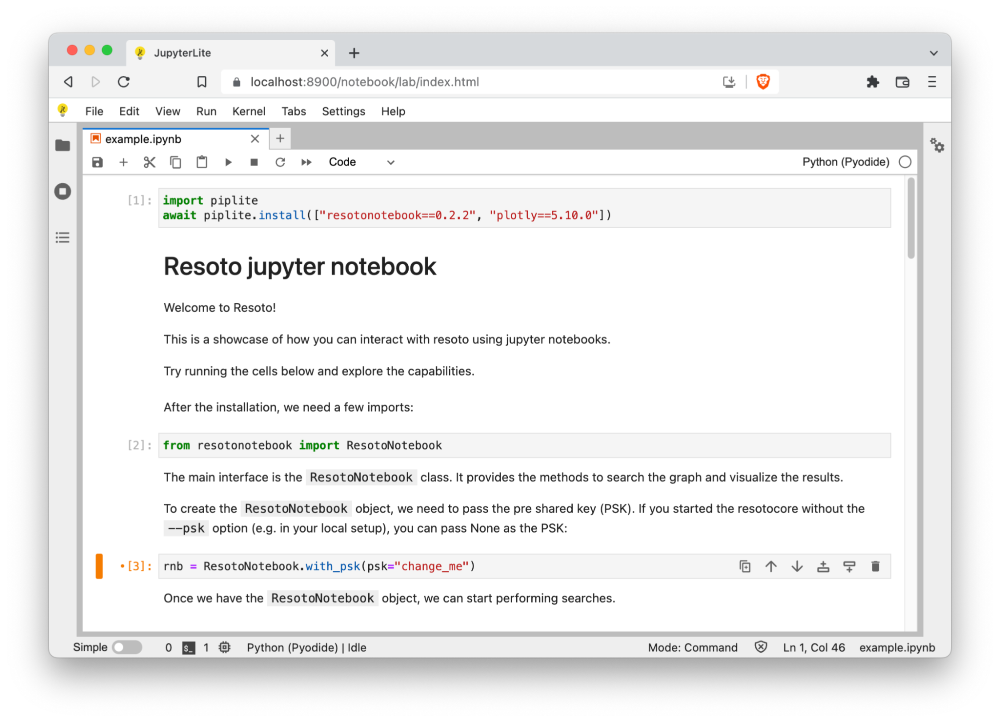
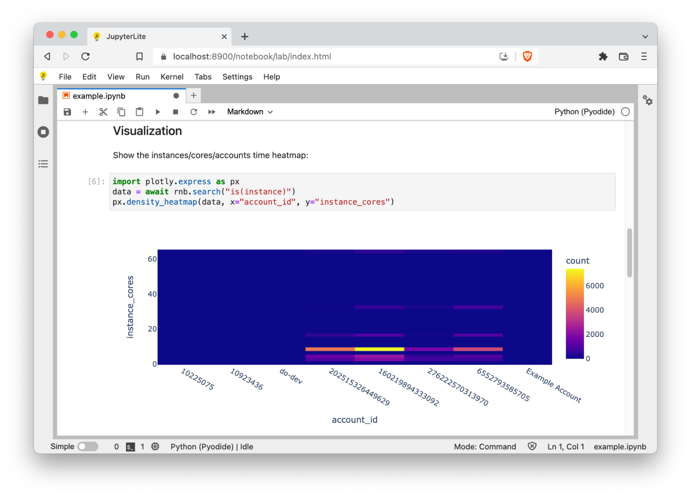
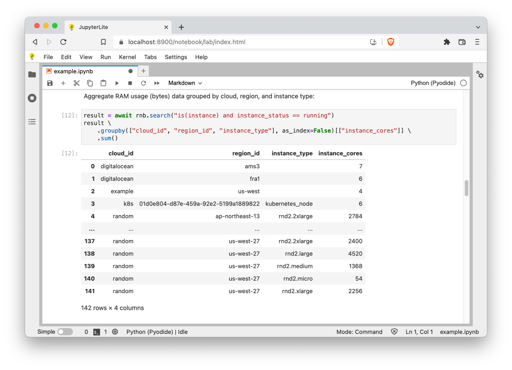
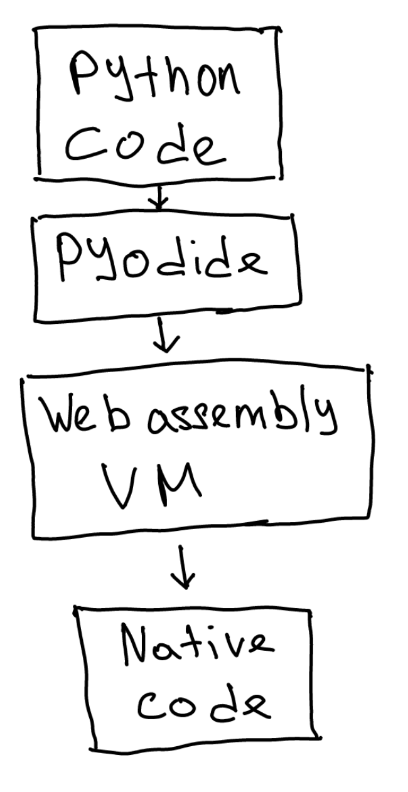

# Resoto + JupyterLite = ❤️

Hello folks! A couple of months ago we released [resotonotebook](https://resoto.com/blog/2022/05/31/resoto-meets-jupyter-notebook), a library that makes it easy to query, visualize and analyze Resoto data using Pandas, Plotly and Jupyter notebooks. Today, we’ll discuss JupyterLite support, a new Resoto feature which allows you to use notebooks in the browser without installing and launching a Jupyter server.

There are a few reasons why you might be interested in this feature. You might be wondering, how can you analyze the raw infrastructure data when only the platform engineers can access cloud consoles? How to count the infrastructure assets without a data scientist at hand? Our goal is to make it easy by giving you the most popular data analysis tools bundled with an example notebook which requires zero installation steps from your side.

JupyterLite is a JupyterLab distribution that runs entirely in a web browser. You can access JupyterLite by opening the `https://<resotocore url>/notebook` link in your browser, and it is ready to use!



The pure browser-based jupyterlab is a bit different from the desktop version: it is not possible to use pip directly. Instead, there is a package called piplite which can install pip wheels in a similar fashion. If the package to be installed is written in pure python, it will work out of the box.

Since JupyterLite works (almost) the same as a regular Jupyter Notebook, there are many cool things we can do with it. Let’s dive in:

### Heatmaps

JupyterLite includes the [Plotly Python library](https://plotly.com/python), which is capable of visualizing data in a variety of ways. [Heatmaps](https://plotly.com/python/2D-Histogram) are one of the supported visualization methods. Heatmaps make it easy to spot outliers—imagine, for example, someone was experimenting with an expensive cluster and forgot to shut it down.



### Aggregation

As mentioned previously, [Resoto Notebook](/docs/reference/notebook) allows you to harness the power of [pandas](https://pandas.pydata.org), a popular [Python](https://python.org) package for data analysis. The [pandas](https://pandas.pydata.org) [`DataFrame` structure](https://pandas.pydata.org/pandas-docs/stable/reference/api/pandas.DataFrame.html) is a table-like object that allows for easy querying, filtering, and aggregation of data.

Let's try aggregating the number of cores in running instances per cloud, per region:



Of course it does not end with the two use cases mentioned above. Since it is possible to execute arbitrary python code in a notebook, your capabilities for data analysis are endless.

Once you’re finished working with the notebook, it will be saved in your browser local storage.

## How can you use the new notebooks

Jupyterlite notebooks are a part of our 3.0 release. All you have to do is to get the latest version of Resoto, open your browser, and go to the https://resotocore-url/notebook. That’s the best part about it: no need to install extra packages or run a Jupyter server.

## How it works under the hood (the technical bits)

Let’s dive into a more technical area and take a look at how this feature works inside. There are two main components: Pyodide and JupyterLite. JupyterLite is a distribution of JupyterLab that runs in a browser, and Pyodide is a CPython running in a WASM runtime.

### JupyterLite

We integrated JupyterLite with Resoto by including its static assets generation into our build pipeline.

During the asset generation process, JupyterLite creates a distribution for three components: JupyterLab, “classic” jupyter and an interactive repl. The latter two components were not the main target for us, and we excluded them from the pipeline to reduce the artifact size. Additionally, we disabled the sourcemaps generation, and all these measures allowed us to cut the size of the resulting distribution from 30 megabytes down to 9.7 megabytes. It can be all configured via the launch flags when the jupyter lite build command is called.

One convenient hack we found is to define the launch flags in the configuration file called jupyter_lite_config.json:

```
{
    "LiteBuildConfig": {
        "lite_dir": "jupyterlite_extras",
        "output_dir": "resotocore/jupyterlite",
        "no_sourcemaps": true,
        "apps": [
            "lab"
        ]
    }
}
```

We also used a custom Pyodide version, which we defined in the jupyter-lite.json config file.

### Pyodide

Pyodide is a port of CPython to webassembly. That allows you to easily run pure python code in the browser.

In the hierarchy of abstraction layers, Pyodide sits in between your code and the browser, and allows the execution of python source code.



This, however, comes with some limitations when we want to run a python package which spawns subprocesses or opens sockets to make network calls. There is simply no such thing in the browser environment!

That posed a problem for us: we rely on a resotonotebook package which uses the requests library, and this library is opening sockets and making network calls. Not good for us!

To overcome these limitations, we needed to provide a browser-friendly implementation of the http infrastructure.

Fortunately for us, Pyodide provides a python proxy for javascript APIs, which allows us to access the browser APIs using python!

Let’s look at the resotonotebook for some examples:

```
import js
import pyodide

path = f"/graph/{graph}/search/list"
url = js.URL.new(path, js.location.origin)
options = {"method": "POST"}
options = pyodide.ffi.to_js(options, dict_converter=js.Object.fromEntries)
response = await js.fetch(url, options)
```

Here we made a post request using the fetch API, all in python. The JavaScript APIs are available in the js package. When we want to provide Python data structures to the JS functions, Pyodide can do the type conversion implicitly, and it works in most cases. However, to transform a dictionary to a JS object we need to use a `ffi.to_js` pyodide call, otherwise the implicit conversion will produce a JS Map.

To get the JS types back to the python world, we can use the `to_py` method. Here is an example:

```
json = await response.json()
return json.to_py()
```

The async/await syntax is seamlessly interoperable in both python and js thanks to pyodide, which makes it easy to call into the JS ecosystem. Additionally, jupyterlite has its own eventloop, and that makes it fairly simple to await on asynchronous calls inside the notebooks.

## Closing words

It is quite exciting to see that the current state of the web allows us to bring powerful tools directly into the browser. We hope that you will find browser-based notebooks a useful tool for exploring your cloud assets and getting insights.
