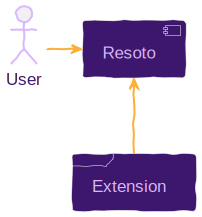

# Resoto - At your command

An installation of Resoto comes with batteries included: a command-line interface (CLI) with [powerful commands](/docs/reference/cli) that allows for exploration, insights, and manipulation of your infrastructure. With those tools at hand, automating tedious tasks becomes a breeze. Think about enforcing a policy, cleaning up resources, exporting data, or alerting on specific circumstances. See our [How-To](/docs/how-to-guides) section to learn more about possible use cases.


Version 3 of Resoto introduces the ability to extend this capability by defining your commands programmatically in the programming language of your choice.

<!--truncate-->

If you are confident using Python, this task becomes super easy, since all the necessary boilerplate code is already provided as part of Resoto. In this blog post, we will implement a new command called `hello-world` in Python, to show the power and flexibility of this new feature. The simple idea of our new command is adding a greeting to the tags of a selected resource.

## Architectural overview

Resoto has a WebSocket endpoint to [attach to the work queue](https://resoto.com/docs/reference/api/web-socket-attach-to-the-working-queue). Multiple workers can register for tasks that are then distributed to the workers. Part of the registration process is a complete definition of the task the worker is able to handle. This definition is used inside Resoto to create a CLI command for this task. When the user executes the command on a given resource, the resource data with a task description is added to the work queue and the worker is notified. The worker can now do whatever it is supposed to do with the provided resource data.



A private shared key secures the communication between Resoto and the extension. The permission to handle the resource needs to be implemented in the extension.

## Usage

To demonstrate the power of this feature, we will implement a simple command that adds a greeting to the tags of a resource. We call it `hello-world` because it is a simple command that might be a good starting point for your commands. The idea is to allow the user to select resources via the built-in `search` command and then execute the `hello-world` command on the selected resources.

```shell title="Our hello-world command in action"
> search is(kubernetes_pod) and name~resoto | hello-world
```

All resources that got selected by the search command will be passed to the `hello-world` command. Resoto will send a task for every single resource that was selected. All workers registered for the `hello-world` task will receive messages and perform the work. A task can succeed or fail - the result is returned to Resoto and propagated to the user.

## Implementation

For the sake of simplicity, we will use Python as the programming language for the extension. Resoto has facilities for finding, introspecting, activating, and using installed Python extensions using [setuptools](https://setuptools.pypa.io/en/latest/pkg_resources.html). See [available Resoto plugins](https://github.com/someengineering/resoto/tree/main/plugins) for reference.

A simple decorator can expose methods inside a plugin. This decorator collects all the required information about the command and makes it available to Resoto. When a user executes the command, Resoto will send a message to all registered workers, and the runtime will invoke the registered method.

Please note: it is also possible to use your programming language of choice to implement the extension. In this case, you need to implement the communication between Resoto and the extension yourself.

To implement the `hello-world` command, we need to define a plugin class and define our method within:

```python showLineNumbers
class MyExtensionsHolder(BasePlugin):

  @execute_command_on_resource(
      name="hello-world",
      info="Add a greeting to the tags of a resource.",
      description="Long description of the command.",
      args_description={},
      expect_node_result=True,
  )
  def hello_world(self,
       config: Config,
       resource: BaseResource,
       args: List[str]
  ) -> BaseResource:

    if resource.update_tag("greeting", "Hello World"):
       resource.tags["greeting"] = "Hello World"
    return resource
```

Let's quickly go through the code step by step:

- Line 1: To make the plugin available to Resoto, we need to define a class that inherits from `BasePlugin`.
- Line 3-8: The decorator tells Resoto how this method is exposed to the user. The name of the command, as well as a description and information about the arguments, can be defined. Please note: inside Resotoshell, you can get online help via `help hello-world`.
- Line 8: The function can decide to update the given resource in place. We want to see the change in the resource directly reflected in Resoto. For that reason we turn this flag on, update the resource in place, and return it.
- Line 10: This signature of the method is expected by Resoto. The function's name can be anything and is not exposed to the user.
- Line 11: This method receives the current configuration of the worker.
- Line 12: Defines the resource that was selected by the user. This is a single resource. If multiple resources are selected, this method will be invoked multiple times. The type of resource is a specific resource class as defined by the particular collector. All Resources share the same common base class `BaseResource`.
- Line 13: The arguments that were passed to the command. In this case, we don't expect any arguments.
- Line 14: We defined `expect_node_result` to be `True`, which requires that the method returns the updated `BaseResource`. It would also be possible to set this to `False` and return `None` or any other value, which is then propagated to the user as a result.
- Line 16-18: We are using the generic `update_tag` method to update a tag of the resource, which is an abstract method in `BaseResource`. The method returns `True` if the tag was added or updated. In this case, we also update the copy and return it to Resoto. Please note: Resoto makes sure this method is implemented for every resource type for every cloud provider.

Once the plugin is loaded, and the worker starts, the command is registered and available to the user. We can check this by executing the `help` command:

```shell
> help
# highlight-start
​
​# Custom Commands
​hello-world - Add a greeting to the tags of a resource.
​
​... other commands removed ...
# highlight-end
```

We can get more information about the command by executing `help hello-world`:

```shell
> help hello-world
# highlight-start
​hello-world: Add a greeting to the tags of a resource.
​
​hello-world
​
​Long description of the command.
# highlight-end
```

We should have paid more attention to documenting the behavior of our command. The help description is not helpful as such. Custom commands allow defining the description using Markdown syntax while describing every argument in detail. You can see a complete example of a custom command in the [Resoto GitHub Repository](https://github.com/someengineering/resoto/blob/main/plugins/aws/resoto_plugin_aws/__init__.py#L156).

## Experimenting with the new command

The Unix idea of small tools that do one thing well is excellent. We can combine the `search` command with the `hello-world` command to add a greeting to all resources that match a particular criterion.

```shell
> search is(instance) and age<1h | hello-world
# highlight-start
​kind=aws_ec2_instance, id=i07b, name=ekt, instance_status=running, age=34min, cloud=aws, account=someengineering, region=eu-central-1
# highlight-end
```

This command line will search for compute instances that are younger than one hour and add a greeting to the tags of matching resources. The `hello-world` command returns the updated resource, making it possible to process the result further. For example, we can select the tags property of the resource using the `jq` command. The result would be a list of all tags for every resource that was updated. We can see our greeting tag in the list and other existing tags.

```shell
> search is(instance) and age<1h | hello-world | jq .tags
# highlight-start
​costCenter: bus
​owner: Maricel
​greeting: Hello World
# highlight-end
```

It is possible to pass arguments to the `hello-world` command. The arguments passed to the command will be available in the `args` parameter of the method. In our simple implementation, we are currently ignoring the arguments - but it would be possible to parameterize our function and make it even more helpful. Consider having a greeting parameter where we can define the greeting that is added to the tags of the resource. I am leaving out the implementation details since it is super trivial to do.

```shell
> search is(aws_ec2_instance) and age<1h | hello-world --greet "Hi there" | jq .tags
# highlight-start
​costCenter: bus
​owner: Maricel
​greeting: Hi there
# highlight-end
```

Another option that Resoto provides is parameter expansion. The value of a command parameter does not have to be static but could come from the resource's data to process. Let's assume every resource has an `owner` tag. We could define a greeting specific to the resources owner:

```shell
> search is(aws_ec2_instance) and age<1h | hello-world --greet "Hi {tags.owner}" | jq .tags
# highlight-start
​costCenter: bus
​owner: Maricel
​greeting: Hi Maricel
# highlight-end
```

The placeholder does not need to come from the tags but could come from any resource property. See [format](/docs/reference/cli/format-commands/format) for a more detailed description of placeholder value handling. A short summary: a property path inside curly braces will be replaced by the value of the property of the incoming resource. The string `Hi {tags.owner}` will be replaced by `Hi Maricel` if the resource has a tag `owner` with the value `Maricel`. This can be quite powerful and allows you to create expressive commands to process resources flexibly.

## The `aws` command line tool

AWS provides a command line tool that allows interaction with every possible AWS resource. We thought it would be great to have the same power inside Resoto and decided to provide a custom command called `aws` with almost the same interface as the official AWS CLI tool. It allows selecting resources via `search` and piping them into the `aws` command line tool to get specific information or manipulate resources. You can find the implementation of the `aws` command in the [Resoto GitHub Repository](https://github.com/someengineering/resoto/blob/main/plugins/aws/resoto_plugin_aws/__init__.py#L156).

If you have set up your [AWS collector](/docs/getting-started/configure-cloud-provider-access/aws) you can use the `aws` command to see the configured identity using [`get-caller-identity`](https://docs.aws.amazon.com/cli/latest/reference/sts/get-caller-identity.html):

```shell
> aws sts get-caller-identity
# highlight-start
​UserId: AIDA42373XXXXXXXXXXXX
​Account: '882311111111'
​Arn: arn:aws:iam::882311111111:user/matthias
# highlight-end
```

Let's do something more interesting with our `aws` command. We assume that some development accounts with many ec2 instances are idle during the weekend. We want to automatically stop all running ec2 instances in our dev accounts on Friday EOB and start them again on Monday morning.

The command to stop running instances would look like this using the [`stop-instances`](https://docs.aws.amazon.com/cli/latest/reference/ec2/stop-instances.html) command:

```shell
> search is(aws_ec2_instance) and
         instance_status=running and
         /ancestors.account.reported.name~dev |
  aws ec2 stop-instances --instance-ids {id}
```

We select all running ec2 instances in all accounts that have `dev` in their name. The selected instances are piped into the `aws` command, which will execute the `stop-instances` command with the `instance-ids` parameter set to the resource's id. Based on the resource, Resoto will pick the correct credentials and region to execute the command. This is also why we will only pass one id per call, while the `stop-instances` call theoretically allows defining multiple instance ids.

To start all stopped instances again, we can use the [`start-instances`](https://docs.aws.amazon.com/cli/latest/reference/ec2/start-instances.html) command:

```shell
> search is(aws_ec2_instance) and
         instance_status=stopped and
         /ancestors.account.reported.name~dev |
  aws ec2 start-instances --instance-ids {id}
```

To automate the two actions we can create jobs with a cron trigger, that are executed by Resoto automatically. We will schedule one job to run on Friday EOB and the other on Monday morning.

```shell
> jobs add --id tgif --schedule "0 22 * * 5" 'search ... | aws ec2 stop-instances ...'
# highlight-start
​Job tgif added.
# highlight-end
> jobs add --id hello_monday --schedule "0 8 * * 1" 'search ... | aws ec2 start-instances ...'
# highlight-start
​Job hello_monday added.
# highlight-end
```

## Conclusion

Ideally, Resoto already brings all the power you need to manage your cloud infrastructure. In case you find yourself in a situation, where you need to do something that is not possible with the built-in commands, you can always extend Resoto and write your own custom command. The nature of the Resoto shell command line approach using pipes and filters allows for simple extensions that can be combined to solve the most complex problems.  
As we have seen in this article, it is straightforward to write a custom command and extend Resoto to fit your needs.
