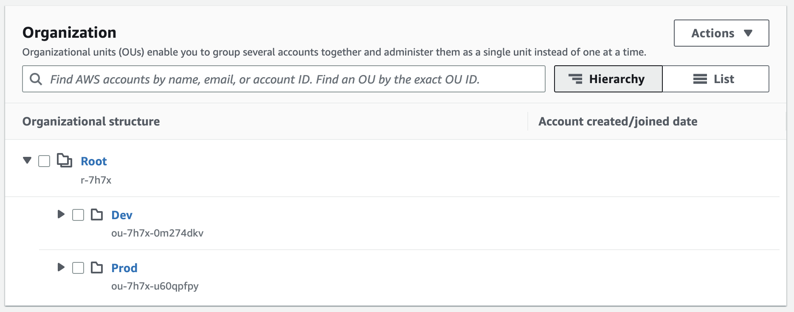
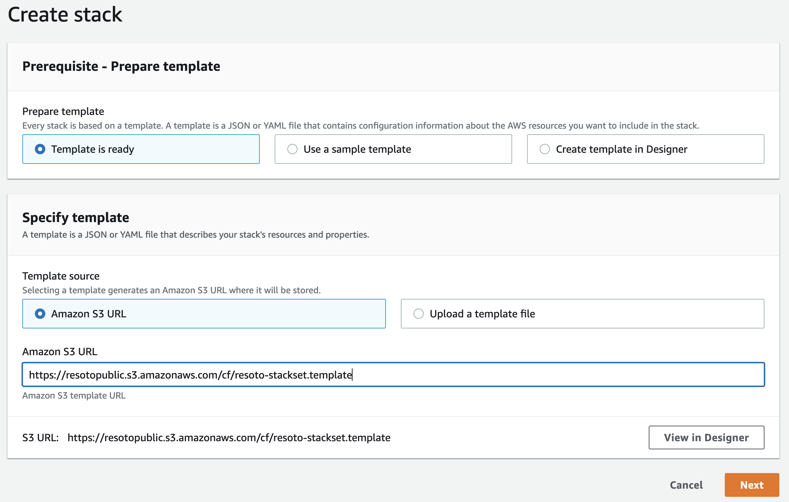
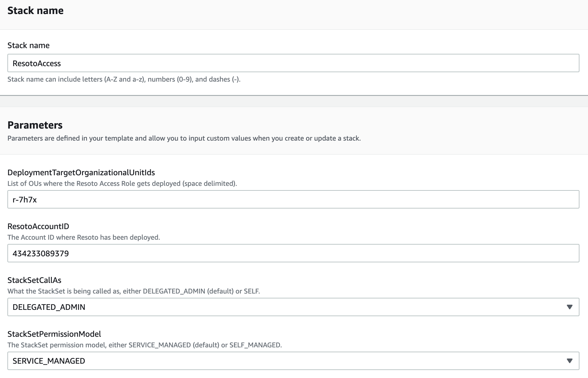
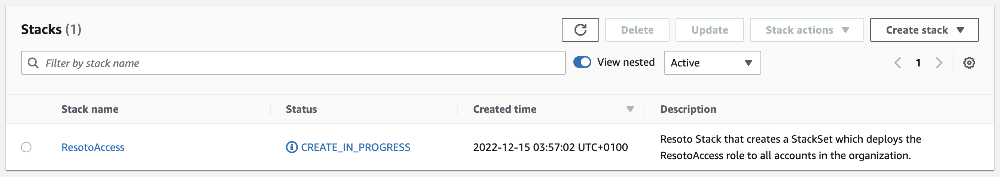
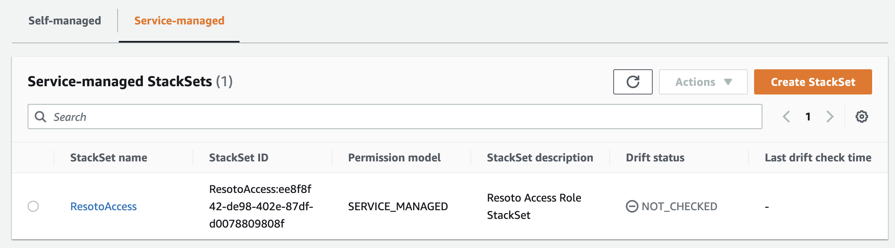
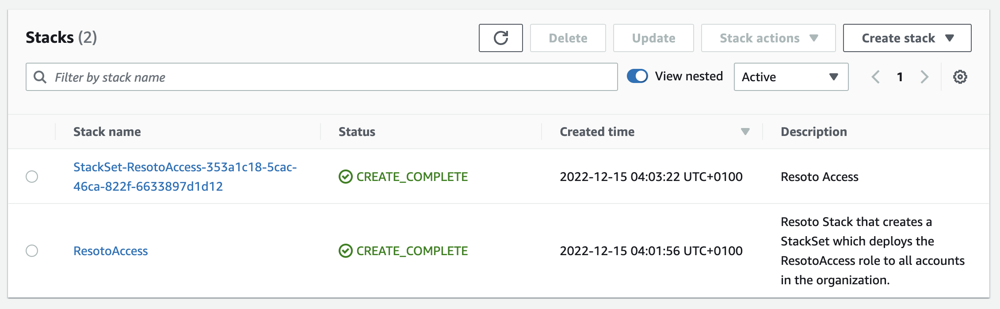
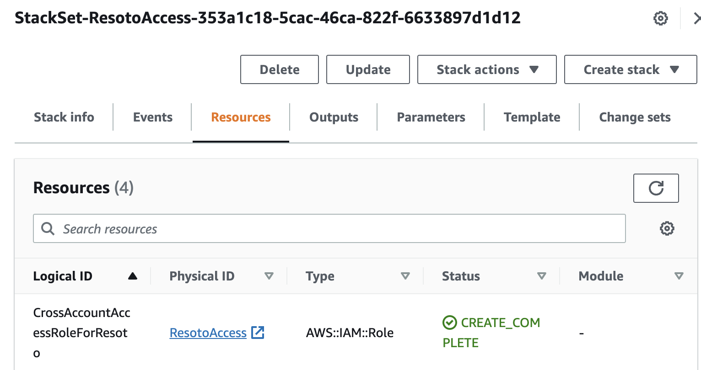
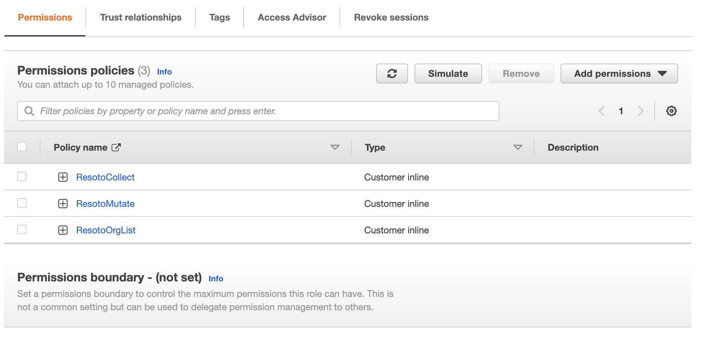
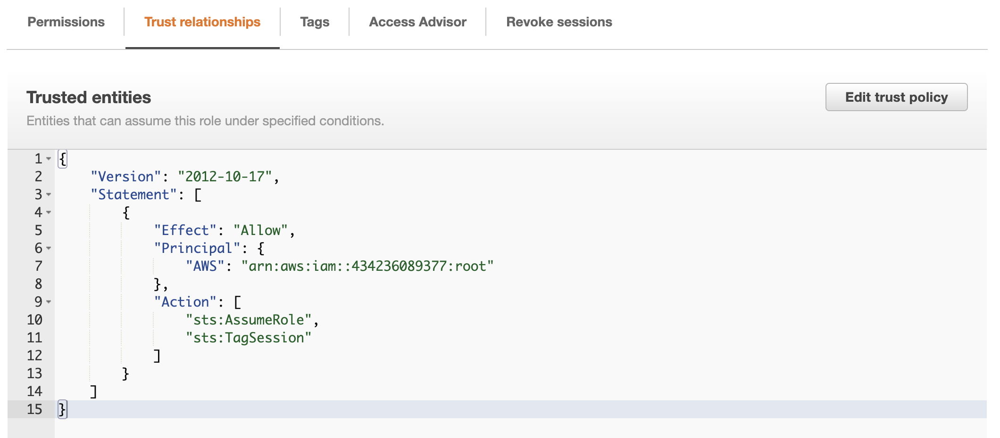
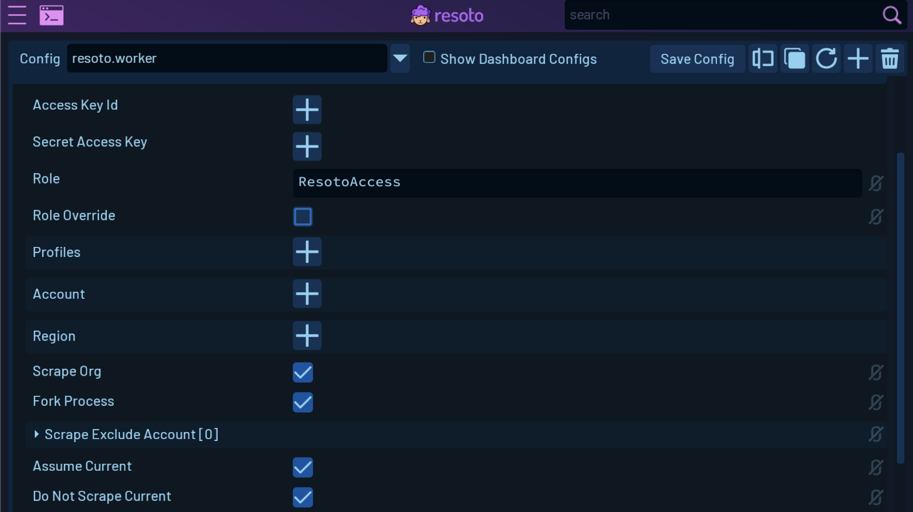

# Resoto AWS Permissions Rollout

Each version of Resoto programmatically generates the specific IAM permissions it requires to collect and optionally to manipulate AWS resources. Manually maintaining these permissions is a tedious task, especially when you have multiple AWS accounts. This is why we have created a Cloudformation Stack that automatically creates the `ResotoAccess` role with the correct permissions and creates a trust that allows a specified AWS account to assume this role.

This stack can be deployed in a single account or organization-wide as a Cloudformation StackSet.

The source code for these stacks can be found in the [resoto-cf](https://github.com/someengineering/resoto-cf) Github repository.

<!--truncate-->

The latest versions of the stacks are hosted in the following S3 locations:

- [https://resotopublic.s3.amazonaws.com/cf/resoto-role.template](https://resotopublic.s3.amazonaws.com/cf/resoto-role.template) - This stack creates the ResotoAccess role and its permissions.
- [https://resotopublic.s3.amazonaws.com/cf/resoto-stackset.template](https://resotopublic.s3.amazonaws.com/cf/resoto-stackset.template) - This stack creates a StackSet that deploys the `ResotoAccess` role to all accounts in your organization.

Using these stacks, you can easily manage the permissions required by Resoto, saving time and making it easier to maintain your AWS environment. Give them a try and see how they can help you with your AWS permissions management.

## Deploying the StackSet

The StackSet is the easiest way to deploy the `ResotoAccess` role to all accounts in your organization. It is also the recommended way to deploy the role to multiple accounts.

This post assumes that your organization is already set up with an AWS Organization and that it meets all [the prerequisites required to use StackSets in your organization](https://docs.aws.amazon.com/AWSCloudFormation/latest/UserGuide/stacksets-prereqs.html).

### Deploying the StackSet from the AWS Console

#### Finding the Organization Unit (OU)

Find out the Organization Unit (OU) in your organization where you want to deploy the `ResotoAccess` role. The role will be deployed to all accounts in this OU and all child OUs.

Navigate to the Organization Home in the [AWS Organizations Console](https://console.aws.amazon.com/organizations/v2/home/accounts) and find the OU where you want to deploy the role.



The OU is that cryptic string underneat the name of the OU. In our example we want to deploy the role to all accounts in the organization, so we will use the Root OU. Which in this case is `r-7h7x`.

#### Deploying the StackSet

If you are not already in the correct account, log into the account where you want to deploy the StackSet. This account will be the account that manages the StackSet and the role that is deployed to all accounts in the organization unit.

Navigate to the [Cloudformation Console](https://console.aws.amazon.com/cloudformation/home) and click on `Create Stack`. Leave all the default settings, enter the before mentioned S3 URL `https://resotopublic.s3.amazonaws.com/cf/resoto-stackset.template` in the `Amazon S3 URL` field and click `Next`.



On the next page, enter a Stack Name like `ResotoAccess`. In the Parameters section there are four parameters of which you need to fill out the first two. Numbers 3 and 4 are optional depending on your organization setup.

1. DeploymentTargetOrganizationalUnitIds - This is the OU (or multiple OUs separated with a space) where you want to deploy the role. In our example we want to deploy the role to all accounts in the organization, so we will use the Root OU. Which in this case is `r-7h7x`.
2. ResotoAccountID - This is the account ID of the account where you have Resoto deployed. This account will be the one the Role has a trust relationship with.
3. StackSetCallAs - Defaults to DELEGATED_ADMIN but can be changed to SELF depending on the permissions you have in your organization and whether the account you are deploying the StackSet in is registered as a delegated administrator for your organization (recommended).
4. StackSetPermissionModel - defaults to SERVICE_MANAGED but can be changed to SELF_MANAGED if you want to manage the StackSet permissions yourself. We prefer SERVICE_MANAGED as it allows us to turn on automatic deployments to accounts that we add to our organization in the future.



Click `Next` on this as well as the next page and then click `Create Stack`.

The stack will take a few minutes to deploy.



If we switch over to the left hand side menu and click on `StackSets` and then, depending on which option you chose, on the Service-managed tab, we can see that the StackSet is being created.



After a few minutes the Stack and StackSet will be created and we can see that it is deploying to all accounts in our organization. When we check back to the Stacks in us-east-1 we should now see a new stack that was created by the StackSet. This is the stack based on the `resoto-role.template` mentioned above which created the `ResotoAccess` role.



If we click it and check out its resources we should see the ResotoAccess IAM role.



Selecting the Role you can see that it has the correct permissions and a trust relationship with the account where Resoto is deployed.

 

### Deploying the StackSet from the AWS CLI

Perform the steps from above to find your Organization Unit (OU) and the account ID of the account where you have Resoto deployed.

```bash
AWS_OU="r-7h7x"  # Replace with your OU
RESOTO_ACCOUNT_ID="434236089377"  # Replace with your Resoto account ID
aws cloudformation create-stack \
  --region us-east-1 \
  --stack-name ResotoAccess \
  --template-url https://resotopublic.s3.amazonaws.com/cf/resoto-stackset.template \
  --parameters ParameterKey=DeploymentTargetOrganizationalUnitIds,ParameterValue="$AWS_OU" ParameterKey=ResotoAccountID,ParameterValue=$RESOTO_ACCOUNT_ID
```

The region can be changed to any region you like, but since [IAM is a global service running in us-east-1](https://docs.aws.amazon.com/IAM/latest/UserGuide/reference_policies_condition-keys.html#condition-keys-requestedregion) I like to create my IAM related stacks there as well.

## Configuring Resoto to assume the `ResotoAccess` role and scrape the entire organization

### Using Resoto Shell

In Resoto Shell execute `config edit resoto.worker` and look for the `aws` section. There configure the following:

```yaml
aws:
  role: 'ResotoAccess'
  scrape_org: true
  assume_current: true
  do_not_scrape_current: true
```

The last two options depend on your organization setup. They control whether Resoto should assume the role inside the account it is running in or just collect that account with the permissions it already has. For instance if you deploy Resoto using Kubernetes and it is using a service account that is already using the ResotoAccess role, there would be no need to assume the same role again.

### Using Resoto UI

The same settings can be made in the Resoto UI. Open the `resoto.worker` config and look for the Aws section. Enter the `Role` name and check the `Scrape Org` checkbox. Optionally check the `Assume Current` and `Do Not Scrape Current` checkboxes depending on your organization setup.



Don't forget to save the config.

## Conclusion

We hope that this post has shown you how easy it is to deploy the `ResotoAccess` role to all accounts in your organization. This will save you a lot of time and effort when it comes to managing the permissions required by Resoto.
