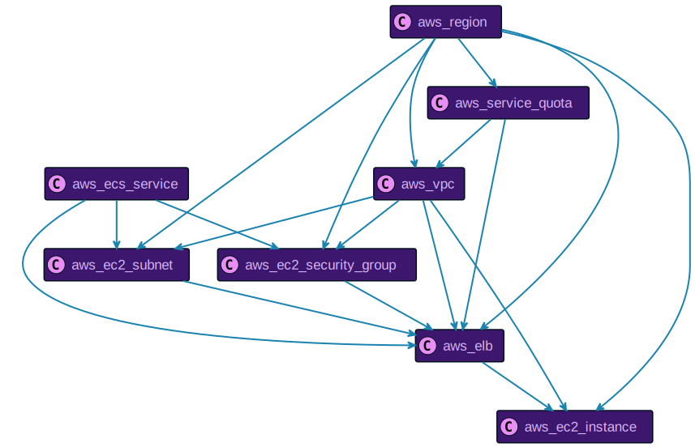
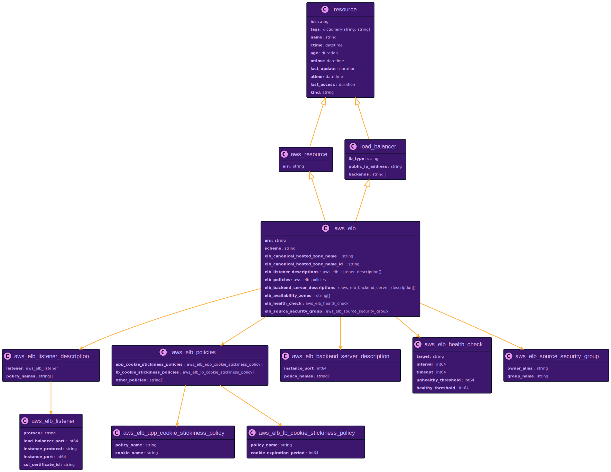
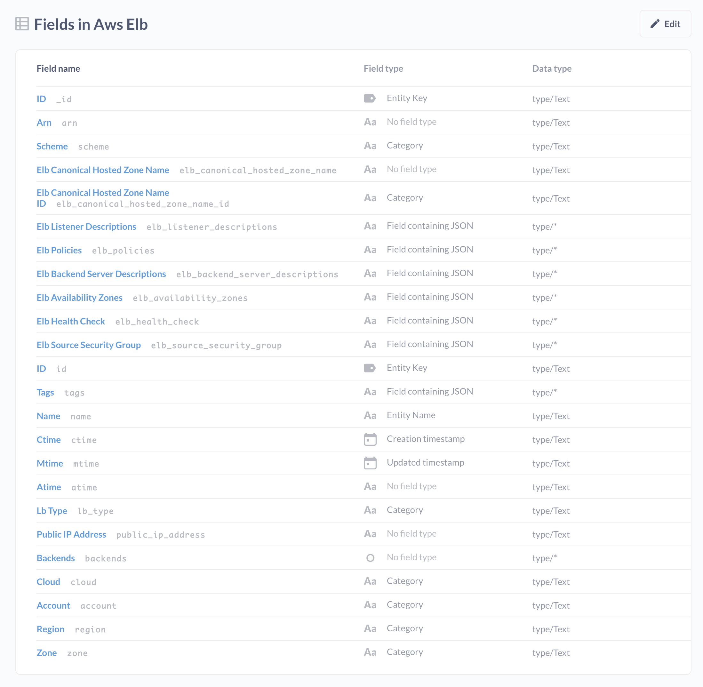
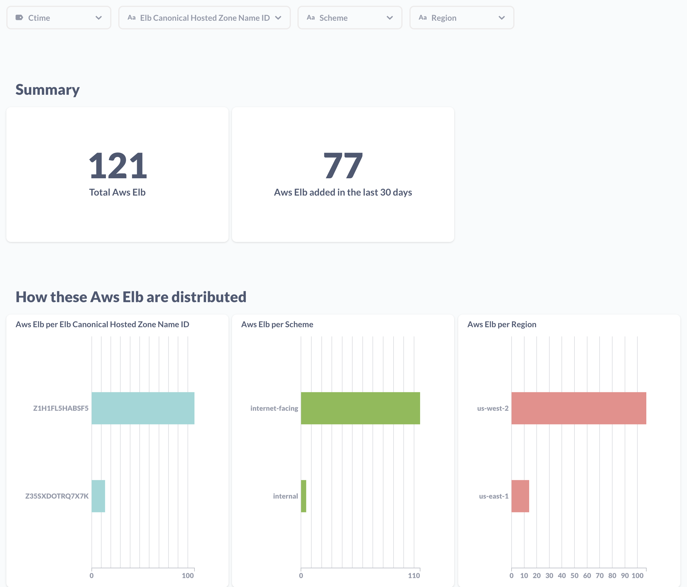

# From cloud2sql

```mdx-code-block
import ZoomPanPinch from '@site/src/components/ZoomPanPinch';
```


One of the key features of Resoto is its ability to collect data from a wide range of cloud providers, including Amazon Web Services (AWS), DigitalOcean, and Google Cloud Platform (GCP). This makes it easy to get a comprehensive view of your cloud infrastructure, no matter where it is deployed.

But what sets Resoto apart from other cloud data collection tools is its ability to enrich the data it collects and make additional connections. This means that Resoto not only gathers raw data about your cloud resources, but also adds additional context and information that can help you better understand your cloud environment.

<!--truncate-->

For example, when collecting data about Elastic Block Store (EBS) volumes in AWS, Resoto uses Amazon CloudWatch time series data to find out when a volume had its last read and write IO. This information is then used to enrich the raw volume data with "last_access" and "last_update" timestamp properties, which makes it easy to answer when a particular EBS volume was last used, not just that it is not in use right now.

Resoto also makes additional connections, for instance between your K8S clusters and the underlying cloud provider systems. So you can easily see how your Kubernetes pods are related to the virtual machines that they are running on, and how those virtual machines are related to the storage volumes that they are using. This can provide valuable insights into the structure and organization of your cloud environment, and can help you make better decisions about how to manage and optimize it.

The data collected by Resoto is complex and deeply nested, with many levels of dependencies between different cloud resources. To manage this complexity, Resoto uses a graph data model where each cloud resource is represented by a node in the graph with edges connecting dependent nodes.

Let us take a closer look at all the dependencies of an AWS Elastic Load Balancer (ELB) named `aws_elb` in the model:



To represent an individual node, Resoto uses a unified data model with strict typing and support for inheritance. In practice this has the advantage that you can either ask for e.g. all of your infrastructure's load balancers, or you can ask for AWS ELBs specifically. Speaking of which, here is the model for an ELB.

<ZoomPanPinch>



</ZoomPanPinch>

As you can see, every `aws_elb` inherits `load_balancer` which in turn inherits from `resource`. Every `aws_elb` also contain additional data like `aws_elb_policies` which in turn contain an `aws_elb_app_cookie_stickiness_policy` and `aws_elb_lb_cookie_stickiness_policy`, and so on.

An example for an individual `aws_elb` would look like this:

```json
{
  "id": "hgoa3433hOo7j6pEUDmozE",
  "type": "node",
  "revision": "_fH7wa0K--I",
  "reported": {
    "kind": "aws_elb",
    "id": "blogtest-apiserver-526928195.us-west-2.elb.amazonaws.com",
    "name": "blogtest-apiserver",
    "ctime": "2022-11-22T09:14:30Z",
    "tags": {
      "owner": "lukas",
      "sigs.k8s.io/cluster-api-provider-aws/role": "apiserver",
      "sigs.k8s.io/cluster-api-provider-aws/cluster/blogtest": "owned",
      "Name": "blogtest-apiserver"
    },
    "lb_type": "elb",
    "backends": [
      "i-08381208b144af211"
    ],
    "scheme": "internet-facing",
    "elb_canonical_hosted_zone_name": "blogtest-apiserver-526928195.us-west-2.elb.amazonaws.com",
    "elb_canonical_hosted_zone_name_id": "Z2H1FL2FABSF3",
    "elb_listener_descriptions": [
      {
        "listener": {
          "protocol": "TCP",
          "load_balancer_port": 6443,
          "instance_protocol": "TCP",
          "instance_port": 6443
        },
        "policy_names": []
      }
    ],
    "elb_policies": {
      "app_cookie_stickiness_policies": [],
      "lb_cookie_stickiness_policies": [],
      "other_policies": []
    },
    "elb_backend_server_descriptions": [],
    "elb_availability_zones": [
      "us-west-2c",
      "us-west-2b",
      "us-west-2a"
    ],
    "elb_health_check": {
      "target": "SSL:6443",
      "interval": 10,
      "timeout": 5,
      "unhealthy_threshold": 3,
      "healthy_threshold": 5
    },
    "elb_source_security_group": {
      "owner_alias": "999264467951",
      "group_name": "blogtest-apiserver-lb"
    }
  }
}
```

While a graph data model is well suited to representing the complex and hierarchical data collected by Resoto, the reality is that many people are familiar with SQL and the traditional database model based on rows and columns. SQL is a mature and well-established language, with a rich ecosystem of tools and applications.

To provide users with the option to use SQL with the data collected by Resoto, we developed [cloud2sql](https://cloud2sql.com), a sub-project of Resoto. cloud2sql is based on the same rich data collected by Resoto, but it flattens that data into tables, complete with foreign keys and link tables that represent the relationships between different cloud resources.



This allows users who are familiar with SQL to easily work with the data collected by Resoto, using the tools and applications that they are already familiar with. It also makes it easy to integrate the data collected by Resoto into existing SQL-based workflows and processes.



[cloud2sql](https://cloud2sql.com) is stateless and runs standalone, independently of Resoto. It is however based on the same collector plugins that Resoto uses to gather data.

[cloud2sql](https://cloud2sql.com) already has support for writing to a variety of different destinations, including [SQLite](https://www.sqlite.org/) files, [MySQL](https://www.mysql.com/), [MariaDB](https://mariadb.org/) and [PostgreSQL](https://www.postgresql.org/) databases, the [Snowflake](https://www.snowflake.com/) cloud-based data warehousing platform, and [Parquet](https://parquet.apache.org/) columnar structure files. This allows users to choose the destination that best fits their needs and workflows. By supporting a range of different destinations, cloud2sql makes it easy to work with the data collected by Resoto in the way that is most convenient for you.

In the next post we will take a closer look at [cloud2sql](https://cloud2sql.com), install and configure it, and see how it can be used to get insights into our cloud infrastructure.
