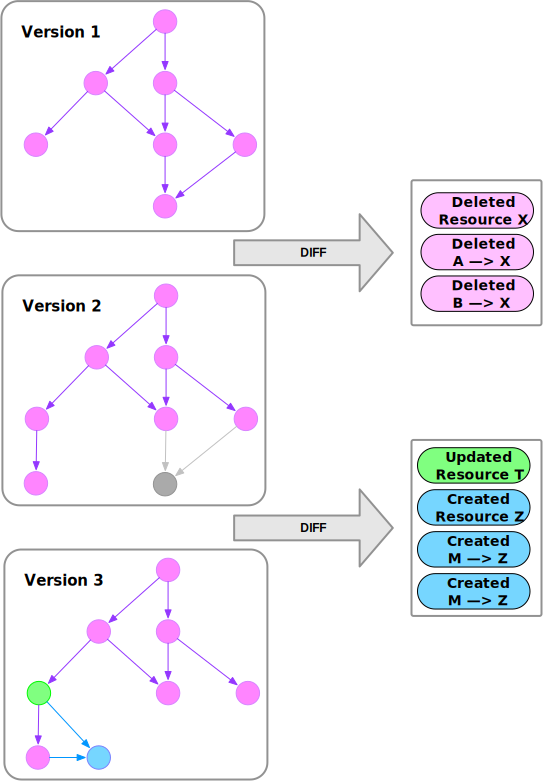

# What We Can Learn from History

> **"A generation which ignores history has no past—and no future."**<br/>_— Robert A. Heinlein_

While Heinlein's words refer to human history, they also apply to cloud infrastructure. Most of the time, we care about the current state of resources; but sometimes, we want to know the origin of a resource, when a resource was deleted, or when/how a resource was updated.

Such knowledge is necessary in situations where you need to understand the timeline to investigate a specific system behaviour:

- To perform the post-mortem analysis of an outage, we need to know which cloud resources changed and how they changed to yield the behaviour that we saw in our application. Without the ability to review a change log this becomes impossible.
- To understand cost spikes in your cloud billing dashboard, you need to understand what resources were created, when they were created, and by whom they were created. Not only do you need a list of changes, but also the ability to filter, group, sort, and aggregate the data to see the big picture.
- To check for security issues or compliance violations, you may need to reduce the scope to verify only those resources that were created or updated since the previous scan. Even complex checks can be performed on large infrastructures if they are only run against changed resources.

**History is a log of events defining your infrastructure.** This event log is important, as it will enable you to answer future questions about the state of your infrastructure retrospectively, including tomorrow's questions that have not yet crossed your mind.


<!-- truncate -->

## Existing Cloud Provider Tools

Without Resoto, you rely on your cloud provider for information. In many cases, cloud providers offer tools yielding at least some information:

- [**AWS CloudTrail**](https://docs.aws.amazon.com/awscloudtrail/latest/userguide/cloudtrail-user-guide.html)

  > "AWS CloudTrail is an AWS service that helps you enable operational and risk auditing, governance, and compliance of your AWS account. Actions taken by a user, role, or an AWS service are recorded as events in CloudTrail. Events include actions taken in the AWS Management Console, AWS Command Line Interface, and AWS SDKs and APIs."

- [**Google Cloud Audit Logs**](https://cloud.google.com/logging/docs/audit)
  > "Google Cloud services write audit logs that record administrative activities and accesses within your Google Cloud resources. Audit logs help you answer 'who did what, where, and when?' within your Google Cloud resources with the same level of transparency as in on-premises environments."

These tools give insights into resource changes; but if your application is spread across different accounts or regions, it is tedious to gather the data. If you have resources in a Kubernetes cluster, cloud provider tools actually won't help at all, further increasing the amount of tedious, manual work. If you want to know how a resource was configured at a specific time, your only hope is that Kubernetes Deployments may have an answer based on the configured resource limit.

**Cloud providers do not offer a complete picture of the history of your infrastructure across accounts and regions, they cannot show a resource's configuration at a given point in time, and they completely ignore resources maintained in Kubernetes.**

## Resoto's `history` Command

**Resoto maintains a record of your resources in an asset inventory.** Resoto scrapes your infrastructure at regular intervals and tracks the configuration of collected resources. Whenever a change to a resource is detected, Resoto updates its internal representation of the resource and captures the change as an event in its database:



Since Resoto does not rely on cloud providers to provide historical data but instead generates it from collected snapshot data, you can use Resoto to get the history of all your resources, no matter where they are running.

Each resource change falls into one of three categories:

- `created`: happens only once for any single resource when the resource gets created. Payload data is the configuration of the created resource.
- `updated`: can happen zero, one or multiple times and happens every time the resource changes. Payload data is the configuration of the updated resource.
- `deleted`: happens only once for any single resource when the resource gets deleted. Payload of the data is the configuration of the resource before it gets deleted.

It is possible to filter the list of events by event-type and time of change.

Let us see this in action. The command in Resoto to access the history is called `history`. The simplest version of history can be invoked by defining the type and the time of change. The result will be a list of all matching changes for all cloud providers in all accounts and all regions.

```bash title="List all reasource that have been deleted between 2022-12-02 and 2022-12-09"
> history --change node_deleted --after 2022-12-02 --before 2022-12-09
# highlight-start
​change=node_deleted, changed_at=2022-12-03T16:02:17Z, kind=aws_iam_role, name=resoto-eks-stack, cloud=aws, account=prod, region=global
​change=node_deleted, changed_at=2022-12-04T16:02:17Z, kind=aws_vpc, name=eks-stack-vpc, cloud=aws, account=dev, region=eu-central-1
​change=node_deleted, changed_at=2022-12-07T16:37:12Z, kind=kubernetes_pod, name=resotocore, cloud=k8s, account=resoto, region=default
# highlight-end
```

Here we defined the absolute time for `before` and `after`. It is also possible to use relative time by defining durations, e.g. `2d` (2 days), `4h` (4 hours), `6m` (6 minutes) which can also be combined to something like `2d4h6m` (2 days and 4 hours and 6 minutes). We can use durations instead of absolute time to define the time of change, where the duration is subtracted from the current time.

```bash title="List all reasource that have been deleted in the last 3 days"
> history --change node_deleted --after 3d
# highlight-start
​change=node_deleted, changed_at=2022-12-07T16:37:12Z, kind=kubernetes_pod, name=resotocore, cloud=k8s, account=resoto, region=default
# highlight-end
```

If we want to know how the configuration was defined at the moment of deletion, we can pipe the result into the [`dump`](/docs/reference/cli/format-commands/dump) command. Since the complete configuration is part of any event, we can use this approach for any event, no matter which type of event or which time the resource changed.

```bash title="Show the last known configuration of resources that have been deleted"
> history --change node_deleted --after 3d | dump
# highlight-start
​id: '4836788'
​reported:
​  id: b9a2ca84-399c-4716-8f1e-3ab47a4f89d4
​  tags:
​    kubectl.kubernetes.io/restartedAt: '2022-12-01T23:33:14+01:00'
​  name: resoto-resotocore-5ff798987-wj7cp
​  ctime: '2022-12-01T22:33:17Z'
​  resource_version: '39787763'
​  namespace: default
​  labels:
​    app.kubernetes.io/instance: resoto
​    app.kubernetes.io/name: resoto
​    pod-template-hash: 5ff798987
​    resoto: core
​  pod_spec:
​...
# highlight-end
```

Resoto comes with a powerful search DSL that allows filtering the resources that we maintain. The history command understands the same search syntax and can be used to filter the resulting list of changes even further. Let's filter the list of changes to only see resources of kind Kubernetes deployment that have the name `core` in their name:

```bash title="List all changes to the k8s deployment of core after 2022-12-02"
> history --after 2022-12-02 is(kubernetes_deployment) and name~core
# highlight-start
change=node_updated, changed_at=2022-12-02T16:37:12Z, kind=kubernetes_deployment, name=resoto-resotocore, cloud=k8s, account=resoto, region=default
change=node_updated, changed_at=2022-12-04T00:02:21Z, kind=kubernetes_deployment, name=coredns, cloud=k8s, account=posthog, region=kube-system
# highlight-end
```

You can not only filter the result, but also use any other command that is provided by Resoto, including `count` and `aggregation`. Let's assume we want to know which resource kinds have changed the most in the last week:

```bash title="Which resource kinds have changed the most in the last week"
> history --after 7d | count kind
# highlight-start
​aws_iam_access_key: 96
​aws_ec2_volume: 141
​kubernetes_endpoint: 182
​aws_iam_role: 285
​kubernetes_node: 450
​kubernetes_config_map: 720
​total matched: 1874
​total unmatched: 0
# highlight-end
```

It is also interesting to count the number of changes based on the type of change. Let's see how many resources have been created, updated or deleted in the last week:

```bash title="How many resources have been created, updated or deleted in the last week"
> history --after 7d | count /change
# highlight-start
​node_updated: 412
​node_deleted: 480
​node_created: 982
​total matched: 1874
​total unmatched: 0
# highlight-end
```

Let us take the same changes again but this time aggregate the data by the owner of the resource and the kind of change. We assume that you have a proper tag policy in place, so that an owner of a resource can be identified by the owner tag. We will see which owner did the most changes and which kind of changes they did.

```bash title="Count the number of changes by owner in the last week"
> history --after 7d | aggregate tags.owner, /change: sum(1) as count
# highlight-start
​count: 132
​group:
​  owner: team-cumulus
​  change: node_updated
​---
​count: 637
​group:
​  owner: team-stratos
​  change: node_created
​---
​count: 81
​group:
​  owner: team-cumulus
​  change: node_created
​---
​count: 12
​group:
​  owner: team-cirrus
​  change: node_updated
​...
# highlight-end
```

## Future plans

We hope this feature is already useful for you. We are planning to extend the capabilities of the history feature in several ways. The straight forward extension is providing a diff view that shows exactly what has changed between two resource configurations. This way you would not only see what has changed plus the final configuration, but also the delta between the two configurations.

The other more involved feature is the ability to provide a complete snapshot of the state of your infrastructure at a specific point in time. We would love to hear from you, if this is something you would like to see in Resoto. Please join our [Discord](https://discord.gg/someengineering) and let us know what you think.

## Conclusion

If you need more insights into who is changing your infrastructure, when, to which configuration across clouds, accounts, regions, Resoto is the right tool for you. Resoto is a free and open source tool that is available on [GitHub](https://github.com/someengineering/resoto). Please find installation instructions, tutorials and more in our [documentation](https://resoto.com).
