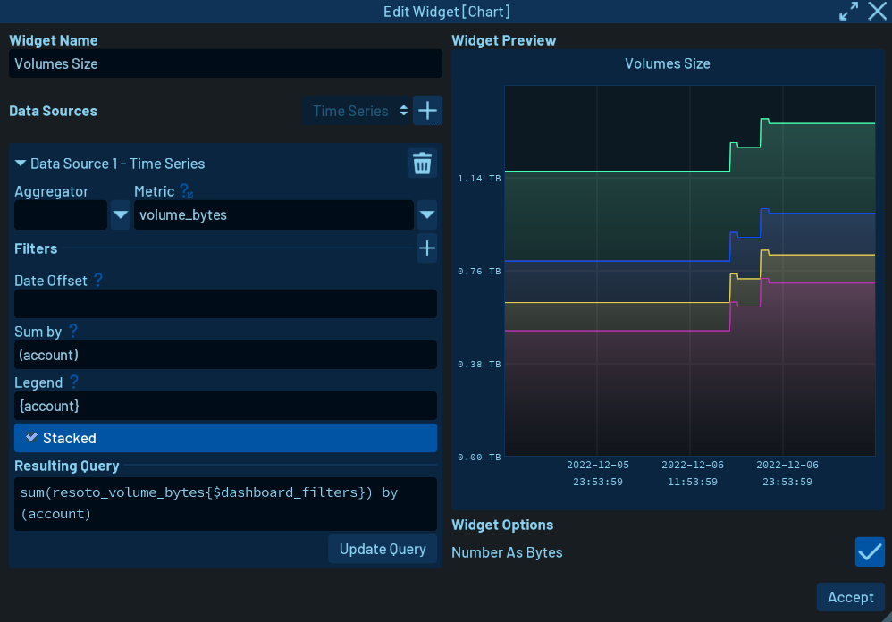

# First look at resoto dashboards

Resoto makes it easier than ever to create an inventory of your cloud infrastructure. And with just a few commands, you can immediately get a snapshot of what is currently happening with your resources. Furthermore, with this data ingested into a time series database, you not only know the current state of your cloud but also how they evolve.

So, with all this data now available, you will probably want a simple and human-readable way to visualize it. Until now, you could [export the data to google sheets](https://resoto.com/docs/how-to-guides/data-export/export-data-to-google-sheets) to create some charts out of it or use [resoto notebook](https://resoto.com/docs/reference/notebook) to interactively visualize and analyze the result of your searches.

Now, we are introducing a new way to have this visual information always available: Resoto Dashboards.

You may be wondering: "But why do we need yet another way to visualize data?". With our dashboards, you don't just visualize the data. Your searches and queries will be executed periodically and the results displayed in widgets automatically, so you always look at updated information. You can organize your widgets freely in the dashboard, to keep the most important metrics always within reach. You can share these dashboards across your organization so everybody that needs this information can make use of it. And of course, you can access your dashboards from everywhere as long as you have access to your resoto installation.

## Key concepts

A _dashboard_ is a container where you can place different _widgets_ to show relevant information. Each _widget_ has its way to display data, and thus, its configurable properties. Available widgets so far are:

- Numeric Indicators
- Line Charts
- Heatmaps
- Tables

Of course, you can freely position and resize widgets inside a dashboard, to organize the data in the best way possible for your application.

Each widget needs one or more _data sources_ to get the data that the user wants to display. These data sources have a query that is executed periodically to keep the dashboard updated. Each widget may have some limitations on what data sources it can accept, so not all data sources are available for every widget. Available data sources so far are:

- Search
- Aggregate Search
- Time Series
- Two-entry Aggregate Search

## Resoto Example Dashboard

Once you have resoto up and running, you can access the UI from a web browser in `HTTP://<your_resoto_url>/ui`. The following home screen should appear:

There is a lot to do in the UI, but for now, let's just focus on the dashboard section. Click on the dashboard button, and you will be redirected to the Dashboard Manager:

### Visualizing unused volumes

For a quick demonstration of how dashboards work in resoto, let's just open the _Resoto Example Dashboard_ provided with the installation, double-clicking on that option in the list.

This dashboard has pre-configured a lot of widgets with relevant information about your cloud infrastructure.

Let's take a quick look at some of the elements being displayed here. Look for the table widget titled "Unused Volumes older than 1 week". There you have a complete list, as the title suggests, of the available volumes older than 1 week. This information is really useful if you want to know what resources you may mark for cleanup, and is very easily retrieved with resoto and displayed in a dashboard.

To see how you can make this information available in your dashboards, let's check that specific widget's configuration. Pressing the edit button in the top-right corner of the dashboard, you can toggle the _edit mode_. While in this mode, you can move and resize your widgets, edit their settings to modify what they are showing and how they are displaying the information. You will note that an edit button appeared also on each widget. Press the one in the table we are inspecting. The following dialog should pop up:

In the right part of this dialog, you can see a preview of the widget with the data and, below it, some display options (just some color settings in this case). In the left part, we have a more important section. There you can define the _data sources_ to retrieve the data you want to show in the widget. In this case, a quite simple _full-text search_ command was used. You can learn more about _full-text search_ in resoto [here](https://resoto.com/docs/reference/search/full-text).

You can modify that search to fit your needs. As a little exercise, try to make the query show only the volumes in the "eu-central-1" region which are older than 10 days. Once you are finished with your modifications, press "Accept" and the widget will be updated in the dashboard.

Finally, toggle the edit mode on the top-right corner of the dashboard to return to the normal mode.

### Checking out volumes size

Another interesting widget to check out is the chart that is titled "Volumes Sizes". This widget shows how the size of the volumes grew over time for each account. Hovering the mouse over it will show a legend with summarized information about the data being displayed (in this case, volume size per account). Let's enter into the edit mode again, and then press the edit button in this widget, to check how we made it display this information.

This time we are using a _time series data source_. This data source gets the data from **prometheus** time-series database. This information is available there because we previously configured some metrics in the `resoto.metrics` configuration. For more information about this, check [this blog post](https://resoto.com/blog/2022/06/09/building-actionable-cloud-infrastructure-metrics#how-metrics-are-made).

You can see in the left part of the dialog how we configured this **data source**. Editing the fields in the dialog will automatically generate and update the query at the bottom. So to create this widget, we selected the `volume_bytes` metric from the drop-down menu, and set it to sum the results by account. The legend setting is used to display the account name when hovering the mouse over the chart.

## Conclusions

This was just a quick overview of the usefulness of resoto dashboards. There are a lot more features that one needs to learn to exploit their maximum potential, but that information is probably best suited for future blog posts and official documentation. So stay tuned if you want to learn more about this new feature!
