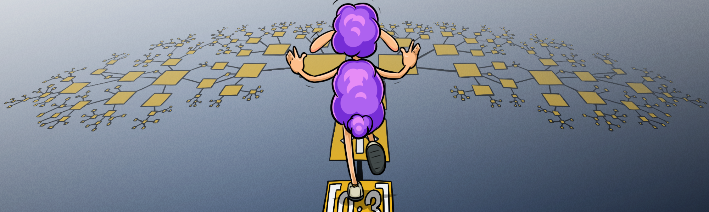
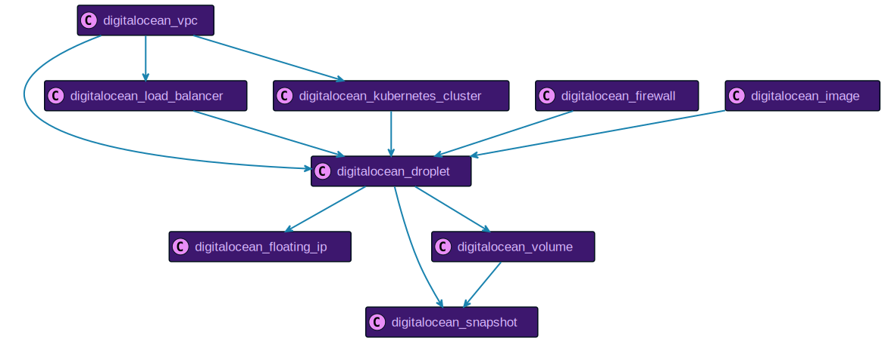
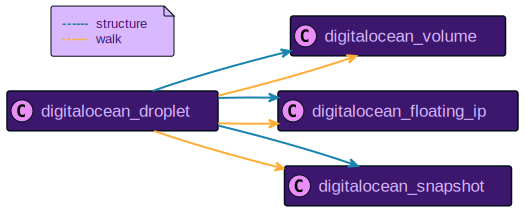
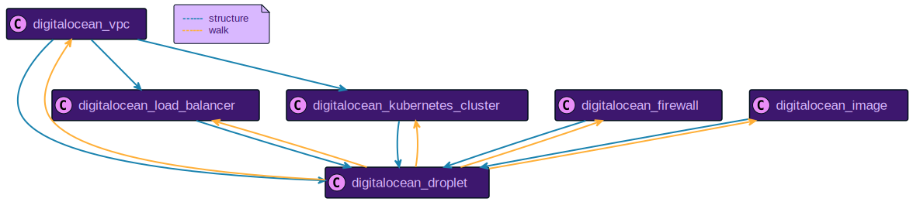
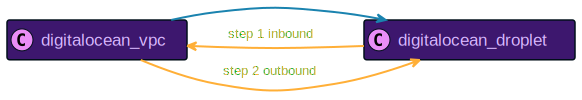
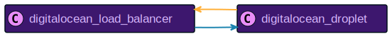
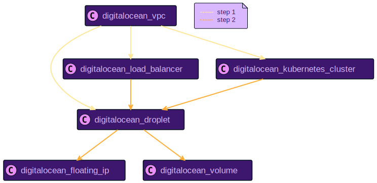
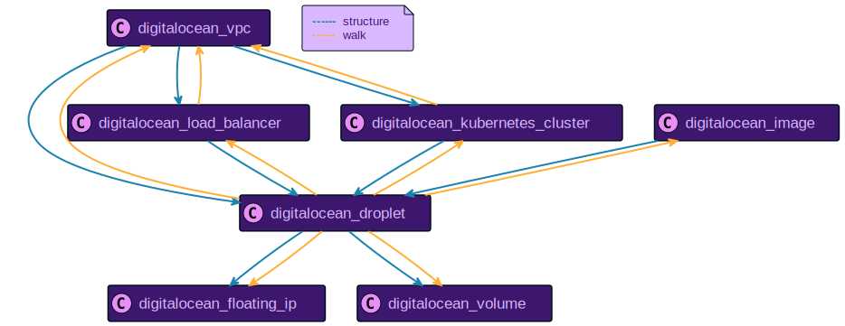
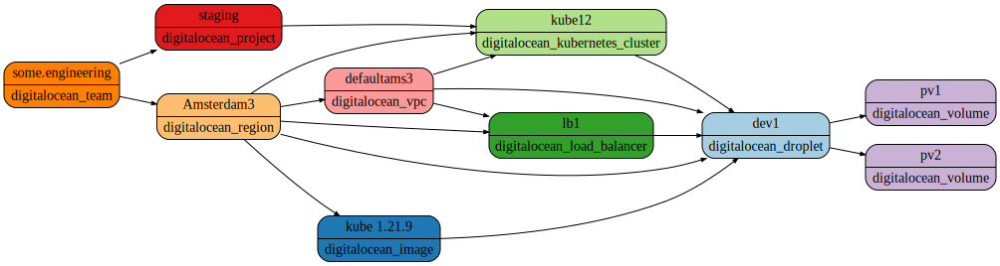

# A Walk in the Graph

Resoto uses a [directed graph](https://en.wikipedia.org/wiki/Directed_graph) to represent your infrastructure resources as nodes and relationships between them as edges. A load balancer for example is represented as node with edges pointing to all target compute instances. The compute instance might have a volume attached, where we would see an edge between the instance node and the volume node.

Nodes represent resources, while edges define the relationship between nodes. It is often the case that a resource has multiple relationships to other resources.



{/* truncate */}

This model makes it easy to capture not only the structure, but also makes the relationships explicit. You can think of the graph as a digital twin of your infrastructure metadata. Resoto allows you to explore and extract meaningful information from your infrastructure with a simple search.

The following diagram shows an excerpt of the graph model for DigitalOcean droplets. Droplets are the compute instances in DigitalOcean, similar to EC2 instances in <abbr title="Amazon Web Services">AWS</abbr>. (The full model is documented in [DigitalOcean Resource Data Models](/docs/reference/unified-data-model/digitalocean).)

:::note

This example uses DigitalOcean but works for [<abbr title="Amazon Web Services">AWS</abbr>](/docs/reference/unified-data-model/aws) or [Google Cloud](/docs/reference/unified-data-model/google-cloud) accordingly.

:::



This diagram shows how the different kinds of possible resources are connected to each other in the graph. This does not mean that all of these resources have to exist in your infrastructure, it shows how they would be connected in case they exist.

A droplet, for example, can have volumes, snapshots, or floating IPs, which are direct successors of the node. If we want to know which volumes are attached to a droplet, we will traverse the graph outbound by one step. Since this could yield volumes, snapshots, and floating IPs, as seen in the diagram, we need to filter the resulting list to only keep the volumes. Let's assume we have a specific droplet with id `289061882`, where we want to know all attached volumes:



```bash
> search is(digitalocean_droplet) and id=289061882 --> is(volume)
# highlight-start
​kind=digitalocean_volume, name=pv2, age=2mo7d, account=10225075, region=Amsterdam 3
​kind=digitalocean_volume, name=pv1, age=2mo7d, account=10225075, region=Amsterdam 3
# highlight-end
```

This search finds the DigitalOcean droplet with the specified ID, traverses the graph outbound one step (`-->`), and then filters the resulting list to return volumes only. Other resources point to our droplet, and we see from the graph structure that those resources could be load balancers, Kubernetes clusters, firewalls, or images.

To get all the resources that point to this resource, we need to traverse the graph inbound - which means in the opposite direction of the arrow in the graph structure diagram. Resoto uses the left facing arrow `<--` to traverse the graph inbound. We use the same filter as before but this time, we traverse the graph inbound and count the number of resources by kind.



```bash
> search is(digitalocean_droplet) and id=289061882 <-- | count kind
# highlight-start
​digitalocean_region: 1
​digitalocean_image: 1
​digitalocean_vpc: 1
​digitalocean_kubernetes_cluster: 1
​digitalocean_load_balancer: 1
​total matched: 5
​total unmatched: 0
# highlight-end
```

The droplet belongs to a region inside a [VPC](https://docs.digitalocean.com/products/networking/vpc). It is the target of a load balancer and part of a Kubernetes cluster. Let's find out which other instances exist in the same VPC:



```bash
> search is(digitalocean_droplet) and id=289061882
  <-- is(digitalocean_vpc) --> is(digitalocean_droplet)
# highlight-start
​id=289061882, name=dev-1, age=2mo7d, account=10225075, region=Amsterdam 3
​id=289061881, name=dev-3, age=2mo7d, account=10225075, region=Amsterdam 3
​id=289061880, name=dev-2, age=2mo7d, account=10225075, region=Amsterdam 3
# highlight-end
```

We again start at our droplet and traverse the graph inbound to the VPC. From there, we traverse one step outbound to find all droplets attached to the same VPC. There are three droplets in this VPC, and one of them is the one we were starting from.

It is possible to chain any number of graph traversals. We could have used the same technique to find all the droplets in the Kubernetes cluster or the ones behind the load balancer.

Since this droplet is attached to a load balancer, we want to find out the public IP address. If multiple load balancers were attached to the same droplet, we would get the list of all IP addresses.



```bash
> search is(digitalocean_droplet) and id=289061882 <-- is(load_balancer) |
  format {public_ip_address}
# highlight-start
​137.121.131.102
# highlight-end
```

Resoto allows for traverseing not only one step but multiple steps. You can define a specific number of steps to traverse (e.g. `-[4]->` traverse exactly 4 steps outbound) and a range of steps (e.g. `<-[2:3]-` traverse inbound and return everything during step 2 and 3). You can even specify the range as unlimited (e.g. `-[2:]->` traverse outbound and return everything from step 2 and later), which would traverse the graph to the root or leaf, depending on the direction of the traverse.

The following search will select all DigitalOcean VPCs and then traverse the graph outbound, returning all nodes that can be reached starting from the VPC up to two steps. This list would never include snapshots since snapshots can not be reached in two steps starting from the VPC.



```bash
> search is(digitalocean_vpc) -[0:2]-> | count kind
# highlight-start
​digitalocean_load_balancer: 2
​digitalocean_kubernetes_cluster: 2
​digitalocean_vpc: 2
​digitalocean_volume: 6
​digitalocean_droplet: 6
​total matched: 18
​total unmatched: 0
# highlight-end
```

If we can traverse outbound with `-->` and inbound with `<--`, there has to be an option to traverse in both directions. The combination of the two approaches is expressed with `<-->`. It is possible to get the list of all reachable resources starting from a specific node. We use the above droplet and ask for all attached resources.



```bash
> search is(digitalocean_droplet) and id=289061882 <-[0:]-> | count kind
# highlight-start
​digitalocean_droplet: 1
​digitalocean_load_balancer: 1
​digitalocean_kubernetes_cluster: 1
​digitalocean_region: 1
​digitalocean_vpc: 1
​graph_root: 1
​cloud: 1
​digitalocean_image: 1
​digitalocean_team: 1
​digitalocean_project: 1
​digitalocean_volume: 2
​total matched: 12
​total unmatched: 0
# highlight-end
```

The traversal definition `<-[0:]->` might look strange at first glance. It defines to traverse inbound and outbound starting from the current node (`0`). Since the end of the traverse is not specified, it will traverse until there are no more nodes to traverse. It will traverse to the graph root inbound and all possible leafs outbound. The result is then counted by kind. To make this information even more helpful, we can create a graph diagram out of this search in [Graphviz DOT format](https://graphviz.org/doc/info/lang.html). The same search as above is used with edges included in the result.

```bash
> search --with-edges is(digitalocean_droplet) and
id=289061882 <-[0:]-> | format --dot | write graph.dot
# highlight-start
Received a file graph.dot, which is stored to ./graph.dot.
# highlight-end
```

We can now use Graphviz to render the graph, or one of the many online tools to visualize the graph. The final result is the following:



This diagram reveals a lot of useful information. It shows the related DigitalOcean team and project and the droplet usage as a node in a Kubernetes cluster and backend of a load balancer as well as its attached volumes. All of this information is available as-is. The search syntax makes it extremely easy to traverse this structure and reveal the information of interest.

Please head over to the [Resoto documentation](/docs/getting-started) and try it out yourself!
