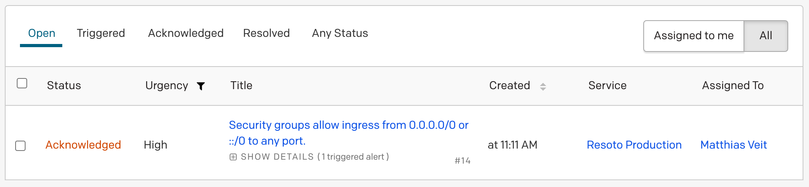
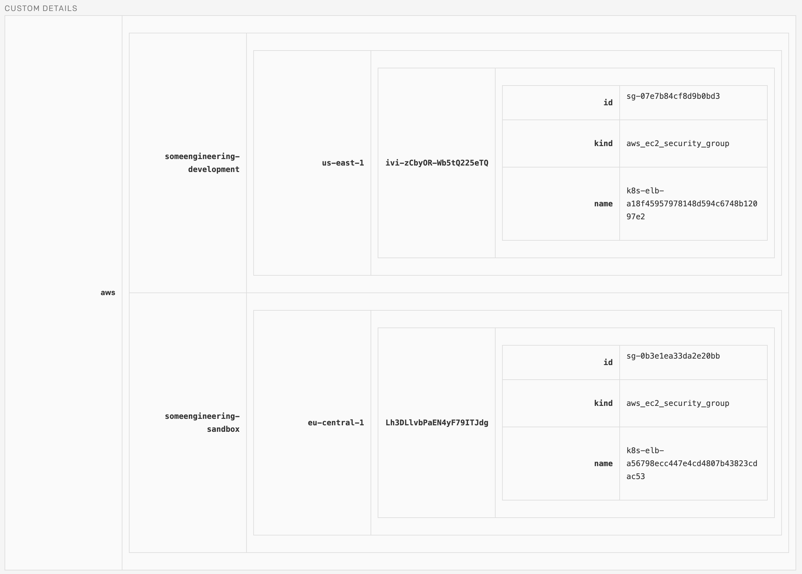

# Automating PagerDuty Infrastructure Alerts with Resoto

In today's cloud-native world, maintaining a resilient and secure infrastructure is crucial to the success of any business. However, as the cloud infrastructure grows in complexity, it becomes increasingly difficult to track all your cloud resources.

This is where Resoto comes in—Resoto ensures that information about your cloud resources is always available by routinely collecting infrastructure data across cloud providers, accounts, regions, and a plethora of services.

**However, simply having cloud resource data is not enough; it is also crucial to automate actions based on this data.**

For example, if a resource is no longer needed, it should be cleaned up to avoid incurring unnecessary costs. Similarly, if a resource is not properly tagged, it can be difficult to identify its purpose, leading to confusion and making reporting a mess.

Resoto provides tools to cope with such challenges. **In this post, we'll explore another category of high-priority issues that often require immediate attention: breaches in the security baseline.**

<!--truncate-->

## Security Baselines

**In the context of cloud-native architectures, a security baseline is a set of standards and configurations that establish a minimum level of security for a system or environment.**

A security baseline defines a set of security controls that must be implemented to ensure the confidentiality, integrity, and availability of the system and its data. It is typically designed to help organizations establish a consistent and reliable security posture across their cloud environments.

By adhering to a security baseline, organizations can ensure that they are meeting their regulatory and compliance requirements and protecting their critical data and systems from threats. However, it is vital to note that a security baseline is not a one-size-fits-all solution. Each organization has its own unique security requirements, and the security baseline should be customized to meet those needs.

This post is not intended to show how a security baseline is established—that goes far beyond what we can cover in a single blog post.

### Restricting Network Ingress Traffic

**A network access control list (ACL) rule determines what traffic is allowed or denied in a network.**

It is typically implemented at the router or firewall level to filter traffic based on criteria such as source and destination IP addresses, ports, and protocols.

### Detecting Security Baseline Violations

Let's consider a baseline that requires ingress traffic be restricted to defined ranges of allowed IPv4 or IPv6 addresses.

We can examine AWS EC2 security groups that control [access to VPCs](https://docs.aws.amazon.com/vpc/latest/userguide/vpc-network-acls.html).

Looking at the [`aws_ec2_security_group` resource data model](/docs/reference/data-models/aws#aws_ec2_security_group), we see that the security group can define multiple IP permissions for ingress and egress, each of which is described as multiple IP ranges.

The following Resoto search reveals all security groups that violate the rule by defining at least one permission set for ingress either:

- without a defined network protocol or
- allowing access from all IPv4 addresses (CIDR `0.0.0.0/0`) or all IPv6 addresses (CIDR `::/0`).

```bash
> search is(aws_ec2_security_group) and group_ip_permissions[*].{ip_protocol="-1" and (ip_ranges[*].cidr_ip="0.0.0.0/0" or ipv6_ranges[*].cidr_ipv6="::/0")}
```

:::note

Usually, we define a security baseline for production accounts, while setting more relaxed requirements for development accounts.

It is possible to restrict our search filter to only check the desired target accounts and regions.

:::

## PagerDuty Alerts

Once resources violating our security baseline have been detected, we want to trigger a PagerDuty alert to make people aware of the issue.

[PagerDuty](https://pagerduty.com) is an incident management platform that helps teams manage, respond to, and resolve critical issues quickly and efficiently. You should use PagerDuty to ensure that your team is able to respond to incidents in a timely and coordinated manner, minimizing downtime and customer impact.

### `pagerduty` Resoto Command

Resoto includes a `pagerduty` command that creates an alert in PagerDuty using the results of a search.

:::info

**See [How to Create PagerDuty Alerts](/docs/how-to-guides/alerting/create-pagerduty-alerts) for step-by-step directions on how to automate PagerDuty alerts with Resoto.**

The `pagerduty` command has a couple of options that define how the alert looks.

After following the above how-to guide, only two parameters need to be explicitly specified on each invocation of the command:

| Parameter | Description |
| --- | --- |
| `--summary` | A short description of the issue. This text is also sent as part of any notifications or telephone calls. |
| `--dedup-key` | A unique key for the issue type. If multiple alerts are triggered using the same deduplication key, they will not create separate issues. (Resoto will update or renew an existing alert instead of creating new, duplicate alerts.) |

:::

### Creating a PagerDuty Alert in Resoto

Now, let's combine our search with the `pagerduty` command:

```bash
> search is(aws_ec2_security_group) and group_ip_permissions[*].{ip_protocol="-1" and (ip_ranges[*].cidr_ip="0.0.0.0/0" or ipv6_ranges[*].cidr_ipv6="::/0")} | pagerduty --summary "Security groups allow ingress from 0.0.0.0/0 or ::/0 to any port." --dedup-key allow_ingress_from_internet_to_any_port
```

This command will search for AWS EC2 security groups that are not configured correctly.

- If noncompliant groups are found, the `pagerduty` command which will create an PagerDuty alert with a list of those resources.
- The static deduplication key ensures not to trigger multiple alerts if one is already open. If no security group violates our baseline, the `pagerduty` command is not invoked - no alert is created.

Once the search filter returns a result, an alert will be triggered with the configured escalation policy we defined in PagerDuty. The PagerDuty web UI will list the alert:



We can see a summary of the alert as well as the current status, urgency, and assignee.

However, the summary alone is not really actionable. We need to know which security groups exactly are not configured correctly.

A PagerDuty incident allows for details to be specified, which is exactly what Resoto's `pagerduty` command did, attaching details of all matching resources as a part of the issue:



Information about all matching resources are provided aggregated by region, account, and cloud provider. This should give the assignee enough context and detailed information to understand and tackle the issue.

### Automating PagerDuty Alerts in Resoto

We have demonstrated how we can use the results to trigger an alert in PagerDuty. While triggering the check and alert in Resoto manually is a good start, we really want Resoto to automatically do this whenever infrastructure changes are detected.

[Automations in Resoto](/docs/concepts/automation) are defined as [jobs](/docs/concepts/automation#jobs). A job is a command that is executed on a schedule or in response to an event.

In this case, we want to trigger a job whenever Resoto finishes capturing a new snapshot of our infrastructure data, so we'll define the `post_collect` [event](/docs/reference/events) as the trigger:

```bash
> jobs add --id sec_network_open_ingress_from_internet --wait-for-event post_collect 'search is(aws_ec2_security_group) and group_ip_permissions[*].{ip_protocol="-1" and (ip_ranges[*].cidr_ip="0.0.0.0/0" or ipv6_ranges[*].cidr_ipv6="::/0") } | pagerduty --summary "Security groups allow ingress from 0.0.0.0/0 or ::/0 to any port." --dedup-key allow_ingress_from_internet_to_any_port'
# highlight-next-line
​Job sec_network_open_ingress_from_internet added.
```

At this point, Resoto will take over. Whenever Resoto detects a violation in the security baseline, it will create a PagerDuty alert.

## Summary

Resoto can automatically perform security checks and compliance verification, reducing the tedious part of infrastructure management.

The combination of Resoto and PagerDuty enables businesses to maintain a proactive approach to infrastructure management and avoid costly mistakes. Rather than waiting for a problem to occur, Resoto can detect potential problems before they become critical issues.

## Further Reading

- [Automation](/docs/concepts/automation)
- [Search How-To Guides](/docs/how-to-guides/search)
