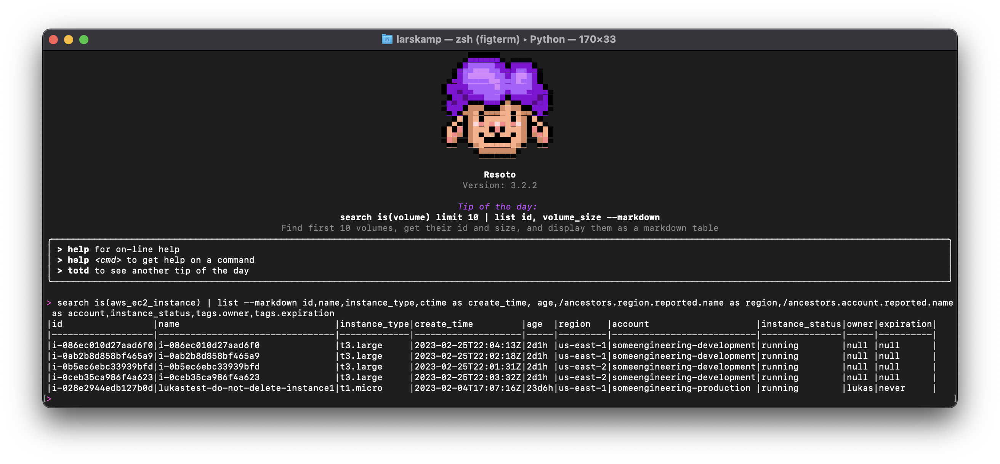
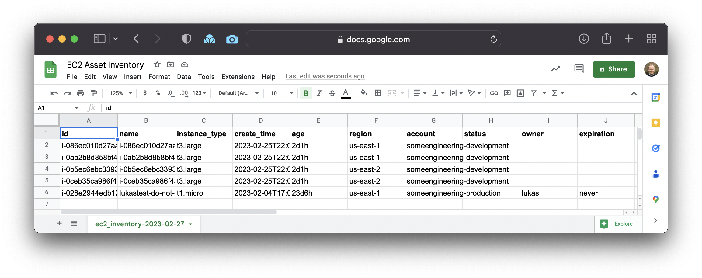

# Building an EC2 Cloud Inventory

EC2 instances often account for the largest portion of your <abbr title="Amazon Web Services">AWS</abbr> bill. Yet, it's notoriously difficult to get a simple list of all EC2 instances across all regions and accounts, as threads on [StackOverflow](https://stackoverflow.com/questions/42086712/how-to-see-all-running-amazon-ec2-instances-across-all-regions) and [Reddit](https://www.reddit.com/r/aws/comments/s83381/list_ec2_instances_from_all_accounts_in_all) show.

You also then want to use that list to ask questions about your inventory, such as:

- How many total instances are there?
- Which instances are running?
- Which instances are missing tags?
- Which resources have an expiration date?

In this post, I'll describe how to use Resoto to build an EC2 cloud asset inventory. The baseline inventory is a list with all EC2 instances, which you then can use to create more narrow and detailed views.

<!--truncate-->

## Getting Started with Resoto

1. [Install Resoto.](/docs/getting-started/install-resoto)

2. [Start Resoto Shell.](/docs/getting-started/launch-resoto#launching-resoto-shell)

3. [Configure Resoto to collect <abbr title="Amazon Web Services">AWS</abbr> resources and trigger resource collection.](/docs/how-to-guides/data-sources/collect-aws-resource-data)

   During each "collect run," Resoto extracts and transforms data from cloud APIs to generate and store snapshots of your infrastructure in its [graph database](/docs/concepts/asset-inventory-graph).

## Creating Your First EC2 Inventory

Once Resoto has completed collecting your <abbr title="Amazon Web Services">AWS</abbr> resources, run the following search, which I'll call our "baseline inventory":

```bash
> search is(aws_ec2_instance) | list --markdown id,name,instance_type,ctime as create_time, age,/ancestors.region.reported.name as region,/ancestors.account.reported.name as account,instance_status,tags.owner,tags.expiration
```

The above command returns a list of EC2 instances formatted as a Markdown table:



And voilà, you have your EC2 asset inventory, listing all instances across your regions and accounts.

Re-running the search will produce identical results unless Resoto has taken a new snapshot and your inventory has changed.

## Export Your EC2 Inventory in CSV Format

Let's export this list to a CSV file so that we can import the data into Excel or Google Sheets:

```bash
> search is(aws_ec2_instance) | list --csv id,name,instance_type,ctime as create_time, age,/ancestors.region.reported.name as region,/ancestors.account.reported.name as account,instance_status,tags.owner,tags.expiration | write ec2_inventory-@TODAY@.csv
```

- The `--csv` flag for the [`list` command](/docs/reference/cli/format-commands/list) tells Resoto to output the results in CSV format.
- The [`write` command](/docs/reference/cli/miscellaneous-commands/write) sends the CSV output to the designated file.
- The pipes (`|`) passes the result of the preceeding command as input for the following command.
- `@TODAY@` is a special [placeholder string](/docs/reference/cli#placeholder-strings) that we use to add the current date to the filename.

Executing the above command writes your EC2 inventory to a file on your computer.

## Customizing Your EC2 Inventory

Now that you have a baseline inventory, let's customize it to include custom resource properties.

The search we used up until this point is:

```bash
> search is(aws_ec2_instance) | list
```

This returns a list of EC2 instances with [properties from a predefined list](/docs/reference/cli/format-commands/list#options).

To add specific properties of interest, we can specify them as a parameter to the [`list` command](/docs/reference/cli/format-commands/list).

### Available Resource Properties in Resoto

The available properties of a resource kind are defined in the [resource data model](/docs/reference/data-models). In our case, the relevant resource kind is [`aws_ec2_instance`](/docs/reference/data-models/aws#aws_ec2_instance).

You can list the available properties of [`aws_ec2_instance`](/docs/reference/data-models/aws#aws_ec2_instance) in your terminal with:

```bash
> kind aws_ec2_instance
```

### Including Custom Resource Properties in Your EC2 Inventory

To keep it simple, we'll building the inventory with ten properties:

1. ID
2. Name
3. Instance type
4. Creation time
5. Age
6. Region
7. Account
8. Instance status
9. Owner tag
10. Expiration tag

These properties provide a good overview, and include instance identifiers, how long ago instances were created, whether or not instances are currently running, and if so, where (region, account).

A best practice and policy we recommend is to tag all resources with an owner and expiration. By including these two properties into the search, the inventory clearly shows if developers are following that policy.

The full search syntax to build my inventory (for now, without formatting and writing the results to a file) reads as:

```bash
> search is(aws_ec2_instance) | list id,name,instance_type,ctime as create_time, age,/ancestors.region.reported.name as region,/ancestors.account.reported.name as account,instance_status,tags.owner,tags.expiration
```

You can see how there are two different ways to fetch the properties.

- **Directly from the resource:** ID, name, instance type, create time, age, and instance status are direct properties of the [`aws_ec2_instance`](/docs/reference/data-models/aws#aws_ec2_instance) kind.
- **Indirectly from a related resource:** Region name and account name belong to the kinds [`aws_region`](/docs/reference/data-models/aws#aws_region) and [`aws_account`](/docs/reference/data-models/aws#aws_account).

### Capturing Indirect Properties with Graph Traversal

After each complete data extraction, Resoto transforms the data extracted from the cloud APIs into a [directed graph](/docs/concepts/asset-inventory-graph). Each resource becomes a [node](/docs/concepts/asset-inventory-graph#nodes) in this graph.

Each resource node in the graph has "ancestors" and "descendants," depending on their location in the hierarchy relative to related resources.

- **Ancestors** are resources that are higher up in the graph. The immediate ancestors of a resource are called "predecessors."

  If you think about the hierarchy of an EC2 instance, each instance is part of an account and a region. These are ancestors.

- **Descendants** resources are resources that are further down in the graph. The immediate descendants of a resource are called "successors."

  Every EC2 instance will also have additional relationships to other resources, like EBS volumes or ENI network interfaces. Such resources are descendants.

Graph traversal allows me to "walk" the graph and select properties from related resources.

For our baseline inventory, we're only interested in the region and account our resources run in. Both are higher up in the graph. We can retrieve the two properties by adding `/ancestors.region.reported.name as region` and `/ancestors.account.reported.name as account` to our search.

The search will traverse up the graph and search for nodes of kind `region` and `account`, and display the reported name with labels `region` and `account`. The benefit of this syntax is that we don't have to specify exactly where in the graph that information is available—just that it is available somewhere.

## Formatting and Exporting the EC2 Inventory

We've already seen that Resoto offers two ways to format the results of a search, Markdown and CSV.

Markdown provides a nice visual in the CLI, whereas CSV format allows for further analysis of data in a spreadsheet or cloud warehouse.

Adding back in the formatting and writing to a file, the full command to build the inventory now reads as:

```bash
> search is(aws_ec2_instance) | list --csv id,name,instance_type,ctime as create_time, age,/ancestors.region.reported.name as region,/ancestors.account.reported.name as account,instance_status,tags.owner,tags.expiration | write ec2_inventory-@TODAY@.csv
```

[I can now take the resulting CSV file and upload it to Google Sheets](/docs/how-to-guides/data-export/export-data-to-google-sheets) for further analysis:



Exporting the inventory to a spreadsheet makes the data available to a wider audience, without the need for specific <abbr title="Amazon Web Services">AWS</abbr> skills like using the [AWS Console](https://aws.amazon.com/console).

## Building on Your Baseline EC2 Inventory

With a baseline inventory in place, you can now narrow down or expand the search to include properties like instance prices or [aggregate data](/docs/reference/search/aggregation) by instance type.

We're always curious to hear what you're building and how we can help. [Join us on Discord](https://discord.gg/someengineering) and let us know!
