# Building an Infrastructure App with Resoto and Streamlit

```mdx-code-block
import TabItem from '@theme/TabItem';
import Tabs from '@theme/Tabs';
```

In [Actionable Cloud Infrastructure Metrics](../actionable-cloud-infrastructure-metrics/index.mdx), we explored how to create metrics, export them into a time series database, and visualize them with Grafana. **Today, we'll take a look at how to build an infrastructure app using [Streamlit](https://streamlit.io), a framework that turns data into web apps.**


If you are not familiar with [Python](https://python.org), don't worry—we're going to keep it simple! In [Prerequisites](#prerequisites), we'll go over installing Python and the coding techniques utilized in this project.

<!--truncate-->

:::info

If you're already comfortable with [Python](https://python.org) and just want the finished product, you can follow the steps in [Environment Setup](#environment-setup) and jump straight to [The Final Product](#the-final-product). Then, see [Running the App](#running-the-app) for instructions on how to start the app.

:::

:::tip

Many of the instructions below include commands to be executed in a terminal. The `$`, `>`, `>>>`, or `...` at the beginning of each line indicates the prompt. **You should not type or copy these characters.**

When hovering over the upper right corner of a code block, you will see a copy button. You can use this to copy the commands within the code block to your clipboard without these prompts.

:::

## Prerequisites

- A text editor (I personally use [Visual Studio Code](https://code.visualstudio.com))
- [Python](https://python.org) 3.8+
- [`pip`](https://pip.pypa.io) (the Python package installer)
- Resoto 😉

:::note

If you already these prerequisites installed, you can skip ahead to [Environment Setup](#environment-setup).

:::

### Python and `pip`

<Tabs groupId="operating-system">

<TabItem value="linux" label="Linux">

On Linux, there is a good chance the distro already comes with a version of Python 3.x installed. If you are not sure, you can check with the following command:

```bash
$ python3 --version
# highlight-start
​Python 3.10.4
# highlight-end
```

If the command returns an error, you can install Python and `pip` using your distro's package manager:

<Tabs groupId="linux-distro">

<TabItem value="debian" label="Debian/Ubuntu">

```bash
$ sudo apt update
$ sudo apt install python3 python3-pip
```

</TabItem>

<TabItem value="fedora" label="Fedora/CentOS">

```bash
$ sudo dnf install python3 python3-pip
```

</TabItem>

</Tabs>

</TabItem>

<TabItem value="macos" label="macOS">

<Tabs>

<TabItem value="download" label="Download">

You can download the latest version of Python for macOS from [Python.org](https://python.org/downloads):

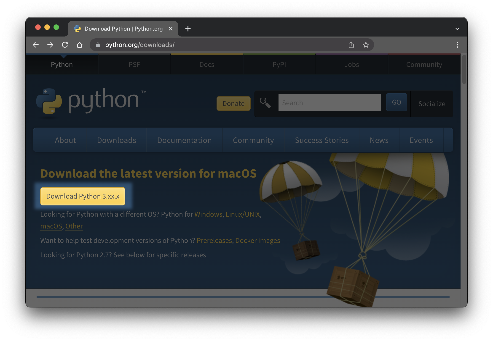

</TabItem>

<TabItem value="homebrew" label="Homebrew">

With [Homebrew](https://brew.sh), you can install Python by executing the following command in the **Terminal** app:

```bash
$ brew install python
```

:::tip

The **Terminal** app can be found under **Utilities** within the **Applications** folder:

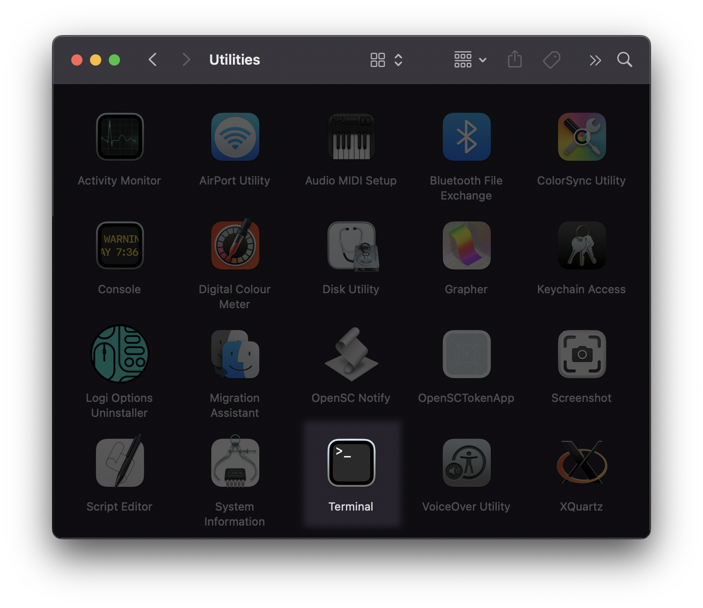

:::

</TabItem>

</Tabs>

</TabItem>

<TabItem value="windows" label="Windows">

<Tabs>

<TabItem value="download" label="Download">

You can download the latest version of Python for Windows from [Python.org](https://python.org/downloads):

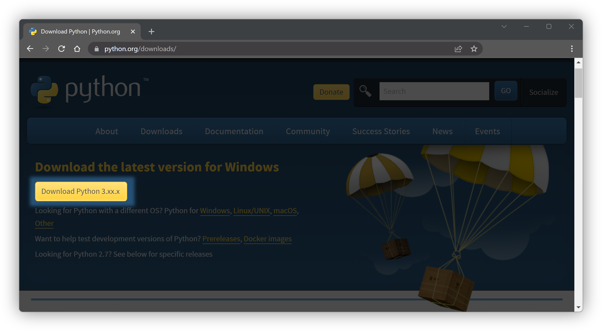

</TabItem>

<TabItem value="chocolatey" label="Chocolatey">

With [Chocolatey](https://chocolatey.org), you can install Python by executing the following command:

```powershell
choco install python
```

</TabItem>

</Tabs>

</TabItem>

</Tabs>

If you don't have prior Python or programming experience, please read the following overview of some Python basics before proceeding:

<details>

<summary>Python Basics</summary>

<div>

<h4 id="starting-the-repl">Starting the REPL</h4>

Start Python by running the following command (in PowerShell on Windows or the Terminal app on macOS):

```bash
$ python3
# highlight-start
​Python 3.10.4 (v3.10.4:9d38120e33, Mar 23 2022, 17:29:05) [Clang 13.0.0 (clang-1300.0.29.30)] on darwin
​Type "help", "copyright", "credits" or "license" for more information.
# highlight-end
​>>>
```

:::note

Depending on how Python was installed, the command may be `python` instead of `python3`.

:::

This starts the Python <abbr title="Read-Eval-Print-Loop">REPL</abbr>. The REPL is a great way to quickly test code. You can type in a command, execute it by pressing the <kbd>Enter</kbd> key, and see the result printed to the screen.

To exit the REPL, simply type `exit()` and press <kbd>Enter</kbd>.

<h4 id="variables-and-functions">Variables and Functions</h4>

_Variables_ store values. They are created by assigning a value to a name. The name can be any combination of letters, numbers, and underscores, but it must start with a letter or underscore.

_Functions_ group code into a single unit. Functions can be called by using the function name followed by a list of arguments in parentheses. For this app we won't write any functions ourselves but we will call existing functions.

In the following code, we assign the value `"Monday"` to a variable named `today` and then use the `print()` function to output the value of the variable.

```python
>>> today = "Monday"
>>> print(today)
# highlight-next-line
​Monday
```

<h5 id="types-of-variables">Types of Variables</h5>

There are different types of variables. The most common are _strings_, _integers_, and _floats_. Strings are used to store text. Integers are used to store whole numbers. Floats are used to store decimal numbers. There are also _booleans_, which can be either `True` or `False`, and _lists_ and _dictionaries_ which are used to store multiple values. To access a value in a list we use an index, which is a number that starts at 0, 0 being the first element of a list. Dictionaries are similar to lists, but instead of using a number to access a value, you can use a string. Lists are created by using square brackets `[]` and dictionaries are created by using curly brackets `{}`.

Let's quickly go through some examples of each type of variable.

```python
>>> greeting = "Hello there! 👋"
>>> number_of_colleagues = 7
>>> current_temperature = 74.6
>>> window_closed = True
>>> pancake_ingredients = ["flour", "eggs", "milk", "salt", "baking powder"]
>>> capital_cities = {
...   "England": "London",
...   "Germany": "Berlin",
...   "USA": "Washington DC",
...   "Lebanon": "Beirut",
...   "Nepal": "Kathmandu",
...   "Spain": "Madrid"
... }
>>> type(greeting)
# highlight-next-line
​<class 'str'>
>>> type(number_of_colleagues)
# highlight-next-line
​<class 'int'>
>>> type(current_temperature)
# highlight-next-line
​<class 'float'>
>>> type(window_closed)
# highlight-next-line
​<class 'bool'>
>>> type(pancake_ingredients)
# highlight-next-line
​<class 'list'>
>>> type(capital_cities)
# highlight-next-line
​<class 'dict'>
```

<h5 id="accessing-and-printing-variables">Accessing and Printing Variables</h5>

Let's look at some examples illustrating how to access and print variable values:

```python
>>> print(current_temperature)
# highlight-next-line
​74.6
>>> print(f"The current temperature is {current_temperature}F")
# highlight-next-line
​The current temperature is 74.6F
>>> pancake_ingredients[0]
# highlight-next-line
​'flour'
>>> pancake_ingredients[3]
# highlight-next-line
​'salt'
>>> {capital_cities['USA']}
# highlight-next-line
​{'Washington DC'}
>>> print(f"The capital city of England is {capital_cities['England']}")
# highlight-next-line
​The capital city of England is London
>>> capital_cities.get("USA")
# highlight-next-line
​'Washington DC'
>>> capital_cities.get("USA", "Unknown")
# highlight-next-line
​'Washington DC'
>>> capital_cities.get("USAwoiuebcroiuw", "Unknown")
# highlight-next-line
​'Unknown'
```

<h5 id="modifying-variables">Modifying Variables</h5>

Variables can be changed by assigning a new value:

```python
>>> current_temperature = 75.2
>>> print(f"The current temperature is {current_temperature}F")
# highlight-next-line
​The current temperature is 75.2F
>>> current_temperature = current_temperature + 5
>>> print(f"The current temperature is {current_temperature}F")
# highlight-next-line
​The current temperature is 80.2F
>>> current_temperature += 10
>>> print(f"The current temperature is {current_temperature}F")
# highlight-next-line
​The current temperature is 90.2F
```

<h5 id="multiple-assignment">Multiple Assignment</h5>

Multiple variables can be assigned in a single line by comma-delimiting the variable names and values:

```python
>>> name, age, city = "John", 36, "New York"
>>> print(f"My name is {name}, I am {age} years old, and I live in {city}.")
# highlight-next-line
​My name is John, I am 36 years old, and I live in New York.
```

Some functions also return multiple values. In such cases, the values can be assigned to multiple variables in the same fashion.

<h5 id="conditionals">Conditionals</h5>

Sometimes, we want to take different actions depending on the value of a variable. We can define this logic using an `if` statement.

The following code will print a different message depending on the value of `window_closed`:

```python
>>> if window_closed:
...   print("The window is closed.")
... else:
...   print("The window is open.")
# highlight-next-line
​The window is closed.
```

It is also possible to chain multiple `if` statements together using `elif` (short for "else if").

The following code will print a different message depending on the value of `current_temperature`:

```python
>>> if current_temperature < 50:
...   print("It's cold outside.")
... elif current_temperature < 70:
...   print("It's warm outside.")
... else:
...   print("It's hot outside.")
# highlight-next-line
​It's hot outside.
```

Multiple conditions can be checked using the `and` and `or` operators:

```python
>>> if current_temperature < 50 and window_closed:
...   print("It's cold and the window is closed.")
... elif current_temperature < 50 or window_closed:
...   print("It's cold or the window is closed.")
... else:
...   print("It's warm and the window is open.")
# highlight-next-line
​It's warm and the window is open.
```

</div>

</details>

### Resoto

If you are new to Resoto, [start the Resoto stack](/docs/getting-started/install-resoto) and [configure it to collect your cloud accounts](/docs/getting-started/configure-resoto).

## The App

**So, what should the app look like?** I am mostly interested in compute and storage, as they are the most expensive resources on my cloud bill.

The steps below will guide you through creating an app with the following features:

- **Instance metrics:** The current number of compute instances, CPU cores, and memory across all <abbr title="Amazon Web Services">AWS</abbr> and Google Cloud accounts.
- **Volume metrics:** The current number of storage volumes and their sizes, again across all <abbr title="Amazon Web Services">AWS</abbr> and Google Cloud accounts.
- **World map:** A visualization of where in the world instances are running. If anyone starts compute instances in a region we don't typically use, I can easily spot it on a map.
- **Top accounts and regions by cost:** A list of accounts currently spending the most money.
- **Instance age distribution:** The average age of compute instances per account. (It should be investigated if a development account has a lot of old instances, as they are typically short lived.)
- **Storage sunburst chart:** A visualization of the distribution of storage volumes by cloud and account, to see at a glance if a account suddenly has a lot more storage than usual.
- **Instance type heatmap:** A visualization of the distribution of instance types by account. This allows us to easily spot outliers (e.g., if an account suddenly has a lot of instances of a high-core count type).

:::note

If you are interested in different resource types or metrics, you can easily adapt the below code to suit your needs.

:::

### Environment Setup

**We are going to use a [Python virtual environment](https://docs.python.org/3/library/venv.html) to keep the project isolated from the rest of the system.** (This is not strictly necessary, but is good practice to keep your system clean and avoid conflicts with other projects.)

1.  Create a new project directory to store source code and the virtual environment.

    <Tabs groupId="operating-system">

    <TabItem value="linux" label="Linux/macOS">

    In the Terminal app, create a new directory for your project, create a new virtual environment and activate it by running the following commands:

    ```bash
    $ mkdir ~/resoto-app        # create a new directory named resoto-app inside the home directory
    $ cd ~/resoto-app           # change into the new directory
    $ python3 -m venv venv      # create a new virtual environment named venv
    $ source venv/bin/activate  # activate the virtual environment
    ```

    :::note

    The `$` in front of the line must not be entered into the terminal. It just indicates that the following command is to be entered on a user shell without elevated permissions. You can use the code boxes copy button ⧉, to copy the commands to your clipboard.

    :::

    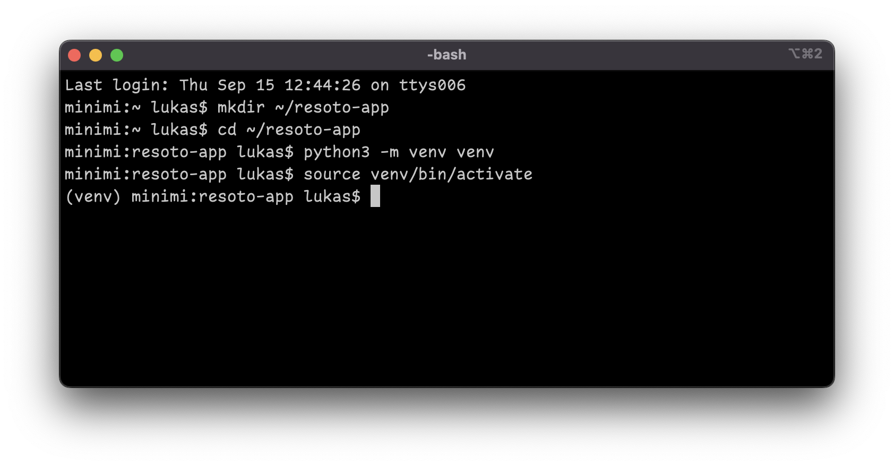

    :::info

    If you close the Terminal app, you will need to re-activate the virtual environment the next time. Simply switch to the `resoto-app` directory, then execute the `venv\Scripts\activate` command:

    ```bash
    $ cd ~/resoto-app
    $ source venv/bin/activate
    ```

    :::

    </TabItem>

    <TabItem value="windows" label="Windows">

    In PowerShell, create a new directory for your project, create a new virtual environment and activate it by running the following commands:

    ```powershell
    > $documents = [Environment]::GetFolderPath("MyDocuments")
    > md $documents\resoto-app
    > cd $documents\resoto-app
    > python -m venv venv
    > venv\Scripts\activate
    ```

    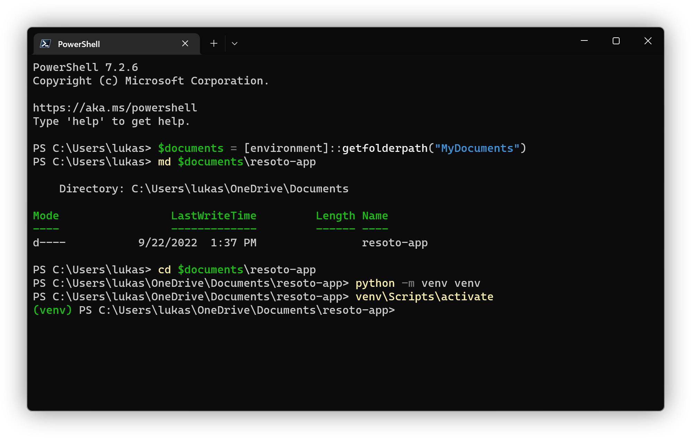

    :::info

    If you close Powershell, you will need to re-activate the virtual environment the next time. Simply switch to the `resoto-app` directory, then execute the `venv\Scripts\activate` command:

    ```powershell
    > cd $documents\resoto-app
    > venv\Scripts\activate
    ```

    :::

    </TabItem>

    </Tabs>

2.  In your text editor, create a new file named `requirements.txt` inside the `resoto-app` directory:

    ```python title="requirements.txt"
    resotoclient[extras]
    resotodata
    resotolib
    streamlit
    pydeck
    numpy
    ```

    :::caution

    In production environments, you should pin the version of each package (e.g., `resotolib==2.4.1`).

    :::

    Here's a quick overview of the dependencies:

    | Package | Description |
    | --- | --- |
    | [`streamlit`](https://streamlit.io) | The framework we're using to create this web app. |
    | [`resotoclient`](https://github.com/someengineering/resotoclient-python) | The Resoto Python client library, used to connect to the Resoto API to retrieve infrastructure data as [Pandas dataframes](https://pandas.pydata.org) and [<abbr title="JavaScript Object Notation">JSON</abbr>](https://json.org) |
    | [`resotodata`](https://github.com/someengineering/resotodata) | Contains static data, like the locations of cloud data centers. |
    | [`resotolib`](https://github.com/someengineering/resoto/tree/main/resotolib) | A collection of helper functions for Resoto. (The one we'll be using converts bytes into human-readable units like GiB, TiB, etc.) |
    | [`pydeck`](https://deckgl.readthedocs.io) | A library for making spatial visualizations. We'll use it to display the locations of cloud resources on a map. |
    | [`numpy`](https://numpy.org) | A math library for working with the data Resoto returns. |

3.  Now, we can install the dependencies listed in `requirements.txt` using `pip`:

    <Tabs groupId="operating-system">

    <TabItem value="linux" label="Linux/macOS">

    ```bash
    $ pip install -r requirements.txt
    ```

    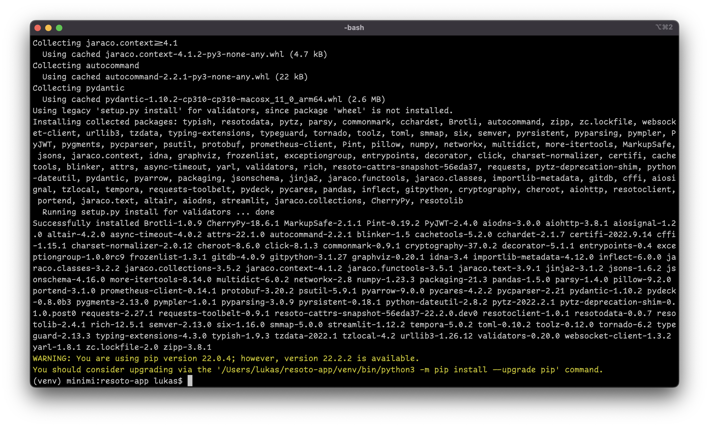

    </TabItem>

    <TabItem value="windows" label="Windows">

    ```powershell
    pip install -r requirements.txt
    ```

    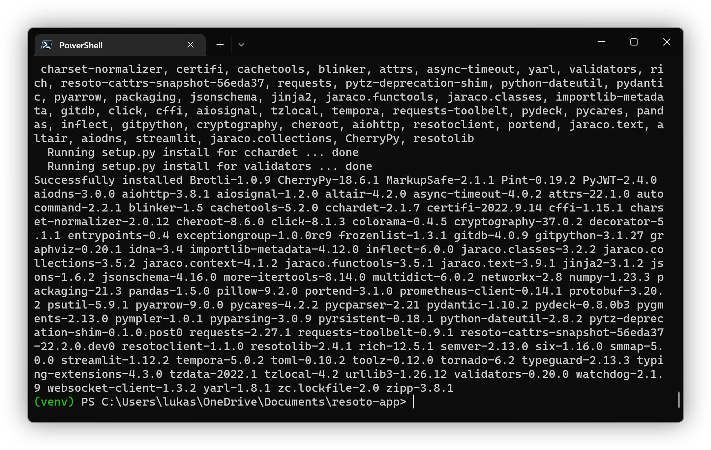

    :::note

    If you encounter the `Microsoft Visual C++ 14.0 or greater is required.` error message, download and install [Microsoft C++ Build Tools](https://visualstudio.microsoft.com/visual-cpp-build-tools) as instructed.

    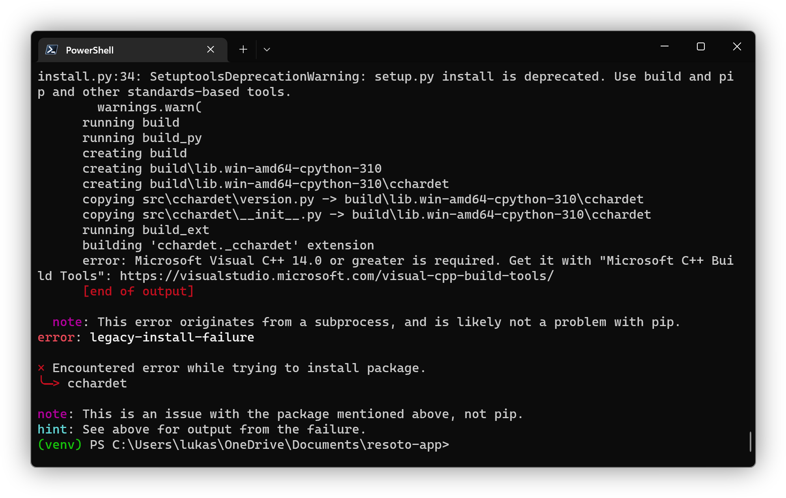

    Be sure to select the **Desktop development with C++** option during installation:

    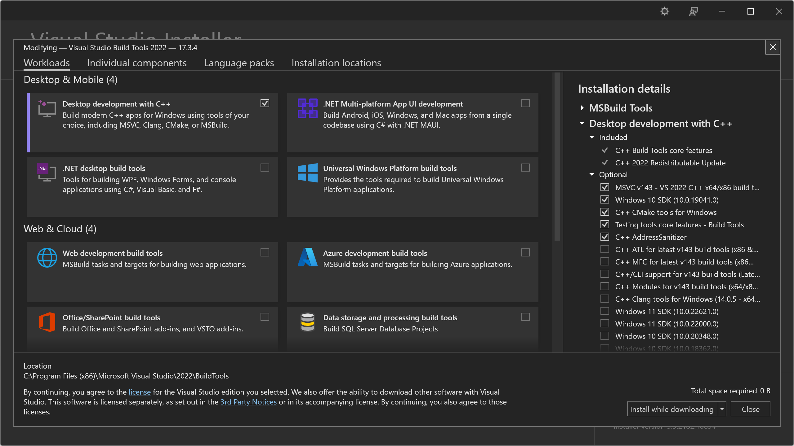

    Once installation is complete, execute `pip install -r requirements.txt` again.

    :::

    </TabItem>

    </Tabs>

### Creating a Demo App

Now that we've set up the project environment, we can start creating the infrastructure app.

**Let's start with a simple demo app to verify that the environment is set up correctly.**

1.  Create a file `app.py` inside the `resoto-app` directory:

    ```python title="app.py"
    import streamlit as st
    from resotoclient import ResotoClient

    resoto = ResotoClient(url="https://localhost:8900", psk="changeme")

    st.set_page_config(page_title="Cloud Dashboard", page_icon=":cloud:", layout="wide")
    st.title("Cloud Dashboard")

    df = resoto.dataframe("is(instance)")
    st.dataframe(df)
    ```

    <details>

    <summary>Code Explanation</summary>

    <div>

    Let's take a look at the meaning of each line of the above code.

    ```python
    import streamlit as st
    from resotoclient import ResotoClient
    ```

    This is the import section of the app. In it we import libraries that other people have written and made available to us. Imports typically happen at the beginning of a file. These two lines import the `streamlit` and `resotoclient` libraries into the project.

    - In the first import we use the `as` keyword to assign `streamlit` a shorter name.
    - In the second line, instead of importing all of `resotoclient` we tell Python to only import the `ResotoClient` class.

    ```python
    resoto = ResotoClient(url="https://localhost:8900", psk="changeme")
    ```

    Here we initialize a new instance of the Resoto Client and assign it to the variable `resoto`, passing a Resoto Core URL and pre-shared key (PSK) as arguments. The PSK is used to authenticate the client against the Resoto Core.

    ```python
    st.set_page_config(page_title="Cloud Dashboard", page_icon=":cloud:", layout="wide")
    st.title("Cloud Dashboard")
    ```

    These two lines set the page title and icon. The `page_icon` argument is an emoji that will be displayed in the browser tab. The `layout` argument tells Streamlit to use the full width of the browser window. With `st.title`

    ```python
    df = resoto.dataframe("is(instance)")
    st.dataframe(df)
    ```

    For now, these two lines are only here for demo purposes. We ask Resoto to [search](/docs/reference/search) for everything that is a compute instance and return it as a [Pandas DataFrame](https://pandas.pydata.org/docs/reference/api/pandas.DataFrame.html). We then pass the DataFrame to [Streamlit](https://streamlit.io)'s `st.dataframe` function to display it as a table in the app.

    Think of dataframes as an Excel spreadsheet. Resoto stores all of its data in a [graph](https://en.wikipedia.org/wiki/Directed_acyclic_graph), and `resoto.dataframe()` allows us to search that graph and flatten the result into a DataFrame that can be consumed by [Streamlit](https://streamlit.io).

    </div>

    </details>

2.  Modify the `url` and `psk` values to match your local Resoto Core URL and pre-shared key. The above reflects the default values for a [Docker Compose install](/docs/getting-started/install-resoto/docker).

3.  Save the file and switch back to the terminal.

### Running the App

1.  Run [Streamlit](https://streamlit.io) by executing following command:

    <Tabs groupId="operating-system">

    <TabItem value="linux" label="Linux/macOS">

    ```bash
    $ streamlit run app.py
    ```

    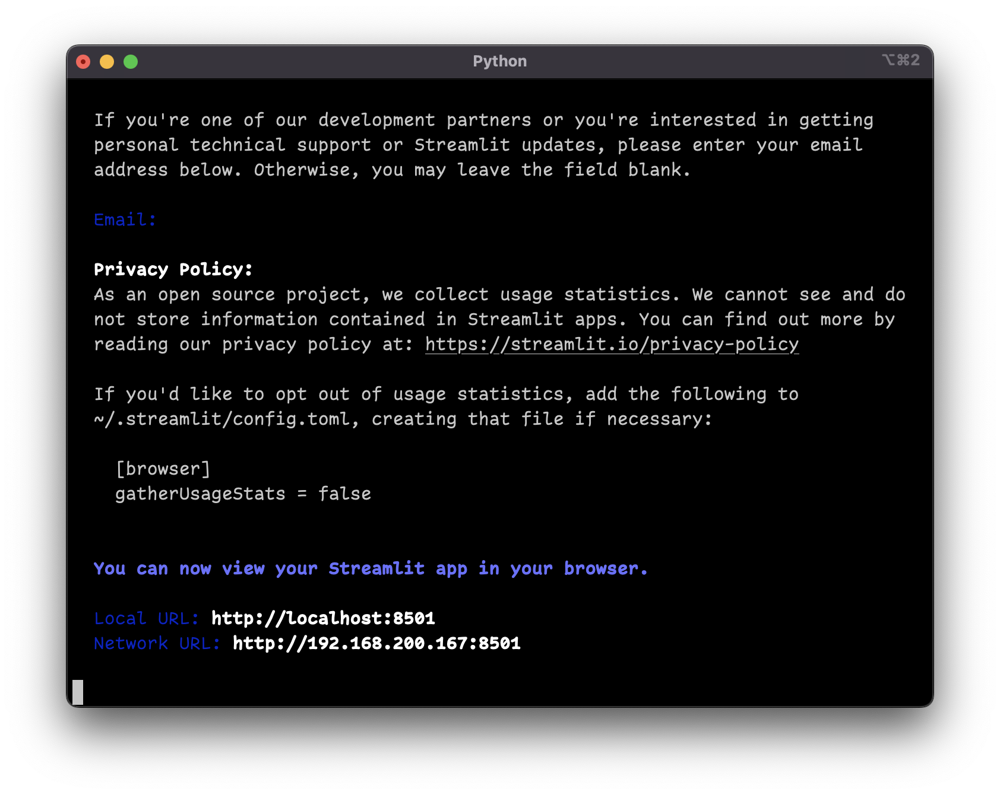

    </TabItem>

    <TabItem value="windows" label="Windows">

    ```powershell
    streamlit run app.py
    ```

    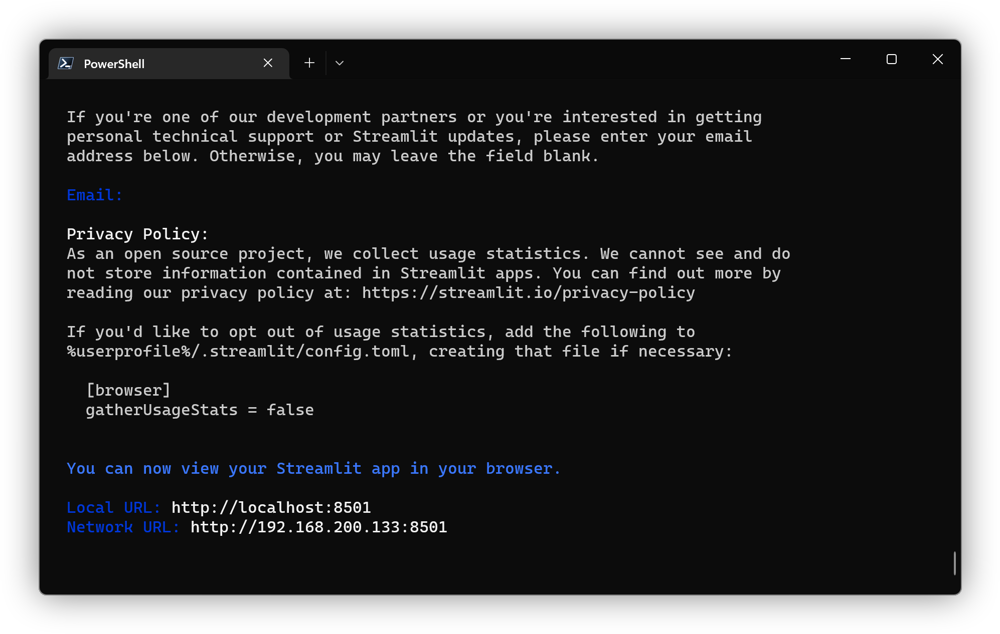

    :::note

    The first time you run [Streamlit](https://streamlit.io) on Windows, you may see the following Windows Defender Firewall alert:

    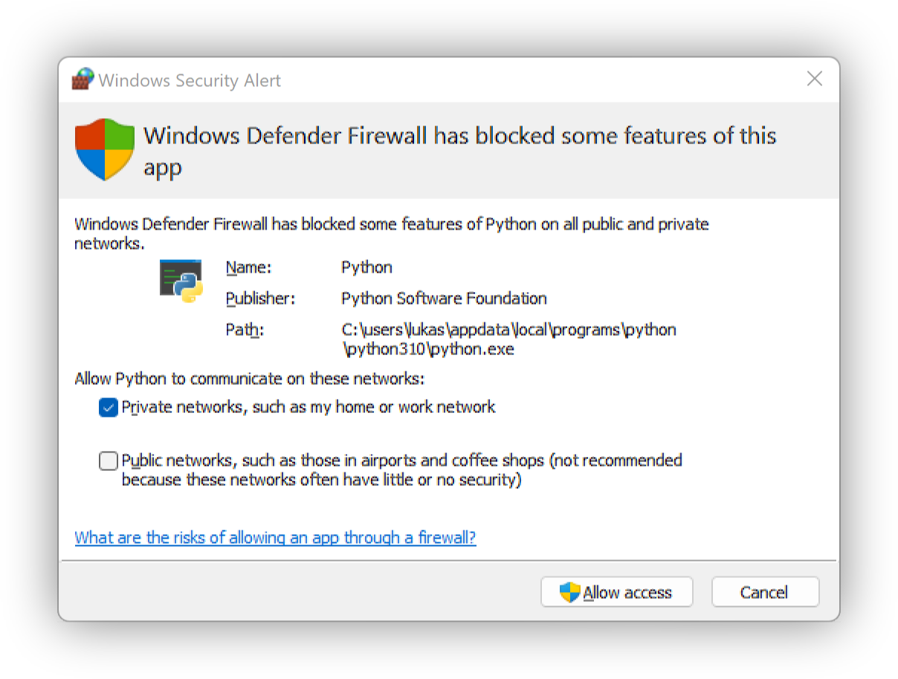

    Click the **Allow access** button to allow your browser to access the local [Streamlit](https://streamlit.io) web server.

    :::

    </TabItem>

    </Tabs>

2.  Your browser should open [`http://localhost:8501`](http://localhost:8501) and display the following page:

    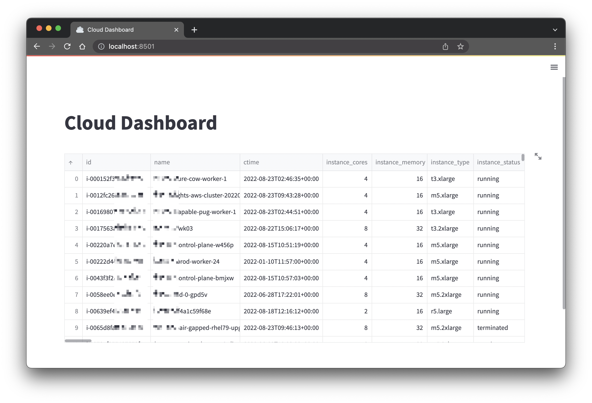

### Defining the App Layout

Now that we have a basic app up and running, let's define the final desired layout.

1. Delete the last two lines of code from `app.py`:

   ```diff
   - df = resoto.dataframe("is(instance)")
   - st.dataframe(df)
   ```

2. Then, add the following code:

   ```python
   col_instance_metrics, col_volume_metrics = st.columns(2)
   col_instance_details, col_storage = st.columns(2)
   map_tab, top10_tab, age_tab = col_instance_details.tabs(["Locations", "Top 10", "Age"])
   ```

   This gives us seven new variables:

   - `col_instance_metrics` and `col_volume_metrics` are columns. **Columns split the screen horizontally.** The `st.columns()` function takes a number as an argument and returns that many columns. We want two columns, so we pass the number `2` as the argument. These two columns are where we will add the instance and volume metrics.
   - `col_instance_details` and `col_storage` are also columns. The former is where we will add instance details and the latter is where we will add a sunburst chart.
   - `map_tab`, `top10_tab` and `age_tab` are tabs. **Tabs provide a way to switch between different views.** The `st.tabs()` function takes a list of tab names as an argument.

3. When you reload the app in your browser, it should now look like this:

   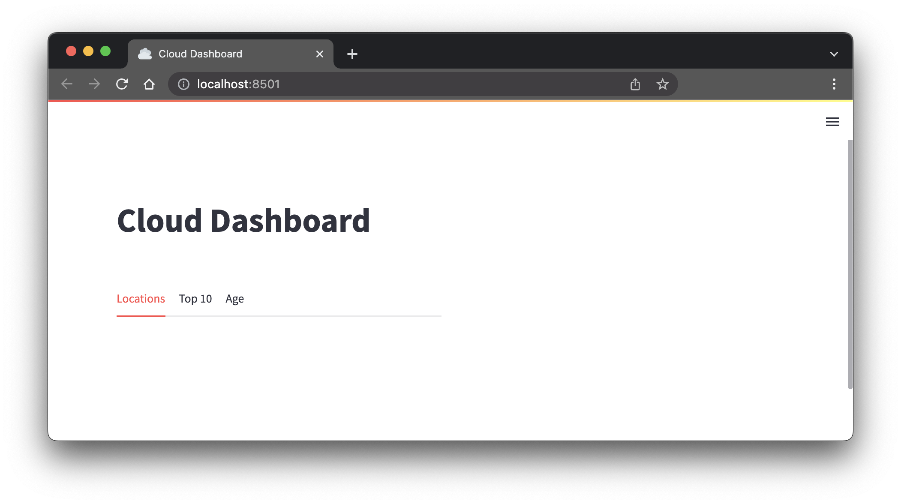

### Adding Data

Now that the layout is in place, let's add some data!

#### Instance Metrics

We'll begin with instance metrics.

1.  Add the following import at the top of `app.py`:

    ```python
    from resotolib.utils import iec_size_format
    ```

    This line imports a function `iec_size_format()` that we will use to format the instance metrics. It turns bytes into human readable GiB, TiB, etc.

2.  Append the following code to the end of `app.py`:

    ```python showLineNumbers
    resoto_search = "aggregate(sum(1) as instances_total, sum(instance_cores) as cores_total, sum(instance_memory*1024*1024*1024) as memory_total): is(instance)"
    instances_info = list(resoto.search_aggregate(resoto_search))[0]
    col_instance_metrics.metric("Instances", instances_info["instances_total"])
    col_instance_metrics.metric("Cores", instances_info["cores_total"])
    col_instance_metrics.metric("Memory", iec_size_format(instances_info["memory_total"]))
    ```

    <details>

    <summary>Code Explanation</summary>

    <div>

    - In the first line, we define a variable `resoto_search` which contains [an aggregate search](/docs/reference/search/aggregation). You can copy and paste the search into [Resoto Shell](/docs/reference/components/shell) to see what it does.

      In short, it searches for all instances (`is(instance)`) and returns the total number of instances (`sum(1) as instances_total`), the total number of CPU cores (`sum(instance_cores) as cores_total`) and the total amount of memory (`sum(instance_memory*1024*1024*1024) as memory_total`). (Instance memory is stored in GB in Resoto, but we need it in bytes so we multiply it by 1024\*1024\*1024 for the number of bytes.)

    - In the second line, we execute the search and store the result in the variable `instances_info`.

      The `list()` function is used to convert the result into a list. The result is a generator, so we convert it into a list so we can access it by index. Since the aggregate search only returns a single result, we can access it at index `0`.

      The resulting content of `instances_info` looks like this:

      ```json
      {
        "cores_total": 3158,
        "instances_total": 536,
        "memory_total": 13202410860544
      }
      ```

      When we use the `iec_size_format()` function on the `memory_total` value, we get a human readable string:

      ```python
      >>> iec_size_format(instances_info["memory_total"])
      ​'12.01 TiB'
      ```

    - The final three lines of code use the `st.metric()` function to display the instance metrics. The `st.metric()` function takes three arguments: a label, a value and an optional delta. The delta is the difference between the current value and the previous value. We don't have a previous value so we don't use it.

      Because we don't want the metrics to be appended at the end of the page we apply the `metric()` function on the `col_instance_metrics` variable we created earlier. This tells [Streamlit](https://streamlit.io) to display the metrics in the appropriate column.

    </div>

    </details>

3.  Reload the browser tab. You should see the instance metrics on the left side:

    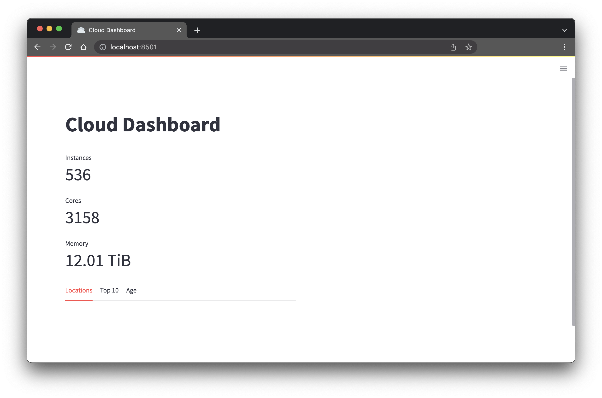

#### Volume Metrics

1. Append the following code to the end of `app.py`:

   ```python
   resoto_search = "aggregate(sum(1) as volumes_total, sum(volume_size*1024*1024*1024) as volumes_size): is(volume)"
   volumes_info = list(resoto.search_aggregate(resoto_search))[0]
   col_volume_metrics.metric("Volumes", volumes_info["volumes_total"])
   col_volume_metrics.metric("Size", iec_size_format(volumes_info["volumes_size"]))
   ```

   The code is the same as for the instance metrics except that we search for volumes instead of instances.

2. Reload the browser tab. You should see volume metrics on the right side:

   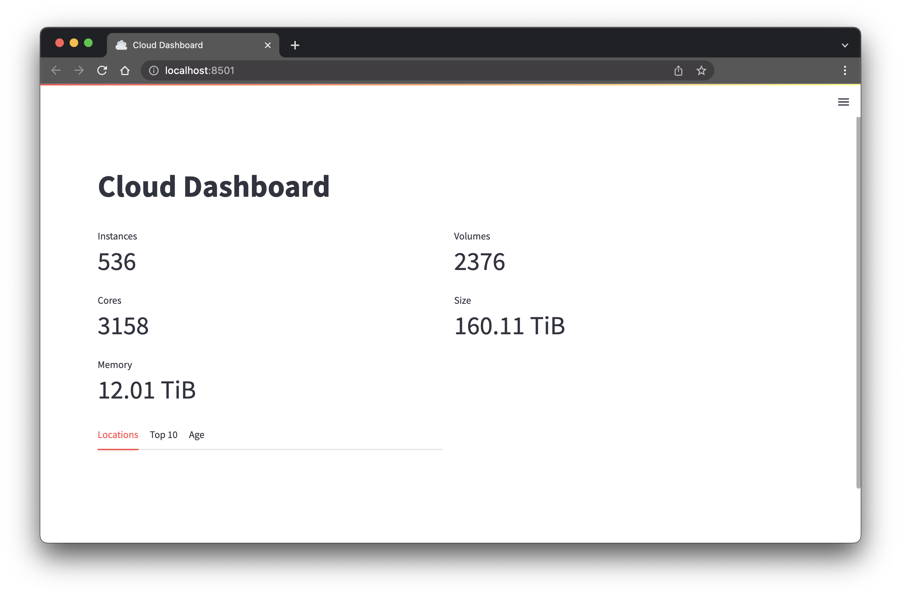

#### World Map

Next, we are going to add the most complex element of the app: a world map.

1.  Add the following imports at the top of `app.py`:

    ```python
    import pydeck as pdk
    import numpy as np
    from resotodata.cloud import regions as cloud_regions
    ```

2.  Append the following code to the end of `app.py`:

    ```python showLineNumbers
    resoto_search = "aggregate(/ancestors.cloud.reported.name as cloud, /ancestors.region.reported.name as region: sum(1) as instances_total): is(aws_ec2_instance) or is(gcp_instance)"
    df = resoto.dataframe(resoto_search)
    df["latitude"], df["longitude"] = 0, 0
    for x, y in df.iterrows():
        location = cloud_regions.get(y["cloud"], {}).get(y["region"], {})
        df.at[x, "latitude"] = location.get("latitude", 0)
        df.at[x, "longitude"] = location.get("longitude", 0)
    midpoint = (np.average(df["latitude"]), np.average(df["longitude"]))
    map_tab.pydeck_chart(
        pdk.Deck(
            map_style=None,
            initial_view_state=pdk.ViewState(
                latitude=midpoint[0], longitude=midpoint[1], zoom=2, pitch=50
            ),
            tooltip={
                "html": "<b>{instances_total}</b> instances running in {region} ({cloud})",
                "style": {
                    "background": "grey",
                    "color": "white",
                    "font-family": '"Helvetica Neue", Arial',
                    "z-index": "10000",
                },
            },
            layers=[
                pdk.Layer(
                    "ColumnLayer",
                    data=df,
                    get_position=["longitude", "latitude"],
                    get_elevation="instances_total",
                    get_fill_color="cloud == 'aws' ? [217, 184, 255, 150] : [255, 231, 151, 150]",
                    elevation_scale=10000,
                    radius=100000,
                    pickable=True,
                    auto_highlight=True,
                )
            ],
        )
    )
    ```

    <details>

    <summary>Code Explanation</summary>

    <div>

    - First, the three imports:

      1. `pydeck` is used to create the world map.
      2. `numpy` is used to calculate the midpoint of the map.
      3. `resotodata.cloud` is used to get the latitude and longitude of the cloud provider regions.

    - We then do an aggregate search to get the number of instances per region. The search is similar to the one we used for the instance metrics. The only difference is that we also return the cloud provider and region name. We store the result in the variable `df`, which is a [Pandas `DataFrame`](https://pandas.pydata.org/pandas-docs/stable/reference/api/pandas.DataFrame.html). The `resoto.dataframe()` function is used to convert the result into a `DataFrame`.

      The contents of the `DataFrame` look something like this:

      ```python
      >>> df
        instances_total cloud        region
      0                7   aws  eu-central-1
      1               55   aws     us-east-1
      2                2   aws     us-east-2
      3              405   aws     us-west-2
      4               12   gcp   us-central1
      ```

    - Next, we add two new columns to the DataFrame: `latitude` and `longitude`. We use the `resotodata` library to get the latitude and longitude of the cloud provider regions. We store the result in the `latitude` and `longitude` columns.

      When we look at the structure of `cloud_regions`, we see that it is a dictionary with the cloud provider names as keys. The value of each entry is _another_ dictionary with region names as keys. The value of this region dictionary is an object containing `latitude` and `longitude` properties:

      ```python
      >>> print(cloud_regions)
      ​{'aws': {'af-south-1': {'latitude': -33.928992,
      ​                        'long_name': 'Africa (Cape Town)',
      ​                        'longitude': 18.417396,
      ​                        'short_name': 'af-south-1'},
      ​         'ap-east-1': {'latitude': 22.2793278,
      ​                       'long_name': 'Asia Pacific (Hong Kong)',
      ​                       'longitude': 114.1628131,
      ​                       'short_name': 'ap-east-1'},
      ​...
      ```

    - The `midpoint` variable is used to center the map. We use the `numpy` library to calculate the average latitude and longitude of the DataFrame.

    - We then use the `pydeck` library to create the map. The `pydeck` library is used to create interactive maps in Python.

      We use `ColumnLayer` to create the map. `ColumnLayer` is used to create 3-D columns. We use the `latitude` and `longitude` columns to position the columns and the `instances_total` column to set the height.

      The tertiary operator (`?`) is used to set the color based on the value of the `cloud` column:

      ```python
      get_fill_color="cloud == 'aws' ? [217, 184, 255, 150] : [255, 231, 151, 150]",
      ```

      This has the same result as the following code:

      ```python
      if cloud == 'aws':
          get_fill_color = [217, 184, 255, 150]
      else:
          get_fill_color = [255, 231, 151, 150]
      ```

      The four elements of the `get_fill_color` list are the red, green, blue, and alpha values. The alpha value defines the transparency of the color.

      See the [`pydeck` documentation](https://deckgl.readthedocs.io/en/latest/gallery/column_layer.html) for more information about `ColumnLayer`.

    </div>

    </details>

3.  Reload the browser tab. You should see a world map displaying where your instances are running:

    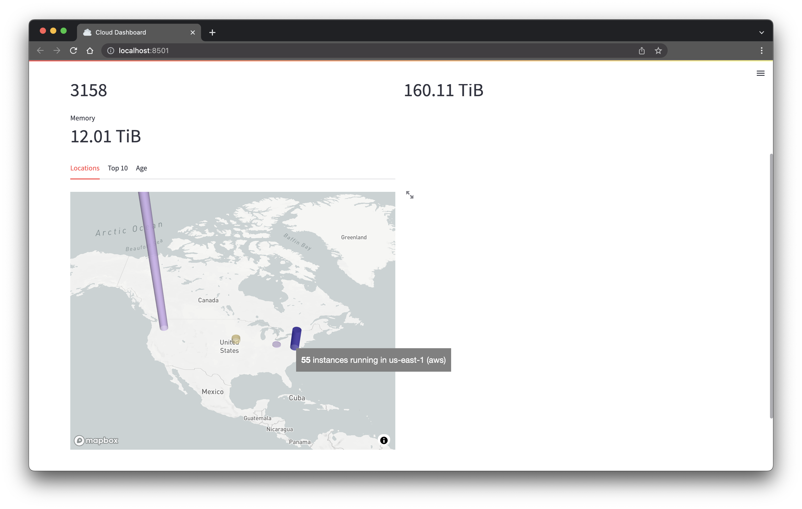

#### Top 10

This is an easy one. It's similar to the [demo app](#creating-a-demo-app), but instead of displaying the dataframe unchanged we use some of Panda's built-in functions to display the top 10 accounts and regions by on-demand cost.

1.  Append the following code to the end of `app.py`:

    ```python showLineNumbers
    top10_tab.header("Top 10 accounts and regions")
    resoto_search = "aggregate(/ancestors.cloud.reported.name as cloud, /ancestors.account.reported.name as account, /ancestors.region.reported.id as region: sum(/ancestors.instance_type.reported.ondemand_cost) as ondemand_cost): is(instance)"
    df = (
        resoto.dataframe(resoto_search)
        .nlargest(n=10, columns=["ondemand_cost"])
        .sort_values(by=["ondemand_cost"], ascending=False)
        .reset_index(drop=True)
    )
    top10_tab.table(df.style.format({"ondemand_cost": "${:.2f}/h"}))
    ```

    <details>

    <summary>Code Explanation</summary>

    <div>

    The DataFrame looks like this:

    ```python
    >>> resoto.dataframe(resoto_search)
    ​    ondemand_cost     cloud                    account          region
    ​0        0.166400       aws                eng-devprod       us-east-1
    ​1        0.768000       aws                eng-devprod       us-west-2
    ​2        7.104000       aws        eng-sphere-insights       us-west-2
    ​3        0.192000       aws        eng-sphere-platform       us-east-1
    ​4       26.304000       aws        eng-sphere-platform       us-west-2
    ​5        3.648000       aws           eng-ksphere-soak       us-east-1
    ​6        6.460800       aws           eng-ksphere-soak       us-west-2
    ​7        0.166400       aws          eng-qualification       us-east-1
    ​...
    ```

    We then sort the DataFrame by the `ondemand_cost` column and only show the top 10 rows. We use the `top10_tab.table()` function to display the DataFrame as a table.

    The `style.format()` function formats the `ondemand_cost` column with a [Python format string](https://docs.python.org/3/library/string.html#format-string-syntax). `:.2f` means that we want a floating-point number with two decimal places.

    </div>

    </details>

2.  Reload the browser, select the "Top 10" tab and you should see the following:

    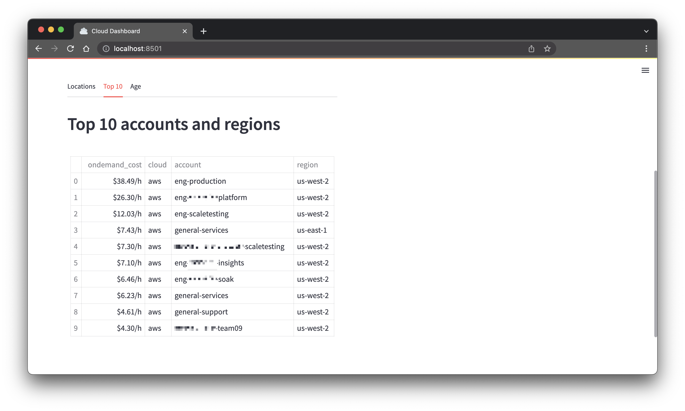

#### Sunburst Chart

1.  Add the following import at the top of `app.py`:

    ```python
    import plotly.express as px
    ```

    We use the `plotly.express` library to create the sunburst chart. The `plotly` library is used to create interactive charts in Python.

2.  Append the following code to the end of `app.py`:

    ```python showLineNumbers
    resoto_search = "aggregate(/ancestors.cloud.reported.name as cloud, /ancestors.account.reported.name as account: sum(volume_size*1024*1024*1024) as volume_size): is(volume)"
    df = resoto.dataframe(resoto_search)
    df["volume_size_human"] = df["volume_size"].apply(iec_size_format)
    fig = px.sunburst(
        df,
        path=["cloud", "account"],
        values="volume_size",
        hover_data=["cloud", "account", "volume_size_human"],
    )
    fig.update_traces(hoverinfo="label+percent entry", textinfo="label+percent entry")
    col_storage.plotly_chart(fig)
    ```

    <details>

    <summary>Code Explanation</summary>

    <div>

    This aggregate search returns a DataFrame that looks like this:

    ```python
    >>> resoto.dataframe(resoto_search)
    ​       volume_size         cloud                        account
    ​0     223338299392           aws                    eng-devprod
    ​1    2940978855936           aws            eng-sphere-insights
    ​2       2147483648           aws                eng-sphere-kudo
    ​3   11857330962432           aws            eng-sphere-platform
    ​4    5625333415936           aws                eng-sphere-soak
    ​5    4778151116800           aws                         eng-ds
    ​...
    ```

    - `df["volume_size_human"] = df["volume_size"].apply(iec_size_format)` adds a new column to the DataFrame. The new column is called `volume_size_human` and it contains the volume size in human readable format by asking Pandas to apply the `iec_size_format` function to the `volume_size` column.

    - `px.sunburst()` creates a sunburst chart from the DataFrame. The `path` argument tells the function which columns to use for the different levels of the sunburst chart. The `values` argument tells the function which column to use for the size of the slices. The `hover_data` argument tells the function which columns to show when hovering over a slice.

    - `fig.update_traces()` updates the properties of the slices. The `hoverinfo` argument tells the function which information to show when hovering over a slice. The `textinfo` argument tells the function which information to show in the center of the sunburst chart.

    </div>

    </details>

3.  Reload the browser and you should see a sunburst chart:

    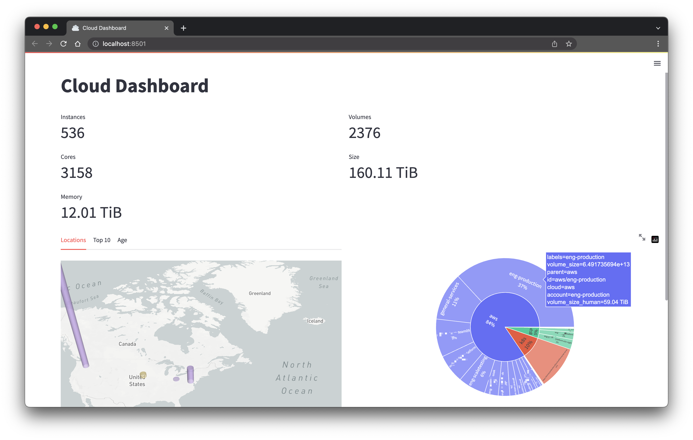

#### Heatmap

This will be quite similar to the sunburst chart; we're again using the `plotly.express` library.

1. Append the following code to the end of `app.py`:

   ```python showLineNumbers
   st.header("Instance Types")
   resoto_search = "aggregate(/ancestors.cloud.reported.name as cloud, /ancestors.account.reported.name as account_name, instance_type as instance_type, instance_cores as instance_cores: sum(1) as instances): is(instance)"
   df = resoto.dataframe(resoto_search).sort_values(by=["instance_cores"])
   fig = px.density_heatmap(
       df,
       x="instance_type",
       y="account_name",
       z="instances",
       color_continuous_scale="purples",
   )
   st.plotly_chart(fig, use_container_width=True)
   ```

2. Reload the browser and you should see a heatmap:

   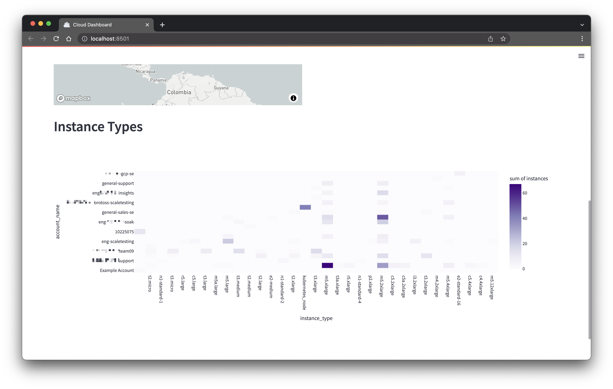

#### Instance Age Distribution

Finally, we will add a histogram of the instance age distribution. (We're adding this last because it can take a while to load.)

1.  Add the following import at the top of `app.py`:

    ```python
    import pandas as pd
    ```

2.  Append the following code to the end of `app.py`:

    ```python showLineNumbers
    resoto_search = "is(instance)"
    df = resoto.dataframe(resoto_search)
    df["age_days"] = (pd.Timestamp.utcnow() - df["ctime"]).dt.days
    fig = px.histogram(
        df,
        x="age_days",
        nbins=50,
        title="Instance Age Distribution",
        labels={"age_days": "age in days"},
        color="account_name",
    )
    age_tab.plotly_chart(fig, use_container_width=True)
    ```

    <details>

    <summary>Code Explanation</summary>

    <div>

    - We create a new `age_days` column, calculated by subtracting the `ctime` column from the current time, and use it as the basis for the x-axis of the histogram.
    - `ctime` is the time when an instance was created.
    - `nbins` is the number of bins to use for the histogram. All instances within a certain age range are grouped together in a bin.

    </div>

    </details>

3.  Reload the browser and you should see a histogram, with different colors representing different accounts:

    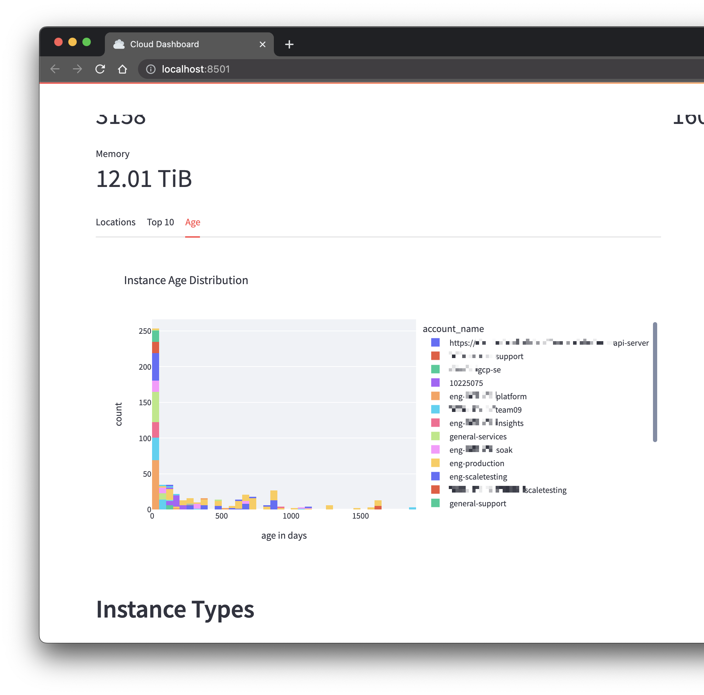

### The Final Product

<details>

<summary>Complete App Code</summary>

<div>

```python title="app.py" showLineNumbers
import streamlit as st
import pydeck as pdk
import numpy as np
import pandas as pd
import plotly.express as px
from resotoclient import ResotoClient
from resotolib.utils import iec_size_format
from resotodata.cloud import regions as cloud_regions

resoto = ResotoClient(url="https://localhost:8900", psk="changeme")

# Page config
st.set_page_config(page_title="Cloud Dashboard", page_icon=":cloud:", layout="wide")
st.title("Cloud Dashboard")

# Page layout
col_instance_metrics, col_volume_metrics = st.columns(2)
col_instance_details, col_storage = st.columns(2)
map_tab, top10_tab, age_tab = col_instance_details.tabs(["Locations", "Top 10", "Age"])

# Instance metrics
resoto_search = "aggregate(sum(1) as instances_total, sum(instance_cores) as cores_total, sum(instance_memory*1024*1024*1024) as memory_total): is(instance)"
instances_info = list(resoto.search_aggregate(resoto_search))[0]
col_instance_metrics.metric("Instances", instances_info["instances_total"])
col_instance_metrics.metric("Cores", instances_info["cores_total"])
col_instance_metrics.metric("Memory", iec_size_format(instances_info["memory_total"]))

# Volume metrics
resoto_search = "aggregate(sum(1) as volumes_total, sum(volume_size*1024*1024*1024) as volumes_size): is(volume)"
volumes_info = list(resoto.search_aggregate(resoto_search))[0]
col_volume_metrics.metric("Volumes", volumes_info["volumes_total"])
col_volume_metrics.metric("Size", iec_size_format(volumes_info["volumes_size"]))

# World map of instance locations
resoto_search = "aggregate(/ancestors.cloud.reported.name as cloud, /ancestors.region.reported.name as region: sum(1) as instances_total): is(aws_ec2_instance) or is(gcp_instance)"
df = resoto.dataframe(resoto_search)
df["latitude"], df["longitude"] = 0, 0
for x, y in df.iterrows():
    location = cloud_regions.get(y["cloud"], {}).get(y["region"], {})
    df.at[x, "latitude"] = location.get("latitude", 0)
    df.at[x, "longitude"] = location.get("longitude", 0)
midpoint = (np.average(df["latitude"]), np.average(df["longitude"]))
map_tab.pydeck_chart(
    pdk.Deck(
        map_style=None,
        initial_view_state=pdk.ViewState(
            latitude=midpoint[0], longitude=midpoint[1], zoom=2, pitch=50
        ),
        tooltip={
            "html": "<b>{instances_total}</b> instances running in {region} ({cloud})",
            "style": {
                "background": "grey",
                "color": "white",
                "font-family": '"Helvetica Neue", Arial',
                "z-index": "10000",
            },
        },
        layers=[
            pdk.Layer(
                "ColumnLayer",
                data=df,
                get_position=["longitude", "latitude"],
                get_elevation="instances_total",
                get_fill_color="cloud == 'aws' ? [217, 184, 255, 150] : [255, 231, 151, 150]",
                elevation_scale=10000,
                radius=100000,
                pickable=True,
                auto_highlight=True,
            )
        ],
    )
)

# Top 10 accounts and regions by on-demand cost
top10_tab.header("Top 10 accounts and regions")
resoto_search = "aggregate(/ancestors.cloud.reported.name as cloud, /ancestors.account.reported.name as account, /ancestors.region.reported.id as region: sum(/ancestors.instance_type.reported.ondemand_cost) as ondemand_cost): is(instance)"
df = (
    resoto.dataframe(resoto_search)
    .nlargest(n=10, columns=["ondemand_cost"])
    .sort_values(by=["ondemand_cost"], ascending=False)
    .reset_index(drop=True)
)
top10_tab.table(df.style.format({"ondemand_cost": "${:.2f}/h"}))

# Sunburst of storage distribution
resoto_search = "aggregate(/ancestors.cloud.reported.name as cloud, /ancestors.account.reported.name as account: sum(volume_size*1024*1024*1024) as volume_size): is(volume)"
df = resoto.dataframe(resoto_search)
df["volume_size_human"] = df["volume_size"].apply(iec_size_format)
fig = px.sunburst(
    df,
    path=["cloud", "account"],
    values="volume_size",
    hover_data=["cloud", "account", "volume_size_human"],
)
fig.update_traces(hoverinfo="label+percent entry", textinfo="label+percent entry")
col_storage.plotly_chart(fig)

# Heatmap of instance types
st.header("Instance Types")
resoto_search = "aggregate(/ancestors.cloud.reported.name as cloud, /ancestors.account.reported.name as account_name, instance_type as instance_type, instance_cores as instance_cores: sum(1) as instances): is(instance)"
df = resoto.dataframe(resoto_search).sort_values(by=["instance_cores"])
fig = px.density_heatmap(
    df,
    x="instance_type",
    y="account_name",
    z="instances",
    color_continuous_scale="purples",
)
st.plotly_chart(fig, use_container_width=True)

# Age distribution of instances
resoto_search = "is(instance)"
df = resoto.dataframe(resoto_search)
df["age_days"] = (pd.Timestamp.utcnow() - df["ctime"]).dt.days
fig = px.histogram(
    df,
    x="age_days",
    nbins=50,
    title="Instance Age Distribution",
    labels={"age_days": "age in days"},
    color="account_name",
)
age_tab.plotly_chart(fig, use_container_width=True)
```

</div>

</details>

## What's Next?

We've covered the basics of building an infrastructure app with Resoto and [Streamlit](https://streamlit.io). Currently, we are only displaying data, but in my next post we will introduce input widgets to add interactive functions to the app.
