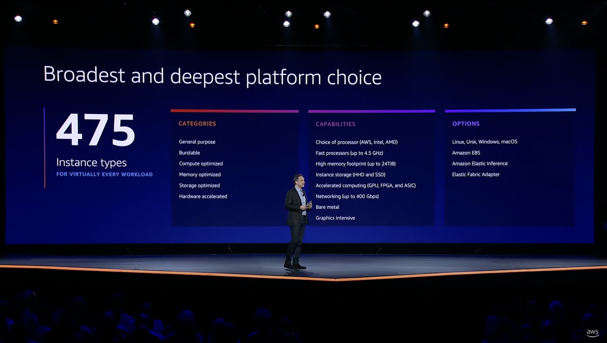

# Cloud Asset Inventory

**A cloud asset inventory is a complete representation of the resources in your cloud.** The job of the inventory is to continuously discover new resources and store data about each individual resource (such as its properties, configurations, and dependencies). Examples of resources not only include compute instances, storage buckets, Kubernetes pods, but also access keys and user and org policies.

In modern cloud-native environments, developers enjoy freedom and permissions to create new resources. The resources in a company's cloud environment can easily number in the hundreds of thousands or millions, resulting in new challenges for infrastructure engineers. One such problem is "infrastructure fragmentation"—resources are distributed across regions, organizations, accounts, and/or projects, and each resource has unique properties and APIs. Coupled with constant change, this fragmentation makes it difficult to keep track of resources, which opens the door to cost problems, security threats, and compliance issues.

**A cloud asset inventory solves the infrastructure fragmentation problem by providing complete visibility into all resources from a single place.**

<!--truncate-->

## The Evolution of Cloud Offerings and New Challenges

**Since 2006, cloud providers have launched hundreds of new products.** Market leader [Amazon Web Services (AWS)](https://aws.amazon.com) alone offers a portfolio of over two hundred fully-featured services today.

Two hundred may not seem significant until you start looking at the <abbr title="stock-keeping units">SKU</abbr>s for each service. Consider [<abbr title="Elastic Compute Cloud">EC2</abbr>](https://aws.amazon.com/ec2), <abbr title="Amazon Web Services">AWS</abbr>' computing flagship service which comes in over 475 [instance types](https://aws.amazon.com/ec2/instance-types) with various combinations of CPU, memory, storage, and networking capacity. "And we're not even close to being done," said <abbr title="Amazon Web Services">AWS</abbr> CEO Adam Selipsky during the 2021 [<abbr title="Amazon Web Services">AWS</abbr> re:Invent keynote](https://youtube.com/watch?v=WGA2P_oH5Xc).

[<span class="badge badge--secondary">AWS re:Invent 2021 - Keynote with Adam Selipsky</span>](https://youtube.com/watch?v=WGA2P_oH5Xc)

With the emergence of containers and serverless functions, services have only become even more abstract, and the size of the individual deliverables smaller. And since cloud providers often match each other's portfolios, these trends apply to [Azure](https://azure.microsoft.com), [Google Cloud](https://cloud.google.com), [DigitalOcean](https://digitalocean.com), and others as well.

### Infrastructure Fragmentation, a New Type of Technical Debt

On the enterprise side, adoption of new cloud services is driving forward innovation.

**However, the flip side of that innovation is that companies now have an infrastructure fragmentation problem.** It's a new type of technical debt, where you lose track of the assets running in your infrastructure and how they relate to your business.

The driver behind this fragmentation is the growing distribution of cloud resources across organizations, regions, accounts, etc. Cloud providers obviously have data about where exactly these resources run, but that data is locked behind fragmented cloud APIs.

The following graph render depicts how vast the problem can be. It shows the <abbr title="Amazon Web Services">AWS</abbr> infrastructure snapshot of a 200-employee startup with over 400,000 cloud resources:


### What Is a Cloud Asset?

A cloud asset can be a resource such as a virtual machine, database, or storage bucket. An asset can also be a VPC, subnet, policy, security key, or IP address. Assets also include third-party cloud services, like an identity platform or even channels on [Slack](https://slack.com) or [Discord](https://discord.com). Cloud inventory consists of the many discrete assets that form your stack.

<abbr title="Information Technology">IT</abbr> used to control asset procurement. Now, developers have liberal permissions to spin up new cloud resources. Reintroducing the old, rigid process of submitting <abbr title="Information Technology">IT</abbr> support tickets would kill productivity.

If anything, companies have adopted new processes to iterate more quickly. Continuous integration (CI) and infrastructure-as-code (IaC) have enabled development teams to deploy more, faster. A startup with a hundred employees can easily have hundreds of thousands of resources, and larger enterprises millions.

### New Operational Challenges

Platform teams responsible for infrastructure today deal with three new challenges:

1. **Building a complete cloud asset inventory**

   It's hard to get a complete picture of all assets in a cloud. Resources are distributed across multiple regions and accounts, for reasons like architecture, high availability, geography, compliance, and separation of workloads. You have to peel through many layers of hierarchy to get answers to questions like, "How many total instances are running?"

2. **Tracking cloud resource and configuration changes**

   Frequent deployments lead to changes in the stack and its resources. When pipelines fail, they often leave behind orphaned assets. Developers also make changes and spin up resources through cloud consoles, unbeknownst to the platform team. These changes result in infrastructure drift, which in turn causes uncertainty, security issues, and toil.

3. **Data for cost, security, and compliance use cases**

   Platform teams need resource context to prioritize their work and take action. Creating actionable metrics like resource adoption, utilization, pricing, or tag coverage is impossible without complete inventory knowledge.

If left unmanaged, cloud infrastructure fragmentation results in incidents that slow down development. Sooner or later, resources hit quota limits and result in the failure of new deployments. Misconfigured resources expose critical data. Cloud bills pile up from zombie cloud resources.

## Tackling Infrastructure Fragmentation

Reducing infrastructure fragmentation is a preventative measure to avoid or prevent incidents before they occur, with fewer wasted engineering hours and lower cloud bills.

The first step to tackling infrastructure fragmentation is to create a complete inventory of all assets. This requires collecting data about the state and configuration of each resource in every cloud account.

### XOps Tools vs. Cloud Asset Inventory

XOps (DevOps, SecOps, FinOps, etc.) tools create inventories tailored for solving specific problems, such as performance, security, compliance, or cloud spend.

XOps tools only offer a retrospective, often with a narrow lens on a subset of inventory data. Their goal is to diagnose infrastructure issues and make adjustments to individual assets. They support a corresponding team (Dev, Security, Finance, etc.) and help "operate" and manage a single aspect of infrastructure.

A cloud asset inventory is different. A cloud asset inventory takes periodical snapshots of inventory data, creating full representations of your infrastructure at specific points in time. An inventory is a strategic, forward-looking tool that aligns infrastructure with company strategy and helps a company grow. Rather than supporting a single core use case like XOps tools, a cloud asset inventory prioritizes flexibility and exploration.

### Building a Cloud Asset Inventory

A cloud asset inventory should include two types of data:

1. **Resource data**, including but not limited to:
   - General resource information (e.g., name, ID, timestamp, tags),
   - Hierarchy information (e.g., region, account), and
   - Resource-specific information (e.g., CPU, memory, price, utilization, policy).
2. **Dependency data** that represents the relationship between different resources.

Modern cloud asset inventories use a [graph](/docs/concepts/asset-inventory-graph)-based data model, as it's better suited to capture dependencies than a traditional relational model. Resources are always connected to each other in some way. For example:

- A cloud account belongs to a region.
- A compute instance runs within a cloud account.
- A storage volume is attached to a compute instance.
- A load balancer sits in front of a target group.
- A target group is associated with an IP address.
- A target group runs a fleet of compute instances.

Dependencies are often nested and can run many levels deep. A [graph-based asset inventory](/docs/concepts/asset-inventory-graph) is particularly strong at exposing the hidden relationships between resources.

## Cloud Asset Inventory Accelerates Growth

With an inventory in place, all teams now benefit from exploring the [graph](/docs/concepts/asset-inventory-graph), either ad-hoc or by continuously running queries, to support a variety of use cases:

- Platform teams can create asset reports.
- Finance can track cost metrics.
- Engineering can identify unused resources.
- Security can discover attack paths.

Resource data also aids in planning and forecasting for holidays or events (Black Friday, Tax Day, etc.).

But most of all, a cloud asset inventory is a foundation for increasing development velocity. Platform teams can give developers liberal permissions without accumulating infrastructure fragmentation. Inventory data gives platform teams both visibility and control.

## Resoto vs. Native Cloud Inventory Tools

Cloud providers already offer native inventory tools that support their own resources, but platform teams support a wide range of assets across <abbr title="software-as-a-service">SaaS</abbr> tooling, legacy on-premises assets, and multi-cloud infrastructure.

### What Is Resoto?

**Resoto is an open-source cloud asset inventory platform and alternative to closed-source native tools.** Resoto is extensible through [plugins](/docs/reference/components/plugins), so anyone can [build or modify a collector](/docs/development/plugins) to suit their needs.

### Resoto Cloud Asset Inventory Platform Features

In addition, Resoto adds unique capabilities that solve the three major problems platform teams face when working with cloud inventory:

1. **Building a complete cloud asset inventory**

   Often, you don't even know what resources exist. There is no single place to search resources across all accounts. Resoto offers [full-text search](/docs/reference/search/full-text), which allows you to find resources that contain a specified string, with [filters](/docs/reference/search/filters) to refine your search. The experience is like googling your infrastructure.

2. **Tracking cloud resource and configuration changes**

   You can't steer a fleet of tens of thousands of resources by individually reviewing each resource. Metrics are a better solution. Metrics describe the state of your inventory, reflecting business goals like cost, usage, or compliance. [Resoto Metrics](/docs/reference/components/metrics) runs aggregation functions on inventory data and exposes them in [Prometheus](https://prometheus.io) format, which are easy to visualize in [Grafana dashboards](../actionable-cloud-infrastructure-metrics/index.mdx).

3. **Data for cost, security, and compliance use cases**

   Many tools either provide reporting or take action, but not both. This places the burden of resolving issues upon the platform team. [Resoto jobs](/docs/concepts/automation#jobs) automate actions based on your defined criteria and metrics. Actions include updating resource [tags](/docs/concepts/resource-management/tagging) and [cleaning up](/docs/concepts/resource-management/cleanup) unused resources.

### Resoto Use Case Scenario

Consider a scenario where a platform team announces a new cost policy. The policy requires that any <abbr title="Amazon Web Services">AWS</abbr> compute instance older than 24 hours with more than 32 cores be cleaned up.

Finding the instances that violate the policy is easy with Resoto's [search](/docs/reference/search):

```bash
> search is(aws_ec2_instance) and instance_cores > 32 and age > 24h
```

Then, adding a [job](/docs/concepts/automation#jobs) to automate [cleanup](/docs/concepts/resource-management/cleanup) after each new inventory snapshot is as simple as:

```bash
> jobs add 32_core_instance_cleanup --wait-for-event post_collect 'search is(aws_ec2_instance) and instance_cores > 32 and age > 24h | clean'
```

And just like that, the team has automated the work of enforcing the new cost policy.

### Try Resoto Today

Resoto is a cloud asset inventory tool that enables platform teams to create measurable <abbr title="key performance indicator">KPI</abbr>s they can track over time, build fleet-wide monitoring, and automate tedious infrastructure work.

Resoto is [open source](https://github.com/someengineering/resoto/blob/main/LICENSE) and free to use. [Install Resoto](/docs/getting-started/install-resoto) today!
