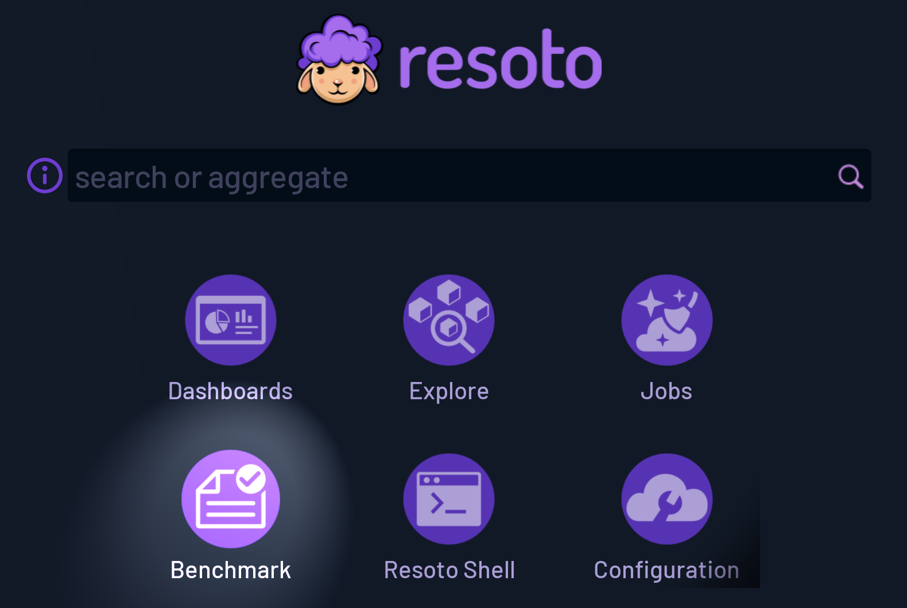
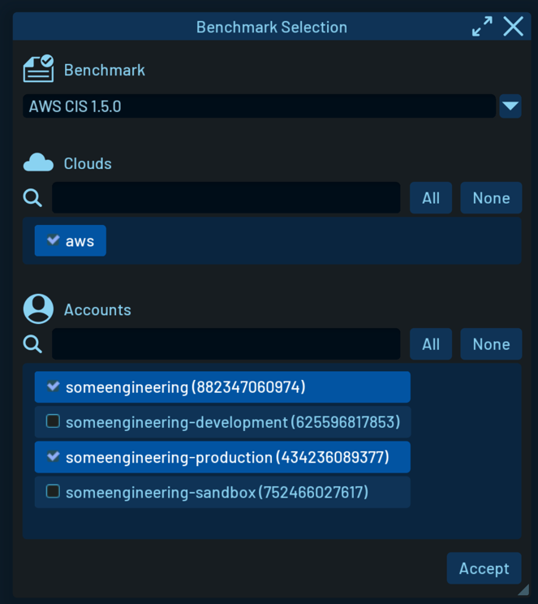
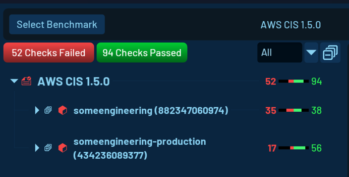
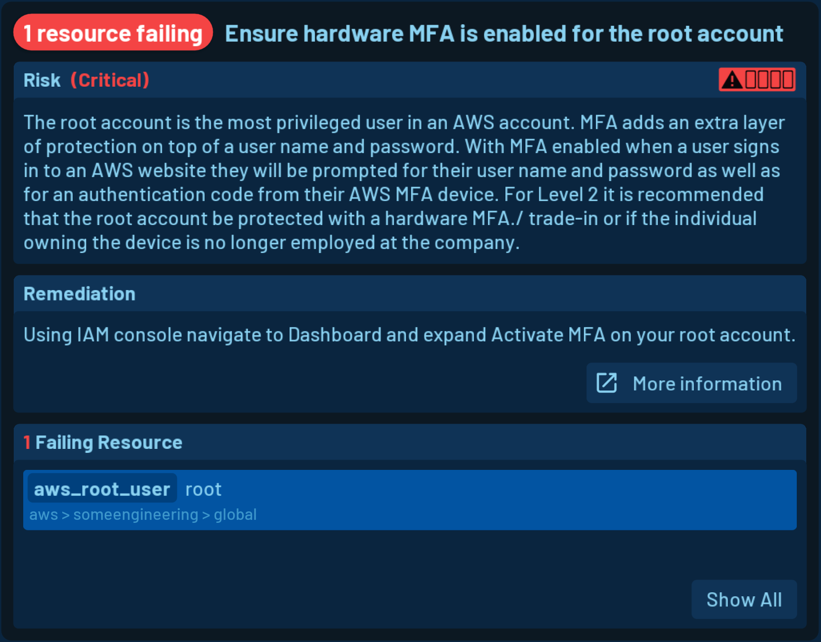

# Cloud Resource Security Benchmarks

**Performing security benchmarks on your cloud resources is an important step in ensuring the security and compliance of your organization's cloud environment.**

While security benchmarks are often associated with large corporations, they provide invaluable insights and guidance for organizations and individuals of all sizes. Benchmarks offer a wealth of information on potential security risks, best practices, and compliance requirements that can help fortify your cloud environment—even if you're not legally obligated to adhere to them.

In this blog post, we'll explore the benefits of performing security benchmarks on your cloud resources and introduce **Resoto Sentinel**, the Resoto security module designed to simplify the benchmarking process.

<!--truncate-->

## Rationale for Security Benchmarks

There are several reasons why you should perform security benchmarks on your cloud resources:

1. **Identify Security Risks**

   Security benchmarks provide a framework to identify security risks and vulnerabilities in your cloud resources.

   Benchmarks offer insight into the security posture of your resources and identify potential weaknesses that attackers could exploit.

2. **Ensure Compliance**

   Many organizations are subject to regulatory compliance requirements, such as [<abbr title="Payment Card Industry Data Security Standard">PCI DSS</abbr>](https://pcisecuritystandards.org), <abbr title="Health Insurance Portability and Accountability Act">HIPAA</abbr>, or <abbr title="General Data Protection Regulation">GDPR</abbr>.

   Security benchmarks provide a standardized set of controls that align with requirements and ensure your cloud resources comply with regulations.

3. **Improve Security Posture**

   Implementing security benchmarks improves your overall security posture by ensuring your resources are configured following best practices.

   This reduces the likelihood of security incidents and minimizes the impact of any security breaches that do occur.

4. **Demonstrate Security Posture to Stakeholders**

   Performing security benchmarks and implementing the resulting recommendations demonstrates that you are taking proactive steps to ensure the security of your cloud resources to stakeholders (such as customers, partners, and auditors).

## Security Benchmark Frameworks and Standards

There are several security benchmarks available that you can use to evaluate the security posture of your cloud resources. Some of the popular ones are:

- **[<abbr title="Center for Internet Security">CIS</abbr> Benchmarks](https://cisecurity.org)** provides security benchmarks for securing your cloud resources on various platforms (including <abbr title="Amazon Web Services">AWS</abbr>, Azure, and Google Cloud) based on best practices and industry standards.

- **[<abbr title="National Institute of Standards and Technology">NIST</abbr> Cybersecurity Framework](https://nist.gov/cyberframework)** provides a set of guidelines and best practices for improving cybersecurity across different sectors.

- **[<abbr title="International Organization for Standardization">ISO</abbr>/<abbr title="International Electrotechnical Commission">IEC</abbr> 27001](https://iso.org/standard/27001)** is a well-known standard for information security management systems (ISMS).

- **[<abbr title="Payment Card Industry Data Security Standard">PCI DSS</abbr>](https://pcisecuritystandards.org)** provides a set of requirements for protecting payment card data.

- **[<abbr title="Health Insurance Portability and Accountability Act">HIPAA</abbr> Security Rule](https://www.hhs.gov/hipaa/for-professionals/security/index.html)** provides a set of requirements for protecting patients' electronically stored, protected health information (ePHI).

- **[<abbr title="Service Organization Control">SOC</abbr> 2](https://soc2.co.uk)** provides a set of criteria for evaluating the security, availability, processing integrity, confidentiality, and privacy of cloud services.

## Steps to Perform a Security Benchmark

Performing a security benchmark involves several steps to evaluate the security posture of your cloud resources using a specific standard or benchmark:

1. **Determine the scope.**

   Identify cloud resources that are in the scope of the benchmark. This may include specific accounts, services, or applications.

   Each benchmark provides documentation to understand its controls, requirements, and recommendations. Your cloud resources will be evaluated on the checks specified in the benchmark.

2. **Develop a remediation plan to address gaps and deficiencies identified in the assessment.**

   Remediation actions should be prioritized based on their impact and risk level. Execute the remediation plan by implementing the recommended controls and configurations in your cloud resources. You should also document the changes made and track progress toward completing the plan.

3. **Verify that the remediation plan has been implemented successfully.**

   Repeat the assessment to confirm that the gaps and deficiencies have been addressed.

4. **Regularly review and update your cloud resources to maintain compliance with the benchmark.**

   Conduct periodic assessments and remediate any new gaps or deficiencies that may arise. Monitor your cloud resources for security incidents and implement appropriate remediation actions.

**Performing a security benchmark is an ongoing process that requires regular attention and effort to maintain the security of your cloud resources.** It is essential to stay up-to-date with the latest benchmark updates and incorporate them into your security program as needed.

## Security Benchmarks in Resoto

**Resoto provides an asset inventory and compliance management platform that can perform security benchmarks on your cloud resources.**

Resoto collects a comprehensive inventory of your cloud resources and provides a unified view of your cloud environment. All of your cloud resources are automatically categorized and organized into groups based on their attributes, such as account, region, service, and tags. Resource metadata is collected and stored in a central database, which allows you to perform security benchmarks.

A benchmark organizes checks into different sections and subsections, and each check has the following properties:

| Property    | Description                                                         |
| ----------- | ------------------------------------------------------------------- |
| Title       | The name and title of the check                                     |
| Risk        | The danger or harm that failing resources pose to your organization |
| Severity    | The degree of risk and importance of the check                      |
| Detect      | Resoto search command to identify failing resources                 |
| Remediation | Guidance on remediation of failing resources                        |

### AWS CIS Benchmark

While you can define your own custom checks and benchmarks, [Resoto provides security benchmarks based on the AWS CIS Benchmark 1.5 out-of-the-box](/docs/how-to-guides/security).

These benchmarks provide a standardized set of controls to evaluate the security posture of your AWS resources.

The AWS CIS benchmark is organized into the following sections:

- [Access Management](/docs/how-to-guides/security/access-management)
- [Storage](/docs/how-to-guides/security/storage)
- [Logging](/docs/how-to-guides/security/logging)
- [Monitoring](/docs/how-to-guides/security/monitoring)
- [Networking](/docs/how-to-guides/security/networking)

## Performing Security Benchmarks in Resoto UI

Security benchmarks can be performed using Resoto's web interface, Resoto UI:

:::info

An upcoming blog post will cover how to perform security benchmarks using Resoto's command-line interface, Resoto Shell.

:::

1. Choose the accounts you want to perform the benchmark on:

   

   This is a crucial step since you may have multiple accounts in your cloud environment but only want to select specific accounts that are relevant for the benchmark.

   For example, development or sandbox accounts might have different security requirements than production accounts.

2. Run the benchmark assessment. All selected accounts will be checked on the selected benchmark.

3. The benchmark result is broken down into individual accounts, giving you a detailed overview of the security posture of your cloud environment.

   - The result view displays the number of passing and failing checks, offering an overview of the overall benchmark result.

     

   - The tree view lists checks and their failing resources. You can expand the tree view to see the structure of the benchmark, information about each check, and details of individual failing resources.

     

   - You can view a list of all failing checks by clicking on any level in the tree view. Easy export of the result is available as well, so you can share the result with your stakeholders.

     

### Acting on Benchmark Results

Getting an overview of the security posture of your cloud environment is great, but it is even more important to act on the result. On the level of checks, you can see useful information:

- the number of resources failing the check
- the severity of the check
- the risk associated with failing resources
- the remediation guidance with a link to the official documentation

You also get a list of all failing resources. Clicking on the resource name will open the resource details view, where you can see all the available metadata of the resource.

Most remediation actions cannot be performed automatically, as they usually involve manual application and infrastructure changes.

### Customizing Benchmark Configuration

The benchmark feature in Resoto was developed to allow for easy customization of the benchmark configuration, so Resoto's configuration editor allows you to view and adjust any aspect of the benchmark configuration.

Some checks define default values that can be adjusted. For example, the `old_instances` check in AWS EC2 defines `180d` as the default value for the `old_instance_age` parameter. You can adjust this value to meet your specific requirements.

You can even create your own benchmark from existing benchmarks. You can add new checks, remove existing checks, or adjust the configuration of existing checks. The goal is to help you define your security baseline and ensure that your cloud resources comply with your security requirements.

Extending Resoto with additional checks and benchmarks is easy—no coding required. We are working on extending the list of available benchmarks and checks—help us make Resoto better by contributing your own checks and benchmarks!

## Measure, Improve, and Repeat

Resoto UI provides a simple and intuitive way to perform benchmarks and get an overview of the security posture of your cloud environment. The benchmark feature in Resoto is flexible and customizable, so you can easily adjust the benchmark configuration to meet your specific requirements.

**Measuring, improving, and repeating the security benchmark process is essential to ensure your cloud resources remain secure over time.**

In the past, security benchmarks were typically conducted by dedicated auditors or consultancies, and often only once per quarter or even just once a year. The infrequency of these checks left organizations vulnerable to security issues that could arise between audits.

However, Resoto Sentinel enables you to perform crucial audits multiple times per _day_, dramatically reducing the window of opportunity for security breaches to occur.

By continually monitoring and assessing your cloud resources, you can identify and address security issues as soon as they emerge, ensuring a consistently secure environment for your organization.
