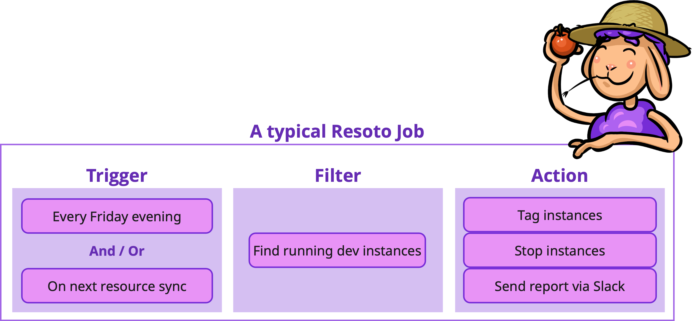
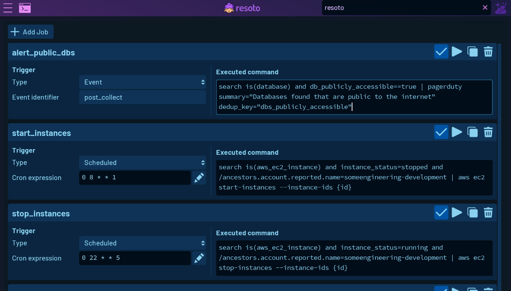
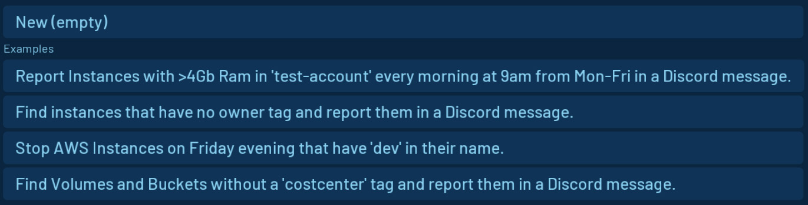

# Creating and Managing Automations with the Resoto Job Editor

Welcome to my first blog post! I'm Raffa and I'm excited to share a new feature that I've been working on: the job editor in [Resoto UI](/docs/getting-started/launch-resoto#launching-resoto-ui).

**The Resoto job editor provides a low-code way to create and manage automated jobs.**

<!--truncate-->

As I was building the jobs editor, I found myself gaining a newfound appreciation and deeper understanding of [Resoto jobs](/docs/concepts/automation#jobs).

**"Jobs" may sound plain and unremarkable, but trust me—they have the potential to save you an incredible amount of time and eliminate tedious manual tasks from your work.**

I had to read the Resoto documentation inside and out in order to build the job editor UI, and I was blown away by their potential once I understood how jobs worked.

## Components of a Resoto Job

**A job executes a command when triggered by an event or schedule.**

The typical job consists of three parts: a [trigger](#trigger), a [filter](#filter), and an [action](#action). The filter and action combine to form the command that executes in response to the trigger.

### Job Triggers

You can configure a scheduled job by utilizing cron expressions. Alternatively, you can trigger a job based on [events](/docs/reference/events) that occur within Resoto, such as the [`post_collect` event](/docs/reference/events#collect-events) in the [`collect_and_cleanup` workflow](/docs/reference/workflows#collect_and_cleanup-workflow).

**Jobs can be [scheduled](/docs/how-to-guides/automation/create-a-scheduled-job) or [reactive](/docs/how-to-guides/automation/create-an-event-based-job), or even [combine schedule and event triggers](/docs/how-to-guides/automation/create-a-scheduled-event-based-job)**. This allows for maximum flexibility and efficiency in automating tasks.

### Job Filters

While jobs can execute commands as simple as `echo hello world`, Resoto jobs truly start to shine when you chain together [commands](/docs/reference/cli) to implement more complex logic.

**Most jobs use Resoto's powerful [search](/docs/reference/search) capabilities to perform actions on specific cloud resources in your infrastructure.** For example, you may want to keep an eye on large instances in test accounts, track of untagged resources, or stop instances before the weekend and restart them on Monday morning.

Resoto search and jobs enables you to easily find relevant resources and take action.

### Job Actions

Once you have identified the resources you want to target, you can mark resources for [cleanup](/docs/concepts/resource-management/cleanup), send notifications to [Discord](/docs/how-to-guides/alerting/send-discord-notifications) or [Slack](/docs/how-to-guides/alerting/send-slack-notifications), [export the data to Google Sheets](/docs/how-to-guides/data-export/export-data-to-google-sheets), or interact with any [HTTP(S) endpoint](/docs/reference/cli/action-commands/http).

The possibilities are truly endless with Resoto jobs. See [How-To Guides](/docs/how-to-guides) and [Action Commands](/docs/reference/cli/action-commands) in the Resoto docs for more inspiration.

## Resoto UI Job Editor

The job editor was introduced in version 3.2.4 of Resoto UI, and is accessible by clicking the button in the side menu or on the start screen.

### Viewing Jobs

The job editor in Resoto UI provides a comprehensive list of all configured jobs, displaying important information about each job (such as the trigger and command):

:::note

If you haven't set up any jobs yet, this list will be empty.

:::

### Managing Jobs

In addition to listing jobs, the UI also provides easy-to-use tools for managing jobs.

You can activate or deactivate a job, manually trigger a job to run, duplicate a job, or delete a job with just a few clicks.

### Creating Jobs

Creating new jobs is also simple and straightforward.

You can use example templates to get started quickly, or create a completely custom job from scratch:

If you need to edit an existing job, the UI makes it similarly easy to do so.

Resoto UI also provides a cron expression helper to aid in authoring cron expressions for creating scheduled jobs, and lists the possible events for event-based jobs.

To help you get started with jobs in Resoto, we have also included some example jobs that you can add with a simple click.

## Conclusion

While the Resoto jobs may appear simple at first glance, its power to combine actions with searches that filter and find resources of interest is truly remarkable.

We hope that the job editor in Resoto UI makes it easier to create and manage jobs. Please give it a try and let us know what you think!

Resoto is free and open-source. Check out the [docs](/docs) for [installation instructions](/docs/getting-started/install-resoto), [how-to guides](/docs/how-to-guides), and more.

## Further Reading

- [Automation](/docs/concepts/automation)
- [Cloud Data Sync](/docs/concepts/cloud-data-sync)
- [Resource Management](/docs/concepts/resource-management)
- [Search How-To Guides](/docs/how-to-guides/search)
- [Search](/docs/reference/search)
