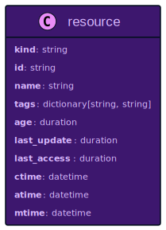
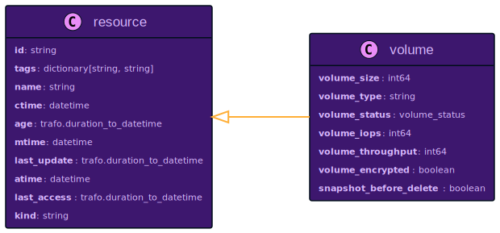
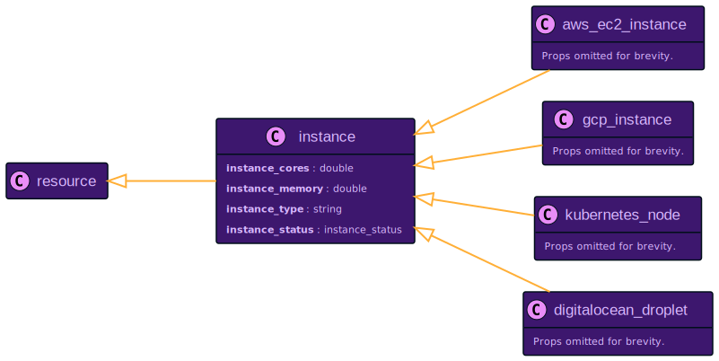
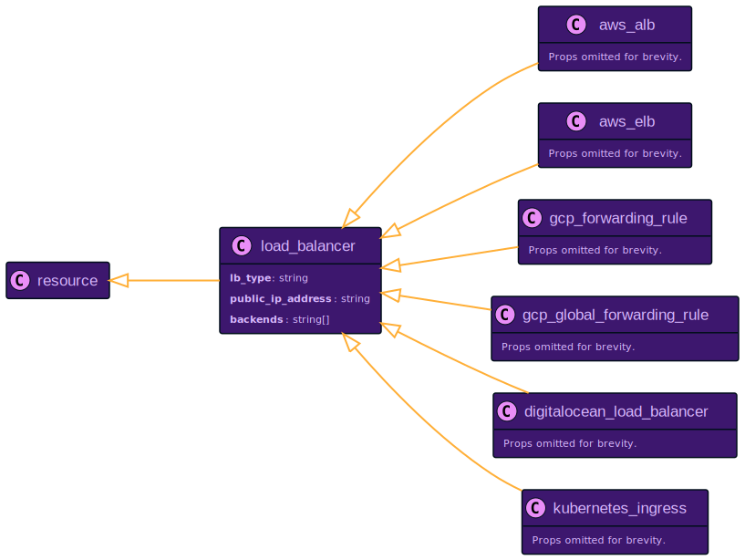

# Multi-Cloud Resource Management with Resoto

Today's world of cloud computing is complex. There are many cloud providers, each with their own set of services. Getting insights out of your infrastructure requires specialized understanding of the data from each service.

## Cloud Service Diversity

Properties in different services may have different names but the same meaning, or vice versa. To interpret properties, we need to ensure that values have a defined unit of measurement and one base unit. You can see the challenge if you imagine the many ways you can specify the size of a volume, the number of CPU cores, or even timestamps.


<!--truncate-->

[Map the Cloud](https://mapthe.cloud) shows that [<abbr title="Amazon Web Services">AWS</abbr>](https://aws.amazon.com) offers 324 services, [Azure](https://azure.microsoft.com) 222 services, and [Google Cloud](https://cloud.google.com) 52 services.

Applications built in the cloud typically use several provided services, including computing, storage, databases, networking, etc. Each cloud provider's offerings are unique, so it should come as no surprise that no two services have the exact same data model.

## Challenges in Working with AWS Resource Data

Let us assume we have an application deployed on AWS, and we want to get my application's EC2 instances and SQS queues ordered by the time of creation.

We can use the AWS CLI to query the data using the [`describe-instances`](https://docs.aws.amazon.com/cli/latest/reference/ec2/describe-instances.html) and a combination of [`list-queues`](https://docs.aws.amazon.com/cli/latest/reference/sqs/list-queues) and [`get-queue-attributes`](https://docs.aws.amazon.com/cli/latest/reference/sqs/get-queue-attributes) for every queue that is returned by the list call. The output of each command returns a list of resources with a specific data model, which is also described in the documentation of the AWS CLI commands.

To sort the list of resources by the time of creation, we need to determine the property of each resource that contains this information.

We ascertain that the EC2 property `LaunchTime` (formatted as an ISO 8601 time string) and the SQS queue property `CreatedTimestamp` (whose value is the number of seconds that have elapsed since the Unix epoch) contain the pertinent values. We now need to use a consistent time format to compare the creation times. I will leave out the listing and sorting part here, since it is not straightforward using just the AWS CLI (and impossible with the console).

The example I presented may seem contrived, but it illustrates the problem that you face when you want to get data out of your cloud infrastructure: **you need to have detailed, specialized understanding of each service's data model**. To select or combine data from different services, you need to use the same abstraction level and the same units of measurement.

## Resoto: A Multi-Cloud Resource Management Platform

**Resoto collects data from different services and different cloud providers.** Resoto not only makes the data for all cloud provider services available, but also abstracts and unifies this data.

This brings us to the first basic building block, the `resource` abstraction:



### Resource Data Abstraction in Resoto

Every resource that Resoto collects provides the above set of properties:

- Each resource is of a specific `kind` and provides this information as a property. A resource `kind` could be `aws_ec2_instance`, `aws_sqs_queue`, etc.
- The `id` is provided by the cloud provider and identifies a resource. There is no guarantee that this `id` is unique across all cloud providers. This is the reason Resoto introduces a global unique identifier to each resource on the node level.
- Resoto tries its best to retrieve the `name` from the underlying resource. If the resource does not provide a name, Resoto will look for a `Name` tag and, if found, use its value.
- Most cloud providers allow attaching arbitrary information to resources as key-value pairs. This information is also provided for every resource called `tags`.

There are three attributes that you can define for every resource: when has it been created (`ctime`), when has it been modified (`mtime`), and when has it been accessed the last time (`atime`). Resoto makes sure to transform available properties to one base unit, the ISO 8601 time string in the UTC timezone.

Of course, this information is not always available for every resource. Either Resoto can map a meaningful value to the attribute, or it tries to get the data from other systems. For the time of creation, the default is mapping an existing property, as we have seen for the EC2 instances and SQS queues. If this information is unavailable, Resoto will remember the time it has seen the resource for the first time and uses it as `ctime`. By default, Resoto scrapes your infrastructure every hour, so this might be a sane fallback value.

If there is no meaningful access or modification time, it might be possible to retrieve this information elsewhere. <abbr title="Amazon Web Services">AWS</abbr>, for example, provides time series data via the CloudWatch service. Resoto can use this data to provide meaningful values for the `atime` and `mtime` attributes for specific resources. Let's take <abbr title="Amazon Web Services">AWS</abbr> RDS databases or EC2 volumes as an example, where we can retrieve meaningful values for the `atime` and `mtime` attributes. The process of retrieving and merging the data is fully transparent to the user since it happens during collection time. You can access, filter, and sort the data as you like.

While `ctime`, `mtime` and `atime` are timestamps, you often want to display and query by duration. This is where `age`, `last_update` and `last_access` come into play. Those properties are calculated from the timestamp attributes and are displayed as human-readable durations. The same is true for searching those properties, which is possible in the same human-readable format, like: `14d`, `1h30m`, `23s`.

### Cloud Resource Search in Resoto

So, to complete the example I started in the beginning… this is the Resoto search that would find all EC2 instances and SQS queues and sort them by age. As a bonus, we render the resulting list as a markdown table:

```bash
> search is(aws_ec2_instance, aws_sqs_queue) sort age | list --markdown kind, name, age
# highlight-start
​| kind             | name       | age    |
​|------------------|------------|--------|
​| aws_ec2_instance | ganymed    | 3mo5d  |
​​| aws_sqs_queue    | styx       | 2mo1d  |
​| aws_ec2_instance | bardolin-1 | 1mo14d |
​| aws_ec2_instance | bardolin-2 | 17d    |
​| aws_sqs_queue    | jordan     | 5d3h   |
# highlight-end
```

We select the resources by kind and sort them by age. The output is a table with the resources' kind, name, and age. This kind of query can be done with any resource from any service and any cloud provider since we rely only on properties of the `resource` abstraction.

Please note what you don't see: you don't need to collect data from different accounts or regions, know anything about the specific resource, don't need to know the unit of measurement or the property name. Instead, you can select and sort by any base property.

With this knowledge at hand, we can also do other interesting searches. Let's select all resources that have been created in the last 4 hours and do not have an owner tag defined:

```bash
> search age<4h and tags.owner==null
```

Summarize the number of resources per kind that have been created in the last two days:

```bash
> search age<2d | count kind
```

Show resources that are older than one year and have not been accessed in the last two months:

```bash
> search age>1y and last_access>2mo
```

**Every resource in Resoto provides the same head data based on the same base units.** This allows you to select, sort, and aggregate without knowing the details of the underlying resource.

## Multi-Cloud Resource Data Abstraction in Resoto

:::info

Resoto currently supports the following cloud providers:

- [Amazon Web Services (AWS)](/docs/how-to-guides/data-sources/collect-aws-resource-data)
- [Google Cloud](/docs/how-to-guides/data-sources/collect-google-cloud-resource-data)
- [DigitalOcean](/docs/how-to-guides/data-sources/collect-digitalocean-resource-data)
- [Kubernetes](/docs/how-to-guides/data-sources/collect-kubernetes-resource-data)

This section is most relevant for Resoto users with more than one resource provider.

:::

The unification of base properties is only the first step. There are other entities for every cloud provider that can also be abstracted and unified.

### Representation of a Volume in Resoto

For example, let's take the representation of a volume in Resoto:



The above image shows a [<abbr title="Unified Modeling Language">UML</abbr>](https://en.wikipedia.org/wiki/Unified_Modeling_Language) class diagram of the `volume` abstraction in Resoto. The arrow signifies that volumes are resources, and that volumes have all the properties of a resource in addition to additional properties (size, throughput, etc.).

This abstract idea of a volume holds whether it is a persistent volume in Kubernetes, a block device in <abbr title="Amazon Web Services">AWS</abbr>, or a disk in Google Cloud. Since the specific resource in a particular cloud provider has its own set of unique properties, we can not simply use the volume definition directly but use it again as one level of abstraction.

The following image shows the `resource` and `volume` abstraction, as well as all the possible concrete definitions:


An <abbr title="Amazon Web Services">AWS</abbr> EC2 volume is a specific resource available in <abbr title="Amazon Web Services">AWS</abbr>. It brings its own set of properties that are unique to <abbr title="Amazon Web Services">AWS</abbr> EC2 volumes. At the same time, it also provides properties it shares with other volumes from different providers.

This abstraction level allows one to search, sort, and aggregate on the volume level using properties available for all volumes. Resoto again will ensure that the property has the same name, the same unit of measurement, and the same base unit for every volume collected.

To give you an idea of what that means: the size of a volume can be defined in MB, GB, MiB, GiB, etc. as a string, integer, or float unit. Resoto will always give you the size as `integer` using `GB` as the unit of measurement.

### Searching and Aggregating Multi-Cloud Data in Resoto

As an example, we will search all volumes and aggregate data by volume type, counting all available volumes and the size in GB. The result contains volumes from <abbr title="Amazon Web Services">AWS</abbr> (`gp3`), Google Cloud (`pd-ssd`), and DigitalOcean (`do-block-storage`).

```bash
$ search is(volume) | aggregate volume_type: sum(volume_size) as total_size, sum(1) as count
# highlight-start
​| volume_type      | count | volume_size |
​|------------------|-------|-------------|
​| gp3              | 5405  | 1448160     |
​| pd-ssd           | 937   | 20944       |
​| do-block-storage | 3     | 108         |
# highlight-end
```

Volumes are available in all cloud providers, but the specific implementation from each provider is different. Resoto provides a set of properties with the same name and meaning, no matter which cloud provider you use.

### Other Common Abstractions in Resoto

More abstractions like this are available in Resoto. The following list shows the most prominent examples that are available in Resoto:

- Compute instances (`instance`) like EC2, GCE, DigitalOcean Droplets, and Kubernetes Pods share common properties. The number of cores, amount of memory, and state of an instance use the same unit of measurement.

  

- The same logic is applied to load balancers (`load_balancer`). (Note there are even different options using the same cloud provider here.)

  

- And many more, like `network_interface`, `ip_address`, `dns_record`, `database`, etc.

:::info

[Data models for all supported cloud resource can be found in the Resoto documentation](/docs/reference/data-models). This not only includes a complete list of properties but the hierarchy of the abstractions as well:

- [Amazon Web Services Resource Data Models](/docs/reference/data-models/aws)
- [Google Cloud Platform Resource Data Models](/docs/reference/data-models/google-cloud)
- [Kubernetes Resource Data Models](/docs/reference/data-models/kubernetes)
- [DigitalOcean Resource Data Models](/docs/reference/data-models/digitalocean)

:::

## Why Is This Useful?

Unifying the base properties and the common abstractions allow you to search, sort, aggregate and act on a higher level of abstraction.

This is not possible with the raw data from the cloud providers. You would need to gather the data, transform it into common names, ensuring the same unit of measurement and base unit, and then you can work with it.

Providing such abstraction ad-hoc is a lot of effort and error-prone. **Resoto does all of this for you out of the box!**
