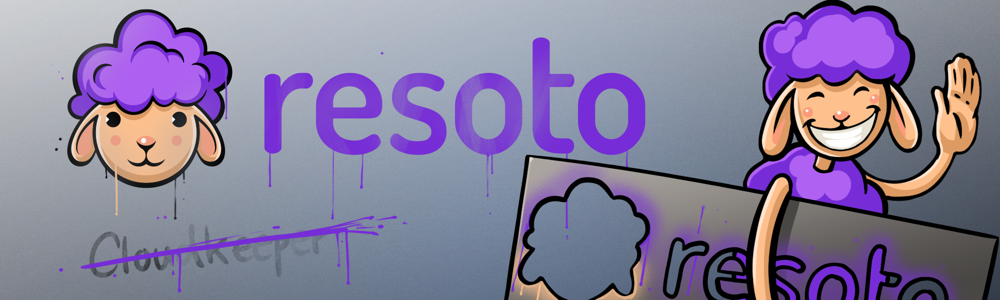

# New Name, New Website!

**This past month has been quite the roller coaster for us at Some Engineering.** 🎢

Right before Christmas, we decided to part ways with the name "Cloudkeeper." There were many reasons behind this decision, one of which was that we did not feel the product we were developing should be limited to cloud infrastructure. We were building a product that did much more than just "housekeeping for your clouds."

<!--truncate-->

We partnered with brand namer [Steve Cecil](http://wherewords.com) to devise a new name. I found the process to be really special and quite fun, though Steve did require us to invest quite a bit of our time.

The process began with each member of the "naming committee" individually completing a sixty-question questionnaire exploring different facets of our product and brand identity. 📝

We then met for a two-hour working session, during which we were assigned homework: to review 264 potential product names born from Steve's genius, reading and re-reading them both front-to-back and back-to-front, and (again, individually) submit a ranked list of our favorites.

All the work Steve asked of us paid off, and we ended the second working session with our new name: **_Resoto_**. ✨

Since you've found your way here, you presumably have also noticed that we have a new website to accompany the rebranded project!

I joined the Some Engineering team as a [technical writer](https://github.com/lloesche/valheim-server-docker/issues/423) (no, your eyes are not deceiving you—I was discovered on [GitHub](https://github.com) as a result of my open-source contributions!) to find a somewhat broken documentation system and pipeline.

Documentation was formatted using [reStructuredText](https://sphinx-doc.org/en/master/usage/restructuredtext/basics.html), and [Lukas](https://github.com/lloesche) told me that he "\[hated\] editing [reStructuredText](https://sphinx-doc.org/en/master/usage/restructuredtext/basics.html) in [Sphinx](https://sphinx-doc.org), so \[he doesn't\] do it." 😅

**You know that there is a serious problem when the developers on your team don't want to write documentation simply because it is too painful to do so.**

Lukas suggested migrating our documentation to [Docusaurus](https://docusaurus.io). As I began poking around and reading the [Docusaurus documentation](https://docusaurus.io/docs), it quickly became apparent that Docusaurus could do _much more_ than just docs! 🦖

We originally intended to partner with a design firm to create a design for the Resoto website, which would also serve as the new, more appropriate home for our documentation. However, I couldn't ship [`resoto.com/docs`](/docs) without `resoto.com`, so I found myself blocked.

Being a generally grumpy person when I do not have something concrete to show for my time and effort (and, perhaps also somewhat importantly, possessing some web design and frontend development experience)… I decided to take matters into my own hands.

And now, this is the result! I can attest to Docusaurus being very easy to set up and work with, especially if you have experience with [React](https://reactjs.org). ⚛️

P.S.: If you are also head-over-heels in love with our sheep logo and mascot, it was created in-house by our insanely talented designer [Raffaele](https://github.com/RPicster). Please be on the lookout for a future blog post about the design process. 🎨
