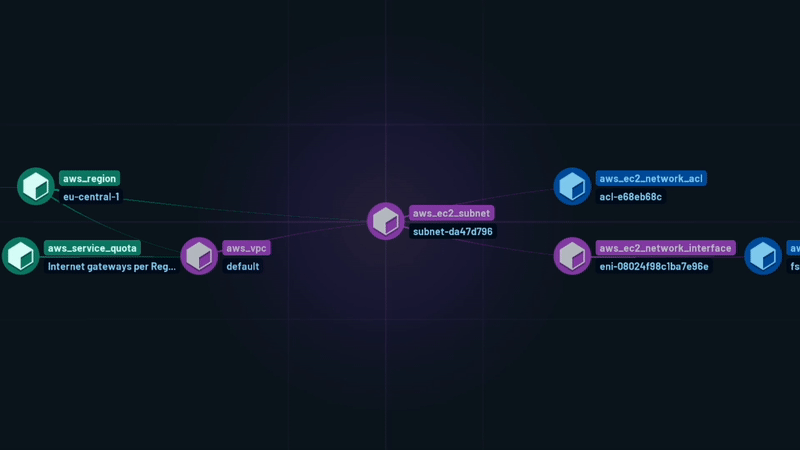
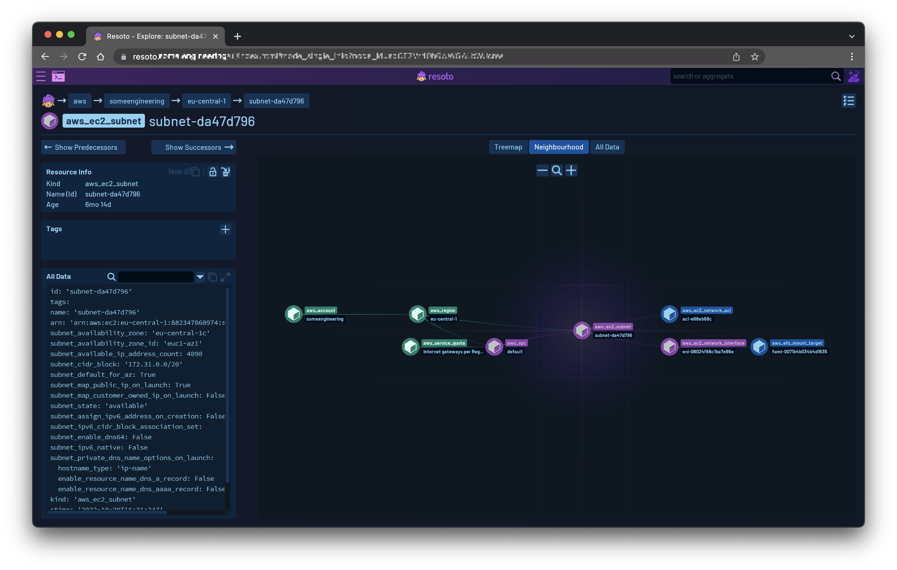

# April 2023 Product Updates

Last month, we merged a total of 33 pull requests and released [Resoto 3.4.1](/releases/3.4.1).

This release introduces the [Security Benchmarks CLI](#security-benchmarks-cli) as well as a new [Neighborhood View](#neighborhood-view).



{/* truncate */}

## Security Benchmarks CLI

In March, we released Resoto 3.3 with the Security Benchmarks UI. This month, we added the Security Benchmarks CLI in Resoto 3.4.

**The Security Benchmarks CLI allows you to run security benchmarks from the command line and integrate them into your CI/CD pipelines or other automated environments.**

Running a security benchmark and writing the output to a file is as simple as:

```bash
> report benchmark run aws_cis_1_5 | write report.md
# highlight-start
​Received a file report.md, which is stored to ./report.md
# highlight-end
```

<details>
<summary>Generated benchmark report in Markdown format</summary>
<div>

```markdown title="report.md"
# Report for account 00123456789

Title: AWS CIS 1.5.0

Version: 1.5

Summary: 42 checks ✅ and 31 checks ❌

## Passed Checks

- ✅ critical: Ensure no root account access key exists
- ✅ critical: Ensure hardware MFA is enabled for the root account
- ✅ critical: Avoid the use of the root accounts
...

### 3.2 Ensure CloudTrail log file validation is enabled (all checks ❌)

CloudTrail log file validation creates a digitally signed digest file containing a hash of each log that CloudTrail writes to S3. These digest files can be used to determine whether a log file was changed, deleted, or unchanged after CloudTrail delivered the log. It is recommended that file validation be enabled on all CloudTrails.

- ❌ **medium**: Ensure CloudTrail log file validation is enabled

  - Risk: Enabling log file validation will provide additional integrity checking of CloudTrail logs.

  - There are 1 `aws_cloud_trail` resources failing this check.

  - Remediation: Ensure LogFileValidationEnabled is set to true for each trail.. See [Link](http://docs.aws.amazon.com/awscloudtrail/latest/userguide/cloudtrail-log-filevalidation-enabling.html) for more details.

### 3.3 Ensure the S3 bucket used to store CloudTrail logs is not publicly accessible (all checks ✅)

CloudTrail logs a record of every API call made in your AWS account. These logs file are stored in an S3 bucket. It is recommended that the bucket policy or access control list (ACL) applied to the S3 bucket that CloudTrail logs to prevent public access to the CloudTrail logs.

- ✅ **critical**: Ensure the S3 bucket CloudTrail logs is not publicly accessible
...
```

</div>
</details>

Markdown rendering is the CLI default, but since benchmark results are returned as a graph, you can use all the existing Resoto commands to filter and alert on these results!

For example, try piping the output of a `report benchmark run` into the `dump` command to see the raw data structure of the report results:

<details>
<summary>Raw benchmark report data in YAML format</summary>
<div>

```yaml
---
id: 23e2446e-ede2-11ed-a163-1ad5c904c3a4
kind: report_check_result
reported:
  categories:
  - security
  - compliance
  default_values: null
  detect:
    resoto: is(aws_ec2_security_group) and group_ip_permissions[*].{ip_protocol="-1"
      and ipv6_ranges[*].cidr_ipv6="::/0"}
  id: aws_ec2_allow_ingress_from_internet_to_any_port_ipv6
  provider: aws
  related: []
  remediation:
    action: null
    text: Apply Zero Trust approach. Implement a process to scan and remediate unrestricted
      or overly permissive network acls. Recommended best practices is to narrow the
      definition for the minimum ports required.
    url: https://docs.aws.amazon.com/vpc/latest/userguide/vpc-network-acls.html
  result_kind: aws_ec2_security_group
  risk: If Security groups are not properly configured the attack surface is increased.
  service: ec2
  severity: high
  title: Ensure no security groups allow ingress from ::/0 to any port.
  url: null
  kind: report_check_result
  name: Ensure no security groups allow ingress from ::/0 to any port.
  number_of_resources_failing: 41
  number_of_resources_failing_by_account:
    '00123456789': 3
    '00987654321': 6
    '00564738291': 22
```

</div>
</details>

Or, pipe a report into the `list --csv` command followed by a list of fields to get a CSV-formatted output.

## Neighborhood View

The first version of Neighborhood View is available in Resoto 3.4.

Neighborhood View is a new way to visualize your infrastructure and a great way to get a quick overview of the relationships between your resources. It can be accessed in the Explore section of Resoto UI.



Different resource kinds have different colors. In an upcoming release, we will be adding unique icons to each resource kind.

## Looking Ahead

### Infrastructure Apps

Resoto 3.4 included a stealth release of the first version of Resoto Infrastructure Apps (i.e., not visible in the CLI unless you know it's there). Since this feature doesn't affect any existing systems, we decided to ship it early.

**Resoto Infrastructure Apps are low-code Jinja templates that can be used to perform complex actions within Resoto.** They are an excellent way to automate common tasks, and we've ported every Resoto plugin that was previously implemented in Python to the new Infrastructure Apps system.

Check out the [design doc](https://docs.google.com/document/d/1tHZpPAWKh1XMLqsoapAKibAkLnnqH0edCIC6Li-W2b8/edit?usp=sharing) for implementation details. Stay tuned for the official release in Resoto 3.5!

### Authentication and Authorization

We are working on a new authentication and authorization system for Resoto.

**Instead of a single PSK for all users, each user will have their own login and roles.** This will allow you to give users access to only the resources they need to see and the actions they need to perform.

The first version will have three hard-coded roles: `read`, `write`, and `admin`. However, the system was designed to allow for expansion to fully scoped granular access in future releases.

Initially, only Resoto's internal user management will be supported, but the system was designed with support for external OIDC and SAML2 providers in mind.

Check out the [design doc](https://docs.google.com/document/d/1yuD5d301uyIA8PCh-Ddew-i9EzPW5YoPWZ2AxjJutoY/edit?usp=sharing) for implementation details. We hope to ship this feature with Resoto 3.5.

### Resoto Rewind

**Resoto Rewind is a new module that allows you to take snapshots of your cloud infrastructure and compare the state of your cloud today to its state at a point in the past.**

By taking regular snapshots of your infrastructure, you can track changes over time and compare the current state of your cloud to past states. This can be invaluable for understanding how your infrastructure has evolved, identifying potential issues, and making informed decisions about future changes and capacity planing. Want to know how compliance with your [tagging policy](../../../effective-cloud-management-tagging-policies/index.mdx) evolved over time? Rewind lets you compare.

See the [design doc](https://docs.google.com/document/d/1HZLyJXYiNZ06gdgF4RvyApZy_uf3BhaRnNX45vLgwvg/edit?usp=sharing). We are still working on the implementation, but we are hoping to ship this feature in Resoto 3.6 (with maybe a stealth release in Resoto 3.5).

### Google Cloud Collector

**The new Google Cloud collector is still in testing and will be released _Soon™_.**

We are continuing to test the new collector. Since this collector will replace the existing Google Cloud collector, we will perform thorough testing before merging its extensive changes. As such, there is currently no ETA for this feature.
