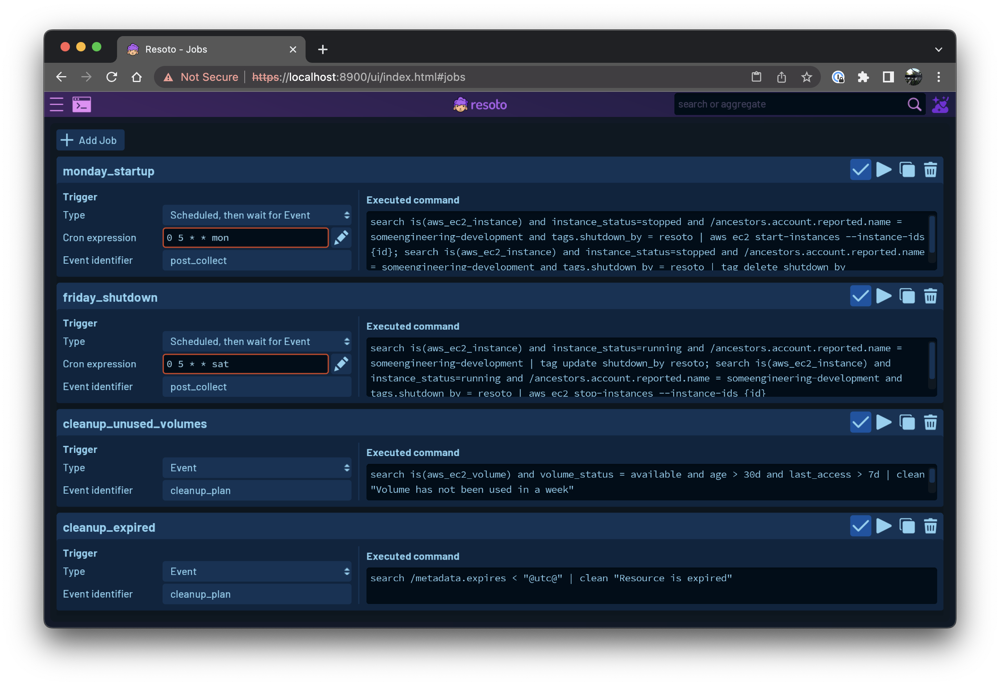
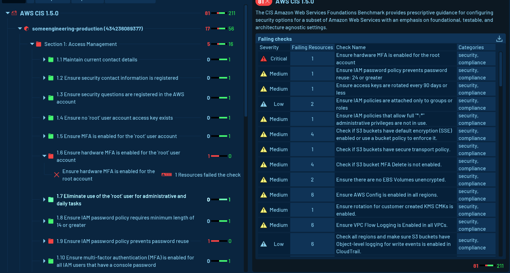

# February 2023 Product Updates

New month, new release! We shipped [Resoto 3.2](/releases/3.2.0) with a handful of new features and improvements.

<!--truncate-->

## Job Editor

[Resoto UI now has a job editor](../../../creating-and-managing-automations-with-the-resoto-job-editor/index.md), allowing you to create [automations](/docs/concepts/automation) from the UI instead of the Resoto Shell.



## Aggregate Search in Resoto UI

Until now, [aggregate searches](/docs/reference/cli/search-commands/aggregate) could only be displayed as part of dashboards or on the Resoto Shell.

The latest version of the UI now allows you to start any search with the word aggregate and it will turn into an aggregate search. Making it super convenient to test out those metrics searches.


## External Configuration Overrides

You can now override Resoto config using external `yaml` or `json` files. If you are familiar with Kubernetes Helm Charts, `values.yaml` the functionality is very similar.

Start `resotocore` with the `--override-path` argument (or the corresponding `RESOTOCORE_OVERRIDE_PATH` environment variable) pointing to a file or directory. (If a directory is specified, Resoto will read all files in the directory with `.yaml`, `.yml`, or `.json` extensions.) The filename must correspond to the name of the Resoto config you would like to override.

:::tip Example

`resoto.worker.yaml` would override the data in the `resoto.worker` config.

Let's say you wanted to override the default thread pool size of 5 with something else, the contents of the file would look like this:

```yaml
resotoworker:
  pool_size: 10
```

And that's it. Resoto will automatically pick up this override and overlay it over the database provided config. When editing the `resoto.worker` config using Resoto Shell, you will see a comment above `pool_size` letting you know that the value you are seeing is being overridden by an external override.

:::

You can update these override files at runtime and create or delete them without having to restart any of Resoto's components. Changes are automatically picked up and propagated to the relevant components.

## PagerDuty Alerts

With the new `pagerduty` command, you can now easily pipe any search into Pagerduty and create alerts from it.

For instance, if you have a policy that forbids unencrypted databases, you can add a job like `search is(aws_rds_instance) and volume_encrypted = false | pagerduty...` to alert on those instances.

This feature can be useful in helping you stay on top of critical issues and ensuring that you are promptly notified when there is a problem.

## Support for New Cloud Resources

- [AWS collector](/docs/how-to-guides/data-sources/collect-aws-resource-data) plugin now supports AWS CloudTrail.

- The vSphere collector now supports additional resources, thanks to a contribution by [@fatz](https://github.com/fatz).

## Other Improvements

- The configuration editor has been redesigned to display configurations in a folder-like structure similar to a file explorer.

  

- When adding dashboard widgets the UI now displays a hint on how to add a new data source.

  

- A warning message is now displayed in the UI when non-Chrome browsers are used to notify users that they are untested.

- The Resoto docker image now includes `vim` as a default editor.

- Support for AWS RDS Clusters, which was previously missing, has now been added.

## Bug Fixes

- The Resoto UI's Shell had a bug that resulted in a loss of focus when the command key was pressed on macOS.

- To address a shader compatibility problem on macOS, the Resoto UI has been transitioned to the GLES2 rendering backend.

- A memory leak was discovered in the AWS collector, but it has since been resolved.

- There was a race condition in the AWS GraphBuilder that could be triggered when multiple threads accessed it simultaneously. The relevant access has now been made thread-safe.

- AWS EFS Shares previously inherited the volume type, which was incorrect, as they are actually network shares. This issue has now been addressed.

## Looking Ahead

### Security Benchmarks and Compliance Checks

Work continues on security benchmarks and compliance checks. Here's another sneak peek at what's coming:



### Cloud Resource Tagging White Paper

We are also working on a white paper that covers tagging policies in detail. A draft can be found [here](https://docs.google.com/document/d/1oA_olUTlFby0spsMm_6zBH4Y4e16HIdDsIudCES-zOU/edit?usp=sharing). We will be sharing more details about this in the coming weeks.
