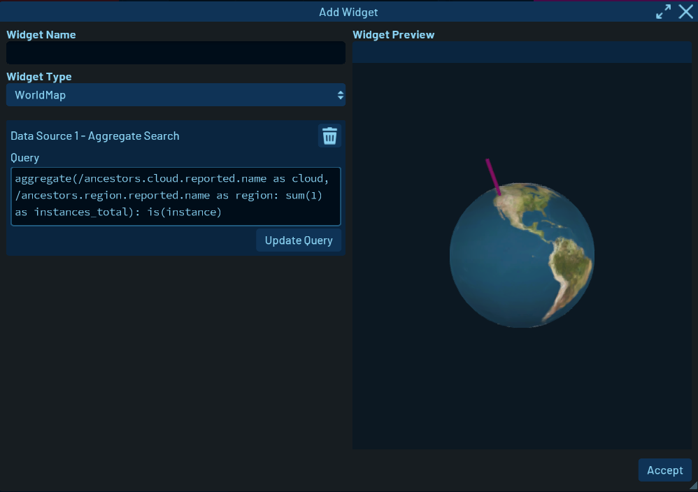
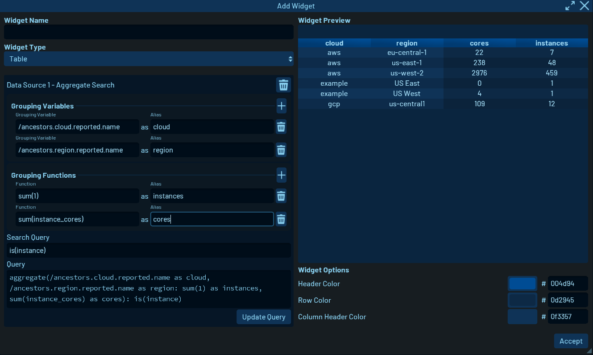
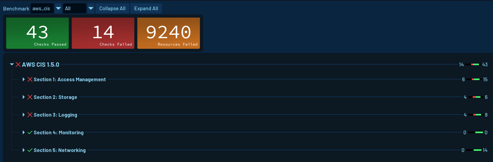

# January 2023 Product Updates

**As 2022 came to a close, we released [Cloud2SQL](https://cloud2sql.com) and [Resoto 3.0](/releases/3.0.0).** Resoto 3.0 shipped with a brand new web UI built on the [Godot game engine](https://godotengine.org).

{/* truncate */}

## Cloud2SQL

[Cloud2SQL](https://cloud2sql.com) is a stateless standalone tool that leverages Resoto's collectors to [fetch and import your cloud inventory data](/docs/concepts/cloud-data-sync) into a <abbr title="Structured Query Language">SQL</abbr> database.

Cloud2SQL includes support for [PostgreSQL](https://postgresql.org), [MySQL](https://mysql.com), [MariaDB](https://mariadb.org), [SQLite](https://sqlite.org), [Snowflake](https://snowflake.com), and [Parquet](https://parquet.apache.org) files.

We also introduced a [Homebrew package for Cloud2SQL](https://cloud2sql.com/docs/installation#homebrew), making installing and updating Cloud2SQL on macOS as simple as `brew install cloud2sql`.

Additionally, Parquet files can now be uploaded to [S3](https://cloud2sql.com/docs/configuration#s3) and [Google Cloud Storage](https://cloud2sql.com/docs/configuration#google-cloud-storage). This is super useful for data lakes!

## AWS SageMaker Support

The AWS collector now supports [AWS SageMaker](https://aws.amazon.com/sagemaker). This allows you to search SageMaker models and endpoints in Resoto.

## Resoto UI

Our UI team has been hard at work on the new Resoto UI.

Here's a couple of the cool new features they've added:

### Interactive World Map

An interactive world map shows the location of all your cloud resources either on a flat 2D map or on a rotating 3D globe.

The world map allows you to immediately see if resources in a certain region spike, or if there are suddenly resources in regions that are typically not used.

### Aggregate Search Builder

Improvements were made to the way aggregate searches are built up in Dashboard widgets.

## Resoto CloudFormation Stack

Resoto fetches all AWS resources across your accounts. This requires Resoto to assume a role in each account, as it is not ideal to have a role that provides wide access to all of your resources.

Resoto now automatically generates policy documents listing its [required IAM permissions](/docs/reference/iam-permissions/aws).

This policy data is also available as a [CloudFormation template](https://resotopublic.s3.amazonaws.com/cf/resoto-role.template), and we also now provide a [CloudFormation stack that automatically deploys the required IAM policies to your accounts](/docs/how-to-guides/configuration/roll-out-resoto-aws-permissions-with-cloudformation).

## Other Improvements

- Regex searches are now case-insensitive. This makes it easier to find resources and should have been the default from the start. Please note that this changes the default search behavior, which is why we raised the version to 3.1.

## Bug Fixes

The following bugs have been squashed:

- There was an optimization in the AWS collector to only fetch instance types in a single region. However, not all instance types are available in all regions.

  **The AWS collector now fetches instance types from all regions.**

- [Resoto Worker](/docs/reference/components/worker) would unregister from [Resoto Core](/docs/reference/components/core) when shutting down, causing any [workflow](/docs/reference/workflows) executions that were performed as the worker was shutting down to fail.

  **A workflow will now resume execution as soon as a new worker is available.**

- Each error was reported individually. This could cause a lot of noise in the logs.

  **Repeating errors are now accumulated and combined.**

- In a migration from Python Data Classes to [attrs](https://attrs.org), we introduced a bug in the Google Cloud collector which caused it to fail to collect data.

  **The [Google Cloud collector](/docs/how-to-guides/data-sources/collect-google-cloud-resource-data) has been fixed.**

- Resoto hot-reloads most changes to its configuration. However, some configuration changes require a restart (e.g., changing the port or network interface to bind on). Resoto does this automatically, but there was a race-condition between listing currently running child processes and killing them.

  **The race condition has been resolved.**

## Looking Ahead

### Security Benchmarks and Compliance Checks in Resoto

Work has begun on security benchmarks and compliance checks. This will allow you to run security checks on your cloud resources and get a report on how compliant they are.

