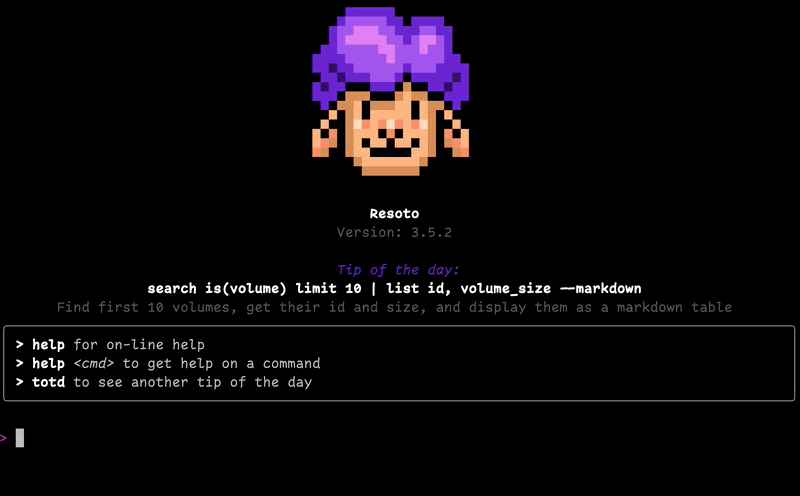
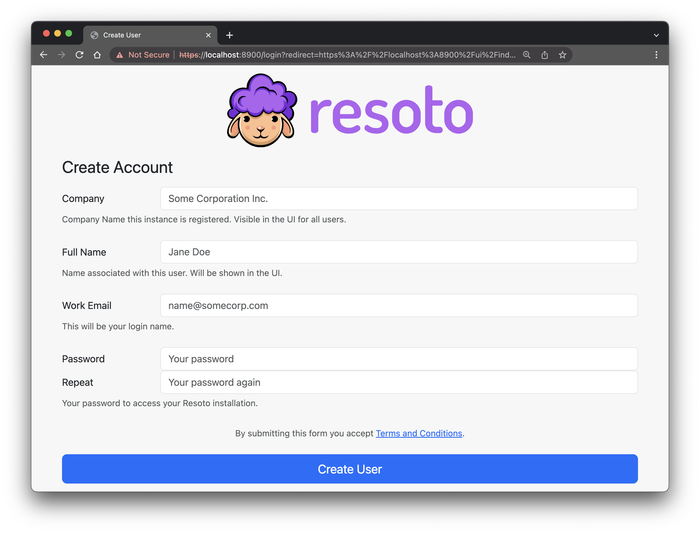

# May 2023 Product Updates

Last month, we released [Resoto 3.5](/releases/3.5.0)! This updated version is chock-full of new features and essential bug fixes. In total, we've successfully merged 50 pull requests.

<!--truncate-->

## Resoto Rewind

Ever wished you could travel back in time to see what your cloud infrastructure looked like a week, a month, or even some years ago? Now you can!

Resoto Rewind automatically takes snapshots of your cloud infrastructure, allowing you to observe its historical state. This feature helps you gauge, for instance, compliance improvement with new tagging policies. It also assists in making better decisions when purchasing reserved instances by revealing how your compute demand has fluctuated over time. Resoto Rewind supports all cloud providers we cater to, and it's automatically enabled.

## Resoto Infrastructure Apps

Resoto offers help with a variety of tasks, from tag correction to resource cleanup. Until now, if you desired to implement infrastructure logic that Resoto didn't support natively, you'd have to compose a custom plugin in Python. But with Resoto Infrastructure Apps, we're introducing a low-code method of implementing infrastructure logic.

These Apps are written as Jinja templates, which many will recognize from systems like [dbt](https://www.getdbt.com/). They're inherently secure because they can not execute code themselves; instead, they generate Resoto commands for execution. This allows for dry-run and audit of the commands prior to execution.

We've taken the initial step of reimplementing [all existing Resoto plugins](https://github.com/someengineering/resoto/tree/main/plugins) as [Infrastructure Apps](https://github.com/someengineering/resoto-apps).

## Resoto Identity

Previously, Resoto used a pre-shared key to authenticate with the system and establish trust between components. With Resoto 3.5, we're introducing Resoto Identity. This new OIDC-like service enables you to create and manage users and their system access.

Consequently, the first time you open the Resoto UI or Resoto Shell after upgrading to Resoto 3.5, the system will prompt you to create a new user. Currently, the system only supports the "admin" role, but we plan to add more roles and the ability to connect 3rd party OIDC and SAML2 providers in the future.

## New Google Cloud Collector

After months of meticulous testing, we're excited to release our new Google Cloud Collector.

It not only supports more Google Cloud resources than the former collector but also ensures that all resources now contain a complete set of Google Cloud metadata.

## Other Resoto Improvements and bug-fixes

- For K8S Ingress and DigitalOcean, load balancers now correctly display the list of backend servers in the [Unified Data Model](/docs/reference/unified-data-model).
- A bug in the DigitalOcean collector, which caused the collector to fail for very old snapshots lacking a region association, has been fixed.
- AWS EBS volumes now consistently have an atime and mtime.
- Configuration files written to the home directory now have [0600 permissions](https://en.wikipedia.org/wiki/File-system_permissions#Numeric_notation).
- For write_files_to_home_dir, paths are now recursively created if they don't already exist.

We hope you're as thrilled with these updates as we are. As always, your feedback is invaluable to us, so don't hesitate to share your thoughts on these new features and improvements.
