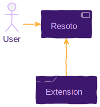

# Resoto, at Your Command

A Resoto install comes with batteries included; Resoto ships with a [command-line interface (CLI)](/docs/reference/cli) that allows for exploration, insights, and manipulation of your infrastructure. With Resoto's <abbr title="command-line interface">CLI</abbr>, automating tedious tasks becomes a breeze. Think about enforcing a policy, cleaning up resources, exporting data, or alerting on specific circumstances. See [How-To Guides](/docs/how-to-guides) to learn more about possible use cases.


**Version 3 of Resoto introduces the ability to extend this capability by defining custom commands programmatically in the language of your choice.** If you are familiar with Python, this task becomes super easy, since all the necessary boilerplate code is already provided.

In this blog post, we will implement a new command called `hello-world` in Python, to show the power and flexibility of this new feature. The simple idea of our new command is adding a greeting to the tags of a selected resource.

<!--truncate-->

## Architecture

Resoto has a [WebSocket endpoint to attach to the work queue](/docs/reference/api/web-socket-attach-to-the-working-queue). Multiple workers can register for tasks that are then distributed to the workers. Part of the registration process is a complete definition of the task the worker is able to handle. This definition is used inside Resoto to create a <abbr title="command-line interface">CLI</abbr> command for this task.

When the user executes the command on a given resource, the resource data with a task description is added to the work queue and the worker is notified. The worker can now do whatever it is supposed to do with the provided resource data.



A private shared key secures the communication between Resoto and the extension. The permission to handle the resource needs to be implemented in the extension.

## Defining a Command

The idea behind this feature is to allow the user to select resources via the [`search` command](/docs/reference/cli/search-commands/search) and perform an action on each selected resource:

```bash
> search is(kubernetes_pod) and name~resoto | hello-world
```

In this example, resources selected by the search command will be passed to the `hello-world` command, with Resoto sending a task for each selected resource. Workers registered for the `hello-world` task will receive the messages and perform the work. The result of each task (success or failure) is then returned to Resoto and propagated to the user.

### Implementation

Let's implement a `hello-world` command that adds a `greeting` tag to a resource. This simple command can serve as a starting point for defining your own commands.

For the sake of simplicity, we'll use Python—Resoto has facilities for finding, introspecting, activating, and using installed Python extensions using [`setuptools`](https://setuptools.pypa.io/en/latest/pkg_resources.html).

A simple decorator exposes the methods of a plugin. This decorator collects all the required information about the command and makes it available to Resoto. When a user executes the command, Resoto sends a message to all registered workers, and the runtime invokes the registered method.

:::tip

See the [someengineering/resoto GitHub repository](https://github.com/someengineering/resoto/tree/main/plugins) for Resoto plugin examples.

:::

:::note

It is also possible to other programming languages to implement Resoto extensions, but you would need to build the communication layer between Resoto and the extension as well.

:::

We first need to define a plugin class and define our method within:

```python showLineNumbers
class MyExtensionsHolder(BasePlugin):

  @execute_command_on_resource(
      name="hello-world",
      info="Add a greeting to the tags of a resource.",
      description="Long description of the command.",
      args_description={},
      expect_node_result=True,
  )
  def hello_world(self,
      config: Config,
      resource: BaseResource,
      args: List[str]
  ) -> BaseResource:

    if resource.update_tag("greeting", "Hello World"):
      resource.tags["greeting"] = "Hello World"
    return resource
```

| Line | Description |
| --- | --- |
| 1 | To make the plugin available to Resoto, we need to define a class that inherits from `BasePlugin`. |
| 4–7 | The decorator tells Resoto how this method is exposed to the user, defining the command name, description, and arguments. (This information is accessible to users in Resoto Shell via `help hello-world`.) |
| 8 | We want to see the change in the resource directly reflected in Resoto, so we set the `expect_node_result` flag to `True`. This denotes that we will update the resource in place and return it. |
| 10 | The function's name can be anything and is not exposed to the user. |
| 11 | This is the current configuration of the worker. |
| 12 | This is a single resource. If multiple resources are selected, this method will be invoked for each individual resource. The resource type is defined by the collector. All resources share the same common base class `BaseResource`. |
| 13 | This is a list of command arguments. In this example, we don't expect any arguments. |
| 14 | We defined `expect_node_result` to be `True`, which requires that the method returns the updated `BaseResource`. It would also be possible to set this to `False` and return `None` or any other value, which is then propagated to the user as a result. |
| 16–18 | We use the `update_tag` method to update a tag of the resource, which is an abstract method in `BaseResource` that returns `True` if the tag was added or updated. In this case, we also update the copy and return it. (Resoto ensures this method is implemented for every resource type of each cloud provider.) |

:::info

Once the plugin is loaded and the worker starts, the command is registered and available to the user. We can check this by executing the [`help` command](/docs/reference/cli/miscellaneous-commands/help), which lists all available commands:

```bash
> help
# highlight-start
​...
​# Custom Commands
​hello-world - Add a greeting to the tags of a resource.
​...
# highlight-end
```

We can view information about the command by executing `help hello-world`:

```bash
> help hello-world
# highlight-start
​hello-world: Add a greeting to the tags of a resource.
​​
​hello-world
​​
​Long description of the command.
# highlight-end
```

As you can see, the description is lacking in information and thus not very helpful.

[Markdown](https://daringfireball.net/projects/markdown) syntax is allowed in custom command descriptions, making it easy to clearly document arguments, examples, and other useful information.

:::

:::tip

See a complete example of a custom command in the [Resoto GitHub Repository](https://github.com/someengineering/resoto/blob/1fc68807056e0d27dff9ec25053df3bcbc6d6948/plugins/aws/resoto_plugin_aws/__init__.py#L115-L229).

:::

### Usage

We can now combine the [`search` command](/docs/reference/cli/search-commands/search) with our new `hello-world` command to add a `greeting` tag to all resources that match a particular criterion:

```bash
> search is(instance) and age<1h | hello-world
# highlight-start
​kind=aws_ec2_instance, id=i07b, name=ekt, instance_status=running, age=34min, cloud=aws, account=someengineering, region=eu-central-1
# highlight-end
```

This above command searches for compute instances with age less than one hour, and add a `greeting` tag to each matching resource.

**Additionally, the `hello-world` command returns the updated resource, making it possible to process the result further.** For example, we can select the tags property of the resource using the `jq` command. The result would be a list of all tags for every resource that was updated. We can see our greeting tag in the list and other existing tags.

```bash
> search is(instance) and age<1h | hello-world | jq .tags
# highlight-start
​costCenter: bus
​owner: Maricel
​greeting: Hello World
# highlight-end
```

**It is possible to pass arguments to the `hello-world` command.** Arguments are available via the `args` parameter. In the above example, we ignore the `args` parameter as we don't expect any arguments; however, it would be possible to parameterize our function to make it more useful.

Consider the addition of a `--greet` parameter where we can define the text that is added to the `greeting` tag:

```bash
> search is(aws_ec2_instance) and age<1h | hello-world --greet "Hi there" | jq .tags
# highlight-start
​costCenter: bus
​owner: Maricel
​greeting: Hi there
# highlight-end
```

**Resoto also supports parameter expansion.** The value of a command parameter does not have to be static, but could come from resource data.

Assuming every resource has an `owner` tag, we could define a greeting specific to the resources owner:

```bash
> search is(aws_ec2_instance) and age<1h | hello-world --greet "Hi {tags.owner}" | jq .tags
# highlight-start
​costCenter: bus
​owner: Maricel
​greeting: Hi Maricel
# highlight-end
```

The placeholder could come from any resource property. Property paths inside curly braces are replaced with values from the incoming resource. The string `Hi {tags.owner}` will be replaced by `Hi Maricel` if the resource has a tag `owner` with value `Maricel`. This can be quite powerful and allows you to create expressive commands to process resources flexibly.

:::tip

See [`format`](/docs/reference/cli/format-commands/format) for details of placeholder value handling.

:::

## The `aws` Command

<abbr title="Amazon Web Services">AWS</abbr> provides a command-line utility that facilitates interactions with <abbr title="Amazon Web Services">AWS</abbr> resources.

**We thought it would be great to have the same power inside Resoto and added an `aws` command with almost the same interface as the official <abbr title="Amazon Web Services">AWS</abbr> <abbr title="command-line interface">CLI</abbr> tool.** It allows selecting resources via `search` and piping them into the `aws` command line tool to get specific information or manipulate resources.

:::info

You can find the implementation of the `aws` command in the [someengineering/resoto GitHub repository](https://github.com/someengineering/resoto/blob/1fc68807056e0d27dff9ec25053df3bcbc6d6948/plugins/aws/resoto_plugin_aws/__init__.py#L115-L229).

:::

If you have [configured collection of your <abbr title="Amazon Web Services">AWS</abbr> resources](/docs/how-to-guides/data-sources/collect-aws-resource-data), you can use the `aws` command to see the configured identity using [`get-caller-identity`](https://docs.aws.amazon.com/cli/latest/reference/sts/get-caller-identity.html):

```bash
> aws sts get-caller-identity
# highlight-start
​UserId: AIDA42373XXXXXXXXXXXX
​Account: '882311111111'
​Arn: arn:aws:iam::882311111111:user/matthias
# highlight-end
```

Let's try something more interesting with the `aws` command. Consider the case where some development accounts with many EC2 instances are idle during weekends, and we want to automatically stop all running EC2 instances in dev accounts at Friday <abbr title="end of business">EOB</abbr> and restart them on Monday morning.

The command to stop running instances would use the [`stop-instances` command](https://docs.aws.amazon.com/cli/latest/reference/ec2/stop-instances.html):

```bash
> search is(aws_ec2_instance) and
         instance_status=running and
         /ancestors.account.reported.name~dev |
  aws ec2 stop-instances --instance-ids {id}
```

We first select all running EC2 instances in all accounts that have `dev` in their name. Selected instances are piped to the `aws` command, which executes the `stop-instances` command with the `--instance-ids` parameter set to the resource's ID.

Based on the resource, Resoto will pick the correct credentials and region to execute the command. (This is why we will only pass one ID per call, though the `stop-instances` call theoretically allows defining multiple instance IDs.)

To start all stopped instances again, we use the [`start-instances` command](https://docs.aws.amazon.com/cli/latest/reference/ec2/start-instances.html):

```bash
> search is(aws_ec2_instance) and
         instance_status=stopped and
         /ancestors.account.reported.name~dev |
  aws ec2 start-instances --instance-ids {id}
```

To automate these two actions, we can create jobs with a cron trigger. We schedule one job to run on Friday evening, and the other on Monday morning.

```bash
> jobs add --id tgif --schedule "0 22 * * 5" 'search ... | aws ec2 stop-instances ...'
# highlight-start
​Job tgif added.
# highlight-end
> jobs add --id hello_monday --schedule "0 8 * * 1" 'search ... | aws ec2 start-instances ...'
# highlight-start
​Job hello_monday added.
# highlight-end
```

## Conclusion

Resoto provides a multitude of tools to help you manage your cloud infrastructure. But, if you find yourself in a situation where you need to do something that is not possible with Resoto's built-in commands, you can always extend Resoto and write your own custom command.

The nature of the Resoto Shell's command-line approach using pipes and filters allows for simple extensions that can be combined to solve even the most complex problems.
