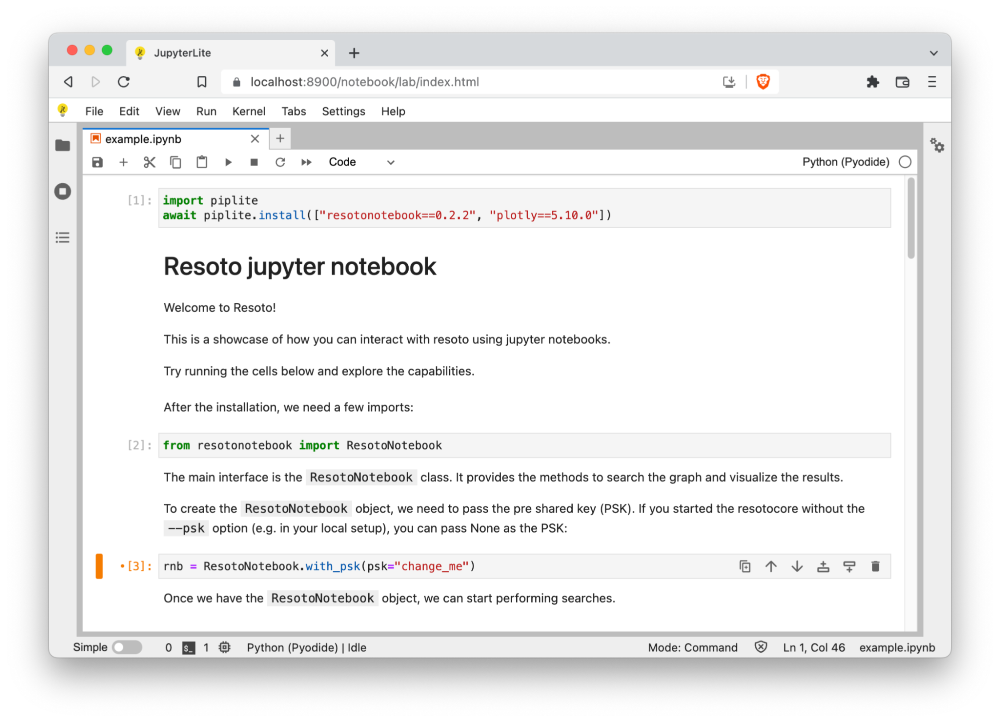
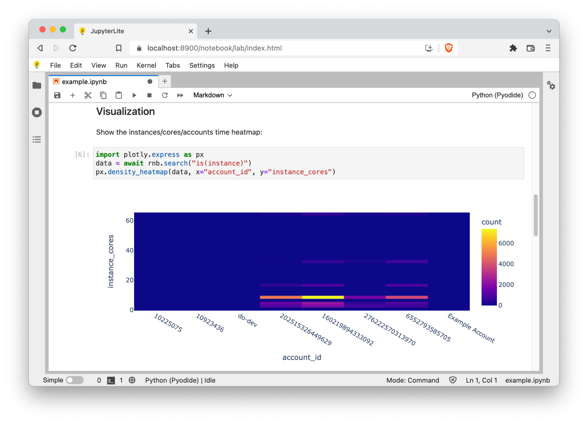
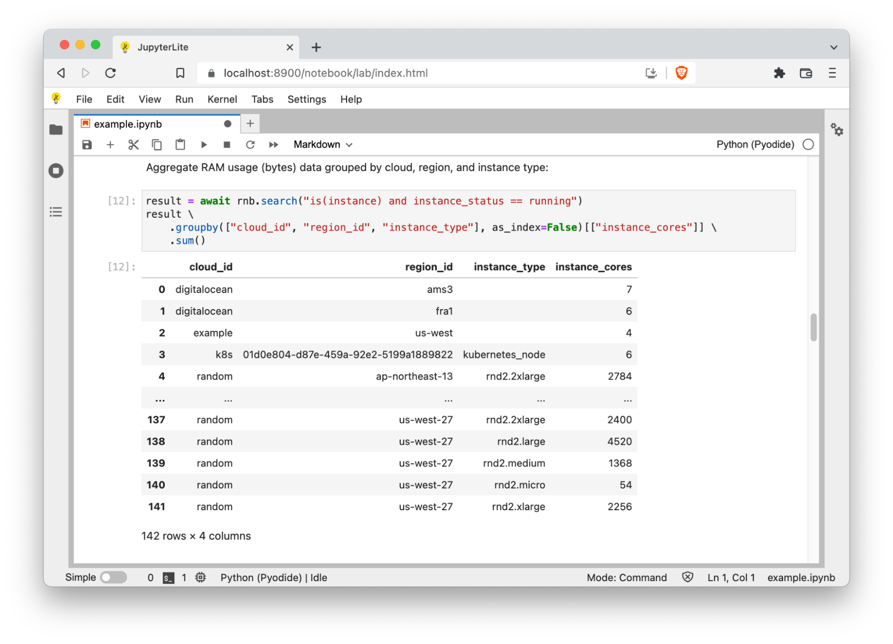
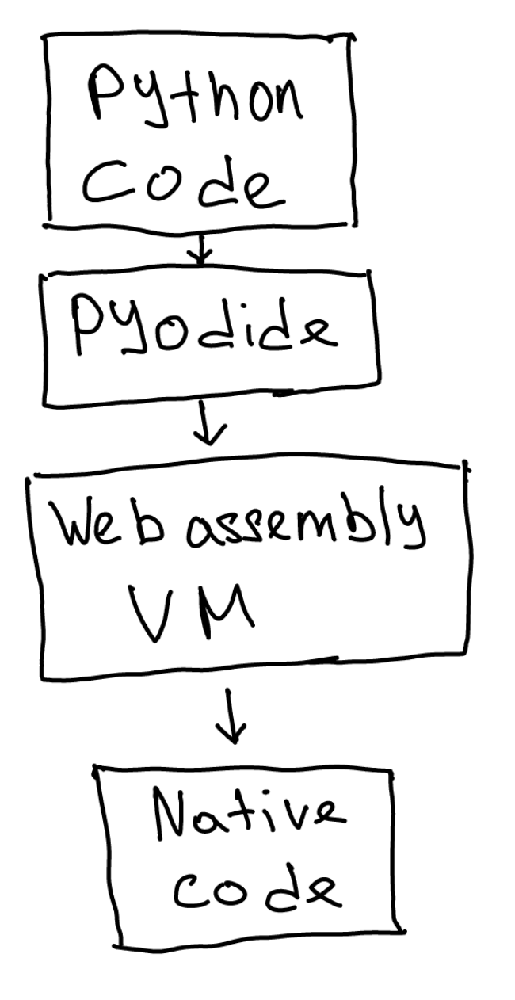

# Resoto + JupyterLite = ❤️

Hello folks! A few months ago, [we released Resoto Notebook](../resoto-meets-jupyter-notebook/index.mdx), a library that makes it easy to query, visualize, and analyze Resoto data using [pandas](https://pandas.pydata.org), [Plotly](https://plotly.com), and [Jupyter](https://jupyter.org) Notebooks.

**Today, we'll discuss Resoto's new [JupyterLite](https://blog.jupyter.org/jupyterlite-jupyter-%EF%B8%8F-webassembly-%EF%B8%8F-python-f6e2e41ab3fa) support, which allows you to use Notebooks in the browser without installing or launching a Jupyter server.**

Want to analyze raw infrastructure data when only platform engineers can access cloud consoles? Or count infrastructure assets without a data scientist? JupyterLite is a JupyterLab distribution that runs entirely in a web browser, and Resoto's JupyterLite support gives you access to popular data analysis tools without the need for any additional installation steps.

{/* truncate */}

You can access JupyterLite simply by opening `https://<Resoto Core hostname or IP address>/notebook` in your web browser!



The browser-based JupyterLab distribution is a bit different from the desktop version: it is not possible to use [`pip`](https://pip.pypa.io) directly. Instead, there is a package called `piplite` which can install Python wheels in a similar fashion.

Since JupyterLite works (almost) the same as a regular Jupyter Notebook, there are many cool things we can do with it. Let's dive in…

## Heatmaps

JupyterLite includes the [Plotly Python library](https://plotly.com/python), which is capable of visualizing data in a variety of ways. [Heatmaps](https://plotly.com/python/2D-Histogram) are one of the supported visualization methods. Heatmaps make it easy to spot outliers—imagine, for example, someone was experimenting with an expensive cluster and forgot to shut it down.



## Aggregation

As mentioned previously, [Resoto Notebook](/docs/reference/notebook) allows you to harness the power of [pandas](https://pandas.pydata.org), a popular Python package for data analysis. The [pandas](https://pandas.pydata.org) [`DataFrame` structure](https://pandas.pydata.org/pandas-docs/stable/reference/api/pandas.DataFrame.html) is a table-like object that allows for easy querying, filtering, and aggregation of data.

Let's try aggregating the number of cores in running instances per cloud, per region:



Of course, it does not end with heatmaps and aggregation! Since it is possible to execute arbitrary Python code in a notebook, the possibilities for data analysis are endless.

:::info

Once you're finished working with the notebook, it will be saved in your browser's local storage.

:::

## Usage

Jupyterlite support will be a part of Resoto 3.0. If you would like to try it out today, you can install the `edge` version of Resoto. Then, open `https://<Resoto Core hostname or IP address>/notebook` in your web browser. No need to install extra packages or run a Jupyter server!

## How It Works

There are two main components: [Pyodide](https://pyodide.org) and [JupyterLite](https://blog.jupyter.org/jupyterlite-jupyter-%EF%B8%8F-webassembly-%EF%B8%8F-python-f6e2e41ab3fa). JupyterLite is a distribution of JupyterLab that runs in a browser, and Pyodide is a port of CPython to WebAssembly/Emscripten.

### JupyterLite

We integrated JupyterLite with Resoto by adding its static assets generation to our build pipeline.

During the asset generation process, JupyterLite creates a distribution for three components: JupyterLab, "classic" Jupyter, and an interactive REPL. The last two components are not required and we excluded them from the build process to reduce the artifact size. Additionally, we disabled sourcemaps generation. These measures allowed us to cut the size of the resulting distribution from 30 megabytes down to 9.7 megabytes.

It can be all configured via the launch flags when the JupyterLite build command is called. One convenient hack we found is to define the launch flags in the configuration file called `jupyter_lite_config.json`:

```json
{
    "LiteBuildConfig": {
        "lite_dir": "jupyterlite_extras",
        "output_dir": "resotocore/jupyterlite",
        "no_sourcemaps": true,
        "apps": [
            "lab"
        ]
    }
}
```

We also used a custom Pyodide version, defined in the `jupyter-lite.json` configuration file.

### Pyodide

Pyodide is a port of CPython to WebAssembly/Emscripten. Pyodide allows you to easily run Python code in the browser. In the hierarchy of abstraction layers, Pyodide sits in between your code and the browser:



This, however, comes with some limitations. When we want to run a Python package that spawns subprocesses or opens sockets to make network calls, there is simply no such thing in the browser environment!

That posed a problem for us: we rely on a resotonotebook package which uses the requests library, and this library is opening sockets and making network calls. Fortunately, Pyodide provides a Python proxy for JavaScript APIs, which allows us to access the browser APIs using Python!

Let's look at Resoto Notebook for some examples:

```python
import js
import pyodide

path = f"/graph/{graph}/search/list"
url = js.URL.new(path, js.location.origin)
options = {"method": "POST"}
options = pyodide.ffi.to_js(options, dict_converter=js.Object.fromEntries)
response = await js.fetch(url, options)
```

Here, we make a `POST` request using the fetch API in Python. JavaScript APIs are available in the imported `js` package. When we want to provide Python data structures to the JavaScript functions, Pyodide performs the type conversion implicitly. However, to transform a dictionary to a JavaScript object we need to use a `ffi.to_js()` Pyodide call (otherwise, the implicit conversion will produce a JavaScript `Map`).

To get JavaScript types back into Python world, we use the `to_py()` method:

```python
json = await response.json()
return json.to_py()
```

`async`/`await` syntax is seamlessly interoperable in both Python and JavaScript thanks to Pyodide, which makes it easy to call into the JavaScript ecosystem. Additionally, JupyterLite has its own event loop, which makes it simple to `await` on asynchronous calls inside notebooks.

## Final Thoughts

It is quite exciting to see that the current state of the web allows us to bring powerful tools directly into the browser. We hope that you will find browser-based notebooks a useful tool for exploring your cloud assets and getting insights.
