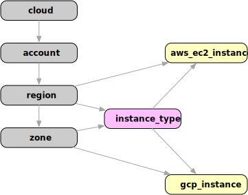

# Aggregating data with Resoto

This post is the second episode of the Resoto query language series. While it is not required, I would encourage you to read the [RQL 101](/blog/2022/02/04/resoto-query-language-101) post to get a short
introduction into the capabilities of the Resoto query language.

RQL allows selecting resources using filters, combinators, and traversals. It is probably the primary use case to perform a query and retrieve the resulting list of resources. This list can be used in other actions and commands or serves information retrieval. While it is beneficial to get a list of resource data,  we also want to combine, group, and aggregate data about our resources.

The simplest way of aggregating data using Resoto is the `count` command. It allows for counting objects or counting the occurrences of a specific property. Let's assume we are interested in the number of compute instances we maintain. We can get the answer by executing the following command:

```shell
> query is(instance) | count
total matched: 540
total unmatched: 0
```

All compute instances for all cloud providers are handled as `instance` in Resoto, so `is(instance)` will select them (see [aws_ec2_instance](/docs/reference/data-models/aws#aws_ec2_instance) or [gcp_instance](/docs/reference/data-models/gcp#gcp_instance)). The `count` command takes this list of instances and counts the number of occurrences. The `count` command also allows specifying a property to use as a grouping value. The following query would show the instances grouped by instance status. Each compute instance has a reported property named `instance_status`. The number of occurrences of this property value is counted here:

```shell
> query is(instance) | count instance_status
stopped: 48
terminated: 151
running: 341
total matched: 540
total unmatched: 0
```

While `count` is easy to use for many cases, it is not powerful enough to do advanced aggregations. Let's assume we want to know the available CPU cores and memory of all instances in our clouds. We can achieve this by using the `aggregate` function. See the following example:

```shell
> query is(instance) | aggregate 
  sum(instance_cores) as sum_of_cores,
  max(instance_cores) as max_cores, 
  sum(instance_memory) as sum_of_memory, 
  max(instance_memory) as max_mem
sum_of_cores: 3441
max_cores: 16
sum_of_memory: 12802.25
max_mem: 64
```

As you can see, we have 3441 cores in total, while there is no instance with more than 16 cores. The same data is also available for the provisioned memory: almost 13TB of RAM, while no instance has more than 64GB of RAM. We could have also queried using `min` or `avg` functions.

While this aggregated data is already useful, we would like to break it down using grouping variables. We have already seen grouping variables in the `count` command: a group is defined by the value of a specified property. Let's assume we want to aggregate available memory broken down by instance status.

```shell
> query is(instance) | aggregate 
   instance_status as status:
   sum(instance_memory) as memory
group:
 status: running
memory: 8538
---
group:
 status: stopped
memory: 1345
---
group:
 status: terminated
memory: 2919.25
```
This query will create multiple results, where each result has a group property. In this group object, you will find the values of the grouping variables. The grouping functions are all applied to the instances in this group. So we see compute instances running with a sum of 8TB, while the remaining 4TB are stopped or terminated.

## A tale about ancestors and descendants

The aggregation capabilities we have seen so far allow for grouping and functions that get applied to the result of each group. Since we are dealing with a graph, it would be great if we could aggregate not only the data of a single node but over the data of nodes that are linked in the graph! RQL allows performing merge queries to allow precisely this: they are mighty and deserve their own little blog post. But there is a handy short notation for merge queries that we want to use here, that already covers a lot of use cases:




The diagram shows the relationship between instances. AWS resources are attached to a region, while GCP resources link to a zone. Every compute instance also has a related `instance_type` node as a predecessor in the graph. To access properties of ancestor nodes of a given kind relative to a node, we can use the `ancestors` notation:

Example:
```shell
> query is(instance) | aggregate 
  sum(/ancestors.instance_type.reported.ondemand_cost) as cost
cost: 155.73
```
This query filters all instances and then aggregates the on-demand cost of each element by walking the graph up to the instance type and selecting the `reported.ondemand_cost` property from this node. The path `/ancestors.instance_type.reported.ondemand_cost` can be translated into a walk over the node's ancestors until one of kind `instance_type` is found. The walk itself is not defined explicitly, but added automagically by Resoto. The remaining part of this path is relative to the node that is found, which is `reported.ondemand_cost` in this example. The result of this aggregation query is the on-demand cost of all instances that we maintain.

It is possible to walk the graph inbound with `ancestors` and outbound via `descendants`. Let's use this technique to filter only the running instances and aggregate the data using account and region. In a query where you can write a property path, you can also use the `ancestors` syntax - aggregation groups and functions included:

```shell
> query is(instance) and instance_status==running | aggregate 
  /ancestors.account.reported.name as account, 
  /ancestors.region.reported.name as region: 
  sum(instance_memory) as memory, 
  sum(instance_cores) as cores, 
  sum(/ancestors.instance_type.reported.ondemand_cost) as cost
group:
 account: sales
 region: us-west-2
memory: 1936
cores: 484
cost: 23.232
---
group:
 account: sales
 region: us-west1
memory: 30
cores: 8
cost: 0.3799
---
group:
 account: dev
 region: us-east-1
memory: 576
cores: 144
cost: 7.2
.
.
```

Wow, this information is helpful! And it is updated as often as the graph is updated - every hour by default. Imagine the complexity of this task without a tool like Resoto.

Looking at the aggregation query above, you might think that this data would be great to watch as a metric over time. Imagine ingesting the result of an aggregation query into a time series database like Prometheus and using Grafana to visualize it. You no longer have a snapshot of the aggregated data but a metric to watch over time, with options to create alarms, etc. Guess what: this is what [`resotometrics`](https://github.com/someengineering/resoto/tree/main/resotometrics) is all about. It uses robust aggregation metrics to feed a time series database. [Check it out](https://github.com/someengineering/resoto/tree/main/resotometrics)!

See our [documentation](/docs/reference/cli/query/aggregation) for more details about aggregation capabilities.
I hope the examples presented show the power of the aggregation functionality in Resoto. Please head over to our [Getting Started](/docs/getting-started) section to try it out yourself!
