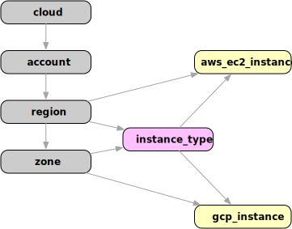

# Aggregating Data with Resoto

:::note

This blog post is the second in a series about Resoto's powerful search capability. The previous post, [Resoto Search 101](/blog/2022/02/04/resoto-search-syntax-101), provides an introduction and overview of search syntax and options. 

:::

Resoto's search capability allows selecting resources using [filters](/docs/concepts/search/filters), [combinators](/docs/concepts/search/filters#combining-selections), and [traversals](/docs/concepts/search/traversals). Search results can be combined, grouped, and [aggregated](/docs/concepts/search/aggregation).

The simplest example of search aggregation in Resoto is the [`count` command](/docs/reference/cli/count), which enables you to count objects or the occurrences of a specific property. Let's say we are interested in the number of compute instances we maintain:

```bash
> query is(instance) | count
// highlight-start
total matched: 540
total unmatched: 0
// highlight-end
```

All compute instances are of [kind](/docs/concepts/search/filters#selecting-nodes-by-kind) `instance` regardless of cloud provider, so `is(instance)` will select both [`aws_ec2_instance`](/docs/reference/data-models/aws#aws_ec2_instance)s _and_ [`gcp_instance`](/docs/reference/data-models/gcp#gcp_instance)s. The [`count` command](/docs/reference/cli/count) then takes the results and returns the number of occurrences.

The `count` command also allows specifying a property to use as a grouping value. The following search would return instance counts grouped by `instance_status`:

```bash
> query is(instance) | count instance_status
// highlight-start
stopped: 48
terminated: 151
running: 341
total matched: 540
total unmatched: 0
// highlight-end
```

While [`count`](/docs/reference/cli/count) is sufficient in many cases, the [`aggregate` command](/docs/reference/cli/aggregate) is required for more advanced use cases. For example, we could get CPU core and memory data using [`aggregate`](/docs/reference/cli/aggregate):

```bash
> query is(instance) | aggregate
  sum(instance_cores) as sum_of_cores,
  max(instance_cores) as max_cores,
  sum(instance_memory) as sum_of_memory,
  max(instance_memory) as max_mem
// highlight-start
sum_of_cores: 3441
max_cores: 16
sum_of_memory: 12802.25
max_mem: 64
// highlight-end
```

In this example, we have 3441 cores in total while each instance has a maximum of 16 cores. The same data is also available for provisioned memory: we have almost 13 TB of RAM with no instance having more than 64 GB.

While this aggregated data is already useful, we can break it down using grouping variables. We have already seen grouping variables in the [`count` command](/docs/reference/cli/count), which group data based on the value of a specified property. Let's try aggregating the available memory by instance status:

```bash
> query is(instance) | aggregate
   instance_status as status:
   sum(instance_memory) as memory
// highlight-start
group:
 status: running
memory: 8538
---
group:
 status: stopped
memory: 1345
---
group:
 status: terminated
memory: 2919.25
// highlight-end
```

The above search returns multiple results, each of which has a `group` property. The grouping variable value for each result is a property of the `group` object. In this case, running compute instances have 8 TB of available memory altogether, while the remaining stopped or terminated instances have a total of 4 TB of allocated memory.

## Ancestors and Descendants

The aggregation capabilities we have seen so far allow for grouping and functions that get applied to the result of each group. Resoto captures the state of your infrastructure as nodes and the relationship between them as edges. Wouldn't it be great if we could aggregate not only the data of a single node but over the data of ancestor or descendant nodes in the graph? Resoto's search engine allows performing nested search statements to allow precisely this: they are mighty and deserve their own little blog post. But there is a handy short notation for nested search statements that we want to use here, that already covers a lot of use cases:



The diagram shows the relationship between instances. AWS resources are attached to a region, while GCP resources link to a zone. Every compute instance also has a related `instance_type` node as a predecessor in the graph. To access properties of ancestor nodes of a given kind relative to a node, we can use the `ancestors` notation:

```bash
> query is(instance) | aggregate
  sum(/ancestors.instance_type.reported.ondemand_cost) as cost
cost: 155.73
```

This search filters all instances and then aggregates the on-demand cost of each element by walking the graph up to the instance type and selecting the `reported.ondemand_cost` property from this node. The path `/ancestors.instance_type.reported.ondemand_cost` can be translated into a walk over the node's ancestors until one of kind `instance_type` is found. The walk itself is not defined explicitly, but added automagically by Resoto. The remaining part of this path is relative to the node that is found, which is `reported.ondemand_cost` in this example. The result of this aggregation search is the on-demand cost of all instances that we maintain.

It is possible to walk the graph inbound with `ancestors` and outbound via `descendants`. Let's use this technique to filter only the running instances and aggregate the data using account and region. In a search where you can write a property path, you can also use the `ancestors` syntax - aggregation groups and functions included:

```bash
> query is(instance) and instance_status==running | aggregate
  /ancestors.account.reported.name as account,
  /ancestors.region.reported.name as region:
  sum(instance_memory) as memory,
  sum(instance_cores) as cores,
  sum(/ancestors.instance_type.reported.ondemand_cost) as cost
// highlight-start
group:
 account: sales
 region: us-west-2
memory: 1936
cores: 484
cost: 23.232
---
group:
 account: sales
 region: us-west1
memory: 30
cores: 8
cost: 0.3799
---
group:
 account: dev
 region: us-east-1
memory: 576
cores: 144
cost: 7.2
.
.
// highlight-end
```

Wow, this information is helpful! And it is updated as often as the graph is updated—every hour by default. Imagine the complexity of this task without a tool like Resoto.

Looking at the aggregation search above, you might think that this data would be great to watch as a metric over time. Imagine ingesting the result of an aggregation search into a time series database like Prometheus and using Grafana to visualize it. You no longer have a snapshot of the aggregated data but a metric to watch over time, with options to create alarms, etc. Guess what: this is what [`resotometrics`](https://github.com/someengineering/resoto/tree/main/resotometrics) is all about. It uses robust aggregation metrics to feed a time series database. [Check it out](https://github.com/someengineering/resoto/tree/main/resotometrics)!

See our [documentation](/docs/concepts/search/aggregation) for more details about aggregation capabilities. I hope the examples presented show the power of the aggregation functionality in Resoto. Please head over to our [Getting Started](/docs/getting-started) section to try it out yourself!
