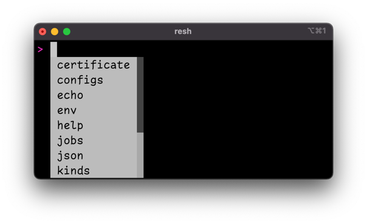
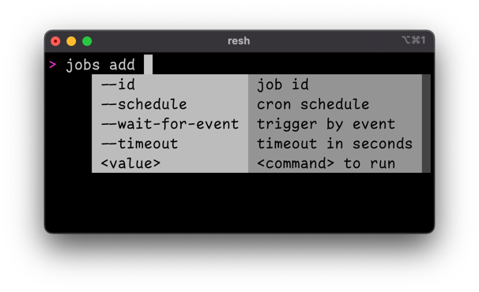

# Resoto Shell Tab Completion

Resoto has a [command-line interface](/docs/reference/cli) accessible via [Resoto Shell](/docs/reference/components/shell). Commands are not executed locally, but interpreted on the server. As such, only [Resoto Shell](/docs/reference/components/shell) is required client-side.

Resoto offers commands like [`echo`](/docs/reference/cli/miscellaneous-commands/echo), [`tail`](/docs/reference/cli/miscellaneous-commands/tail), and [`jq`](/docs/reference/cli/miscellaneous-commands/jq)—old friends to veteran shell users—but these commands only account for a small fraction of the possibilities in Resoto's [command-line interface](/docs/reference/cli).

Version 2.X of [Resoto Shell](/docs/reference/components/shell) introduces tab completion, making the [command-line interface](/docs/reference/cli) easier to use than ever before! Press the tab key, and [Resoto Shell](/docs/reference/components/shell) will present you with a list of available commands:

<!--truncate-->

The tab completion feature is context-aware and will even help you configure the options for a command:

## Search Syntax

Previous blog posts have touched upon the power and extensibility of Resoto's [search syntax](/docs/reference/search), but learning the ins and outs of Resoto's [search syntax](/docs/reference/search) has a rather steep learning curve. Never fear—the new tab completion feature also provides autocomplete for the [`search` command](/docs/reference/cli/search-commands/search) to make Resoto's [search functionality](/docs/reference/search) more accessible:

[Resources can be filtered by kind using `is(<kind>)`](/docs/reference/search/filters#selecting-nodes-by-kind) and the automated assistance uses fuzzy search, allowing you to simply type a portion of the desired text or even just the first letters. For example, `v_t` will yield the suggestion `volume_type`.

[Filter expressions use the syntax `<field> <operator> <value>`](/docs/reference/search/filters#selecting-nodes-by-predicate), and possible fields and operators are presented as suggestions as well. The autocomplete feature ideally would only list properties that are relevant for the selected kind, but it is currently shows always all possible properties—we plan to address this in the future.

## Aggregation

The [`aggregate` command](/docs/reference/cli/search-commands/aggregate) also uses special syntax to define aggregation expressions, and tab completion again can help:

As you can see, the autocomplete feature lists possible properties. There is also support for defining [`/ancestors` grouping variables](/docs/reference/search/merging-nodes#ancestors-and-descendants).

As mentioned previously, [Resoto Shell](/docs/reference/components/shell) is context-aware and will supply a list of possible aggregation functions. And since every grouping variable and every aggregation function can be renamed, the optional `as` clause is suggested as well.

We hope that the new tab completion feature makes Resoto's [command-line interface](/docs/reference/cli) easier to use!
