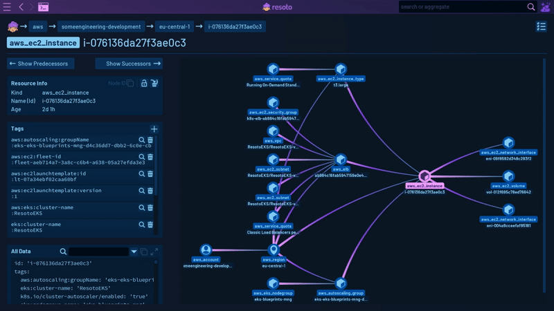

# Solving Infrastructure Fragmentation with Data

As companies grow, their cloud infrastructure quickly becomes fragmented and gets out of control. Data about what resources exist and how resources they relate to each other is tedious to acquire.

In practice, this means that the infrastructure layer often remains a mystery, and engineering teams are unable to see what's happening in their infrastructure. This makes capacity planning impossible, limits organizations' ability to control cloud costs, and leaves teams in the dark about potential security vulnerabilities.

The data to understand cloud growth exists as cloud resource metadata describing the state, configuration, and dependencies of cloud resources. Acquiring and unifying this "infrastructure data" into a single place is the solution for a lot of the problems that infrastructure engineers deal with today—not just cost, but also security and reliability.

But infrastructure is fragmented. Data is locked behind cloud APIs, and the tools that use those APIs to control the deployment of cloud resources. In this post, I'll explain how Resoto acquires infrastructure data, and then uses that data to write code.

<!--truncate-->

## The Cloud-Native Stack

Recent years have seen a shift away from stateful, persistent virtual machines to stacks composed of a cloud-native services like micro instances, Lambda functions, and Kubernetes Pods.

### Cloud Asset Inventory and Why Infrastructure Data Matters

As services have decreased in size, they have increased in volume. The number of individual services in your cloud inventory can number in the millions.

In order to deal with the overhead of managing an increased number of resources, developers have turned to automation and turnkey workflows. Developers use infrastructure-as-code tools and CI/CD pipelines to create, update, and tear down resources via cloud provider APIs.

Developers are often granted liberal permissions to provision resources in their cloud accounts so they can ship more software, faster.

As a result, cloud inventory has not only grown in volume. Consider numbers from [Pulumi](https://pulumi.com), a popular infrastructure-as-code tool; when engineers make the switch from a CLI or a console to automation with Pulumi, both inventory size and change frequency go up. According to Pulumi, the number of resources per engineer grows from 600 to 1,600, with total lifetime updates per resource shooting up from 0-5K to 20K-50K.

[<span class="badge badge--secondary">Groundbreaking Advancements in Deployments-as-a-Service Technology with Pulumi Deployments</span>](https://linkedin.com/pulse/groundbreaking-advancements-deployments-as-a-service-technology-)

What may be great for developer velocity is not so great for control. Developers effectively act as procurement, and drive the continued expansion of cloud inventory.

### Cloud Infrastructure Fragmentation

Individual developers are barely able to track the resources in their cloud accounts. Imagine then what it's like for an infrastructure team or security admins who are supposed to track changes to millions of resources distributed across hundreds of cloud accounts.

There is no data to analyze the infrastructure and answer simple questions:

- What's my compute spend by team and business unit?
- In which accounts do we have unencrypted volumes?
- What TLS certificates will expire in the next four weeks?

The missing data is a result of "infrastructure fragmentation." Because resources are distributed across cloud accounts, there is no single view of all assets, and how they are connected to each other.

Without that knowledge, it's easy to break something. That fear holds a lot of people back from cleaning up any resource. It makes it hard to maintain a general "cloud hygiene." The result is more sprawl, waste and entropy, which opens up the door for security threats and a cloud bill that grows faster than engineering headcount or revenue.

You can of course look at your cloud bill for more insights. But your bill will only tell you how much you're paying for resources. Not why they exist.

Cloud providers have their own solutions to address cloud cost and inventory problems. But they are mostly incomplete and not interoperable. Cost and price information is often buried and hidden behind pricing APIs. Pricing API data is not easy to correlate with, since names differ between the billing API and the compute instance APIs. This is true for both <abbr title="Amazon Web Services">AWS</abbr> and Google Cloud.

## ELT for Infrastructure Data

The status quo to solve these problems has been more observability, tools and scripts. But they all create more siloed, incomplete data sets and integration headaches.

### Lessons from Analytics Engineering and the Modern Data Stack

What's missing is a new layer—a central place that unifies resource data for quick exploratory analysis, without prior knowledge from state files or templates (which describe what infrastructure _should_ look like but don't reflect the reality of what it _actually_ looks like).

Since metadata is distributed and locked behind the cloud and tool APIs, the first step is to extract that data. The issue with these APIs is that they were built for workflows, not for insights. That makes extracting data a brutally manual process. But the playbook to integrate data from distributed sources already exists—in analytics engineering.

- In analytics, <abbr title="extract, load, transform">ELT</abbr> tools extract raw data from production databases and SaaS tools ("sources") on a regular cadence and load it into a data lake or cloud warehouse.
- Raw data is transformed into a format better suited for analysis, and to create data sets for domain-specific use cases (product, finance, sales, CEO, etc.).
- For last mile visualization and presentation, there are dashboards and "reverse ETL" tools that sync data back into the operational tools used by the different domains.

The whole stack is commonly categorized as "the modern data stack", with SQL as the dominant paradigm to transform and query data.

In addition, the concepts of "data products" or "data apps" have gained a lot of popularity. These are interactive applications built on top of the data in the warehouse or data lake, to deliver insights or automatically perform actions. In particular with data apps, machine learning and general data science, a programming language like Python and DataFrame operations are often better suited than SQL.

### Data Integration for Cloud APIs

We can apply the principles from analytics engineering to infrastructure data, and produce a snapshot of the resources in a cloud on a regular cadence by extracting data from the cloud APIs.

How come data integration for cloud infrastructure data hasn't happened up until this point? It's a broader reflection of "the state of infrastructure data":

- The people with access to data (SREs, DevOps) don't have the tooling in place to use it.
- The people with the tooling to use data (analytics engineers) don't have access to it.

But if we bridge the disconnect, we can solve a lot of infrastructure problems in a new, different way:

1. Ask ad-hoc questions and combine infrastructure data ("slice and dice") without having to query our infrastructure directly.
2. Export data and metrics into operational tools for more complete visibility ("data hydration").
3. Write code and build infrastructure apps that automate tasks and incorporate data into deployments and updates.

That approach is different from existing operational tools (DevOps, SecOps, DevSecOps, etc.), which typically require the installation of agents that only collect a subset of data. The discovery is usually also separate from the remediation, i.e. it takes a human to take the insights from discovery and translate them into an action or a policy. That always introduces friction and delays.

## How Resoto Works

Just like an ELT tool, Resoto collects data from cloud APIs to build a cloud inventory that's a complete representation of all resources in your infrastructure.

At the most basic level, Resoto has two components that integrate with each other:

1. An analytical layer that collects raw infrastructure metadata.
2. A governance layer that uses that infrastructure metadata as an input to write code.

Users can write and invoke Resoto code from a [command-line interface](/docs/reference/cli) or from a low-code user interface. The link between the two components is a [unified data model](/docs/reference/unified-data-model).

So, what's the benefit of integrating analytics with governance? I can now use data to write code that discovers resources and reconciles any undesired changes, from a single UI. My code knows how to understand and then change the state of a resource. That opens the way to put infrastructure on autopilot, and continuously reduce the need for human intervention.

### Resoto's Search Syntax

Here's an example of what a search looks like in Resoto:

```bash
> search is(volume) and age > 30d and last_access > 7d and volume_status = available | clean
```

There are two major components in the above command:

- a filtered search for volumes, and
- the `clean` command to mark those volumes for cleanup.

The `search is(volume)` statement searches for all unused (`available`) EBS volumes created at least 30 days ago (`age`) and without any I/O during the past 7 days. The search determines I/O by looking at the last time the resource has either been accessed (`last_access`). We use the 30 days / 7 days combination as a proxy to determine that this volume is unused and can safely be cleaned.

The search generates a list of volumes that match the filter. The result is piped as an input into the [`clean` command](/docs/reference/cli/action-commands/clean). The search filter and action command form a [job](/docs/concepts/automation#jobs) when combined with a [job trigger](/docs/concepts/automation#job-trigger).


Resoto's search syntax is inspired by the Unix shell and designed to be both human- and machine-friendly. For example, Resoto ships with [full-text search functionality](/docs/reference/search/full-text). Resoto's search offers a simple way to make infrastructure data accessible, retrieve insights, and create automations.

### Resoto's Cloud Resource Data Models

The data models for cloud APIs differ, meaning to join data, you'd need to have a detailed understanding of each service's data model. Without that expertise, it becomes hard to combine data sets.

Resoto solves that problem with abstraction. [Resoto's unified data model](/docs/reference/unified-data-model) is cloud-agnostic and supports static-typing and inheritance. Inheritance represents the idea that a resource kind (a "child" resource) inherits properties from another resource kind (a "parent" resource). The child resource has the properties of the parent resource in addition to its own child-specific properties.

The highest-level abstraction and base kind in Resoto is a [resource](/docs/reference/unified-data-model#resource-base-kind). Seven properties are common to all resources:


Properties specific to a particular type of resource are properties of the corresponding kind. For example, every volume is a resource, but some attributes are specific to volumes only (e.g., `volume_type`).

The benefit of this approach is that it delivers a consistent model to retrieve data from different clouds. I can navigate my cloud without prior knowledge about a specific resource.

For example, I can start with a simple search that summarizes all resources that have been created in the last two days by kind:

```bash
> search age < 2d | count kind
```

:::info

Read more about the benefits of Resoto's data model and how it works in [Multi-Cloud Resource Management with Resoto](../multi-cloud-resource-management-with-resoto/index.mdx).

:::

### Resoto's Asset Inventory Graph Database

The traditional approach for ELT uses a row- or column-based data store. A key difference of Resoto is its [asset inventory graph](/docs/concepts/asset-inventory-graph).

When Resoto collects data:

1. records an inventory of all resources,
2. stores the properties for each resource, and
3. captures relationships between resources.

Resoto's asset inventory graph shows the connections between resources running in your cloud and visualizes the pathway to any resource. The below image depicts the dependencies of an EC2 instance in the Resoto UI:



In combination with Resoto's search syntax and jobs, the graph becomes a tool to find critical misconfigurations, put them into context with the rest of your infrastructure, and perform remediation from a single UI. With Resoto, I can continuously scan my infrastructure and introduce custom rules and security monitoring to improve cloud security posture.

Resoto has a pluggable architecture. Resoto resource collectors are configurable plugins that communicate with [Resoto Core](/docs/reference/components/core) and the graph. This pluggable architecture makes Resoto extensible and customizable. We're constantly building collectors for new data sources, and new plugins that perform actions to enhance security or reduce costs (all open-source!).

It's possible to flatten and export data in row-based format to other destinations (e.g., a CSV file, a time-series database like Prometheus, or dashboard tools like Grafana). With [Cloud2SQL](https://cloud2sql.com), we've also carved out our collectors as a stand-alone ELT product, with support for [destinations](https://cloud2sql.com/docs/configuration#destinations) like [Snowflake](https://cloud2sql.com/docs/configuration#snowflake) and [PostgreSQL](https://cloud2sql.com/docs/configuration#postgresql).

## Data-Driven Cloud Control

Resoto is a cloud infrastructure control plane that applies principles from analytics engineering to infrastructure data. What makes Resoto different is that it combines the analytics with a governance layer. The combination provides visibility and control in a single UI.

We think about Resoto as a programming environment for your infrastructure—with clean, normalized infrastructure data as the foundation. With a unified data model, a human-friendly search syntax, and automation through code—we think there's no better way to give developers flexibility while staying in control of your infrastructure.

Resoto has become the product it's today because of specific point of views we hold:

- Cloud infrastructure data should be easily accessible, without requiring specialized knowledge.
- Cloud infrastructure data is an input for writing code.
- Infrastructure tools should combine discovery and remediation in one interface.
- Infrastructure apps are the new way of automating infrastructure work.

These points of views are what led us to build Resoto, and we're excited to extend its functionality.

If you want to play around with Resoto, head over to [Getting Started](/docs/getting-started) to install Resoto, and [join us on Discord](https://discord.gg/someengineering) to ask any questions! We'll see you there!
