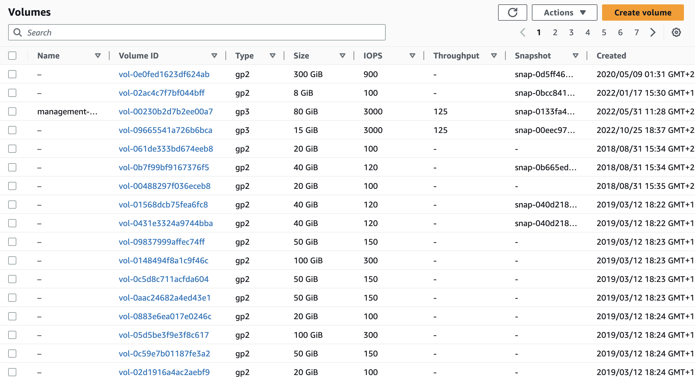
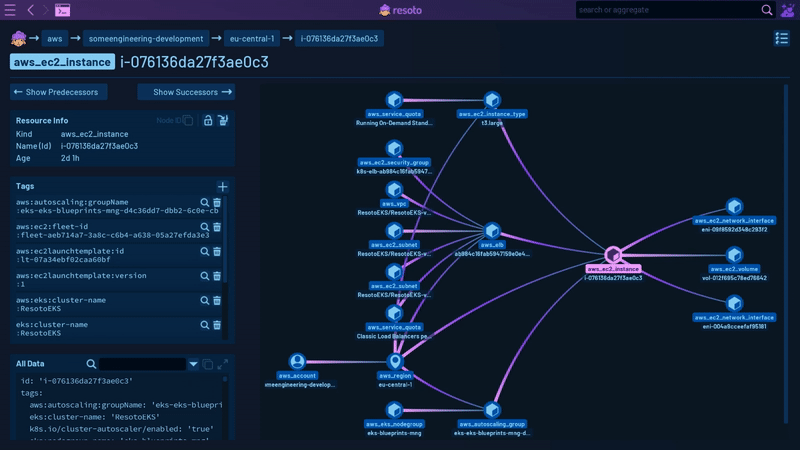

# Tackling Infrastructure Fragmentation with Reactive Infrastructure

Hi there fellow cloud enthusiast 🖖

In this blog post, we'll delve into infrastructure fragmentation, exploring what it entails, why it impacts every organization utilizing the cloud, and how building a reactive infrastructure brings order to chaos.

## Explaining Infrastructure Fragmentation: The Laptop Analogy

For an analogy let's take your Laptop. Over time, performance declines due to a variety of factors, including the accumulation of unnecessary files, software conflicts, and the buildup of outdated or redundant software. And despite your best cleaning efforts, after a year or two its performance is just not what it used to be and everything is a bit more cluttered and disorganized than what it was like when brand new.

Now instead of just you working with that Laptop, imagine there were tens, hundreds or even thousands of users. Imagine every cloud user in your organization was working on it as well. That is what your cloud infrastructure looks like.

Infrastructure fragmentation, also known as cloud fragmentation or cloud sprawl, refers to the phenomenon where an organization's cloud infrastructure becomes decentralized and uncoordinated due to the widespread adoption of cloud services by independently operating teams or individuals and a lack of centralized governance.

In other words, **infrastructure fragmentation is the uncontrolled proliferation of cloud services and providers within an organization**. Resulting in a disorganized and difficult-to-manage cloud infrastructure.

Infrastructure fragmentation can create various problems, such as security issues, quota and performance problems as well as increased costs due to redundancies, leaked or abandoned resources and Infrastructure as Code (IaC) drift.

<!--truncate-->

## Tracing the Roots of Infrastructure Fragmentation

Infrastructure fragmentation can be caused by a variety of factors, some wanted some unwanted, but they all result in a **distribution of control**.

The unwanted factors include lack of coordination and communication between departments and teams, rapid adoption of new technologies without proper evaluation, lack of standardization and clear policies and procedures for infrastructure adoption and management.

A wanted factor would be different or decentralized teams within an organization independently choosing different cloud providers and technologies to meet their specific needs, increase developer velocity and ship more products.

In the past you might have had a more centralized approach like an IT department that acted as a sort of gatekeeper for all software and hardware purchases and rollouts. They would document and have an eye on all changes.

Today control over your infrastructure is fragmented across your entire organization. Teams and individuals, CI/CD systems, IaC tools, scripts and Kubernetes clusters. They all create and modify infrastructure resources.

We gained developer velocity and are shipping more products, but in exchange gave up some control over our infrastructure to each individual part.

## The Pitfalls of Distributed Control

In one word, entropy.

When infrastructure control is distributed, it becomes difficult to maintain consistent practices.

Four examples:

- Different teams and individuals may have different levels of security awareness and may use different tools, leading to inconsistencies in security measures that can make it easier for attackers to exploit vulnerabilities.
- In organizations that are using commercial software it can become difficult to keep track of licenses and ensure compliance with regulations and policies.
- Another issue is inefficiencies in resource allocation and utilization. Overprovisioning is a common occurrence, leading to wasted resources and increased costs.
- It can also be challenging to keep track of all the different infrastructure resources in use. This can lead to a lack of visibility into the overall infrastructure.

## The Silent Enemy: Infrastructure Drift

Another common outcome of infrastructure fragmentation is drift. Meaning **over time more cloud resources are created than deleted** and the actual state of your cloud diverges from the desired state of your cloud, resulting in an ever increasing cloud bill.

The reasons for drift are plenty. Maybe somebody did manual changes in the cloud console and now the actual state diverges from that in your Terraform state file, or maybe an API or the network had intermittent errors and the infrastructure was only partially created or torn down. Maybe the CI/CD system had a failure and left testing resources behind. Maybe a compute instance was created with multiple storage volumes but on termination only the root volume was deleted. Maybe the same instance had a CloudWatch alert associated with it but on termination that alert was never deleted. Again there are many, many reasons why drift happens.

The reason why drift and with it infrastructure fragmentation accumulates is also simple. **It is zero risk to create new resources but non-zero risk to delete them.**

To illustrate this issue, put yourself into the shoes of an SRE that encounters a couple of thousand unused storage volumes, all named `vol-0fc64e721e8a6864b`, `vol-0fcbed0d628d43164`, `vol-0fcd4faf0b3c1e737`, and so on.

You can see that they aren't in use, but you have no idea if they contain a backup copy of your customer database, or just a redundant copy of some website assets. Would you delete them?

What we see in practice is customers doing ad-hoc cleanup sessions every couple of months. Either because they ran into a quota limit or because their finance department asked them why the cloud bill is growing 10% month over month.

And let's be honest with ourselves; your CFO is sitting at the very end of this causal chain. Finance shouldn't be the ones telling us about an issue with our cloud infrastructure.

Ad-hoc cleanup sessions result in suboptimal resource usage, heightened security vulnerabilities, and the diversion of time and resources from more productive tasks.

## Reality Check: Do You Really Know What's Running in Your Cloud?

One objection we've heard over and over is "We use IaC. Everything is locked down and well managed. I know exactly what's running." Your cloud might be well-managed, but I doubt you truly know what's running in it.

My last job was at a mid-sized Silicon Valley startup. We were about 200 engineers and this is what our cloud infrastructure looked like after four years of creating and deleting resources:

Those are 543k cloud resources across 40 AWS and 17 Google Cloud accounts.

Every little pixel-like box is an individual cloud resource. Anything from an IAM policy to a compute instance, storage volume, load balancer, Lambda function, Kinesis stream, Sagemaker model or that old CloudFormation stack in a region you haven't looked into in a while.

**There is no way for any individual to know what each resource is used for, how it relates to other resources and whether it should still exist or not.**

If only there was a way for the infrastructure to monitor itself, automatically react to changes and notify the user immediately when something bad happens, so they don't find out at the end of the month when the bill arrives or worse, on CNN because the security breach of that four year old Wordpress installation was not detected.

## Understanding Reactive Infrastructure

Reactive infrastructure is a new cloud management approach that involves continuous monitoring and adaptation of cloud resources to meet changing demands and conditions. It allows organizations to optimize resource utilization, minimize costs, and ensure high availability, all while maintaining security and compliance.

Reactive infrastructure continuously monitors your entire cloud environment. Hundreds of thousands or even millions of resources. Comparing their state against established security benchmarks and best practices. For instance, if Resoto identifies that a user has created [databases with unencrypted storage](/docs/how-to-guides/security/storage/find-unencrypted-aws-rds-storage-volumes), it can alert you to this situation. This allows you to proactively address security risks and maintain compliance with industry standards.

With reactive infrastructure, you can define policies and actions to automatically remediate issues in your cloud environment. This can include shutting down unused resources, starting up resources when needed, and enforcing tagging policies, among other tasks.

By monitoring and adapting to changes in your infrastructure, reactive infrastructure solutions like Resoto provide a comprehensive overview of resource utilization and ownership. This enables better tracking and accountability for all cloud resources across your organization. Resoto is capable of generating reports and exporting your [asset inventory](../cloud-asset-inventory/index.mdx), allowing you to automatically incorporate this information into existing documentation systems, ensuring your documentation is never out of date.

Reactive infrastructure integrates with your existing IaC tools, CI/CD pipelines, and monitoring systems to provide a unified and efficient approach to cloud management. For instance, your CI system can assign an expiration tag to resources, and Resoto will ensure that these resources are appropriately expired as per the specified timeframe.

## How Reactive Infrastructure Complements Declarative Infrastructure

When you hear "reactive infrastructure" you might be thinking, "But I'm using Gitops and IaC, I want a declarative infrastructure. Reactive infrastructure sounds like it goes against that."

Think about all the systems we have invented that change our infrastructure out of band from IaC tools.

- Autoscaling Groups that add or remove compute instances.
- Kubernetes Cluster API (CAPI) that adds resources when load demands it.
- CI/CD systems that spin up test resources.
- Policy enforcement engines like Cloud Custodian that modify your resources.
- Backup and disaster recovery solutions that automatically create volumes and snapshots.
- DNS services that automatically CRUD records to reflect infrastructure changes.

Chances are you're already using systems that dynamically change your cloud environments. Reactive Infrastructure can coexist with and complement your declarative approach.

Reactive Infrastructure is not a replacement for declarative infrastructure or IaC, but rather an enhancement to it. It brings the benefits of adaptability, resilience, and responsiveness to the table. By embracing a reactive approach, you can create a more robust and flexible infrastructure that can automatically adjust to changes and recover from failures.

When properly integrated, reactive infrastructure can actually help maintaining the desired state defined in your IaC templates. By continuously monitoring and reacting to changes in real-time, reactive infrastructure can identify and remediate drift or discrepancies between your desired state and the actual state of your infrastructure. This ensures that your cloud environment remains aligned with your IaC definitions while keeping it highly adaptive to changing conditions.

## Mastering Reactive Infrastructure with Resoto

Resoto is a cloud infrastructure control plane that offers several clever features to simplify and enhance managing cloud resources at scale.

The disarray depicted in the above graph image was the driving force behind Resoto's creation. Our aim was to tackle the infrastructure challenges we faced ourselves.

We were no strangers to tools that identified problems in our cloud environment but offered no solutions. We envisioned a system that not only provided a comprehensive understanding of our entire cloud infrastructure but also had the ability to resolve issues and establish automations. This way, if the same problem reoccurred, automatic remediation would be in place.

Importantly, Resoto was designed not to be a gatekeeper that slows down developer velocity. Instead, everybody can work with the tools they know and love, while Resoto would operate in the background, monitoring everything and intervening with corrective actions when necessary.

The result was a system that enabled us to search and visualize our entire infrastructure, carry out actions such as verifying, updating or deleting tags, and locating and removing abandoned or unused resources. Additionally, this system could automate all these actions, shut down sandbox environments over the weekend, and constantly monitor any changes in the infrastructure environment. If needed, it would either notify us or independently initiate corrective actions.

Working with Resoto involves four key stages:

1. **Discovery** - Resoto enables you to explore your entire cloud infrastructure much like you would with a file explorer. Its search command helps you identify problematic resources, such as _instances that are over two years old with more than 16 cores, across all your clouds, accounts, and regions_. You can also perform full-text searches to find specific strings in resource names, descriptions, tags, labels, or other attributes, which is helpful when trying to identify _the account associated with an IP address or storage bucket_. In this initial phase, you'll acquire a more comprehensive understanding and form a clear mental model of your cloud infrastructure.
2. **Manual Remediation** - Upon discovering problematic resources, Resoto allows you to take manual actions, like flagging them for cleanup. You can use the same search command and pipe it into the desired action, such as searching for _available volumes with last access over 30 days and cleaning them_.
3. **Automation** - After resolving an issue, you can prevent it from recurring by creating a job using the `job add` command with the same search parameters. This job will run automatically whenever there are changes in your infrastructure.
4. **Monitoring** - Finally, you can create a dashboard in the Resoto UI or a tool like Grafana to track metrics relevant for you. Ideally, most of your time will be spent in this stage after setting up Resoto. You can also configure alerting and notifications through Alertmanager, Discord, Slack, or even create Jira tickets automatically.

You progress through each stage one by one, starting with discovery. Initially, there's a considerable amount to discover and explore. Once you've completed all the manual remediations and implemented automation, the majority of your time will be spent in the monitoring stage. This typically involves observing a dashboard to ensure no anomalies occur or waiting for the system to alert you. If any unexpected behavior arises, you return to the initial discovery stage to investigate the cause, address the issue, automate the solution, and resume monitoring.

**The goal is to put your reactive infrastructure on autopilot, with minimum interventions.**

### Unified Data Model

Under the hood Resoto also does some clever things. It comes with a unified data model designed to tackle the challenges of working with multiple cloud providers and their diverse resource types, attributes, and naming conventions. By employing a unified data model with support for static typing and inheritance, Resoto ensures a consistent and straightforward way to interact with resources across multiple cloud platforms.

For instance, Resoto recognizes both `aws_ec2_volume` and `gcp_disk` resource types, which inherit properties from the generic `volume` type, which in turn inherits from the basic `resource` type. This hierarchy allows users to search and interact with resources using common attributes without having to worry about provider-specific naming conventions. However, the unified data model retains the ability to access all provider-specific attributes, giving you the flexibility to work with the unique features of each cloud platform.

### Data Enrichment

Resoto also enriches the data it provides. Most cloud data collection tools just fetch whatever data the cloud provider API returns and present it to the user. Resoto on the other hand merges and enriches data from multiple sources. It combines configuration data with utilization data which enables the user not only to understand if a resource is properly configured but also how it is utilized.

Take RDS databases for example. Resoto not only fetches all the metadata from the API but also searches CloudWatch time series for information like when did somebody last connect to this database. This information is then added to the resource in the form of a last_access timestamp. So you can perform searches like search is(database) and last_access > 1w to find databases that haven't been accessed in over a week.

Likewise for storage volumes Resoto enriches the data with information about the last read and write I/O. Because you don't just want to know that a volume is not in use right now. You want to know when it was last in use.

For systems like Kubernetes, Resoto creates connections between e.g. a Kubernetes Node and the compute instance that node is running on. Allowing Resoto to answer questions like "what hardware is this pod running on?"

## Conclusion: Overcoming Infrastructure Fragmentation with Reactive Infrastructure

Infrastructure fragmentation and with it distribution of control poses significant challenges for organizations managing cloud resources at scale.

Reactive infrastructure offers a solution that simplifies the management process and empowers businesses to keep their environments organized, efficient, and secure. This approach seamlessly integrates discovery, manual remediation, automation, and monitoring to provide a comprehensive solution for tackling infrastructure fragmentation issues.

Tools like Resoto can play a pivotal role in implementing a reactive infrastructure, allowing organizations to focus on what truly matters - growing their business and delivering value to their customers.

By providing comprehensive visibility, discovery, remediation, automation, and monitoring, Resoto empowers you to mentally defragment your cloud infrastructure and regain control to achieve a more organized, secure, and efficient cloud environment.
