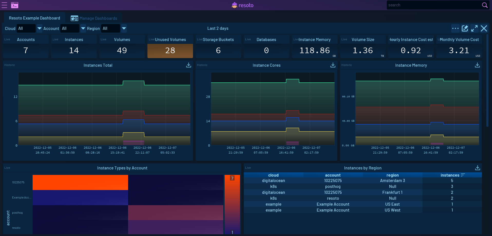

# Visualizing Cloud Inventory with Resoto Dashboards

Resoto makes it easy to create an [inventory of your cloud infrastructure](../cloud-asset-inventory/index.mdx). With just a few commands, you get a snapshot of your resources. And with that data ingested into a time series database, you not only know the current state of your cloud but also have insights into changes and trends.

Resoto also offers simple and human-friendly ways to view this data—you can [export the data to Google Sheets](/docs/how-to-guides/data-export/export-data-to-google-sheets) to create charts or use [Resoto Notebook](/docs/reference/notebook) for interactive search visualization and analysis.

**Today, we are introducing a new way to visualize this data: [Resoto Dashboards](/docs/reference/user-interface/dashboards).**

With Resoto Dashboards, your searches and queries are executed periodically and the results displayed in widgets automatically. You can also customize and organize widgets in the dashboard to keep the most important metrics always within reach. You can even share dashboards across your organization so others can access the data. And of course, you can access your dashboards anywhere you have access to your Resoto installation.

<!--truncate-->

## Key Concepts

A **dashboard** is a container in which you can place **widgets**. Each widget displays data according to its configurable properties. The following widgets are currently supported:

- Numeric indicators
- Line charts
- Heatmaps
- Tables

You can freely position and resize widgets within a dashboard to organize data in way tailored to your specific application.

Each widget requires one or more **data sources**. Data sources execute a query periodically to refresh dashboard data. These are the data sources available today:

- Search
- Aggregate search
- Time series
- Two-entry aggregate search

## Example Dashboard

Once Resoto is up and running, you can access the web UI by following the instructions for your install method:

- [Amazon Web Services](/docs/getting-started/install-resoto/aws#launching-the-web-ui)
- [Docker](/docs/getting-started/install-resoto/docker#launching-the-web-ui)
- [Kubernetes](/docs/getting-started/install-resoto/kubernetes#launching-the-web-ui)
- [pip](/docs/getting-started/install-resoto/pip#launching-the-web-ui)

You will then see the following home screen:

Click on the dashboard button, and you will be redirected to the **Dashboard Manager**:

### Unused Volumes

Double-click **Resoto Example Dashboard** to open a default dashboard with pre-configured widgets.

Look for the **Unused Volumes older than 1 week** table widget. As its name suggests, this widget displays a complete list of volumes with age greater than one week—useful if you want to know what resources should be marked for [cleanup](/docs/concepts/resource-management/cleanup).

Click the pencil icon in the upper-right corner of the dashboard to enter "edit mode." In edit mode, you can move, resize, and modify widgets. Notice that a pencil icon has now also appeared on each widget. Let's try editing the **Unused Volumes older than 1 week** table widget:

The right side shows a preview of the widget and display options (just some color settings in this case).

On the left side, you can define data sources to be displayed by the widget. You can modify the existing search to fit your needs.

When you are done making changes, press **Accept** and the widget will be updated in the dashboard. Don't forget to exit edit mode by clicking the pencil icon in the upper-right corner again.

### Volume Sizes

The **Volumes Sizes** chart widget shows how the size of the volumes has changed over time for each account. Hovering over it will reveal a legend with summarized information about the data (in this case, volume size per account).

:::info

This widget gets data from a Prometheus time-series database. Check out [Actionable Cloud Infrastructure Metrics](../actionable-cloud-infrastructure-metrics/index.mdx) for details on how to add and configure metrics.

:::

Let's examine this widget using edit mode:

On the left, you again see the widget's data sources. This widget automatically generates a query based on inputs to the various fields. We selected the `volume_bytes` metric from the dropdown menu and opted to sum by account. The legend setting is used to display the account name when hovering the mouse over the chart.

## Conclusion

This quick overview only scratches the surface of what is possible with Resoto Dashboards. We are working on adding more comprehensive information to our [docs](/docs). Stay tuned for more!
