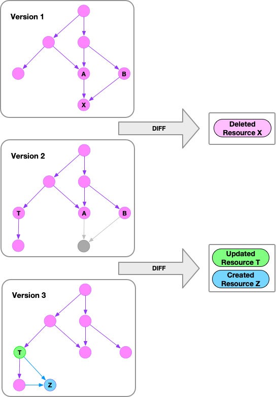

# What We Can Learn from History

> **"A generation which ignores history has no past—and no future."**<br/>_— Robert A. Heinlein_

While Heinlein's words refer to human history, they also apply to cloud infrastructure. Most of the time, we care about the current state of resources; but sometimes, we want to know the origin of a resource, when a resource was deleted, or when/how a resource was updated.

Such knowledge is necessary in situations where you need to understand the timeline to investigate a specific system behaviour:

- To perform the post-mortem analysis of an outage, we need to know which cloud resources changed and how they changed to yield the behaviour that we saw in our application. Without the ability to review a change log this becomes impossible.
- To understand cost spikes in your cloud billing dashboard, you need to understand what resources were created, when they were created, and by whom they were created. Not only do you need a list of changes, but also the ability to filter, group, sort, and aggregate the data to see the big picture.
- To check for security issues or compliance violations, you may need to reduce the scope to verify only those resources that were created or updated since the previous scan. Even complex checks can be performed on large infrastructures if they are only run against changed resources.

**History is a log of events defining your infrastructure.** This event log is important, as it will enable you to answer future questions about the state of your infrastructure retrospectively, including tomorrow's questions that have not yet crossed your mind.


<!-- truncate -->

## Existing Cloud Provider Tools

Without Resoto, you rely on your cloud provider for information. In many cases, cloud providers offer tools yielding at least some information:

- [**AWS CloudTrail**](https://docs.aws.amazon.com/awscloudtrail/latest/userguide/cloudtrail-user-guide.html)

  > "AWS CloudTrail is an AWS service that helps you enable operational and risk auditing, governance, and compliance of your AWS account. Actions taken by a user, role, or an AWS service are recorded as events in CloudTrail. Events include actions taken in the AWS Management Console, AWS Command Line Interface, and AWS SDKs and APIs."

- [**Google Cloud Audit Logs**](https://cloud.google.com/logging/docs/audit)
  > "Google Cloud services write audit logs that record administrative activities and accesses within your Google Cloud resources. Audit logs help you answer 'who did what, where, and when?' within your Google Cloud resources with the same level of transparency as in on-premises environments."

These tools give insights into resource changes; but if your application is spread across different accounts or regions, it is tedious to gather the data. If you have resources in a Kubernetes cluster, cloud provider tools actually won't help at all, further increasing the amount of tedious, manual work. If you want to know how a resource was configured at a specific time, your only hope is that Kubernetes Deployments may have an answer based on the configured resource limit.

**Cloud providers do not offer a complete picture of the history of your infrastructure across accounts and regions, they cannot show a resource's configuration at a given point in time, and they completely ignore resources maintained in Kubernetes.**

## Resoto's `history` Command

**Resoto maintains a record of your resources in an asset inventory.** Resoto scrapes your infrastructure at regular intervals and tracks the configuration of collected resources. Whenever a change to a resource is detected, Resoto updates its internal representation of the resource and captures the change as an event in its database:



Since Resoto does not rely on cloud providers to provide historical data but instead generates it from collected snapshot data, you can use Resoto to get the history of all your resources, no matter where they are running.

Resource changes fall into one of three categories:

| Event     | Description                      | Payload Data                                        |
| --------- | -------------------------------- | --------------------------------------------------- |
| `created` | A resource was created           | Configuration of the created resource               |
| `updated` | An existing resource was changed | Configuration of the updated resource               |
| `deleted` | A resource was deleted           | Configuration of the resource prior to its deletion |

The [`history` command](/docs/reference/cli/search-commands/history) in Resoto supports filtering of events by type and time:

```bash title="List all reasource deleted between 2022-12-02 and 2022-12-09"
> history --change node_deleted --after 2022-12-02 --before 2022-12-09
# highlight-start
​change=node_deleted, changed_at=2022-12-03T16:02:17Z, kind=aws_iam_role, name=resoto-eks-stack, cloud=aws, account=prod, region=global
​change=node_deleted, changed_at=2022-12-04T16:02:17Z, kind=aws_vpc, name=eks-stack-vpc, cloud=aws, account=dev, region=eu-central-1
​change=node_deleted, changed_at=2022-12-07T16:37:12Z, kind=kubernetes_pod, name=resotocore, cloud=k8s, account=resoto, region=default
# highlight-end
```

We defined the absolute times for the `before` and `after` filters, but could instead use duration strings (e.g., `2d` = 2 days, `4h` = 4 hours, `6m` = 6 minutes, `2d4h6m` = 2 days 4 hours 6 minutes) to specify relative times. Durations are subtracted from the current time:

```bash title="List all reasource deleted in the last 3 days"
> history --change node_deleted --after 3d
# highlight-start
​change=node_deleted, changed_at=2022-12-07T16:37:12Z, kind=kubernetes_pod, name=resotocore, cloud=k8s, account=resoto, region=default
# highlight-end
```

To retrieve the configuration of the deleted resource, we can pipe the result into the [`dump` command](/docs/reference/cli/format-commands/dump). Since the complete configuration is part of any event, we can use this approach for any event, no matter which type of event or which time the resource changed.

```bash title="Display last known configuration of deleted resources"
> history --change node_deleted --after 3d | dump
# highlight-start
​id: '4836788'
​reported:
​  id: b9a2ca84-399c-4716-8f1e-3ab47a4f89d4
​  tags:
​    kubectl.kubernetes.io/restartedAt: '2022-12-01T23:33:14+01:00'
​  name: resoto-resotocore-5ff798987-wj7cp
​  ctime: '2022-12-01T22:33:17Z'
​  resource_version: '39787763'
​  namespace: default
​  labels:
​    app.kubernetes.io/instance: resoto
​    app.kubernetes.io/name: resoto
​    pod-template-hash: 5ff798987
​    resoto: core
​  pod_spec:
​...
# highlight-end
```

Resoto includes a powerful search DSL that allows filtering resources. The `history` command understands this search syntax and can perform further filtering. Let's filter to only list Kubernetes deployments with names including `core`:

```bash title="List all changes to "core" Kubernetes deployments after 2022-12-02"
> history --after 2022-12-02 is(kubernetes_deployment) and name~core
# highlight-start
change=node_updated, changed_at=2022-12-02T16:37:12Z, kind=kubernetes_deployment, name=resoto-resotocore, cloud=k8s, account=resoto, region=default
change=node_updated, changed_at=2022-12-04T00:02:21Z, kind=kubernetes_deployment, name=coredns, cloud=k8s, account=posthog, region=kube-system
# highlight-end
```

You can not only apply filters, but you can also use any other Resoto command (e.g., [`count`](/docs/reference/cli/search-commands/count) and [`aggregate`](/docs/reference/cli/search-commands/aggregate)).

If we want to know which resource kinds have changed the most in the last week, we could use the following command:

```bash title="Counts of resource kinds changed in the last week"
> history --after 7d | count kind
# highlight-start
​aws_iam_access_key: 96
​aws_ec2_volume: 141
​kubernetes_endpoint: 182
​aws_iam_role: 285
​kubernetes_node: 450
​kubernetes_config_map: 720
​total matched: 1874
​total unmatched: 0
# highlight-end
```

We can also count changes by type to see how many resources have been created, updated, and deleted in the last week:

```bash title="How many resources have been created, updated or deleted in the last week"
> history --after 7d | count /change
# highlight-start
​node_updated: 412
​node_deleted: 480
​node_created: 982
​total matched: 1874
​total unmatched: 0
# highlight-end
```

We can even aggregate by resource owner and event type if you have a tagging policy in place where resources have `owner` tags:

```bash title="Count changes in the last week by owner and type"
> history --after 7d | aggregate tags.owner, /change: sum(1) as count
# highlight-start
​count: 132
​group:
​  owner: team-cumulus
​  change: node_updated
​---
​count: 637
​group:
​  owner: team-stratos
​  change: node_created
​---
​count: 81
​group:
​  owner: team-cumulus
​  change: node_created
​---
​count: 12
​group:
​  owner: team-cirrus
​  change: node_updated
​...
# highlight-end
```

## Looking Ahead

We plan to continue improving upon and extending the capabilities of the `history` command.

For example, we would like to provide a "diff" view that shows the difference between two resource configurations, so that it is possible to not only see changes and their resulting configurations but also the delta of the before and after.

The other feature we would like to introduce is the ability to generate a complete snapshot of the state of your infrastructure at a specific point in time from history data. If this is a feature you are interested in, we would love to get your input! Please join our [Discord](https://discord.gg/someengineering) and let us know what you think.

## Conclusion

If you want insights into the who, what, when, and where of infrastructure changes across your clouds, accounts, and regions, why don't you give Resoto a try?

Resoto is free and open-source. Check out the [Resoto documentation](/docs) for [install instructions](/docs/getting-started/install-resoto), [how-to guides](/docs/how-to-guides), and more.
